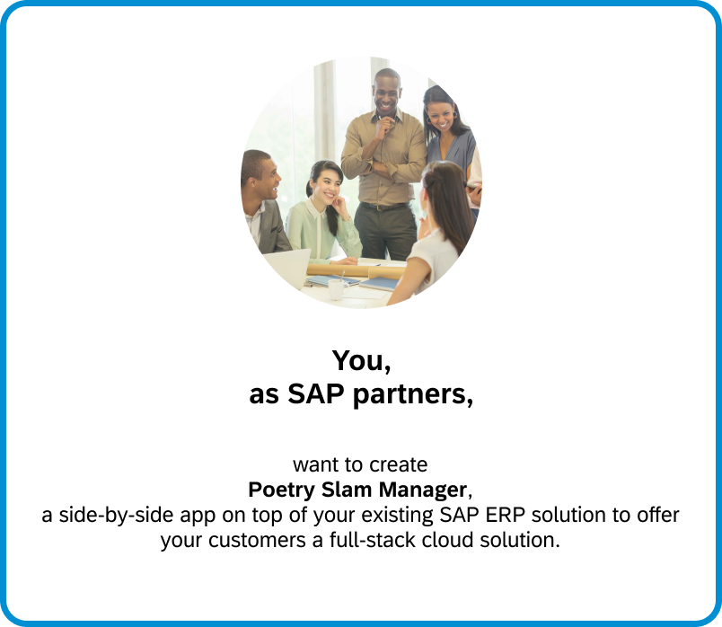
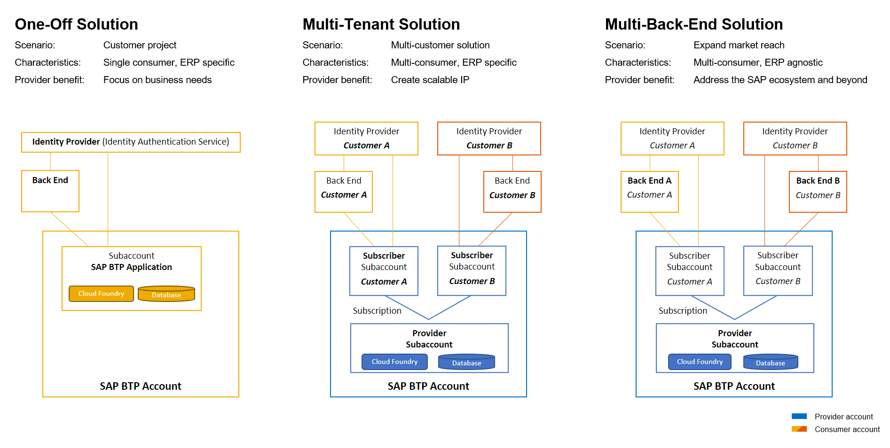
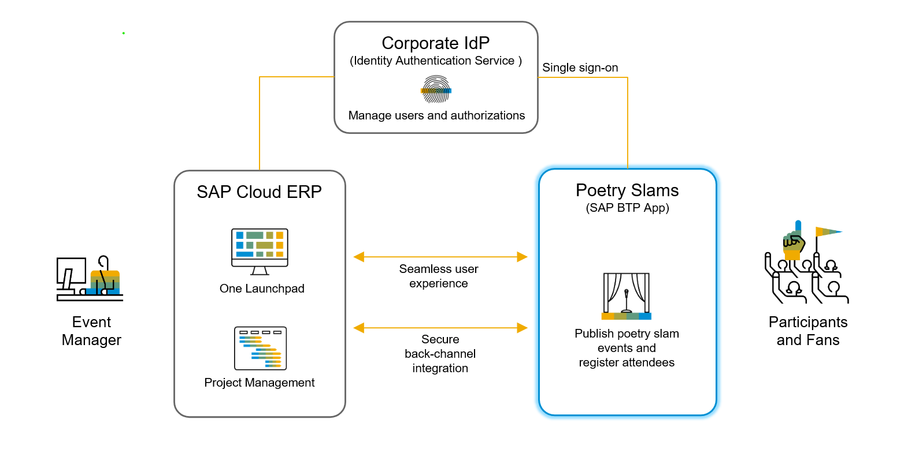
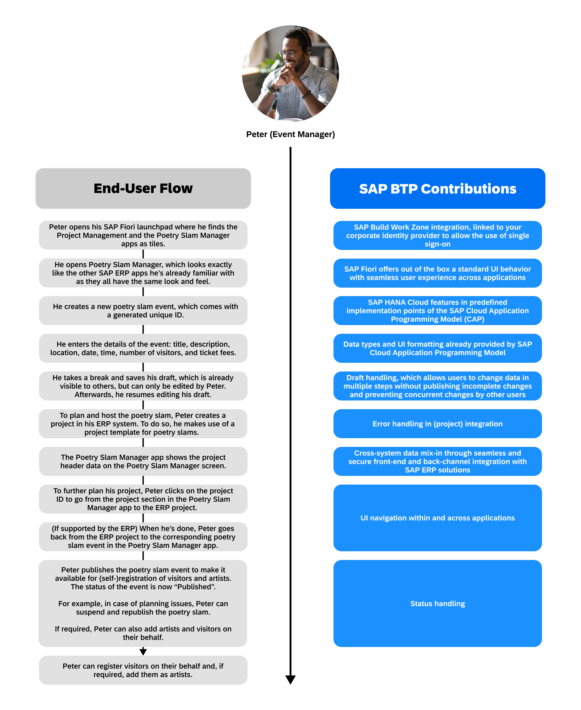
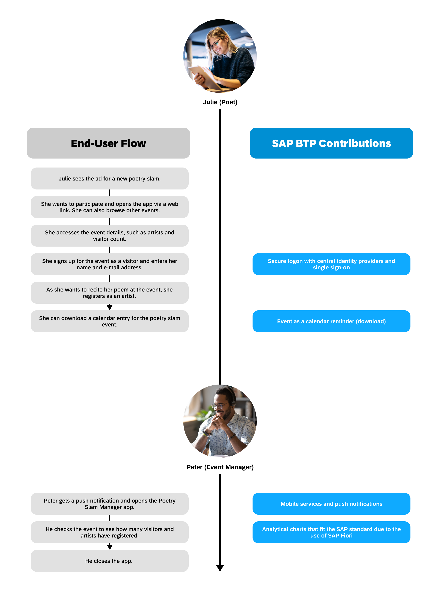

# Partner Reference Application 'Poetry Slam Manager'

## Description

Our Partner Reference Application provides you with a golden path to build, run, and integrate full-stack cloud applications on SAP Business Technology Platform.

      

With this repository, we give SAP partners guidance on how to extend SAP ERP solutions with side-by-side cloud applications running on SAP Business Technology Platform (SAP BTP). It includes:
- a preselection of SAP BTP components with architecture guidance tailored to meet the cost requirements of small and midsize enterprises (SME), 
- best practices (golden path) to build, deploy, and provision full-stack SAP BTP applications, and
- information on the interoperability and integration with cloud ERP solutions such as SAP Business ByDesign and SAP S/4HANA Cloud Public Edition.

The repository includes a sample application that is ready to be deployed and run, and tutorials to rebuild it from scratch following an incremental development approach from one-off to multi-consumer solutions.

  

### About the Sample Application *Poetry Slam Manager*

Imagine you're an event manager, for example, Peter, and your job is to organize and host poetry slams. 

As your company runs its business on a cloud ERP system provided by SAP, you use its project management component to plan and staff events, to collect costs, and to purchase equipment.
Additionally, an SAP partner provided you with a side-by-side application called Poetry Slam Manager (PSM) to publish poetry slam events and to register visitors and artists such as Julie.

      

For security and compliance reasons, it's crucial to you that event publishing and visitor registration are clearly separated from your ERP system. Nevertheless, as a power user working in both systems, you asked the partner to ensure a seamless user experience and navigation between the SAP system and Poetry Slam Manager.

The sample showcases how a side-by-side application benefits from using SAP BTP. The qualities relevant for enterprise-grade partner applications, supported by SAP BTP services and programming models, include:

      

Upcoming versions of the sample application might include further features provided by the SAP BTP:

      

### Features

- Create and change poetry slam events, publish and cancel poetry slams.
- Add and remove visitors, cancel registrations.
- Calculate the number of free seats and block overbookings.
- Create projects for poetry slam events in one click and preview project information on the Poetry Slam Manager UI (here, ERP authorizations must apply in the partner application as well!).
- As an ERP user, start Poetry Slam Manager from your ERP launchpad and navigate from Poetry Slam Manager to the associated project in the ERP system.
- Synchronize the status of the poetry slam with the status of the associated project.
- Make use of a standardized online development environment using SAP Business Application Studio.
- Use a state-of-the-art web application architecture based on HTML5, Node.js, and SAP HANA Cloud.
- Make use of a model-driven development based on the SAP Cloud Application Programming Model, core data services (CDS), and SAP Fiori elements.
- Offer a user experience that matches the SAP standard due to standard floorplan patterns, and out-of-the-box theming and personalization.
- Use a draft concept to allow users to change data in multiple steps without having to publish incomplete changes.
- Benefit from enterprise-grade security by authentication and role-based authorizations in line with SAP product standards and technology alignments.
- Have enterprise-ready compliance by personal data management and audit log.
- Offer seamless and secure front-end and back-channel integration with SAP ERP solutions.
- Deliver open solutions by integration-ready OData APIs and business events following SAP technology alignments.
- Deploy the app as a one-off and/or as a multi-customer solution.

**Join our community!**

Would you like to share your own ideas and best practices? Join our discussions about the Partner Reference Application in our [SAP Community](https://blogs.sap.com/2022/06/03/build-and-run-cloud-applications-on-the-sap-btp/).

## Requirements

The application is based on SAP Business Technology Platform (SAP BTP) and SAP ERP solutions. Therefore, here's what you need:

- An SAP BTP Test, Demo, Development (TDD) account, which includes SAP Business Application Studio as a standardized development environment,  
- GitHub as your code repository, and 
- an SAP ERP system.

To get a more detailed list of the required entitlements and the proposed structure of subaccounts for the deployed Partner Reference Application, go to the [Bill of Materials](./Tutorials/01-BillOfMaterials.md).

## Overview

This repository explains the development journey along the path from
1. development of the core application as a single-customer ("one-off") deployment,
2. enhancement to a multi-customer ("multi-tenant") solution,
3. integration with different ERP back ends,
4. extension with additional features.

A complete and working implementation of the above steps is available in separate branches:
1. One-off deployment: branch [*main-single-tenant*](../../tree/main-single-tenant)
2. Multi-tenant deployment and ERP integration: branch [*main-multi-tenant*](../../tree/main-multi-tenant)
3. Additional features (based on the multi-tenant implementation): branch [*main-multi-tenant-features*](../../tree/main-multi-tenant-features)

This allows you to check out those branches and directly work with the respective implementation. You can use GitHub comparisons to understand the changes required along the development journey.

The tutorials are provided in the ([*main*](../../)) branch.

Updates to this repository are documented in the [change history](./Tutorials/99-Change-History.md).

## Tutorials

1. Build a full-stack SAP BTP application with a **one-off deployment** in a customer SAP BTP account:
    1. [Prepare your SAP BTP account for development](Tutorials/11-Prepare-BTP-Account.md) 
    2. [Prepare your SAP BTP subaccount for deployment](Tutorials/12-Prepare-Deployment.md)
    3. [Deploy the sample application to a customer SAP BTP account](Tutorials/13-Deploy-Sample-Application.md)
    4. [Develop the core of the SAP BTP application](Tutorials/14-Develop-Core-Application.md)
    5. [Deploy your SAP BTP application](Tutorials/15-One-Off-Deployment.md)
    6. [Test, trace, and debug](Tutorials/16-Test-Trace-Debug.md)
    7. [Go on a guided tour to explore the capabilities of the sample application](Tutorials/17-Guided-Tour.md)

2. Enhance the application to support **multiple customers** using shared SAP BTP resources:
    1. [Learn about multitenancy and prepare your SAP BTP account for development](./Tutorials/21-Multi-Tenancy-Introduction.md)
    2. [Prepare your SAP BTP subaccount for multi-tenant deployment](./Tutorials/22-Multi-Tenancy-Prepare-Deployment.md)
    3. [Enhance the core application for multitenancy](./Tutorials/23-Multi-Tenancy-Develop-Sample-Application.md)
    4. [Deploy your SAP BTP multi-tenant application](./Tutorials/24-Multi-Tenancy-Deployment.md)
    5. [Provision your multi-tenant application to subscriber accounts](./Tutorials/25-Multi-Tenancy-Provisioning.md)
    
3. Integrate the application with the **ERP back end** of your customer:
    1. [Go on a guided tour to explore the ERP integration](Tutorials/31-Guided-Tour-ERP-Integration.md)
    2. [Test, trace, and debug the ERP integration](Tutorials/32-Test-Trace-Debug-ERP.md)
    3. SAP Business One as ERP back end:
        1. [Integrate the SAP BTP application with SAP Business One](Tutorials/33a-B1-Integration.md)
        2. [Configure the integration with SAP Business One](Tutorials/33b-Multi-Tenancy-Provisioning-Connect-B1.md)
    4. SAP S/4HANA Cloud Public Edition as ERP back end: 
        1. [Integrate the SAP BTP application with SAP S/4HANA Cloud Public Edition](Tutorials/34a-S4HC-Integration.md)
        2. [Configure the integration with SAP S/4HANA Cloud Public Edition](Tutorials/34b-Multi-Tenancy-Provisioning-Connect-S4HC.md)
    5. SAP Business ByDesign as ERP back end:
        1. [Integrate the SAP BTP application with SAP Business ByDesign](Tutorials/35a-ByD-Integration.md)
        2. [Configure the integration with SAP Business ByDesign](Tutorials/35b-Multi-Tenancy-Provisioning-Connect-ByD.md)

4. To extend your market reach, add **additional features** and integrate your SAP BTP application with more SAP BTP features and services:
    1. [Manage data privacy](Tutorials/41-Manage-Data-Privacy.md)
    2. Open the APIs of the SAP BTP application for third-party integrations:
        1. [Enable API access to SAP BTP applications using service broker](Tutorials/42a-Multi-Tenancy-Service-Broker.md)
        2. [Configure and consume the APIs of the SAP BTP application](Tutorials/42b-Multi-Tenancy-Provisioning-Service-Broker.md)

## More Information
- [SAP BTP Developer’s Guide](https://help.sap.com/docs/btp/btp-developers-guide/what-is-btp-developers-guide)
- [SAP Cloud Application Programming Model](https://cap.cloud.sap/docs/)
- [SAP Cloud SDK](https://sap.github.io/cloud-sdk/)
- [SAP Discovery Center](https://discovery-center.cloud.sap/missionssearch)

## Known Issues

There aren't any known issues.

## Get Support 

This repository is provided "as-is", we don't offer support. For questions and comments, [join the SAP Community](https://answers.sap.com/questions/ask.html).

## License

Copyright (c) 2024 SAP SE or an SAP affiliate company. All rights reserved. This project is licensed under the Apache Software License, version 2.0 except as noted otherwise in the [LICENSE](LICENSE) file.
