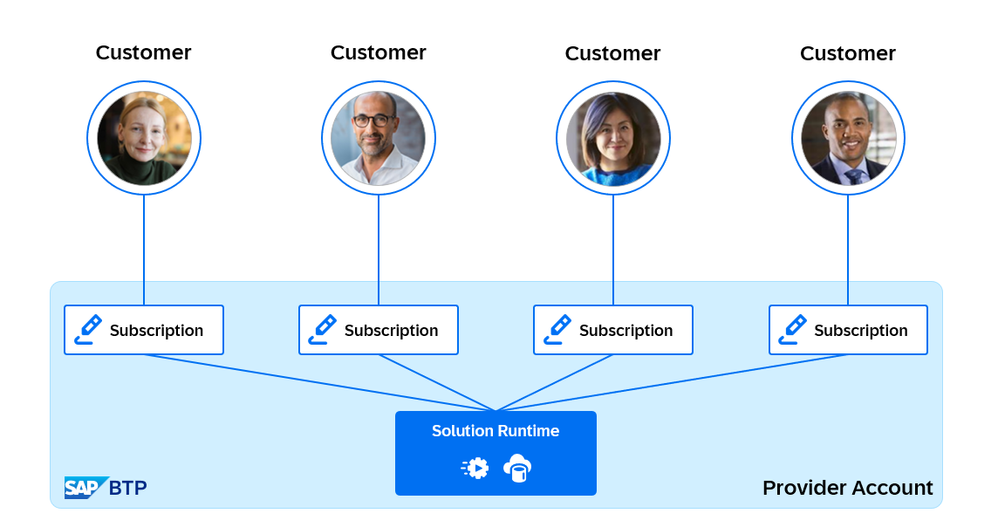
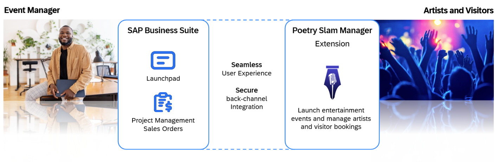
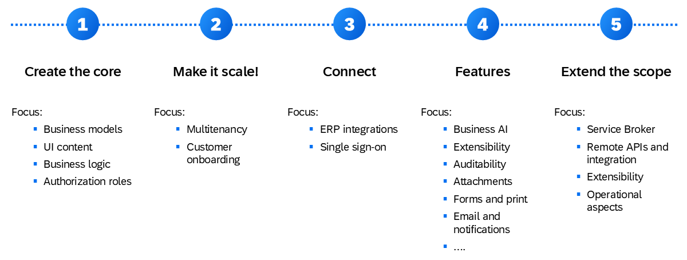

# Partner Reference Application 'Poetry Slam Manager'

## Description

This Partner Reference Application repository provides you with a “golden path” to becoming a SaaS provider of multi-tenant applications based on the SAP Business Technology Platform (SAP BTP).

The guidance covers building, running, and integrating scalable full-stack cloud applications. 
It includes an ERP-agnostic design that lets you deliver your application as a side-by-side extension to consumers using any SAP solution, such as SAP S/4HANA Cloud Public Edition, SAP Business One, and SAP Business ByDesign. 

By using SAP BTP services and the SAP Cloud Application Programming Model (CAP), your application meets SAP standards for enterprise-class business solutions. It offers a harmonized user experience and seamless integration.

The repository includes the “Poetry Slam Manager” application as a ready-to-run example. It also provides tutorials on how to build the application from scratch using an incremental development approach. 

Based on this sample application, you will find the bill of materials and a sizing example. This addresses the question "Which BTP resources do I need to subscribe to and in what quantities?" and serves as a basis for cost calculation.

      

### About the Sample Application *Poetry Slam Manager*

Imagine you're an event manager, for example, Peter, and your job is to organize and host poetry slams. As your company runs its business on a cloud ERP system provided by SAP, you use its project management component to plan and staff events, to collect costs, and to purchase equipment. Additionally, an SAP partner provided you with a side-by-side application called Poetry Slam Manager (PSM) to publish poetry slam events and to manage bookings of visitors and artists. 

The sample showcases how a side-by-side application benefits from using SAP BTP. The qualities relevant for enterprise-grade partner applications, supported by SAP BTP services and programming models.

    

**Join our community!**

Would you like to share your own ideas and best practices? Join our discussions about the Partner Reference Application in our [SAP Community](https://blogs.sap.com/2022/06/03/build-and-run-cloud-applications-on-the-sap-btp/).

## Requirements

The application is based on SAP Business Technology Platform (SAP BTP) and SAP ERP solutions. Therefore, here's what you need:

- An SAP BTP account, which includes SAP Business Application Studio as a standardized development environment (a trial account is not sufficient),  
- GitHub as your code repository, and 
- an SAP ERP system.

The partner reference application targets SAP partners. To learn more about becoming an SAP partner, see the [partner program of SAP](https://www.sap.com/partners/partner-program.html). However, the tutorials also work for multi-tenant applications of SAP customers.

## Overview

This repository explains the development journey along the path as shown in the picture:

      

A complete and working implementation of the above steps is available in separate branches:
1. Core application and multi-tenant deployment: branch [*main-multi-tenant*](../../tree/main-multi-tenant)
2. Additional features (based on the multi-tenant implementation): branch [*main-multi-tenant-features*](../../tree/main-multi-tenant-features)

This allows you to check out those branches and directly work with the respective implementation. You can use GitHub comparisons to understand the changes required along the development journey.

The tutorials are provided in the ([*main*](../../)) branch. If you prefer a quick start with a deployment of the poetry slam manager application including all features without further explanation, follow the [quick start guide](./Tutorials/02-Quickstart.md).

Updates to this repository are documented in the [change history](./Tutorials/99-Change-History.md).

## Tutorials

0. Getting started:
    1. [Bill of Materials: Learn about the required entitlements and the proposed structure of subaccounts](./Tutorials/01-BillOfMaterials.md)
    2. [Learn more about the architecture of the sample application](./Tutorials/03-Architecture.md)
    3. [Prepare your SAP BTP account for development](./Tutorials/11-Prepare-BTP-Account.md)

1. Develop the **core application** focusing on business models, business logic, and UI:
    1. Develop the core of the SAP BTP application
        1. [Develop the domain model and the business logic with SAP Cloud Application Programming Model](./Tutorials/14-Develop-Core-Application.md)
        2. [Develop the user interface with SAP Fiori elements](./Tutorials/14a-Develop-Core-UserInterface.md)
        3. [Enhance the business solution with translation and authorization](./Tutorials/14b-Develop-Core-Finetuning.md)
    2. [Go on a guided tour to explore the capabilities of the sample application](./Tutorials/17-Guided-Tour.md)
    3. [Ensure code quality, test, and troubleshoot the application](./Tutorials/16-Test-Trace-Debug.md)

2. Enhance the application for **multi-tenant deployments** to support multiple customers using shared SAP BTP resources:
    1. [Learn about multitenancy and get an overview of the bill of materials](./Tutorials/20-Multi-Tenancy-BillOfMaterials.md)
    2. [Prepare your SAP BTP account for multi-tenant deployment](./Tutorials/22-Multi-Tenancy-Prepare-Deployment.md)
    3. [Enhance the core application for deployment](./Tutorials/23-Multi-Tenancy-Develop-Sample-Application.md)
    4. [Deploy your SAP BTP multi-tenant application](./Tutorials/24-Multi-Tenancy-Deployment.md)
    5. [Provision your multi-tenant application to consumer subaccounts](./Tutorials/25-Multi-Tenancy-Provisioning.md)
    6. [Go on a guided tour to explore the capabilities of the deployed sample application](./Tutorials/25a-Guided-Tour-Deployed.md)
    7. [Test and troubleshoot multitenancy](./Tutorials/26-Test-Trace-Debug-Multi-Tenancy.md)
    
3. Integrate the application with **SAP ERP solutions**:   
    1. SAP Business One:
        1. [Learn more about the prerequisites and the purpose of SAP Business One integration](./Tutorials/33-B1-Prerequisites.md)
        2. [Integrate the SAP BTP application with SAP Business One](./Tutorials/33a-B1-Integration.md)
        3. [Configure the integration with SAP Business One](./Tutorials/33b-Multi-Tenancy-Provisioning-Connect-B1.md)
    2. SAP S/4HANA Cloud Public Edition: 
        1. [Learn more about the prerequisites and the purpose of SAP S/4HANA Cloud Public Edition integration](./Tutorials/34-S4HC-Prerequisites.md)
        2. [Integrate the SAP BTP application with SAP S/4HANA Cloud Public Edition](./Tutorials/34a-S4HC-Integration.md)
        3. [Configure the integration with SAP S/4HANA Cloud Public Edition](./Tutorials/34b-Multi-Tenancy-Provisioning-Connect-S4HC.md)
    3. SAP Business ByDesign:
        1. [Learn more about the prerequisites and the purpose of SAP Business ByDesign integration](./Tutorials/35-ByD-Prerequisites.md)
        2. [Integrate the SAP BTP application with SAP Business ByDesign](./Tutorials/35a-ByD-Integration.md)
        3. [Configure the integration with SAP Business ByDesign](./Tutorials/35b-Multi-Tenancy-Provisioning-Connect-ByD.md)
    4. [Test and troubleshoot an ERP integration](./Tutorials/32-Test-Trace-Debug-ERP.md)
    5. [Go on a guided tour to explore the ERP integration](./Tutorials/31-Guided-Tour-ERP-Integration.md)

4. Add **additional features and capabilities** to your SAP BTP application:
    1. [Manage data privacy with the SAP Audit Log service](./Tutorials/41-Multi-Tenancy-Features-Data-Privacy.md)
    2. [Observability: logging, metrics, and tracing using SAP Cloud Logging service](./Tutorials/43-Multi-Tenancy-Features-Observability.md)
    3. Add capabilities for output management to your application:
        1. [Manage forms with the SAP Forms service by Adobe](./Tutorials/44a-Multi-Tenancy-Features-Forms.md)
        2. [Print documents using the SAP Print service](./Tutorials/44b-Multi-Tenancy-Features-Print.md)
    4. [Send notifications and emails with SAP Build Work Zone](./Tutorials/44c-Multi-Tenancy-Features-Notification.md)
    5. [Add capabilities for generative artificial intelligence (GenAI) using SAP AI Core service](./Tutorials/45-Multi-Tenancy-Features-GenAI.md)
    6. [Schedule jobs and add background execution with the SAP Job Scheduling service](./Tutorials/46-Multi-Tenancy-Features-Job-Scheduling.md)
    7. [Store Attachments using SAP Document Management service](./Tutorials/47-Multi-Tenancy-Features-Attachments.md)
    
5. Enable the application for **third-party integrations and extensibility**:
    1. Open the APIs of the SAP BTP application for third-party integrations:
        1. [Enable API access to SAP BTP applications using service broker](./Tutorials/42a-Multi-Tenancy-Service-Broker.md)
        2. [Configure and consume the APIs of the SAP BTP application](./Tutorials/42b-Multi-Tenancy-Provisioning-Service-Broker.md) 
        3. [Create an API service for remote integrations without draft handling](./Tutorials/42c-Multi-Tenancy-Features-API-Service.md)
    2. Embed the application in a SAP S/4HANA Cloud Public Edition developer extensibility scenario:
        1. [Enhance the application to look up the latest sales order information](./Tutorials/52a-Multi-Tenancy-Features-API-Service-S4HC.md)
        2. [Configure the connection with SAP S/4HANA Cloud Public Edition](./Tutorials/52b-Multi-Tenancy-Features-API-Service-S4HC-Provisioning.md)
    3. Enable the application for extensibility:
        1. [Enable consumer-specific extensions](./Tutorials/50-Multi-Tenancy-Features-Tenant-Extensibility.md)
        2. [Enable business logic extensions](./Tutorials/50a-Multi-Tenancy-Features-Tenant-BusinessLogicExtensibility.md)
    4. [Enable key user flexibility using SAP Build Work Zone](./Tutorials/51-Multi-Tenancy-Features-Tenant-Key-User-Flexibility.md)

6. **Operational aspects** of multi-tenant SaaS applications
    1. [Upgrading multi-tenant SaaS applications](./Tutorials/61-Operations-SubscriptionUpgrade.md)
    2. [Estimate the required size of the SAP HANA Cloud database](./Tutorials/27-Hana-DB-Scaling.md)
    3. [Estimate the required Cloud Foundry environment configuration](./Tutorials/28-CF-Environment-Scaling.md)
    4. [Estimate the SAP Cloud Logging Service Consumption](./Tutorials/29-Cloud-Logging-Consumption.md)
    5. [Capabilities of SAP Continuous Integration and Delivery Service](./Tutorials/62-Multi-Tenancy-Features-CICD.md)

## More Information
- [SAP Build](https://www.sap.com/products/technology-platform/build.html): Learn more about SAP Build product capabilities, use cases, and customer stories.
- [SAP Build Learning](https://www.sap.com/products/technology-platform/build.html): Learn how to extend SAP applications by building AI agents, developing applications with or without code, automating processes, and offering digital workspaces.
- [SAP Build Trial](https://www.sap.com/products/technology-platform/build/trial.html): Start your free trial of SAP Build.
- [SAP BTP Developer’s Guide](https://help.sap.com/docs/btp/btp-developers-guide/what-is-btp-developers-guide): Introduction to the SAP BTP Developer’s Guide. The starting point for developing a business application on SAP BTP. 
- [SAP Cloud Application Programming Model](https://cap.cloud.sap/docs/): Build enterprise-grade cloud applications with maximized productivity, fueled by proven best practices, served out of the box.
- [SAP Cloud SDK](https://sap.github.io/cloud-sdk/): The one-stop shop for developing and extending SAP applications in the cloud.
- [SAP Discovery Center](https://discovery-center.cloud.sap/missionssearch): Implement your use cases on SAP BTP, with step-by-step guidance and a well-established support from topic experts and SAP Community.
- [What's New for SAP Business Technology Platform](https://help.sap.com/whats-new/cf0cb2cb149647329b5d02aa96303f56?clear=all&locale=en-US): Get an overview of the new and changed features for SAP BTP.
- [SAP HANA Cloud Administration Guide](https://help.sap.com/docs/hana-cloud/sap-hana-cloud-administration-guide/sap-hana-cloud-administration-guide): This guide describes how to create and configure SAP HANA Cloud instances using SAP HANA Cloud Central and the command line interface.
- [SAP Partner Program](https://www.sap.com/partners/partner-program.html): The SAP PartnerEdge program offers four simple engagement models – Build, Sell, Service, and Run. 
  
The partner reference application family: 
- [Partner reference application for a tenant-specific extension](https://github.com/SAP-samples/partner-reference-application-extension): Explore the Partner Reference Application Extension “Catering Management” and realize customer-specific extensions in multi-tenant applications.
- [Partner reference application for a cross-stack extension](https://github.com/SAP-samples/cross-stack-partner-reference-extension): Explore the Cross-Stack Partner Reference Extension “Poetry Slam Event Commerce” and combine SAP S/4HANA Cloud Public Edition on-stack extensions with SAP BTP-based  multi-tenant solutions. 
- [Partner Reference Application using ABAP RESTful Application Programming Model (RAP)](https://github.com/SAP-samples/abap-partner-reference-application): Explore the ABAP Partner Reference Application “Music Festival Manager” and learn how to develop multi-tenant solutions on the SAP BTP ABAP Environment. 

## Known Issues

There aren't any known issues.

## Get Support 

This repository is provided "as-is", we don't offer support. For questions and comments, [join the SAP Community](https://answers.sap.com/questions/ask.html).

## License

Copyright (c) 2026 SAP SE or an SAP affiliate company. All rights reserved. This project is licensed under the Apache Software License, version 2.0 except as noted otherwise in the [LICENSE](LICENSE) file.

## Disclaimer
This repository contains sample code provided “as is” for instructional purposes only. SAP makes no warranties and accepts no liability, except in cases of gross negligence or willful misconduct. All included data is fictitious and contains no real personal, confidential, or sensitive information. Do not use this tutorial app productively with real personal data. SAP is not responsible if anyone uses it to capture personal data.
