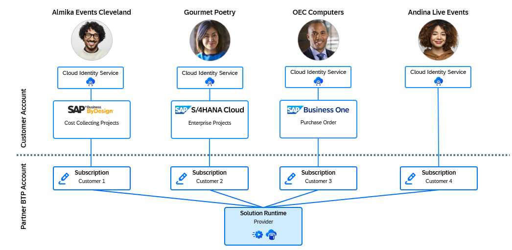

# Bill of Materials
In the full version of Poetry Slam Manager with multitenancy, SAP ERP integration, and additional features, the Partner Reference Application uses several subaccounts and entitlements. These subaccounts include a provider subaccount, where the application is deployed, and consumer subaccounts that contain customer-specific information and configuration. An overview is provided in the section below.

## Subaccounts
The example setup serves four sample customers: 
-   *Gourmet Poetry*: A renowned food magazine known for its exquisite taste and celebration of culinary arts using SAP Cloud ERP enterprise projects to run poetry slam events that blend the art of spoken word with gourmet food experiences.
-	*OEC computers*: A company whose employees frequently come together for poetry slams with a great buffet and all-you-can-eat mousse au chocolat. 
-	*Almika Events Cleveland*: An event agency planning events using SAP Business ByDesign as ERP solution.
-	*Andina Live Events*: A small poet startup without any ERP solution yet (but a promising ERP prospect if they stay on their exciting growth journey). 

    

To develop and run the application for these consumers, the following directory and subaccount structure is proposed.

| Directory Name                   | Subaccount Name                      | Usage                                                                                             |
| --------------------             | --------------------                 | ----------------------------                                                                      |
| Development                      |                                      |                                                                                                   |
|                                  | Development                          | SAP Business Application Studio                                                                   |
| Partner Reference Application    |                                      |                                                                                                   |
|                                  | Provider: Poetry Slam Manager        | Application runtime, the database, other SAP BTP services used to run the application             |
|                                  | Consumer 1: Gourmet Poetry           | Subscription to customer Gourmet Poetry connected to their SAP S/4HANA Cloud tenant          |
|                                  | Consumer 2: OEC Computers            | Subscription to customer OEC Computers connected to their SAP Business One system                 |
|                                  | Consumer 3: Almika Events Cleveland  | Subscription to customer Almika Events Cleveland connected to their SAP Business ByDesign tenant  |
|                                  | Consumer 4: Andina Live Events       | Subscription to customer Andina Live Events who uses the application as a stand-alone solution  |

## Entitlements
The list shows the entitlements that are required in the different subaccounts to develop and run the Poetry Slam Manager application with a multi-tenant deployment and additional features. You can get more information about the used services and applications in the [SAP Discovery Center](https://discovery-center.cloud.sap/protected/index.html#/viewServices). 

### Development Subaccount

| Service Display Name                                   | Service Technical Name    | Service Plan    | Type        | Quantity          |
|-----------------------------------                 |------------------------   |-------------------|-------------|-------------------|
| [SAP Business Application Studio](https://discovery-center.cloud.sap/serviceCatalog/sap-build)                    | sapappstudio              | build-default     | Application | 1 (per developer) |
| [Continuous Integration and Delivery](https://discovery-center.cloud.sap/serviceCatalog/sap-build)               | cicd-app                  | build-runtime     | Application | 1                 |
| [Alert Notification](https://discovery-center.cloud.sap/serviceCatalog/sap-build)                                | alert-notification        | build-runtime     | Service     | 1                 |

### Provider Subaccount

| Service Display Name                                                                                                          				| Service Technical Name    | Service Plan      | Type        | Quantity          |
|--------------------------------------------------- 																							|------------------------   |-----------------  |-------------|-------------------|
| [Cloud Foundry Environment](https://discovery-center.cloud.sap/serviceCatalog/sap-build)                           							| cloudfoundry              | build-runtime     | Environment | 4 units           |
| [Custom Domain service](https://discovery-center.cloud.sap/serviceCatalog/custom-domain)                              						| custom-domain-manager     | standard          | Application | 1                 |
| [Audit Log service](https://discovery-center.cloud.sap/serviceCatalog/audit-log-service)                                  					| auditlog                  | premium           | Service     | 1                 |
| [Authorization and Trust Management service](https://discovery-center.cloud.sap/serviceCatalog/authorization-and-trust-management-service)    | xsuaa                     | broker            | Service     | 1                 |
| [Destination service](https://discovery-center.cloud.sap/serviceCatalog/destination-service)                                					| destination               | lite              | Service     | 1                 |
| [Connectivity service](https://discovery-center.cloud.sap/serviceCatalog/connectivity-service)                               					| connectivity              | lite              | Service     | 1                 |
| [HTML5 Application Repository service](https://discovery-center.cloud.sap/serviceCatalog/html5-application-repository-service)               	| html-apps-repo            | app-host          | Service     | 1                 |
| [HTML5 Application Repository service](https://discovery-center.cloud.sap/serviceCatalog/html5-application-repository-service)               	| html-apps-repo            | app-runtime       | Service     | 1                 |
| [SaaS Provisioning service](https://discovery-center.cloud.sap/serviceCatalog/saas-provisioning-service)                         				| saas-registry             | application       | Service     | 1                 |
| [SAP HANA Cloud*](https://discovery-center.cloud.sap/serviceCatalog/sap-hana-cloud)                              								| hana-cloud                | hana-td           | Service     | 1                 |
| [SAP HANA Cloud](https://discovery-center.cloud.sap/serviceCatalog/sap-hana-cloud)                               								| hana-cloud-tools          | tools            	| Application | 1                 |
| [SAP HANA Schemas & HDI Containers](https://discovery-center.cloud.sap/serviceCatalog/sap-hana-cloud)     									| hana                      | hdi-shared        | Service     | 1                 |
| [Service Manager](https://discovery-center.cloud.sap/serviceCatalog/service-manager)                                   						| service-manager           | container         | Service     | 1                 |
| [Cloud Logging*](https://discovery-center.cloud.sap/serviceCatalog/cloud-logging)                                      						| cloudlogging              | dev               | Service     | 1                 |
| [Forms service by Adobe](https://discovery-center.cloud.sap/serviceCatalog/forms-service-by-adobe)                            				| ads-configui              | default           | Application | 1                 |
| [Forms service by Adobe API](https://discovery-center.cloud.sap/serviceCatalog/forms-service-by-adobe)                         				| adsrestapi                | standard          | Service     | 1                 |
| [Print service](https://discovery-center.cloud.sap/serviceCatalog/print-service)                                     							| print                     | sender            | Service     | 1                 |
| [AI Core](https://discovery-center.cloud.sap/serviceCatalog/sap-ai-core)                                           							| aicore                    | extended          | Service     | 1                 |
| [Job Scheduling service](https://discovery-center.cloud.sap/serviceCatalog/job-scheduling-service)                             				| jobscheduler              | standard          | Application | 1                 |
| [SAP Document Management Service – Integration](https://discovery-center.cloud.sap/serviceCatalog/sap-build)      							| sdm                       | build-runtime     | Service     | 1                 |
| [SAP Document Management Service – Repository](https://discovery-center.cloud.sap/serviceCatalog/sap-build)     								| sdm-repository            | build-runtime     | Service     | 1                 |

> Note: The table outlines SAP BTP service plans used in SAP BTP environments for test, demo, and development. In productive environments, use the SAP HANA Cloud service plan 'hana' and the Cloud Logging service plan 'standard'.

### Consumer Subaccount

| Service Display Name                                     												| Service Technical Name    | Service Plan      | Type        | Quantity          |
|------------------------------------                													|------------------------   |----------------   |-------------|-------------------|
| [Audit Log Viewer service](https://discovery-center.cloud.sap/serviceCatalog/audit-log-service)       | auditlog-viewer           | free              | Application | 1                 |
| [Print service](https://discovery-center.cloud.sap/serviceCatalog/print-service)                      | print-app                 | standard          | Application | 1                 |
| [Print service](https://discovery-center.cloud.sap/serviceCatalog/print-service)                      | print                     | receiver          | Service     | 1                 |
| [SAP Build Work Zone, Standard Edition](https://discovery-center.cloud.sap/serviceCatalog/sap-build)  | SAPLaunchpad              | build-default     | Application | 1                 |                

## Services Without Entitlements
The list shows services that don't require entitlements.

| Subaccount    |  Entitlement Name                                    | Service Plan              | Type          | Quantity                          | 
| -----------   |  -------------------                                 | ---------                 | ---------     | ---------                         |
| Consumer      |                                                      |                           |               |                                   |
|               | Poetry Slam Manager                                  | default                   | Application   | 1 (partner application)           |
|               | Poetry Slam Service Broker                           | fullaccess                | Instance      | 1 (partner application)           |
|               | Poetry Slam Service Broker                           | readonlyaccess            | Instance      | 1 (partner application)           |

On top of the mentioned entitlements, the connectivity and security services are part of the consumer accounts of the solution.

## Modules

### Running in Cloud Foundry
The application consists of the following modules which are deployed into the SAP BTP Cloud Foundry runtime of the provider subaccount. 

Provided by SAP:
- Application Router                                                           
- Multitenancy Extension Module                                                  
- Service Broker     

Your main development task:                                            
- Partner Application Module  

### Node Modules
Some open-source node modules offered by SAP are used to build the solution. 

Provided by SAP:
- SAP Cloud Application Programming Model on Node.js 
- SAPUI5 with SAP Fiori elements 
- SAP Cloud SDK 
- SAP CDS Oyster

## Applications
SAP offers several applications to build the solution. These applications need to be downloaded and installed on the local machine.

Provided by SAP:
- Adobe LiveCycle Designer
- SAP Print Manager                                         

# Scaling
To get an overview of how the services scale and how many entitlements you require for an application, here's an example based on the projected use of the Partner Reference Application.

Let's assume a typical data volume of two poetry slams per week (or 125 slams per year), with 200 visits per event. After three years, if you assume that one visitor books on average two different poetry slams, for 20 subscriptions (customers), this results in a volume of:
 - 7,500 poetry slam events
 - 750,000 visitors and artists
 - 1,500,000 bookings

> Note: The required quantities of most services are calculated based on memory, storage, or usage counts. The SAP HANA Cloud database is based on capacity units (CU), which consider several factors like memory, CPUs, and storage. You can use the [SAP HANA Cloud Capacity Unit Estimator](https://hcsizingestimator.cfapps.eu10.hana.ondemand.com/) to calculate the capacity units required. The chapter [Estimating the Required Size of the SAP HANA Cloud Database](./27-Hana-DB-Scaling.md) explains how to calculate the required CUs based on the above business volume. Next to the SAP HANA Cloud database, resources for the SAP BTP Cloud Foundry runtime need to be acquired. The chapter [Estimating the Required Cloud Foundry Environment Configuration](./28-CF-Environment-Scaling.md) provides guidance on determining the necessary GB of memory for your application. However, this requires measurements in a deployed and running (test) version of the application.

The table below shows how the required quantities scale with typical numbers of customers. The scaling is less than linear which is the benefit of resource sharing in multi-tenant application. This means the costs per customer significantly decrease the more customers you serve.

|  Service Display Name           | Service Technical Name | Service Plan              | 5 Customers                     | 20 Customers                     | 100 Customers                     | 
| -------------------             | ---------------------  | ---------                 | ---------                       | ---------                        | ---------                         |
|   Cloud Foundry Environment   | cloudfoundry |build-runtime                  | 2 GB                            | 2 GB                             | 6 GB                             |
| SAP HANA Cloud*                | hana-cloud   | hana-td                   | 900 CU                          | 900 CU                           | 1000 CU                           |
| Custom Domain service      | custom-domain-manager | standard                  | 1 Domain                        | 1 Domain                         | 1 Domain                          |
| Audit Log service          | auditlog | premium                   | 1 GB Storage, 1 GB Writing      | 1 GB Storage, 1 GB Writing       | 1 GB Storage, 1 GB Writing        ​|
| Cloud Logging* |   cloudlogging   | dev                  | 95/538 CU                          | 95/538 CU                           | 95/538 CU                            |
| SAP AI Core              | aicore | extended                  | 1 CU                            | 1 CU                             | 1 CU                              |
| SAP Business Application Studio | sapappstudio| build-default         | 2 Users                         | 2 Users                          | 2 Users                            |
| SAP Build Work Zone, Standard Edition | SAPLaunchpad | build-default            | 100 Active Users                | 100 Active Users                 | 500 Active Users                   |

> Note: The table outlines SAP BTP service plans used in SAP BTP environments for test, demo, and development. In productive environments, use the SAP HANA Cloud service plan 'hana' and the Cloud Logging service plan 'standard'. The Cloud Logging service plan 'dev' requires 95 capacity units (CUs), and the service plan 'standard' requires 538 CUs.

# Information on Versions and What's New

The SAP Help page ["What's New for SAP Business Technology Platform"](https://help.sap.com/whats-new/cf0cb2cb149647329b5d02aa96303f56?clear=all&locale=en-US) allows you to subscribe for updates. 
