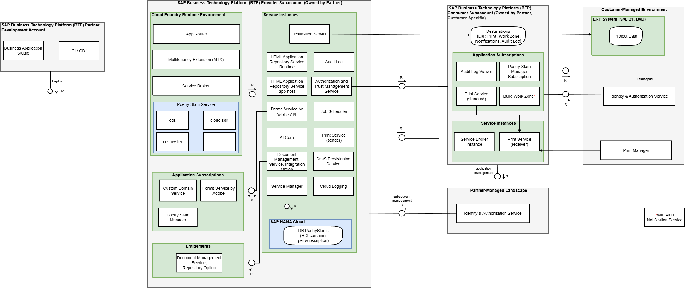

# Architecture
In the image below, you can see the full version of the Poetry Slam Manager with multitenancy, SAP ERP integration, and additional features. The Partner Reference Application uses several subaccounts and entitlements. These subaccounts include a provider subaccount, where the application is deployed, and consumer subaccounts that contain customer-specific information and configuration. A detailed overview with links to further information is provided in the section below.

 

    

> [!IMPORTANT]
> For software development projects, SAP implements the [Secure Software Development and Operations Lifecycle (secure SDOL) at SAP](https://www.sap.com/documents/2016/03/a248a699-627c-0010-82c7-eda71af511fa.html). This framework provides training, tools, and processes to ensure security is integrated at every stage of development: design, coding, testing, and deployment. This approach reduces vulnerabilities and enhances the overall security posture of applications. Following this process is advisable.

### SAP BTP Services

#### Development Subaccount
- [SAP Business Application Studio](https://help.sap.com/viewer/product/SAP%20Business%20Application%20Studio/Cloud): SAP Business Application Studio is a SAP BTP service that offers a modern development environment tailored for efficient development of business applications for the SAP Intelligent Enterprise. The setup is described in [Prepare Your SAP BTP Account for Development](./11-Prepare-BTP-Account.md).

- [Continuous Integration and Delivery](https://help.sap.com/viewer/product/CONTINUOUS_DELIVERY/Cloud): SAP Continuous Integration and Delivery lets you configure and run predefined continuous integration and delivery (CI/CD) pipelines that automatically build, test, and deploy your code changes to speed up your development and delivery cycles. The usage of the service is described in [Capabilities of SAP Continuous Integration and Delivery Service](./62-Multi-Tenancy-Features-CICD.md).

- [SAP Alert Notification](https://help.sap.com/viewer/product/ALERT_NOTIFICATION/Cloud): SAP Alert Notification service offers a common API for providers to publish alerts and for consumers to subscribe to these alerts. It is designed to automatically send real-time notifications and alerts about events that may be of interest to the business and operations. The usage of the service is described in [Capabilities of SAP Continuous Integration and Delivery Service](./62-Multi-Tenancy-Features-CICD.md).

#### Provider Subaccount
- [SAP BTP Cloud Foundry runtime](https://help.sap.com/docs/CF_RUNTIME): The SAP BTP Cloud Foundry runtime lets you develop polyglot cloud-native applications and run them on the SAP BTP Cloud Foundry environment. The enablement of the SAP BTP Cloud Foundry runtime is described in [Prepare Your SAP BTP Account for Multi-Tenant Deployment](./22-Multi-Tenancy-Prepare-Deployment.md). The chapter [Estimate the Required Cloud Foundry Environment Configuration](./28-CF-Environment-Scaling.md) describes how to configure the Cloud Foundry runtime to provide your application to an increasing number of tenants.

- [SAP Custom Domain service](https://help.sap.com/docs/CUSTOM_DOMAINS?version=Cloud): You can configure your own custom domain to publicly expose your application instead of using the default *hana.ondemand.com* subdomain. The configuration of the Custom Domain service is described in [Deploy Your SAP BTP Multi-Tenant Application](./24-Multi-Tenancy-Deployment.md).

- [SAP Audit Log service](https://help.sap.com/docs/AUDIT_LOG): SAP Audit Log is a core, security, and compliance-based SAP BTP service to provide means for audit purposes. Check [Manage Data Privacy](./41-Multi-Tenancy-Features-Data-Privacy.md) to use it in your application.

- [SAP Authorization and Trust Management service](https://help.sap.com/viewer/product/CP_AUTHORIZ_TRUST_MNG/Cloud) : The SAP Authorization and Trust Management service lets you manage user authorizations and trust to identity providers. The integration is described in [Provision Your Multi-Tenant Application to Consumer Subaccounts](./25-Multi-Tenancy-Provisioning.md).

- [SAP Destination service](https://help.sap.com/viewer/product/CP_CONNECTIVITY/Cloud): The SAP Destination service lets you configure and find the information that is required to access a remote service or system from your cloud application. How to add the service to the project is described in [Enhance the Core Application for Deployment](./23-Multi-Tenancy-Develop-Sample-Application.md). 

- [SAP Connectivity service](https://help.sap.com/viewer/product/CP_CONNECTIVITY/Cloud): SAP Connectivity service lets you establish connectivity between your cloud applications and on-premise systems running in isolated networks. More information on the usage of the service to access an on-premise system can be found in [SAP Business One Integration Using a Cloud Connector](./33c-B1-Integration-With-Cloud-Connector.md).

- [SAP HTML5 Application Repository service for SAP BTP](https://help.sap.com/viewer/product/HTML5_APPLICATIONS/Cloud): The HTML5 Application Repository service for SAP BTP enables central storage of HTML5 applications on SAP BTP. The service allows application developers to manage the lifecycle of their HTML5 applications. In runtime, the service enables the consuming application, typically the application router, to access HTML5 application static content in a secure and efficient manner. All SAP Fiori elements user interfaces of the application are stored and managed in this repository. How to add the service to the project is described in [Enhance the Core Application for Deployment](./23-Multi-Tenancy-Develop-Sample-Application.md). 

- [SAP Software-as-a-Service Provisioning service](https://help.sap.com/viewer/65de2977205c403bbc107264b8eccf4b/Cloud/en-US/ed08c7dcb35d4082936c045e7d7b3ecd.html): Manage your subscriptions to multitenant applications and their dependent services. Operations include getting registration details, subscribing to an application, unsubscribing applications, retrieving all your application subscriptions, and updating subscription dependencies. How to add the service to the project is described in [Enhance the Core Application for Deployment](./23-Multi-Tenancy-Develop-Sample-Application.md). 

- [SAP HANA Cloud](https://help.sap.com/viewer/p/HANA_CLOUD): SAP HANA Cloud is a database as a service that powers mission-critical applications and real-time analytics with one solution at petabyte scale. The creation of the database is described in [Prepare Your SAP BTP Account for Multi-Tenant Deployment](./22-Multi-Tenancy-Prepare-Deployment.md). How the service scales and how many entitlements you require for an application is described in [Bill of Materials](./01-BillOfMaterials.md). 

- [SAP HANA Schemas & HDI Containers](https://help.sap.com/docs/hana-cloud-database/sap-hana-cloud-sap-hana-database-developer-guide-for-cloud-foundry-multitarget-applications-sap-business-app-studio/sap-hana-cloud-deployment-infrastructure-services): The SAP HANA Cloud Deployment Infrastructure (HDI) is a service layer of the SAP HANA Cloud database that simplifies the deployment of SAP HANA database objects by providing a declarative approach for defining database objects (as design-time artifacts) and ensuring a consistent deployment into the database. The SAP HANA Cloud DI service enables you to create and manage not only HDI containers but also plain schemata, and the Secure Store on shared SAP HANA systems. How to add the service to the project is described in [Enhance the Core Application for Deployment](./23-Multi-Tenancy-Develop-Sample-Application.md).

- [SAP Service Manager](https://help.sap.com/viewer/product/SERVICEMANAGEMENT/Cloud): SAP Service Manager allows you to consume SAP BTP services from any connected runtime environment, track and manage the creation of service instances, and share services and service instances between different environments. How to add the service to the project is described in [Enhance the Core Application for Deployment](./23-Multi-Tenancy-Develop-Sample-Application.md).

- [SAP Cloud Logging service](https://help.sap.com/docs/SAP_CLOUD_LOGGING?version=Cloud): SAP Cloud Logging service is an instance-based observability service that builds on OpenSearch to store, visualize, and analyze application logs, metrics, and traces from SAP BTP Cloud Foundry, Kyma, Kubernetes and other runtime environments. The usage of the service is described in [Observability: Logging, Metrics, and Tracing](./43-Multi-Tenancy-Features-Observability.md).  

- [SAP Forms service by Adobe](https://help.sap.com/viewer/product/CP_FORMS_BY_ADOBE/Cloud): SAP Forms service by Adobe lets you generate print and interactive forms using Adobe Document Services (ADS). How to add the service to the project is described in [Manage Forms](./44a-Multi-Tenancy-Features-Forms.md).  

- [SAP Print service](https://help.sap.com/viewer/product/SCP_PRINT_SERVICE/SHIP): SAP Print service is used in business applications that are based on SSAP BTP as well as other SAP Cloud products across SAP Intelligent Enterprise Suite. Using this service, the business application's development team can easily establish the connection between SAP Print service and the customer’s local printers. The usage of the service is described in [Print Documents](./44b-Multi-Tenancy-Features-Print.md).

- [SAP AI Core](https://help.sap.com/viewer/product/AI_CORE/CLOUD): SAP AI Core is a service designed to manage the execution and operations of AI assets in a standardized, scalable, and hyperscaler-agnostic manner. It seamlessly integrates with SAP solutions, allowing any AI function to be easily implemented using open-source frameworks. How to add the service to the project is described in [Add Capabilities for Generative Artificial Intelligence (Gen AI)](./45-Multi-Tenancy-Features-GenAI.md).

- [SAP Job Scheduling service](https://help.sap.com/viewer/p/JOB_SCHEDULER): SAP Job Scheduling service allows you to define and manage jobs that run once or on a recurring schedule. The service integration is described in [Schedule Jobs and Add Background Execution](./46-Multi-Tenancy-Features-Job-Scheduling.md).

- [SAP Document Management service](https://help.sap.com/viewer/product/DOCUMENT_MANAGEMENT/Cloud): SAP Document Management service provides secure and scalable document management capabilities for business applications and enterprise content. It enables organizations to create, store, access, and manage documents consistently across cloud and hybrid landscapes. The service integration is described in [Store Attachments](./47-Multi-Tenancy-Features-Attachments.md).

#### Subscriber Subaccount
- [SAP Audit Log Viewer service for the Cloud Foundry environment](https://help.sap.com/docs/btp/sap-business-technology-platform/audit-log-viewer-for-cloud-foundry-environment): The SAP Audit Log Viewer service displays the audit logs associated with your Cloud Foundry account. These are the activity logs generated by the SAP applications and services to which you are subscribed. For information on how to use it in your application, see [Manage Data Privacy](./41-Multi-Tenancy-Features-Data-Privacy.md).

- [SAP Build Work Zone, standard edition](https://help.sap.com/docs/WZ_STD): SAP Build Work Zone, standard edition enables organizations to establish a unified point of access to SAP (for example, SAP S/4HANA), custom-built, and third-party applications and extensions, both on the cloud and on-premise. It offers several out-of-the-box features like a notification service and key user flexibility. How to add the service to the project is described in [Enhance the Core Application for Deployment](./23-Multi-Tenancy-Develop-Sample-Application.md).            

## Modules

### Running in Cloud Foundry

The application consists of the following SAP modules, which are deployed into the SAP BTP Cloud Foundry runtime of the provider subaccount:

- [Application Router](https://www.npmjs.com/package/@sap/approuter): Single entry point to a business application with several different microservices.

- [Multitenancy Extension Module](https://www.npmjs.com/package/@sap/cds-mtxs): Library for multitenancy, feature toggle, and extensibility support for the SAP Cloud Application Programming Model (CAP).        

- [Service Broker](https://www.npmjs.com/package/@sap/sbf): A Node.js framework to create a service broker in SAP BTP.     

### Node Modules

Some open-source node modules offered by SAP are used to build the solution. A list of all modules can be found in the [package.json](../../../blob/main-multi-tenant-features/package.json) file of the main-multi-tenant-features branch.

- [SAP Cloud Application Programming Model on Node.js](https://cap.cloud.sap/docs/): Build enterprise-grade cloud applications with maximum productivity using proven best practices that are available out of the box.

- [SAPUI5 with SAP Fiori elements](https://ui5.sap.com/#/): SAPUI5 using practical examples in an interactive format.

- [SAP Cloud SDK](https://sap.github.io/cloud-sdk/docs/js/getting-started): The SAP Cloud SDK is a set of libraries that helps you develop applications on SAP BTP that communicate with SAP solutions and services.
  
    - [@sap-cloud-sdk/connectivity](https://www.npmjs.com/package/@sap-cloud-sdk/connectivity): This package contains the connectivity functionality of the SAP Cloud SDK as well as the Cloud Platform abstractions.
    - [@sap-cloud-sdk/http-client](https://www.npmjs.com/package/@sap-cloud-sdk/http-client): This package contains the generic http-client functionality of the SAP Cloud SDK as well as the Cloud Platform abstractions.
    - [@sap-cloud-sdk/openapi](https://www.npmjs.com/package/@sap-cloud-sdk/openapi): This package contains the OpenAPI request builder for different types of HTTP requests.
    - [@sap-cloud-sdk/resilience](https://www.npmjs.com/package/@sap-cloud-sdk/resilience): This package contains implementations for the resilience middlewares, such as timeout or circuit breaker middleware. 

- [@sap/cds-oyster](https://www.npmjs.com/package/@sap/cds-oyster): A secure execution environment for tenant-specific code in the Node.js version of CAP.

- [SAP AI SDK](https://sap.github.io/ai-sdk/): The one-stop shop for integrating AI into SAP Cloud applications.
    - [@sap-ai-sdk/orchestration](https://www.npmjs.com/package/@sap-ai-sdk/orchestration): This package incorporates generative AI orchestration capabilities into your AI activities in SAP AI Core and SAP AI Launchpad.
    - [@sap-ai-sdk/prompt-registry](https://www.npmjs.com/package/@sap-ai-sdk/prompt-registry): This package incorporates generative AI prompt registry capabilities into your AI activities in SAP AI Core and SAP AI Launchpad.

# Information on Versions and What's New

[What's New for SAP Business Technology Platform](https://help.sap.com/whats-new/cf0cb2cb149647329b5d02aa96303f56?clear=all&locale=en-US) on SAP Help Portal provides an overview of the new and changed features for SAP BTP. You can subscribe to receive updates.

In the next chapter, you will learn how to [prepare your SAP BTP account for development](./11-Prepare-BTP-Account.md).
