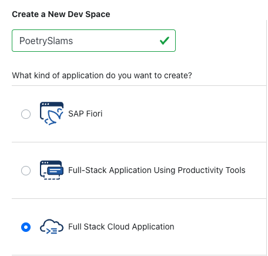

# Prepare Your SAP Business Technology Platform Account for Development

## Prerequisites 

To start with this tutorial, you need an SAP Business Technology Platform (SAP BTP) global Test, Demo, and Development (TDD) account.

## Set Up Your SAP BTP Subaccount

### Create Your Subaccount

1. Go to your SAP BTP global account.
2. Create a new *Multi-Environment* subaccount with the name `PoetrySlams` and enter *Amazon Web Services (AWS)* as provider.

   > The subdomain must be unique across the whole region. Therefore, include an abbreviation that uniquely identifies your company. Don't use special characters or capital letters. In addition, keep it short to avoid length restriction issues.

### Enable SAP Business Application Studio

After you've created a new SAP BTP subaccount, only the standard services appear in the *Entitlements* list. To enable SAP Business Application Studio, assign the respective entitlement to the newly created SAP BTP subaccount:

1. Go to the SAP BTP global account.
2. Go to *Entitlements* and *Entity Assignments*. 
3. Open the value help under *Select Entities* and select the corresponding SAP BTP subaccount, for example, *PoetrySlams*.
4. Choose *Configure Entitlements* and *Add Service Plans*. 
5. Select the *SAP Business Application Studio* entitlement and choose an available plan.

   

6. Choose *Add 1 Service Plan* and save your changes. 
7. Go back to your SAP BTP subaccount. 
8. *SAP Business Application Studio* is now available in the *Entitlements* list. 
9. To create an instance of this service within the SAP BTP subaccount, go to *Service Marketplace*. As a service, select *SAP Business Application Studio* and choose *Create*.

   

10. The instance appears in the *Subscriptions* list.

   

11. When you first start it, access is denied because the user roles have not yet been assigned to this service instance. To assign them, go to *Security* and *Users*. 
12. Select your user and go to the assigned *Role Collections*. 
13. Select all the roles of *SAP Business Application Studio* and confirm the assignment.

   

14. Three role collections have been added.

   

15. Now, you can start SAP Business Application Studio. If access is denied, wait a few seconds and try again. You may need to clear your browser cache. 

   

16. After you've started the development environment, create a new *Dev Space* for the development of this tutorial. Name it `PoetrySlams` and select *Full-Stack Cloud Application*.

   

## Set Up Your GitHub Repository

1. Create a new GitHub repository in a GitHub organization of your choice as a code repository of your own project. 
2. Link it with your *Dev Space*.

In the [next section](./12-Prepare-Deployment.md), you prepare your subaccount for deployment of the application. Afterward, you can directly clone this repository into your *Dev Space* to deploy and run the sample application as provided in this repository. Alternatively, you can create the application manually from scratch, which is also described in this tutorial.
