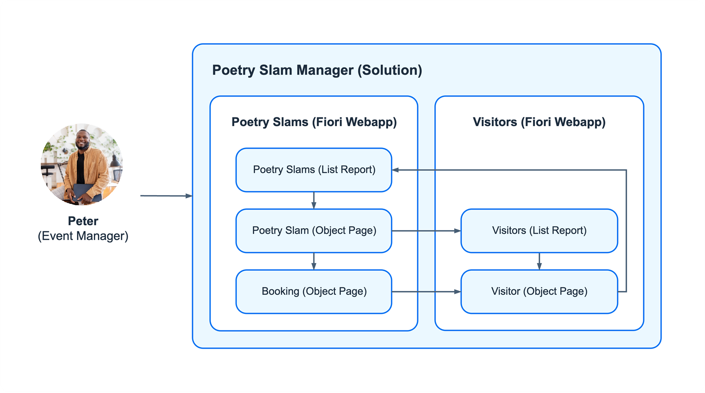
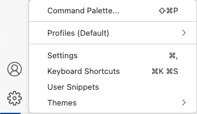
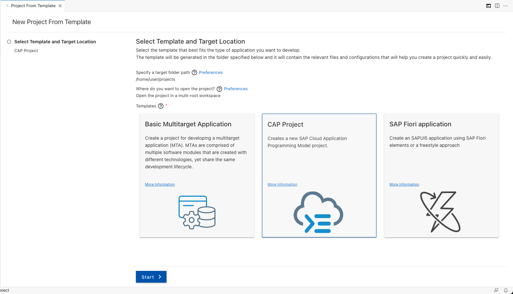
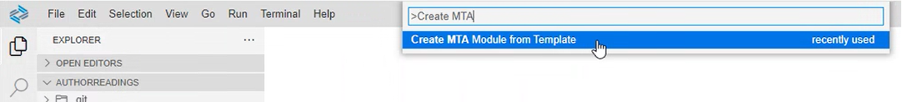
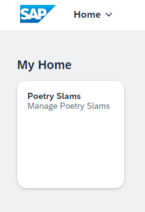

# Develop the Core of the SAP BTP Application

The Partner Reference Application is defined as the business solution *Poetry Slam Manager*. The applications *Poetry Slams* and *Visitors* belong to the business solution and are implemented as Fiori Elements apps, each with their own SAP Cloud Application Programming Model service. This tutorial shows you how to develop and how to test your application locally. First, you learn how the domain model of the business solution and the business logic of the *Poetry Slams* application are defined with the SAP Cloud Application Programming Model. You then add the user interface of the *Poetry Slams* application with SAP Fiori elements. Finally, you learn how to add the application *Visitors* to the business solution, and how to enable the navigation between the applications.

The Poetry Slam Manager has three entities: poetry slams, visitors and visits (bookings). The image shows the apps and the navigation between the UI pages of the entities. To improve the user interface, the visits entity is named bookings.

<p align="center">
    
</p>

## Create a New Project Based on SAP Cloud Application Programming Model
1. To start a new development project, go to the settings in SAP Business Application Studio and open the *Command Palette...*.

   

2. Search for `SAP Business Application Studio: New Project from Template`.

3. Create a new SAP Cloud Application Programming Model (CAP) project. Make sure the target folder path is set to `home/user/projects`.

   

4. Add the following attributes to the SAP Cloud Application Programming Model (CAP) project:
    - As *project name*, enter `partner-reference-application`.
    - Select `Node.js` as your *runtime*.
    - As *productive runtime capabilities*, select *SAP HANA Cloud* and *User Authentication via XSUAA*.
    - For the deployment, select *Clound Foundry: MTA Deployment*. As a result, support for multi-target applications (MTA) is added. 

    As a result, a folder called `partner-reference-application` is created, which includes a set of files to start an SAP Cloud Application Programming Model project.

5. To add dependent node modules, perform `npm install` in a terminal.

6. Create a *.gitignore* file that includes at least the *node_modules/* folder. You may use the [*.gitignore*](../../../tree/main-single-tenant/.gitignore) of this repository with other useful entries.

7. Adapt the created *package.json* file to your needs (for example, change the description attribute, add scripts, etc.). You may use the [*package.json*](../../../tree/main-single-tenant/package.json) of this repository as a reference. For general documentation, see the [npmjs documentation](https://docs.npmjs.com/cli/v10/configuring-npm/package-json).

Looking for more information? Go to the [SAP Cloud Application Programming Model documentation on command line interface](https://cap.cloud.sap/docs/tools/#command-line-interface-cli).

## Define the Domain Models

The domain model represents the relational database model of the application. All entities (tables), their relations (associations), and additional metadata (annotations) are maintained in the domain model. 

For more information on domain modeling, go to the [SAP Cloud Application Programming Model documentation on domain modeling](https://cap.cloud.sap/docs/guides/domain-modeling).

Following the SAP Cloud Application Programming Model, all domain models must be stored in the */db* folder of the project. You create a new file (in this example, [*/db/poetrySlamManagerModel.cds*](../../../tree/main-single-tenant/db/poetrySlamManagerModel.cds)) and add your application entities. In a CDS file, specify a namespace, which is used to structure the entities of the domain model. 
We recommend that you avoid names that are too long. To include reuse components, add a *using* statement. You can define as many entities as required by using the *entity* keyword.

To add entities, use the core data services graphical modeler for SAP Business Application Studio or the code line:
- If you want to create a completely new domain model, we recommend that you use the CDS graphical modeler.
- However, if you want to make some adjustments on top of an already existing domain model, we recommend the code line. 

To open the CDS graphical modeler, open the context menu in the created CDS file and select *Open With > CDS Graphical Modeler*.  

To add additional metadata to the entities, annotate them by using the *annotate* keyword. To make it as easy as possible to read the code, use different files to separate the entity definition and additional metadata. If you want to read up on adding annotations, go to the [SAP Cloud Application Programming Model documentation on data annotations](https://cap.cloud.sap/docs/advanced/odata#annotations).

Copy [Tutorial Domain Model Entity Definitions](../../../tree/main-single-tenant/db/poetrySlamManagerModel.cds) into your project.

## Reuse Common Content
The modeled entities contain attributes, such as currencies, which are common for typical business applications. For this purpose, SAP provides the node module [@sap/cds-common-content](https://www.npmjs.com/package/@sap/cds-common-content), which includes code lists based on the ISO specification of the following CDS common definitions:

- sap.common.Countries: ISO 3166-1
- sap.common.Currencies: ISO 4217
- sap.common.Languages: ISO 639-1

The code names and descriptions are translated into the main languages that are supported by SAP.

In this application, the module to import all default currencies is used. There is no need to manually maintain a list of currencies and their translations.

The following steps are required to use the module in the project:

1. Add the node module with command `npm add @sap/cds-common-content`. Check that it was added to [*package.json*](../../../tree/main-single-tenant/package.json).
2. Install the node module with command `npm install`.
3. Import the module in the CDS definition. This was already done in the sample file [*poetrySlamManagerModel.cds*](../../../tree/main-single-tenant/db/poetrySlamManagerModel.cds) with code line `using from '@sap/cds-common-content';`

## Create an Initial Data Set

Create an [initial data set](https://cap.cloud.sap/docs/guides/databases#providing-initial-data), which will be available after you've started the application. You can specify the data in SAP Cloud Application Programming Model by creating a set of CSV files in the */db/data* folder of the project.

The corresponding entity is encoded in the file name by concatenating the namespace and the entity name (for example, *sap.samples.poetryslams-Visitors.csv*).

Copy the [initial data set](../../../tree/main-single-tenant/db/data/) into your project.

> Note: Initial data sets can be great for quick testing, but in productive environments they should be used for immutable data only. See also the information in the [capire documentation](https://cap.cloud.sap/docs/guides/databases#using-csv-files).

## Define Services

After you've defined the domain model with its entities, define a set of [SAP Cloud Application Programming Model services](https://cap.cloud.sap/docs/guides/providing-services) to add business logic and external APIs to the application. All service definitions must be located in the */srv* folder. You can use subfolders to structure the different services according to their usage. 

1. Create a folder *poetryslam* in the */srv* folder. The folder should contain all the files that are required for the Poetry Slam service.
2. Copy the service definition from [*/srv/poetryslam/poetrySlamService.cds*](../../../tree/main-single-tenant/srv/poetryslam/poetrySlamService.cds) into your project.
3. Create a file *services.cds* in the */srv* folder, which will reference all the service definitions (cds-files of the services). Add the reference to the Poetry Slam Service:

    ```cds
    using from './poetryslam/poetrySlamService';
    ```

To practice creating service entities, go to the [Defining Services tutorial](https://learning.sap.com/learning-journeys/develop-full-stack-applications-using-productivity-tools-in-sap-business-application-studio/defining-services_b82e0775-6d98-4b2f-b12c-2364af1f54b9).

## Create Business Logic

To add behavior to the domain model, you can implement a set of exits in the form of event handlers. Create a file */srv/poetryslam/poetrySlamServiceImplementation.js* as referenced from the */srv/poetryslam/poetrySlamService.cds* definition as the main file of your service implementation. Within this file, you can implement all the required event handlers. For better readability, in the Partner Reference Application, the service implementation is split into several files; the main file and one file for each entity with business logic. 

Every entity defined in the domain model definition comes with a set of generic event handlers for CRUD (create, read, update, delete) operations. Additionally, you can register one event handler per action (for example, *cancel* or *publish*). Note that for draft-enabled entities, you need to decide if the logic is required for the draft, the activated entity, or for both. 

Note that some code functions have been defined in separate utility files such as specific calculations for the entities and the constants for code list values.

Copy the main file of the [Poetry Slams service implementation](../../../tree/main-single-tenant/srv/poetryslam/poetrySlamServiceImplementation.js), the service implementation of the [poetry slams entity](../../../tree/main-single-tenant/srv/poetryslam/poetrySlamServicePoetrySlamsImplementation.js) and the service implementation of the [visits entity](../../../tree/main-single-tenant/srv/poetryslam/poetrySlamServiceVisitsImplementation.js) into the *srv* folder and the [code definitions](../../../tree/main-single-tenant/srv/poetryslam/util/codes.js) and [entity calculation functions](../../../tree/main-single-tenant/srv/poetryslam/util/entityCalculations.js) into the *srv/poetryslam/util* folder of your project.

### Readable IDs
In addition to technical UUIDs, this solution generates readable IDs that end users can use to uniquely identify poetry slam documents. Compared to randomly generated UUIDs, these readable IDs are user-friendlier as they are easier to remember. One common approach for generating readable IDs is to use a combination of meaningful words and numbers. In this example, the poetry slam number is a combination of a prefix and a generated number, for example, *PS-10*.

The number generation depends on the database that you use. For local testing, you use an SQLite database and, for deployed solutions, SAP HANA Cloud. In SQLite, you use the AUTOINCREMENT feature. In SAP HANA Cloud, you use a HANA sequence. This distinction is implemented in the function [getNextNumber of class uniqueNumberGenerator](../../../tree/main-single-tenant/srv/poetryslam/util/uniqueNumberGenerator.js), which is called in the [Poetry Slams service implementation](../../../tree/main-single-tenant/srv/poetryslam/poetrySlamServicePoetrySlamsImplementation.js) when the poetry slam is created (which is the first time a draft is saved).

The sequence used by SAP HANA Cloud is defined in the [poetrySlamNumber.hdbsequence](../../../tree/main-single-tenant/db/src/poetrySlamNumber.hdbsequence). Note that, for SAP HANA Cloud sequences, the generated numbers can't be rolled back. So, if a transaction is not committed, a number is lost from the sequence.

Copy the [poetrySlamNumber.hdbsequence](../../../tree/main-single-tenant/db/src/poetrySlamNumber.hdbsequence) and the [class uniqueNumberGenerator](../../../tree/main-single-tenant/srv/poetryslam/util/uniqueNumberGenerator.js) into your project.

### Input Validation
Input validation ensures that the entered data is correct. Input validations can either be achieved via annotations in the entity definition or via implementation in the service handler. 

You can find an example of input validation via an annotation in the [visitors entity definition](../../../tree/main-single-tenant/db/poetrySlamManagerModel.cds). It defines an assertion about the format of the e-mail address via regular expression. 

```cds
//Visitors table
entity Visitors : cuid, managed {
    ...
    // Regex annotation to validate the input of the e-mail 
    e-mail  : String @assert.format: '^[\w\-\.]+@([\w-]+\.)+[\w-]{2,4}$';
    ...
}
```
Find more details in the [SAP Cloud Application Programming Model documentation on input validation](https://cap.cloud.sap/docs/guides/providing-services#input-validation).

### Calculations and Enrichments
Data can be calculated and enriched in the service. Poetry Slam Manager includes examples of different types of calculations: calculated elements, virtual elements, and calculations of stored and read-only attributes.
- A [calculated element](https://cap.cloud.sap/docs/cds/cdl#calculated-elements) is calculated on the basis of other elements, for example, the *bookedSeats* of the PoetrySlam entity. It's not stored in the database, but calculated when requested from the user interface.
- An example of a calculation of a stored entity is the attribute *freeVisitorSeats*, which is calculated based on the visits that were created and booked.
- A [virtual element](https://cap.cloud.sap/docs/cds/cdl#virtual-elements) is shown with the *statusCriticality* attribute, which is read-only and calculated after the read event of the PoetrySlam entity.

  ```cds
    entity PoetrySlams as select from poetrySlamManagerModel.PoetrySlams  {
      ...
      maxVisitorsNumber - freeVisitorSeats as bookedSeats : Integer @title : '{i18n>bookedSeats}', //calculated element
      // Relevant for color-coding the status on the UI to show priority
      virtual null as statusCriticality : Integer, 
    }
  ```

### Status Handling
A status is defined as a codelist with code, text, and a description. The values of the codelist can be added by [providing initial data](https://cap.cloud.sap/docs/guides/databases#providing-initial-data). As a reference, you can use the [PoetrySlamStatusCodes](../../../tree/main-single-tenant/db/data).

To initialize the status, set a default in the [entity definition](../../../tree/main-single-tenant/db/poetrySlamManagerModel.cds). The following example shows the entity *PoetrySlamStatusCodes*:

```cds
entity PoetrySlamStatusCodes : sap.common.CodeList {
    // Set the default status code to 1 (in preparation)
    key code : Integer default 1
        ...
}
```
You handle the status transitions of an instance in the event handlers of the [service implementation of an entity](../../../tree/main-single-tenant/srv/poetryslam/poetrySlamServicePoetrySlamsImplementation.js). 
- In Poetry Slam Manager, the PoetrySlam entity uses *PoetrySlamStatusCodes*. After an instance has been created, the status is set to the default *In Preparation*.
- With the *Publish* action of the PoetrySlam entity, a PoetrySlam instance is published as soon as the user calls the action. 
- The status *Cancel* is set as soon as the *Cancel* action is called.
- The status *Booked* is calculated and can only be applied when the PoetrySlam entity is published and fully booked, which means when there are no free visitor seats left. The calculation is done during the update of the PoetrySlam and the visit entities. The *cancelVisit* and *confirmVisit* actions require a recalculation, too.

## Add a Web Application with SAP Fiori Elements
Next, you add an SAP Fiori element-based user interface.

### Use the SAP Fiori Element Application Wizard
1. To start the wizard, search for *Create MTA Module from Template* in the *Command Palette...*.

   

2. Select the *SAP Fiori application* module template. 
3. Select *List Report Page*.
4. Select the data source and the OData service as follows:
   - *Data source*: *Use a Local CAP Project*
   - Choose your CAP project: *partner-reference-application*
   - *OData Service*: `PoetrySlamService (Node.js)`
5. Select the main entity from the list:
   - *Main entity*: *PoetrySlams*
   - *Navigation entity*: *None*
   - *Automatically add table columns*: *Yes*
6. Add further project attributes:
   - *Module name*: `poetryslams`
   - *Application title*: `Poetry Slams`
   - *Application namespace*: leave empty
   - *Description*: `Application to create and manage poetry slams`
   - *Add deployment configuration*: *Yes*
   - *Add FLP configuration*: *Yes*
   - *Configure Advanced Options*: *No*
7. Select *Cloud Foundry* as target of the deployment configuration. 
8. For now, the destination name is set to *none* because you'll configure it in a later step of this tutorial. 
9. Enter information on the SAP Fiori launchpad configuration:
   - *Semantic Object*: `poetryslams`
   - *Action*: `display`
   - *Title*: `Poetry Slams`
   - *Subtitle* (optional): `Manage Poetry Slams`
10. Choose *Finish*. The wizard creates the */app* folder, which contains all files related to the user interface.

Looking for more information on using SAP Fiori tools? See the tutorial [Serving SAP Fiori UIs](https://cap.cloud.sap/docs/advanced/fiori#using-sap-fiori-tools).

### Fine-Tune the User Interface
To adapt the generated user interface to your needs, you can either use the [SAP Fiori tools, application modeler](https://help.sap.com/docs/SAP_FIORI_tools/17d50220bcd848aa854c9c182d65b699/a9c004397af5461fbf765419fc1d606a.html?locale=en-US) or you can change the generated files manually.

The SAP Fiori tools, application modeler includes two tools, which are helpful when creating new pages or adjusting existing ones:
- [Page Editor](https://help.sap.com/docs/SAP_FIORI_tools/17d50220bcd848aa854c9c182d65b699/047507c86afa4e96bb3d284adb9f4726.html?locale=en-US): Create and maintain annotation-based UI elements
- [Page Map](https://help.sap.com/docs/SAP_FIORI_tools/17d50220bcd848aa854c9c182d65b699/bae38e6216754a76896b926a3d6ac3a9.html?locale=en-US): Change the structure of pages and application-wide settings

> Note: The recommendation is to use the SAP Fiori tools to create new pages or to enhance existing ones with additional features as the tools generate the required annotations in the annotations file. For better readability, you can restructure the annotations afterwards.

The most relevant files are the following:
- [`app/poetryslams/annotations.cds`](../../../tree/main-single-tenant/app/poetryslams/annotations.cds): Configure the annotations to change the appearance of UI elements.
- [`app/poetryslams/webapp/manifest.json`](../../../tree/main-single-tenant/app/poetryslams/webapp/manifest.json): Define the information about the application (for example, application names, routes, navigations, and so on).
- [`app/poetryslams/webapp/index.html`](../../../tree/main-single-tenant/app/poetryslams/webapp/index.html): Define the appearance of the first UI of your application that is opened via a managed app router or local testing. This can either be a single component or a [sandbox environment for the SAP Fiori launchpad](https://help.sap.com/docs/SAP_NETWEAVER_AS_ABAP_FOR_SOH_740/9765143c554c4ec3951fb17ff80d8989/896efc419d994463a7c148b6904760a8.html?locale=en-US). In this example, the generated file is adopted as described in the section about [sandbox environment for the SAP Fiori launchpad](https://help.sap.com/docs/SAP_NETWEAVER_AS_ABAP_FOR_SOH_740/9765143c554c4ec3951fb17ff80d8989/896efc419d994463a7c148b6904760a8.html?locale=en-US).

In the next paragraphs, some of the content of these files is explained to showcase what may be achieved and how. However, this tutorial will not explain every single line of these files, so you may just replace the content of the generated *annotations.cds*, *manifest.json*, and *index.html* from the example implementation ([annotations.cds](../../../tree/main-single-tenant/app/poetryslams/annotations.cds), [manifest.json](../../../tree/main-single-tenant/app/poetryslams/webapp/manifest.json), and [index.html](../../../tree/main-single-tenant/app/poetryslams/webapp/index.html)). 

#### Using Different User Interface Pages

The [manifest.json](../../../tree/main-single-tenant/app/poetryslams/webapp/manifest.json) of the *poetryslams* app defines a poetry slams list report (*PoetrySlamsList*), a poetry slams object page (*PoetrySlamsObjectPage*) and a bookings object page (*PoetrySlams_visitsObjectPage*), and specifies the navigation between the pages in the *routing* section.

The *PoetrySlams_visitsObjectPage* shall not be opened when the creation of a booking in the poetry slams object page is done, therefore set the [*inline* creation mode](https://sapui5.hana.ondemand.com/sdk/#/topic/cfb04f0c58e7409992feb4c91aa9410b) in the [manifest.json](../../../tree/main-single-tenant/app/poetryslams/webapp/manifest.json).

```json
    "controlConfiguration": {
        "visits/@com.sap.vocabularies.UI.v1.LineItem#VisitorData": {
            "tableSettings": {
                "creationMode": {
                    "createAtEnd": true,
                    "name": "Inline"
                }
            }
        }
    }
```

As the bookings object page shall be a read-only UI, the update is hidden for the entity visits in the [annotations.cds](../../../tree/main-single-tenant/app/poetryslams/annotations.cds).

```cds
annotate service.Visits with @(
UI : {
    UpdateHidden   : true
});  
```

#### Enabling Auto-Refresh when Testing Your Development

Copy the content of the [*ui5.yaml*](../../../tree/main-single-tenant/app/poetryslams/ui5.yaml). It contains a configuration for the `server middleware` which enables the auto-update of UI-changes when testing locally. The whole testing process is explained further below.

#### Annotation Examples

| Functionality                                                                                      | Description                                                                                               | Example       |
| ---------                                                                                          | -------------                                                                                             | ------------- |
| [Semantic Key](https://sapui5.hana.ondemand.com/sdk/#/topic/4c2d17aec55b4162b19f1b573b5a4f99.html) | Display the editing status of a column in the list report                                                 | [annotations.cds > service.PoetrySlams](../../../tree/main-single-tenant/app/poetryslams/annotations.cds) |
| [Side Effects](https://sapui5.hana.ondemand.com/sdk/#/topic/18b17bdd49d1436fa9172cbb01e26544.html) | Reload data, permissions, or messages, or trigger determine actions based on data changes in the UI scenarios | [annotations.cds > service.Visits](../../../tree/main-single-tenant/app/poetryslams/annotations.cds) |
| [Value List](https://sapui5.hana.ondemand.com/sdk/#/topic/16d43eb0472c4d5a9439ca1bf92c915d.html)   | Enable the selection of a value in a column with the help of a value list                                 | [annotations.cds > service.Visits](../../../tree/main-single-tenant/app/poetryslams/annotations.cds) |

#### Sandbox Environment for the SAP Fiori Launchpad
After the SAP Fiori application is created by the wizard, a single component is loaded when the application is started via managed app router or when locally executed. In the Partner Reference Application, the loaded single component is the SAP Fiori elements *ListReportPage* named *PoetrySlamsList*. If an SAP Fiori launchpad is loaded to show tiles for several applications, some changes are required in the *app/poetryslams/webapp/index.html*. 

You can find further details in the [documentation on the sandbox environment for the SAP Fiori launchpad](https://help.sap.com/docs/SAP_NETWEAVER_AS_ABAP_FOR_SOH_740/9765143c554c4ec3951fb17ff80d8989/896efc419d994463a7c148b6904760a8.html).

> Note: The [*manifest.json*](../../../tree/main-single-tenant/app/poetryslams/webapp/manifest.json) defines which component is loaded initially by setting `initialLoad: true` as an option of the component.

To load the sandbox and SAPUI5, you need to replace the SAPUI5 bootstraping script with a script to configure an SAPUI5 shell ([*setShellConfig.js*](../../../tree/main-single-tenant/app/poetryslams/webapp/util/setShellConfig.js)). Additionally, the shell needs to be rendered and placed on the HTML body as soon as the SAPUI5 core is initialized ([*setContent.js*](../../../tree/main-single-tenant/app/poetryslams/webapp/util/setContent.js)). Add both files to folder *app/poetryslams/webapp/util*. Using separate scripts allows you to avoid inline scripts in the Content Security Policy (see the corresponding paragraph in [Prepare Your Project Configuration for Cloud Foundry Deployments](./15a-Prepare-One-Off-Deployment.md#prepare-your-project-configuration-for-cloud-foundry-deployments)).

Use the different scripts in the `<head>` section of the [`app/poetryslams/webapp/index.html`](../../../tree/main-single-tenant/app/poetryslams/webapp/index.html):

```html
<script type="text/javascript" src="util/setShellConfig.js"></script>

<script src="https://sapui5.hana.ondemand.com/1.120.4/test-resources/sap/ushell/bootstrap/sandbox.js"></script>
<script
    src="https://sapui5.hana.ondemand.com/1.120.4/resources/sap-ui-core.js"
    data-sap-ui-libs="sap.m, sap.ushell, sap.fe.templates, sap.uxap"
    data-sap-ui-compatVersion="edge"
    data-sap-ui-theme="sap_horizon"
    data-sap-ui-frameOptions="allow"
    data-sap-ui-bindingSyntax="complex"
    data-sap-ui-async="true"
></script>
<script type="text/javascript" src="util/setContent.js"></script>
```

> Note: in the above snippet you see a reference to a specific SAP UI5 version. See section [Update Project Dependencies](./14-Develop-Core-Application.md#update-project-dependencies) about updating the SAP UI5 version.

#### Autoload Data
By default, lists aren't automatically prefilled when the *List Report* is displayed. However, you can change this behavior by enabling the autoload feature. To do so, simply go to */app/poetryslams/webapp/manifest.json* and add the following parameters:

```json
{
    "sap.ui5": {
        "routing": {
            "targets": {
                "PoetrySlamsList": {
                    "options": {
                        "settings": {
                            "initialLoad": true
                        }
                    }
                }
            }
        }
    }
}
```

#### Color-Coding
To implement a color-coding system for specific columns on the user interface, add a hidden column *statusCriticality* that contains color-coding information. Note that the column is not part of the database model, but only added in the service definition and filled dynamically at READ of the entity.

- Field definition in [*poetrySlamService.cds*](../../../tree/main-single-tenant/srv/poetryslam/poetrySlamService.cds)
- Logic to fill it in [*poetrySlamServicePoetrySlamsImplementation.js*](../../../tree/main-single-tenant/srv/poetryslam/poetrySlamServicePoetrySlamsImplementation.js)
    ```javascript
    for (const poetrySlam of convertToArray(data)) {
        const status = poetrySlam.status?.code || poetrySlam.status_code;
        // Set status colour code
        switch (status) {
            case codes.poetrySlamStatusCode.inPreparation:
            poetrySlam.statusCriticality = codes.color.grey; // New poetry slams are grey
            break;
            case codes.poetrySlamStatusCode.published:
            poetrySlam.statusCriticality = codes.color.green; // Published poetry slams are green
            break;
            case codes.poetrySlamStatusCode.booked:
            poetrySlam.statusCriticality = codes.color.yellow; // Fully booked poetry slams are yellow
            break;
            case codes.poetrySlamStatusCode.canceled:
            poetrySlam.statusCriticality = codes.color.red; // Canceled poetry slams are red
            break;
            default:
            poetrySlam.statusCriticality = null;
        }
    }
    ```

-  Add the helper function to convert an object to an array to the beginning of the file (above the module.export).

    ```javascript
    // Helper function to convert an object to an array
    function convertToArray(x) {
        return Array.isArray(x) ? x : [x];
    }
    ```
- Entries in the i18n files to set the column headers
- An entry in the [*annotations.cds*](../../../tree/main-single-tenant/app/poetryslams/annotations.cds) to use the field on the user interface

The color values, as defined in the codes constants, are fixed values that the UI interpretes automatically.

> Note: *statusCriticality* is modeled as a **[virtual element](https://cap.cloud.sap/docs/cds/cdl#virtual-elements)** and must be initialized in the application code. Otherwise, the READ request will be sent again and again until the application crashes.

### Draft Concept
The SAP Cloud Application Programming Model / SAP Fiori elements stack supports a *Draft Concept* out of the box. This enables users to store inconsistent data without having to publish them to others users. 

You can find more details in the [SAP Cloud Application Programming Model documentation on draft support](https://cap.cloud.sap/docs/advanced/fiori#draft-support). In the Poetry Slams application, the used *Poetry Slams* Service has the entity *PoetrySlams* draft-enabled. In the *Visitors* service, which is used by the Visitors application, the *Visitors* entity is draft-enabled. 

> Note: SAP Fiori elements v4 only supports editable object pages for draft-enabled entities. In case an entity is not draft-enabled in the used service, the user interface does not allow changes.

## Add Translations

Translations of UI labels and texts are stored in properties-files in i18n-folders.

The app is based on the SAP Cloud Application Programming Model default settings:
- All labels used in the domain model are stored in *i18n.properties* files in the folder *../db/i18n*.
- All service model and system message texts are stored in the *i18n.properties* and *messages.properties* files in the folder *../srv/i18n*.
- All web application texts are stored in *i18n.properties* files in the folder *../app/poetryslams/webapp/i18n/*.
- All web application texts specific to the *manifest.json* are stored in the *i18n.properties* files in the folder *../app/poetryslams/i18n/*.

For non-default languages, add the ISO code of the language to the file name, for example, *i18n_de.properties* and *messages_de.properties*.

Copy the [domain model-i18n files](../../../tree/main-single-tenant/db/i18n), [service model and message-i18n files](../../../tree/main-single-tenant/srv/i18n), [web application texts](../../../tree/main-single-tenant/app/poetryslams/webapp/i18n), and [web application texts for the manifest](../../../tree/main-single-tenant/app/poetryslams/i18n) into your project.

## Add Authentication and Role-Based Authorization
To protect the application against unauthorized access, add user-based authentication and authorizations to the application. Broadly speaking, the application defines roles and assigns them statically to service operations such as reading or writing of a certain entity. The customer creates role templates that group a set of roles, which are assigned to the customer's users. You can find further details in the [SAP Cloud Application Programming Model documentation on authorization and access control](https://cap.cloud.sap/docs/guides/authorization).

First, you define the *Roles* as part of the application definition concept. For the Poetry Slam Manager application, two roles are defined: *PoetrySlamManager* and *PoetrySlamVisitor*.

The authorization is always defined on the service level; in this application on the level of the */srv/poetryslam/poetrySlamService.cds*. For better readability, separate the authorization definitions from the service definitions by creating a new file */srv/poetryslam/poetrySlamServiceAuthorizations.cds* that contains all the authorization-relevant model parts. Copy the content from the example implementation [srv/poetryslam/poetrySlamServiceAuthorizations.cds](../../../tree/main-single-tenant/srv/poetryslam/poetrySlamServiceAuthorizations.cds). Enhance the file */srv/services.cds* with the reference to the Poetry Slam Service Authorizations:

```cds
using from './poetryslam/poetrySlamServiceAuthorizations';
```

The wizard created all runtime-relevant security settings of our application. It generated the *xs-security.json*. Open the generated file and replace it. It defines two role collections according to the described roles.

```json
{
    "scopes": [
        {
            "name": "$XSAPPNAME.PoetrySlamFull",
            "description": "Full Read/Write Access to PoetrySlams"
        },
        {
            "name": "$XSAPPNAME.PoetrySlamRestricted",
            "description": "Restricted Read/Write Access to PoetrySlams"
        } 
    ],
    "attributes": [],
    "role-templates": [
        {
            "name": "PoetrySlamManagerRole",
            "description": "Full Access to PoetrySlams",
            "scope-references": [
                "$XSAPPNAME.PoetrySlamFull"
            ],
            "attribute-references": []
        },
        {
            "name": "PoetrySlamVisitorRole",
            "description": "Restricted Access to PoetrySlams for Visitors",
            "scope-references": [
                "$XSAPPNAME.PoetrySlamRestricted"
            ],
            "attribute-references": []
        }          
    ],
    "role-collections": [
        {
            "name": "PoetrySlamManagerRoleCollection",
            "description": "Poetry Slam Manager",
            "role-template-references": [
                "$XSAPPNAME.PoetrySlamManagerRole"
            ]
        },
        {
            "name": "PoetrySlamVisitorRoleCollection",
            "description": "Poetry Slam Visitor",
            "role-template-references": [
                "$XSAPPNAME.PoetrySlamVisitorRole"
            ]
        }
    ]
}
```
		
> Note: In case of multiple deployments, uniqueness of role collections becomes an issue (role collections must be unique within a subaccount). To fix this, prefix namespaces.

Additionally, replace the CDS section in the *package.json*. It tells the CDS framework that you use the cloud security services integration library service of SAP Business Technology Platform. Additionally, it adds *assert integrity* on the database layer, which generates foreign-key constraints. 

For details, refer to the [SAP Cloud Application Programming Model documentation on database constraints](https://cap.cloud.sap/docs/guides/databases#db-constraints).

```json
"cds": {
    "features": {
        "assert_integrity": "db"
    },
    "requires": {
        "db": {
            "kind": "sql"
        },
        "uaa": {
            "kind": "xsuaa"
        }
    },
    "hana": {
        "deploy-format": "hdbtable"
    }
}
```

Last but not least, in the *.cdsrc.json*, define users and their roles for local testing. Here's an example of how you define three users with names, passwords, and assigned roles: 

```json
{
    "requires": {
        "[development]": {
            "auth": {
                "kind": "mocked",
                "users": {
                    "Peter": {
                        "password": "welcome",
                        "id": "peter",
                        "roles": [
                            "PoetrySlamFull",
                            "authenticated-user"
                        ]
                    },
                    "Julie": {
                        "password": "welcome",
                        "id": "julie",
                        "roles": [
                            "PoetrySlamRestricted",
                            "authenticated-user"
                        ]
                    },
                    "Denise": {
                        "password": "welcome",
                        "id": "denise",
                        "roles": [
                            "authenticated-user"
                        ]
                    },
                    "*": true
                }
            }
        }
    }    
}
```

## Add a Second Application

In this section, you learn how to add a second application *Visitors* to the business solution and how to implement the navigation between the *Poetry Slams* and *Visitors* applications. 

1. Add a `visitor` service by copying the service definition from [*srv/visitor/visitorService.cds*](../../../tree/main-single-tenant/srv/visitor/visitorService.cds) to a new folder `visitor` in the `srv`-folder of your project. 
    > Note: The poetryslam service cannot be used for the *Visitors* application as the `visitor` entity is defined as a read-only Poetry Slams service, but it should be changable in the *Visitors* application. The recommendation is to define a unique service for each application.

    > Note: The *Visitors* application does not have a Java Script implementation as no specific logic is added.

    > Note: The entity `visitors` needs to be draft-enabled in the service, otherwise SAP Fiori Elements only renders a read-only object list.

2. Add the authorizations for the `visitor` service by copying the [*srv/visitor/visitorServiceAuthorizations.cds*](../../../tree/main-single-tenant/srv/visitor/visitorServiceAuthorizations.cds).

3. Enhance the file */srv/services.cds* with the reference to the Visitor Service and the Visitor Service Authorizations:

    ```cds
    using from './visitor/visitorService';
    using from './visitor/visitorServiceAuthorizations';
    ```

4. Use the SAP Fiori Element Application Wizard *Create MTA Module from Template* in the *Command Palette* to create the `visitors` module. Refer to [*Use the SAP Fiori Element Application Wizard*](./14-Develop-Core-Application.md#use-the-sap-fiori-element-application-wizard).

    > Note: The wizard will create the [*/app/visitors*-folder with the content of a *SAP Fiori Elements application*](../../../tree/main-single-tenant/app/visitors).

5. Copy the [*content of the ui5.yaml*](../../../tree/main-single-tenant/app/visitors/ui5.yaml).

6. The generated [`app/visitors/webapp/index.html`](../../../tree/main-single-tenant/app/visitors/webapp/index.html) has some inline scripts. To avoid allowing inline scripts in the Content Security Policy (see the corresponding paragraph in [Prepare Your Project Configuration for Cloud Foundry Deployments](./15a-Prepare-One-Off-Deployment.md#prepare-your-project-configuration-for-cloud-foundry-deployments)) replace them:
   1. Copy the files [*setShellConfig.js*](../../../tree/main-single-tenant/app/visitors/webapp/util/setShellConfig.js) and [*setContent.js*](../../../tree/main-single-tenant/app/visitors/webapp/util/setContent.js) into the folder *app/visitors/webapp/util*.
   2. Adopt the `<head>` section of the `app/visitors/webapp/index.html` to use those scripts (see the [`app/visitors/webapp/index.html`](../../../tree/main-single-tenant/app/visitors/webapp/index.html) in this repository).

7. Copy i18n-files with the texts of the *Visitors* UI from [*app/visitors/i18n*-folder](../../../tree/main-single-tenant/app/visitors/i18n) and [*app/visitors/webapp/i18n*-folder](../../../tree/main-single-tenant/app/visitors/webapp/i18n).

8. Add the navigation logic between the *Poetry Slams* and the *Visitors* application by adding SAPUI5 custom logic to the Fiori Elements apps:

    > Note: For one-off deployments with SAP Build Workzone as the launchpad, the [*intent-based navigation*](https://sapui5.hana.ondemand.com/sdk/#/topic/d782acf8bfd74107ad6a04f0361c5f62) of Fiori Elements can be used to handle the navigation between the different applications. As SAP Build Workzone is currently not enabled for multitenancy, a custom solution via SAPUI5 is required. In this example, you use such a custom solution which will work for all cases: local testing, in a deployed solution with SAP Build Workzone, and in a deployed (multi-tenant) solution without SAP Build Workzone.

     1. Enhance [the manifest.json of the Poetry Slam application](../../../tree/main-single-tenant/app/poetryslams/webapp/manifest.json) by adding a custom action in the targets to the header of the VisitorsObjectPage.
        ```json
        "content": {
            "header": {
                "actions": {
                    "MaintainVisitors": {
                        "press": "poetryslams.ext.customActions.navigateVisitors",
                        "visible": true,
                        "enabled": true,
                        "text": "{i18n>maintainVisitors}"
                    }
                }
            }
        }
        ```
    
    2. Add the custom implementation of the action: create a folder `app/poetryslams/webapp/ext` and copy the file [customActions.js](../../../tree/main-single-tenant/app/poetryslams/webapp/ext/customActions.js) into that folder.

    3. Add the custom action in the targets to the header of the PoetrySlamsObjectPage in [the manifest.json of the Visitors application](../../../tree/main-single-tenant/app/visitors/webapp/manifest.json).
        ```json
        "content": {
            "header": {
                "actions": {
                    "MaintainPoetrySlam": {
                        "press": "visitors.ext.customActions.navigatePoetrySlams",
                        "visible": true,
                        "enabled": true,
                        "text": "{i18n>maintainPoetrySlams}"
                    }
                }
            }
        }
        ```

    4. Add the custom implementation of the action. Therefore, create a folder `app/visitors/webapp/ext` and copy the file [customActions.js](../../../tree/main-single-tenant/app/visitors/webapp/ext/customActions.js) into that folder.

9. Adopt the generated file [annotations.cds](../../../tree/main-single-tenant/app/visitors/annotations.cds) to adjust the auto-generated List and Object Page to your needs. For example:
   - Rename the *UI.FieldGroup* from *#GeneratedGroup* to something more meaningful.
   - Use *Capabilities.InsertRestrictions*, *Capabilities.UpdateRestrictions*, *Capabilities.DeleteRestrictions* to enable *Create*, *Edit*, *Delete* buttons.
   - Add *HeaderInfo* and *SelectionFields*, as well as additional *UI.FieldGroups* and *Facets*
   - Add annotations for associations (in our case *Visits*).

10. Ensure that both applications ([*poetryslams*](../../../tree/main-single-tenant/app/poetryslams) and [*visitors*](../../../tree/main-single-tenant/app/visitors)) use the same value *"poetryslammanager"* for *"service"* in the section *"sap.cloud"* of the [manifest.json](../../../tree/main-single-tenant/app/visitors/webapp/manifest.json) file. This value specifies the name under which both UI definitions will be stored in the html5 repository, and this must be the same for all the applications of one solution (in our case, the two applications *poetryslams* and *visitors* make up the solution *poetryslammanager*).

## Update Project Dependencies

To keep the project up-to-date, update a few dependencies on a regular basis:

- Node Modules:
  - package.json
  - app/poetryslams/package.json
  - app/package.json (_Approuter - Only Multi-Tenancy_)
  - mtx/sidecar/package.json (_Only Multi-Tenancy_)
- SAPUI5 version:
  - app/poetryslams/webapp/manifest.json
  - app/poetryslams/webapp/index.html
  - app/poetryslams/webapp/test/flpSandbox.html
  - app/poetryslams/webapp/test/integration/opaTests.qunit.html
  - corresponding files in the subfolders of app/visits/
  - [@sap/ux-specification](https://www.npmjs.com/package/@sap/ux-specification?activeTab=versions): Keep the node module in sync with the currently used SAPUI5 version. For more details on mapping between the node module version and the SAPUI5 version, see this [overview](https://www.npmjs.com/package/@sap/ux-specification?activeTab=versions).

> Note: You can find information on the available SAPUI5 versions and their maintenance status in this [overview](https://sapui5.hana.ondemand.com/versionoverview.html). Especially note those version which are marked as *Long-term Maintenance*.

## Test the App

Now, you can start the web application and test it locally in SAP Business Application Studio:
1. Open a terminal in SAP Business Application Studio. 
2. Run the command `npm install` to ensure all modules are loaded and installed.
3. Use the run command `cds watch` to start the app. A success message indicates that the runtime has been started: *A service is listening to port 4004*.
4. To open the test environment, choose *Open in a New Tab* in the pop-up message or click on the link `http://localhost:4004` in the terminal. As a result, a browser tab opens with the web applications and OData service endpoints. 
5. Now it's time to test the web app: 
    1. Click on the *Web Application* */poetryslams/webapp/index.html*.
    2. A log-on message appears. Use the test users as listed in the file *.cdsrc.json*.
    3. The SAP Fiori launchpad including the generated tile appears. To launch the app, choose *Manage Poetry Slams*.
    
        

> Note: If you would like to switch users, clear the browser cache first. For example, in Google Chrome, press `CTRL+SHIFT+DEL`, go to *Advanced*, and choose a time range and *Passwords and other sign-in data*. 

If you want to get more details about the application implementation, go to [Test, Trace, Debug](./16-Test-Trace-Debug.md).

For more in-depth information on building SAP Cloud Application Programming Model applications, see the [SAP Cloud Application Programming Model documentation](https://cap.cloud.sap/docs/).

In the next step, you'll enhance the application in such a way that you can [deploy it to your SAP Business Technology Platform account](./15a-Prepare-One-Off-Deployment.md). 
