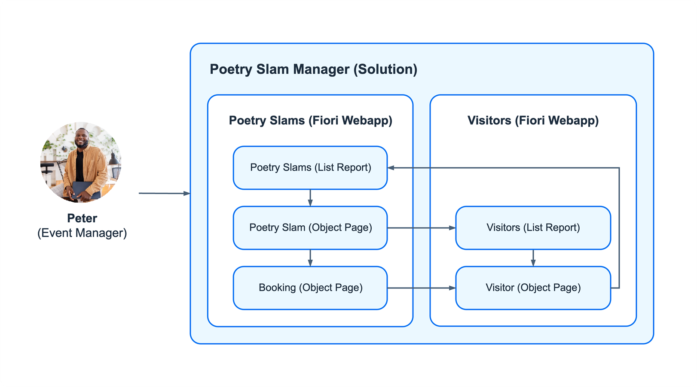
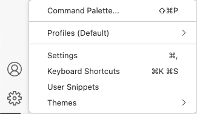
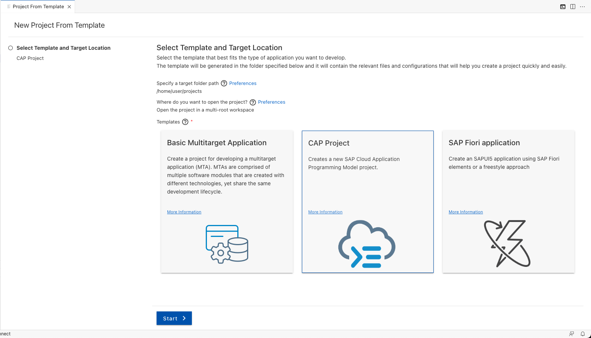

# Develop the Domain Model and the Business Logic with SAP Cloud Application Programming Model

The Partner Reference Application is defined as the business solution *Poetry Slam Manager*. The applications *Poetry Slams* and *Visitors* belong to the business solution and are implemented as SAP Fiori elements apps, each with their own SAP Cloud Application Programming Model service. 

The Poetry Slam Manager has three entities: poetry slams, visitors and visits (bookings). The image shows the apps and the navigation between the UI pages of the entities. To improve the user interface, the visits entity is named bookings.

<p align="center">
    
</p>

This tutorial shows you how to develop your application locally. First, you learn how the domain model of the business solution and the business logic of the *Poetry Slams* application are defined with the SAP Cloud Application Programming Model. 

## Create a New Project Based on SAP Cloud Application Programming Model
1. To start a new development project, go to the settings in SAP Business Application Studio and open the *Command Palette...* or press CTRL + SHIFT + P for Windows and COMMAND + SHIFT + P for Macintosh.

   

2. Search for `SAP Business Application Studio: New Project from Template`.

3. Create a new SAP Cloud Application Programming Model (CAP) project. Make sure the target folder path is set to `home/user/projects`.

   

4. Add the following attributes to the SAP Cloud Application Programming Model (CAP) project:
    - As *project name*, enter `partner-reference-application`.
    - Select `Node.js` as your *runtime*.
    - As *database for your application*, choose *SAP HANA Cloud*.
    - For the deployment, select *Cloud Foundry: MTA Deployment* and *Multitenancy*.
    - As *productive runtime capabilities*, select *SAP BTP Authorization and Trust Management Service (XSUAA)*, *SAP BTP Application Router*, *SAP BTP Destination Service*, and *SAP BTP HTML5 Application Repository*.

    As a result, a folder called `partner-reference-application` is created, which includes a set of files to start an SAP Cloud Application Programming Model project.

5. A *.gitignore* file is created that defines files that are not pushed to the Github repository. You may use the [*.gitignore*](../../../tree/main-multi-tenant/.gitignore) of this repository with other useful entries.

6. Adapt the created *package.json* file to your needs for example, change the description attribute, add scripts, etc. You may use the [*package.json*](../../../tree/main-multi-tenant/package.json) of this repository as a reference. For general documentation, see the [npmjs documentation](https://docs.npmjs.com/cli/v10/configuring-npm/package-json).

Looking for more information? Go to the SAP Cloud Application Programming Model documentation on [command line interfaces](https://cap.cloud.sap/docs/tools/#command-line-interface-cli).

## Define the Domain Models

The domain model represents the relational database model of the application. All entities (tables), their relations (associations), and additional metadata (annotations) are maintained in the domain model. 

For more information on domain modeling, go to the SAP Cloud Application Programming Model documentation on [domain modeling](https://cap.cloud.sap/docs/guides/domain/).

Following the SAP Cloud Application Programming Model, all domain models must be stored in the */db* folder of the project. You create a new file (in this example, [*/db/poetrySlamManagerModel.cds*](../../../tree/main-multi-tenant/db/poetrySlamManagerModel.cds)) and add your application entities. In a CDS file, specify a namespace, which is used to structure the entities of the domain model. 
We recommend that you avoid names that are too long. To include reuse components, add a *using* statement. You can define as many entities as required by using the *entity* keyword.

To add entities, use the core data services graphical modeler for SAP Business Application Studio or the code line:
- If you want to create a completely new domain model, we recommend that you use the CDS graphical modeler.
- However, if you want to make some adjustments on top of an already existing domain model, we recommend the code line. 

To open the CDS graphical modeler, open the context menu in the created CDS file and select *Open With > CDS Graphical Modeler*.  

To add additional metadata to the entities, annotate them by using the *annotate* keyword. To make it as easy as possible to read the code, use different files to separate the entity definition and additional metadata. If you want to read up on adding annotations, go to the SAP Cloud Application Programming Model documentation on [OData annotations](https://cap.cloud.sap/docs/guides/protocols/odata#annotations).

1. Copy the [domain model entity definitions](../../../tree/main-multi-tenant/db/poetrySlamManagerModel.cds) into your project.

2. As foreign key constraints are enabled by the annotation *@assert.integrity*, add the parameter also to the [root package.json](../../../tree/main-multi-tenant-features/package.json) to generate foreign-key constraints on the database layer as described in the capire documentation [Database Constraints](https://cap.cloud.sap/docs/guides/databases/cdl-to-ddl#foreign-key-constraints). 

```json
  "cds": {
    "features": {
      "assert_integrity": "db"
    }
  }
```

## Reuse Common Content
The modeled entities contain attributes, such as currencies, which are common for typical business applications. For this purpose, SAP provides the node module [@sap/cds-common-content](https://www.npmjs.com/package/@sap/cds-common-content), which includes code lists based on the ISO specification of the following CDS common definitions:

- sap.common.Countries: ISO 3166-1
- sap.common.Currencies: ISO 4217
- sap.common.Languages: ISO 639-1

The code names and descriptions are translated into the main languages that are supported by SAP.

In this application, the module to import all default currencies is used. There is no need to manually maintain a list of currencies and their translations.

The following steps are required to use the module in the project:

1. Add the node module executing the command `npm add @sap/cds-common-content` in a terminal of your SAP Business Application Studio. Check that it was added as a dependency to [*package.json*](../../../tree/main-multi-tenant/package.json).
2. Install the node module with command `npm install`.
3. Import the module in the CDS definition. This was already done in the sample file [*poetrySlamManagerModel.cds*](../../../tree/main-multi-tenant/db/poetrySlamManagerModel.cds) with code line `using from '@sap/cds-common-content';`

## Create an Initial Data Set

Create an [initial data set](https://cap.cloud.sap/docs/guides/databases#providing-initial-data) which will be available after you've started the application. You can specify the data in SAP Cloud Application Programming Model by creating a set of CSV files in the */db/data* folder of the project. Initial data sets should only be used for immutable data, for example code lists. Refer to the information in the [capire documentation](https://cap.cloud.sap/docs/guides/databases#using-csv-files). 

The corresponding entity is encoded in the file name by concatenating the namespace and the entity name (for example, *sap.samples.poetryslams-PoetrySlamStatusCodes.csv*). 

Copy the [initial data sets](../../../tree/main-multi-tenant/db/data/) into your project.

> Note: To add entries to mutable data, such as poetry slams, visitors, and visits, in a productive setup, use APIs. For demo purposes in this reference application, the OData action *createTestData* is added to the Poetry Slams service which can be called with a button on the user interface. This is described further below.

> Note: If you have previously used CSV files to create sample data, but later removed them, you will need to adjust the [undeploy.json](../../../tree/main-multi-tenant/db/undeploy.json) to remove the database artifacts that were deployed by the CSV files. For more information, see [Undeploying Artifacts](https://cap.cloud.sap/docs/guides/databases/hana#undeploying-artifacts).

## Define Services

After you've defined the domain model with its entities, define a set of [SAP Cloud Application Programming Model services](https://cap.cloud.sap/docs/guides/services) to add business logic and external APIs to the application. All service definitions must be in the */srv* folder. You can use subfolders to structure the different services according to their usage. 

1. Create a folder *poetryslam* in the */srv* folder. It will contain all the files that are required for the Poetry Slam service.
2. Copy the service definition from [*/srv/poetryslam/poetrySlamService.cds*](../../../tree/main-multi-tenant/srv/poetryslam/poetrySlamService.cds) into your project.
3. Create a file *services.cds* in the */srv* folder, which will reference all the service definitions (cds-files of the services). Add the reference to the Poetry Slam Service:

    ```cds
    using from './poetryslam/poetrySlamService';
    ```

To practice creating service entities, go to the [Defining Services tutorial](https://learning.sap.com/courses/develop-extensions-with-cap-following-the-sap-btp-developer-s-guide/exercise-creating-a-cap-based-service_cc9e93f1-9dda-4f67-9d6b-c6bfefcc0b99).

## Create Business Logic

To add behavior to the domain model, you can implement a set of exits in the form of event handlers. Create a file */srv/poetryslam/poetrySlamServiceImplementation.js* as referenced from the */srv/poetryslam/poetrySlamService.cds* definition as the main file of your service implementation. Within this file, you can implement all the required event handlers. For better readability, in the Partner Reference Application, the service implementation is split into several files: the main file and one file for each entity with business logic. 

Every entity defined in the domain model definition comes with a set of generic event handlers for CRUD (create, read, update, delete) operations. Additionally, you can register one event handler per action (for example, *cancel* or *publish*). Note that for draft-enabled entities, you need to decide if the logic is required for the draft, the activated entity, or for both. 

Note that some code functions have been defined in separate utility files such as specific calculations for the entities and the constants for code list values.

Copy the main file of the [Poetry Slams service implementation](../../../tree/main-multi-tenant/srv/poetryslam/poetrySlamServiceImplementation.js), the service implementation of the [poetry slams entity](../../../tree/main-multi-tenant/srv/poetryslam/poetrySlamServicePoetrySlamsImplementation.js), and the service implementation of the [visits entity](../../../tree/main-multi-tenant/srv/poetryslam/poetrySlamServiceVisitsImplementation.js) into the *srv/poetryslam* folder and the [code definitions](../../../tree/main-multi-tenant/srv/lib/codes.js) and [entity calculation functions](../../../tree/main-multi-tenant/srv/lib/entityCalculations.js) into the *srv/lib* folder of your project.

The Poetry Slams service definition and implementation define and handle the `createTestData` action which is used to create and reset sample entries of mutable data, such as poetry slams, visitors, and visits, after the application is deployed and running. This function is available for demo purpose only. The implementation of the action reads the files [*srv/poetryslam/sample_data/poetrySlams.json*](../../../tree/main-multi-tenant/srv/poetryslam/sample_data/poetrySlams.json), [*srv/poetryslam/sample_data/visitors.json*](../../../tree/main-multi-tenant/srv/poetryslam/sample_data/visitors.json), and [*srv/poetryslam/sample_data/visits.json*](../../../tree/main-multi-tenant/srv/poetryslam/sample_data/visits.json) containing sample data, and adds the data to the corresponding database tables using [`UPSERT`](https://cap.cloud.sap/docs/node.js/cds-ql#upsert). Copy these files into your project.

### Readable IDs
In addition to technical UUIDs, this solution generates readable IDs that end users can use to uniquely identify poetry slam documents. Compared to randomly generated UUIDs, these readable IDs are easier to remember. One common approach for generating readable IDs is to use a combination of meaningful words and numbers. In this example, the poetry slam number is a combination of a prefix and a generated number, for example, *PS-10*.

The number generation depends on the database that you use. For local testing purposes, use an SQLite database and, for deployed solutions, SAP HANA Cloud. In SQLite, use the AUTOINCREMENT feature. In SAP HANA Cloud, use an SAP HANA sequence. This distinction is implemented in the function [getNextNumber of class uniqueNumberGenerator](../../../tree/main-multi-tenant/srv/lib/uniqueNumberGenerator.js) which is called in the [Poetry Slams service implementation](../../../tree/main-multi-tenant/srv/poetryslam/poetrySlamServicePoetrySlamsImplementation.js) when the poetry slam is created (meaning the first time a draft is saved).

The sequence used by SAP HANA Cloud is defined in the [poetrySlamNumber.hdbsequence](../../../tree/main-multi-tenant/db/src/poetrySlamNumber.hdbsequence). Note that, for SAP HANA Cloud sequences, the generated numbers can't be rolled back. So, if a transaction is not committed, a number is lost from the sequence.

Copy the [poetrySlamNumber.hdbsequence](../../../tree/main-multi-tenant/db/src/poetrySlamNumber.hdbsequence) and the [class uniqueNumberGenerator](../../../tree/main-multi-tenant/srv/lib/uniqueNumberGenerator.js) into your project.

### Input Validation
Input validation ensures that the entered data is correct. Input validations can either be achieved through annotations in the entity definition or by implementation in the service handler. 

You can find an example of input validation through an annotation in the [visitors entity definition](../../../tree/main-multi-tenant/db/poetrySlamManagerModel.cds). It defines an assertion about the format of the e-mail address using a regular expression. In addition, it has a length restriction of 255 characters for a data field of type *String*.

```cds
//Visitors table
entity Visitors : cuid, managed {
    ...
    // Regex annotation to validate the input of the e-mail 
    email  : String(255) @assert.format: '^[\w\-\.]+@([\w-]+\.)+[\w-]{2,4}$';
    ...
}
```
Find more details in the SAP Cloud Application Programming Model documentation on [input validation](https://cap.cloud.sap/docs/guides/services/constraints#input-validation).

### Calculations and Enrichments
Data can be calculated and enriched in the service. Poetry Slam Manager includes examples of different types of calculations: calculated elements, virtual elements, and calculations of stored and read-only attributes.
- A [calculated element](https://cap.cloud.sap/docs/cds/cdl#calculated-elements) is calculated on the basis of other elements, for example, the *bookedSeats* of the PoetrySlam entity. It's not stored in the database but calculated when requested from the user interface.
- An example of a calculation of a stored entity is the attribute *freeVisitorSeats*, which is calculated based on the visits that were created and booked.
- A [virtual element](https://cap.cloud.sap/docs/cds/cdl#virtual-elements) is shown with the *statusCriticality* attribute, which is read-only and calculated after the read event of the PoetrySlam entity.

  ```cds
    entity PoetrySlams as select from poetrySlamManagerModel.PoetrySlams  {
      ...
      maxVisitorsNumber - freeVisitorSeats as bookedSeats : Integer @title : '{i18n>bookedSeats}', //calculated element
      // Relevant for color-coding the status on the UI to show priority
      virtual null as statusCriticality : Integer, 
    }
  ```

### Status Handling
A status is defined as a code list with code, text, and a description. The values of the code list can be added by [providing initial data](https://cap.cloud.sap/docs/guides/databases#providing-initial-data). As a reference, you can use the [PoetrySlamStatusCodes](../../../tree/main-multi-tenant/db/data).

To initialize the status, set a default in the [entity definition](../../../tree/main-multi-tenant/db/poetrySlamManagerModel.cds). The following example shows the entity *PoetrySlamStatusCodes*:

```cds
entity PoetrySlamStatusCodes : sap.common.CodeList {
    // Set the default status code to 1 (in preparation)
    key code : Integer default 1
        ...
}
```
You handle the status transitions of an instance in the event handlers of the [service implementation of an entity](../../../tree/main-multi-tenant/srv/poetryslam/poetrySlamServicePoetrySlamsImplementation.js). 
- In Poetry Slam Manager, the PoetrySlam entity uses *PoetrySlamStatusCodes*. After an instance has been created, the status is set to the default *In Preparation*.
- With the *Publish* action of the PoetrySlam entity, a PoetrySlam instance is published as soon as the user calls the action. 
- The status *Cancel* is set as soon as the *Cancel* action is called.
- The status *Booked* is calculated and can only be applied when the PoetrySlam entity is published and fully booked, which means when there are no free visitor seats left. The calculation is done during the update of the PoetrySlam and the visit entities. The *cancelVisit* and *confirmVisit* actions require a recalculation, too.

For more in-depth information on building SAP Cloud Application Programming Model applications, see the [SAP Cloud Application Programming Model documentation](https://cap.cloud.sap/docs/).

You have now successfully developed the domain model and the business logic of the application and you are ready to [build the user interface with SAP Fiori elemens](./14a-Develop-Core-UserInterface.md).
