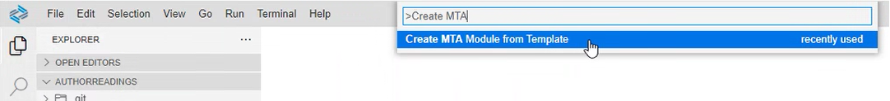

# Develop the Core of the User Interface with SAP Fiori Elements

After you defined the domain model and the business logic of the *Poetry Slams* application with the SAP Cloud Application Programming Model, you now add the user interface of the *Poetry Slams* application with SAP Fiori elements. 

## Add a Web Application with SAP Fiori Elements
Next, you add an SAP Fiori element-based user interface.

### Use the SAP Fiori Element Application Wizard
1. To start the wizard, search for *Create MTA Module from Template* in the *Command Palette...*.

   

2. Select the *SAP Fiori generator* module template. 
3. Select *List Report Page*.
4. Select the data source and the OData service as follows:
   - *Data source*: *Use a Local CAP Project*
   - Choose your CAP project: *partner-reference-application*
   - *OData Service*: `PoetrySlamService (Node.js)`
5. Select the main entity from the list:
   - *Main entity*: *PoetrySlams*
   - *Navigation entity*: *None*
   - *Automatically add table columns*: *Yes*
6. Add further project attributes:
   - *Module name*: `poetryslams`
   - *Application title*: `Poetry Slams`
   - *Application namespace*: leave empty
   - *Description*: `Application to create and manage poetry slams`
   - *Enable TypeScript*: *No*
   - *Add deployment configuration*: *Yes*
   - *Add FLP configuration*: *Yes*
   - *Configure Advanced Options*: *No*
7. Select *Cloud Foundry* as target of the deployment configuration. 
8. For now, the destination name is set to *None* because you'll configure it in a later step of this tutorial. 
9. Enter information on the SAP Fiori launchpad configuration:
   - *Semantic Object*: `poetryslams`
   - *Action*: `display`
   - *Title*: `Poetry Slams`
   - *Subtitle* (optional): `Manage Poetry Slams`
10. Choose *Finish*. The wizard creates the */app* folder, which contains all files related to the user interface.

Looking for more information on using SAP Fiori tools? See the tutorial [Serving SAP Fiori UIs](https://cap.cloud.sap/docs/guides/uis/fiori#using-sap-fiori-tools).

### Fine-Tune the User Interface
To adapt the generated user interface to your needs, you can either use the [SAP Fiori tools, application modeler](https://help.sap.com/docs/SAP_FIORI_tools/17d50220bcd848aa854c9c182d65b699/a9c004397af5461fbf765419fc1d606a.html?locale=en-US) or you can change the generated files manually.

The SAP Fiori tools, application modeler includes two tools, which are helpful when creating new pages or adjusting existing ones:
- [Page Editor](https://help.sap.com/docs/SAP_FIORI_tools/17d50220bcd848aa854c9c182d65b699/047507c86afa4e96bb3d284adb9f4726.html?locale=en-US): Create and maintain annotation-based UI elements
- [Page Map](https://help.sap.com/docs/SAP_FIORI_tools/17d50220bcd848aa854c9c182d65b699/bae38e6216754a76896b926a3d6ac3a9.html?locale=en-US): Change the structure of pages and application-wide settings

> Note: The recommendation is to use the SAP Fiori tools to create new pages or to enhance existing ones with additional features as the tools generate the required annotations in the annotations file. For better readability, you can restructure the annotations afterwards.

The most relevant files are the following:
- [`app/poetryslams/annotations.cds`](../../../tree/main-multi-tenant/app/poetryslams/annotations.cds): Configure the annotations to change the appearance of UI elements.
- [`app/poetryslams/webapp/manifest.json`](../../../tree/main-multi-tenant/app/poetryslams/webapp/manifest.json): Define the information about the application (for example, application names, routes, navigations, and so on).

In the next paragraphs, some of the content of these files is explained to showcase what may be achieved and how. However, this tutorial will not explain every single line of these files, so you may just replace the content of the generated *annotations.cds*, and *manifest.json* from the example implementation ([annotations.cds](../../../tree/main-multi-tenant/app/poetryslams/annotations.cds), and [manifest.json](../../../tree/main-multi-tenant/app/poetryslams/webapp/manifest.json)).

> Note: Information about the available properties of the **manifest.json** are described in the SAPUI5 documentation [Manifest (Descriptor for Applications, Components, and Libraries)](https://sapui5.hana.ondemand.com/sdk/#/topic/be0cf40f61184b358b5faedaec98b2da).

#### Definition of the SAPUI5 Version

SAP Build Work Zone uses the [latest released version of SAPUI5](https://sapui5.hana.ondemand.com/sdk/#/topic/91f021426f4d1014b6dd926db0e91070) in case no explicit version is set in the [app/poetryslams/webapp/manifest.json](../../../tree/main-multi-tenant/app/poetryslams/webapp/manifest.json) and in the [app/visitors/webapp/manifest.json](../../../tree/main-multi-tenant/app/visitors/webapp/manifest.json). By default, no explicit version is set to run the application. It's recommended to set the latest successfully tested version explicitly for both applications. For performance reasons, it should be the same version in all applications of the solution.

To explicitly set the version, add the following code into the [app/poetryslams/webapp/manifest.json](../../../tree/main-multi-tenant/app/poetryslams/webapp/manifest.json).

```json
"sap.platform.cf": {
  "ui5VersionNumber": "1.130.5"
}
```

Some files define the SAPUI5 version that is used to run the application locally or during automated tests. Either update the version regularly or remove it. If it is removed, the [latest version](https://sapui5.hana.ondemand.com/sdk/#/topic/91f021426f4d1014b6dd926db0e91070) is always considered. In the Partner Reference Application, the version is set to the latest successfully tested. 

Files with a defined SAPUI5 version:
  - [app/poetryslams/webapp/index.html](../../../tree/main-multi-tenant/app/poetryslams/webapp/index.html)
  - [app/poetryslams/webapp/test/flpSandbox.html](../../../tree/main-multi-tenant/app/poetryslams/webapp/test/flpSandbox.html)
  - [app/poetryslams/webapp/test/integration/opaTests.qunit.html](../../../tree/main-multi-tenant/app/poetryslams/webapp/test/integration/opaTests.qunit.html)

#### Using Different User Interface Pages

The [manifest.json](../../../tree/main-multi-tenant/app/poetryslams/webapp/manifest.json) of the *poetryslams* app defines a poetry slams list report (*PoetrySlamsList*), a poetry slams object page (*PoetrySlamsObjectPage*) and a bookings object page (*PoetrySlams_visitsObjectPage*), and specifies the navigation between the pages in the *routing* section.

The *PoetrySlams_visitsObjectPage* shall not be opened when the creation of a booking in the poetry slams object page is done. Therefore, set the [*inline* creation mode](https://sapui5.hana.ondemand.com/sdk/#/topic/cfb04f0c58e7409992feb4c91aa9410b) in the [manifest.json](../../../tree/main-multi-tenant/app/poetryslams/webapp/manifest.json).

```json
    "controlConfiguration": {
        "visits/@com.sap.vocabularies.UI.v1.LineItem#VisitorData": {
            "tableSettings": {
                "creationMode": {
                    "createAtEnd": true,
                    "name": "Inline"
                }
            }
        }
    }
```

As the bookings object page shall be a read-only UI, the update is hidden for the entity visits in the [annotations.cds](../../../tree/main-multi-tenant/app/poetryslams/annotations.cds).

```cds
annotate service.Visits with @(
UI : {
    UpdateHidden   : true
});  
```

#### Enabling Auto-Refresh when Testing Your Development

Copy the content of the [*ui5.yaml*](../../../tree/main-multi-tenant/app/poetryslams/ui5.yaml). It contains a configuration for the `server middleware` which enables the auto-update of UI-changes when testing locally. The whole testing process is explained further below.

#### Annotation Examples

| Functionality                                                                                      | Description                                                                                               | Example       |
| ---------                                                                                          | -------------                                                                                             | ------------- |
| [Semantic Key](https://sapui5.hana.ondemand.com/sdk/#/topic/aa2793cd877a4ecebc35d335920ee145) | Display the editing status of a column in the list report                                                 | [annotations.cds > service.PoetrySlams](../../../tree/main-multi-tenant/app/poetryslams/annotations.cds) |
| [Side Effects](https://sapui5.hana.ondemand.com/sdk/#/topic/18b17bdd49d1436fa9172cbb01e26544.html) | Reload data, permissions, or messages, or trigger determine actions based on data changes in the UI scenarios | [annotations.cds > service.Visits](../../../tree/main-multi-tenant/app/poetryslams/annotations.cds) |
| [Value List](https://sapui5.hana.ondemand.com/sdk/#/topic/16d43eb0472c4d5a9439ca1bf92c915d.html)   | Enable the selection of a value in a column with the help of a value list                                 | [annotations.cds > service.Visits](../../../tree/main-multi-tenant/app/poetryslams/annotations.cds) |

> Note: The annotations add the OData action *createTestData* to the Poetry Slams list report. The action creates sample data for mutable entities and is for demo purposes only.

#### Sandbox Environment for the SAP Fiori Launchpad
After the SAP Fiori application is created by the wizard, a single component is loaded when the application is started using the managed app router or when locally executed. In the Partner Reference Application, the loaded single component is the SAP Fiori elements *ListReportPage* named *PoetrySlamsList*. 

> Note: The [*manifest.json*](../../../tree/main-multi-tenant/app/poetryslams/webapp/manifest.json) defines which component is loaded initially by setting `initialLoad: true` as an option of the component.

As SAP Build Work Zone cannot be tested locally, the sandbox environment for the SAP Fiori launchpad is introduced for local testing. The sandbox shows tiles for the poetryslams and visitors applications and allows the [semantic navigation](https://sapui5.hana.ondemand.com/sdk/#/topic/d782acf8bfd74107ad6a04f0361c5f62) between them. 

Therefore, the following changes are required:

1. Add the [flpSandbox.html](../../../tree/main-multi-tenant/app/flpSandbox.html) file into the *app* folder.

2. Create a [util](../../../tree/main-multi-tenant/app/util) folder in the *app* folder.

3. Copy the [setContent.js](../../../tree/main-multi-tenant/app/util/setContent.js) file into the newly created *util* folder.

4. Copy the [setLaunchpadShellConfig.js](../../../tree/main-multi-tenant/app/util/setLaunchpadShellConfig.js) file into the *util* folder.

> Note: In the flpSandbox.html, a specific SAP UI5 version is provided in the *src*-path. For information about how to change the SAP UI5 version, refer to the UI5 Demo Kit [Variant for Bootstrapping from Content Delivery Network](https://sapui5.hana.ondemand.com/sdk/#/topic/2d3eb2f322ea4a82983c1c62a33ec4ae).

#### Dynamic Tiles

You can define dynamic tiles that display a Key Performance Indicator (KPI) based on application data. For more information, refer to [Expose HTML5 Appliactions in SAP Build Work Zone, standard edition -> Configure the manifest.json File -> Dynamic Tile (Optional)](https://help.sap.com/docs/build-work-zone-standard-edition/sap-build-work-zone-standard-edition/expose-html5-applications-in-sap-build-work-zone-standard-edition?locale=en-US). This feature is reflected in the launchpad of SAP Build Work Zone.

Add the *indicatorDataSource* parameter to the [manifest.json](../../../tree/main-multi-tenant/app/poetryslams/webapp/manifest.json) file. The *indicatorDataSource* parameter defines a *dataSource*, which is the service, including a *path* from which to aggregate the KPI based on a specific dataset. In this case, the dataset is the *PoetrySlams* entity, which counts the published events based on the `status_code=2` status code. The refresh interval is measured in seconds, so the tile refreshes every minute.

```json
  "crossNavigation": {
    "inbounds": {
      "poetryslams-display": {
        "indicatorDataSource": {
          "dataSource": "mainService",
          "path": "PoetrySlams/$count?$filter=status_code%20eq%202",
          "refresh": 60
        }
      }
    }
  }
```

#### Autoload Data
By default, lists aren't automatically prefilled when the *List Report* is displayed. However, you can change this behavior by enabling the autoload feature. To do so, simply go to the [manifest.json](../../../tree/main-multi-tenant/app/poetryslams/webapp/manifest.json) and add the following parameters:

```json
{
    "sap.ui5": {
        "routing": {
            "targets": {
                "PoetrySlamsList": {
                    "options": {
                        "settings": {
                            "initialLoad": true
                        }
                    }
                }
            }
        }
    }
}
```

#### Color-Coding
To implement a color-coding system for specific columns on the user interface, add a hidden column *statusCriticality* that contains color-coding information. Note that the column is not part of the database model, but only added in the service definition and filled dynamically at READ of the entity. You will find the required parts in these places:

- Field definition in [*poetrySlamService.cds*](../../../tree/main-multi-tenant/srv/poetryslam/poetrySlamService.cds).
- Logic to fill it in [*poetrySlamServicePoetrySlamsImplementation.js*](../../../tree/main-multi-tenant/srv/poetryslam/poetrySlamServicePoetrySlamsImplementation.js):
    ```javascript
    for (const poetrySlam of convertToArray(data)) {
        const status = poetrySlam.status?.code || poetrySlam.status_code;
        // Set status colour code
        switch (status) {
            case codes.poetrySlamStatusCode.inPreparation:
            poetrySlam.statusCriticality = codes.color.grey; // New poetry slams are grey
            break;
            case codes.poetrySlamStatusCode.published:
            poetrySlam.statusCriticality = codes.color.green; // Published poetry slams are green
            break;
            case codes.poetrySlamStatusCode.booked:
            poetrySlam.statusCriticality = codes.color.yellow; // Fully booked poetry slams are yellow
            break;
            case codes.poetrySlamStatusCode.canceled:
            poetrySlam.statusCriticality = codes.color.red; // Canceled poetry slams are red
            break;
            default:
            poetrySlam.statusCriticality = null;
        }
    }
    ```
- Helper function `convertToArray` to convert an object or array to an array in [*entityCalculations.js*](../../../tree/main-multi-tenant/srv/lib/entityCalculations.js).
- Entries in the i18n files to set the column headers.
- An entry in the [*annotations.cds*](../../../tree/main-multi-tenant/app/poetryslams/annotations.cds) to use the field on the user interface.

The color values, as defined in the codes constants, are fixed values that the UI interprets automatically.

> Note: *statusCriticality* is modeled as a **[virtual element](https://cap.cloud.sap/docs/cds/cdl#virtual-elements)** and must be initialized in the application code. Otherwise, the READ request will be sent again and again until the application crashes.

### Draft Concept
The SAP Cloud Application Programming Model / SAP Fiori elements stack supports a *Draft Concept* out of the box. This enables users to store inconsistent data without having to publish them to other users.

You can find more details in the SAP Cloud Application Programming Model documentation on [draft support](https://cap.cloud.sap/docs/guides/uis/fiori#draft-support). In the Poetry Slams application, the used *Poetry Slams* Service has the entity *PoetrySlams* draft-enabled. In the *Visitors* service, which is used by the Visitors application, the *Visitors* entity is draft-enabled.

> Note: SAP Fiori elements v4 only supports editable object pages for draft-enabled entities. In case an entity is not draft-enabled in the used service, the user interface does not allow changes.

You have now successfully developed the user interface of the application and you are ready to [fine-tune the application by adding translation, defining authorizations and adding the second application *visitors*](./14b-Develop-Core-Finetuning.md).
