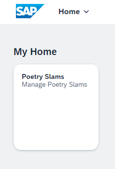

# Fine-Tune the Business Solution with Translation and Authorization

After you defined the domain model, the business logic, and the user interface of the *Poetry Slams* application, you now learn how to add translation and role-based authorizations. You also add the second application *Visitors* to the business solution and enable the navigation between the two applications.

## Add Translations

Translations of UI labels and texts are stored in properties-files in i18n-folders.

The app is based on the SAP Cloud Application Programming Model default settings:
- All labels used in the domain model are stored in *i18n.properties* files in the folder *../db/i18n*.
- All service model and system message texts are stored in the *i18n.properties* and *messages.properties* files in the folder *../srv/i18n*.
- All web application texts are stored in *i18n.properties* files in the folder *../app/poetryslams/webapp/i18n/*.
- All web application texts specific to the *manifest.json* are stored in the *i18n.properties* files in the folder *../app/poetryslams/i18n/*.

For non-default languages, add the ISO code of the language to the file name, for example, *i18n_de.properties* and *messages_de.properties*.

Copy the [domain model-i18n files](../../../tree/main-multi-tenant/db/i18n), [service model and message-i18n files](../../../tree/main-multi-tenant/srv/i18n), [web application texts](../../../tree/main-multi-tenant/app/poetryslams/webapp/i18n), and [web application texts for the manifest](../../../tree/main-multi-tenant/app/poetryslams/i18n) into your project.

## Add Authentication and Role-Based Authorization
To protect the application against unauthorized access, add user-based authentication and authorizations to the application. Broadly speaking, the application defines roles and assigns them statically to service operations, such as the reading or writing of a certain entity. The customer creates role templates that group a set of roles which are assigned to the customer's users. You can find further details in the SAP Cloud Application Programming Model documentation on [authorization and access control](https://cap.cloud.sap/docs/guides/security/authorization).

First define the *Roles* as part of the application definition concept. For the Poetry Slam Manager application, two roles are defined: *PoetrySlamManager* and *PoetrySlamVisitor*.

The authorization is always defined on service level; in this application on the level of the */srv/poetryslam/poetrySlamService.cds*. For better readability, separate the authorization definitions from the service definitions by creating a new file */srv/poetryslam/poetrySlamServiceAuthorizations.cds* that contains all authorization-relevant model parts. Copy the content from the example implementation [srv/poetryslam/poetrySlamServiceAuthorizations.cds](../../../tree/main-multi-tenant/srv/poetryslam/poetrySlamServiceAuthorizations.cds). Enhance the file [*/srv/services.cds*](../../../tree/main-multi-tenant/srv/services.cds) with the reference to the Poetry Slam Service Authorizations:

```cds
using from './poetryslam/poetrySlamServiceAuthorizations';
```

The wizard created all runtime-relevant security settings of our application. It generated the [*xs-security.json*](../../../tree/main-multi-tenant/xs-security.json). Open the generated file and replace it. It defines two roles. 

```json
{
  "scopes": [
    {
      "name": "$XSAPPNAME.PoetrySlamFull",
      "description": "Full Read/Write Access to Poetry Slams"
    },
    {
      "name": "$XSAPPNAME.PoetrySlamRestricted",
      "description": "Restricted Read/Write Access to Poetry Slams"
    },
    {
      "name": "$XSAPPNAME.mtcallback",
      "description": "Subscription via SaaS Registry",
      "grant-as-authority-to-apps": [
        "$XSAPPNAME(application,sap-provisioning,tenant-onboarding)"
      ]
    }
  ],
  "attributes": [],
  "role-templates": [
    {
      "name": "PoetrySlamManagerRole",
      "description": "Full Access to Poetry Slams",
      "scope-references": ["$XSAPPNAME.PoetrySlamFull"],
      "attribute-references": []
    },
    {
      "name": "PoetrySlamVisitorRole",
      "description": "Restricted Access to Poetry Slams for Visitors",
      "scope-references": ["$XSAPPNAME.PoetrySlamRestricted"],
      "attribute-references": []
    }
  ]
}
```

Additionally, replace the CDS section in the [*package.json*](../../../tree/main-multi-tenant/package.json). It tells the CDS framework that you use the cloud security services integration library service of SAP Business Technology Platform.

```json
  "cds": {
    "features": {
      "assert_integrity": "db"
    },
    "requires": {
      "db": {
        "kind": "sql"
      },
      "uaa": {
        "kind": "xsuaa"
      },
      "[development]": {
        "db": {
          "kind": "sqlite",
          "credentials": {
            "url": ":memory:"
          }
        }
      },
      "[production]": {
        "multitenancy": true
      },
      "sql": {
        "native_hana_associations": false
      },
      "hana": {
        "deploy-format": "hdbtable"
      },
      "profile": "with-mtx-sidecar"
    }
  }
```

Last but not least, in the [*.cdsrc.json*](../../../tree/main-multi-tenant/.cdsrc.json), define users and their roles for local testing. Here's an example of how you define three users with names, passwords, and assigned roles: 

```json
{
  "requires": {
    "[development]": {
      "auth": {
        "kind": "mocked",
        "users": {
          "Peter": {
            "password": "welcome",
            "id": "peter",
            "roles": ["PoetrySlamFull", "authenticated-user"]
          },
          "Julie": {
            "password": "welcome",
            "id": "julie",
            "roles": ["PoetrySlamRestricted", "authenticated-user"]
          },
          "Denise": {
            "password": "welcome",
            "id": "denise",
            "roles": ["authenticated-user"]
          },
          "*": true
        }
      }
    }
  }
}
```

In the next step, the second application *visitors* is added. You can already make a first test of the app now. Therefore, follow the steps described in the [Test the App](14b-Develop-Core-Finetuning.md#test-the-app) section.

## Add a Second Application

In this section, you learn how to add a second application *Visitors* to the business solution and how to implement the navigation between the *Poetry Slams* and *Visitors* applications. 

1. Add a `visitor` service by copying the service definition from [*srv/visitor/visitorService.cds*](../../../tree/main-multi-tenant/srv/visitor/visitorService.cds) to a new folder `visitor` in the `srv`-folder of your project. 
    > Note: The poetryslam service cannot be used for the *Visitors* application as the `visitor` entity is defined as a read-only Poetry Slams service, but it should be changeable in the *Visitors* application. The recommendation is to define a unique service for each application.

    > Note: The *Visitors* application does not have a Java Script implementation as no specific logic is added.

    > Note: The entity `visitors` needs to be draft-enabled in the service, otherwise SAP Fiori Elements only renders a read-only object list.

2. Add the authorizations for the `visitor` service by copying the [*srv/visitor/visitorServiceAuthorizations.cds*](../../../tree/main-multi-tenant/srv/visitor/visitorServiceAuthorizations.cds).

3. Enhance the file [*/srv/services.cds*](../../../tree/main-multi-tenant/srv/services.cds) with the reference to the Visitor Service and the Visitor Service Authorizations:

    ```cds
    using from './visitor/visitorService';
    using from './visitor/visitorServiceAuthorizations';
    ```

4. Use the SAP Fiori Element Application Wizard *Create MTA Module from Template* in the *Command Palette* to create the `visitors` module. Refer to [*Use the SAP Fiori Element Application Wizard*](./14a-Develop-Core-UserInterface.md#use-the-sap-fiori-element-application-wizard). Use the following settings (keep default values for other entries):
   - Choose *SAP Fiori Generator*
   - Select *List Report Page*
   - *Data Source*: `Use a Local CAP Project`
   - *OData Service*: `Visitors (Node.js)`
   - *Main entity*: *Visitors*
   - *Navigation entity*: *None*
   - *Module name*: `visitors`
   - *Application title*: `Visitors`
   - *Description*: `Application to create and manage visitors`
   - *Add FLP configuration*: `Yes`
   - *Semantic Object*: `visitors`
   - *Action*: `display`
   - *Title*: `Visitors`
   - *Subtitle* (optional): `Manage Visitors`

    > Note: The wizard will create the folder [*/app/visitors*](../../../tree/main-multi-tenant/app/visitors) with the content of a *SAP Fiori elements application*.

5. Copy the [*content of the ui5.yaml*](../../../tree/main-multi-tenant/app/visitors/ui5.yaml).

6. Copy i18n-files with the texts of the *Visitors* UI from [*app/visitors/i18n*-folder](../../../tree/main-multi-tenant/app/visitors/i18n) and [*app/visitors/webapp/i18n*-folder](../../../tree/main-multi-tenant/app/visitors/webapp/i18n).

7. Adopt the generated file [app/visitors/annotations.cds](../../../tree/main-multi-tenant/app/visitors/annotations.cds) to adjust the auto-generated list and object Page to your needs. You can either copy the complete file or perform individual adjustments, for example:
   1. Rename the *UI.FieldGroup* from *#GeneratedGroup* to something more meaningful.
   2. Use *Capabilities.InsertRestrictions*, *Capabilities.UpdateRestrictions*, *Capabilities.DeleteRestrictions* to enable *Create*, *Edit*, *Delete* buttons.
   3. Add *HeaderInfo* and *SelectionFields*, as well as additional *UI.FieldGroups* and *Facets*.
   4. Add annotations for associations (in our case *Visits*).
   5. Add the navigation logic between the *Poetry Slams* and the *Visitors* applications by adding the [*intent-based navigation*](https://sapui5.hana.ondemand.com/sdk/#/topic/d782acf8bfd74107ad6a04f0361c5f62) of SAP Fiori elements.

      1. Add the navigation from the poetry slams object page of the poetry slams app to the visitors list of the visitors app by enhancing the [app/poetryslams/annotations.cds](../../../tree/main-multi-tenant/app/poetryslams/annotations.cds). Add the following code to the *Identification* section of the *service.PoetrySlams* annotations.

          ```cds
          {
            $Type         : 'UI.DataFieldForIntentBasedNavigation',
            SemanticObject: 'visitors',
            Action        : 'display',
            Label         : '{i18n>maintainVisitors}'
          }
          ```

      2. Add the navigation from the visits object page of the poetry slams app to the visitors list of the visitors app by enhancing the [app/poetryslams/annotations.cds](../../../tree/main-multi-tenant/app/poetryslams/annotations.cds). Add the following code to the *UI* section of the *service.PoetrySlams* annotations.

          ```cds
          Identification                : [{
            $Type         : 'UI.DataFieldForIntentBasedNavigation',
            SemanticObject: 'visitors',
            Action        : 'display',
            Label         : '{i18n>maintainVisitor}',
            Mapping       : [{
              $Type                 : 'Common.SemanticObjectMappingType',
              LocalProperty         : visitor_ID,
              SemanticObjectProperty: 'ID'
            }],
          }],
          ```

      3. Add the navigation from the visitors object page of the visitors app to the poetry slams list of the poetry slams app by enhancing the [app/visitors/annotations.cds](../../../tree/main-multi-tenant/app/visitors/annotations.cds). Add the following code to the *UI* section of the *service.Visitors* annotations.

          ```cds
          Identification                : [{
            $Type         : 'UI.DataFieldForIntentBasedNavigation',
            SemanticObject: 'poetryslams',
            Action        : 'display',
            Label         : '{i18n>maintainPoetrySlams}'
          }],
          ```
   
8. Ensure that both applications ([*poetryslams*](../../../tree/main-multi-tenant/app/poetryslams) and [*visitors*](../../../tree/main-multi-tenant/app/visitors)) use the value `poetryslammanager` for `service` in the section `sap.cloud` of the [manifest.json](../../../tree/main-multi-tenant/app/visitors/webapp/manifest.json) file. This value specifies the name under which both UI definitions will be stored in the html5 repository, and this must be the same for all the applications of one solution (in our case, the two applications *poetryslams* and *visitors* make up the solution *poetryslammanager*):
    
    ```json
    "sap.cloud": {
      "service": "poetryslammanager",
      "public": true
    }
    ```

9. Make sure the [app/visitors/webapp/manifest.json](../../../tree/main-multi-tenant/app/visitors/webapp/manifest.json) includes the following configurations:
    1. Add the parameter `ID` to the `signature` of the inbound navigation `visitors-display`, which is required to enable the intent-based navigation from the *poetryslams* application to the *visitors* application:
        
        ```json
        "signature": {
          "parameters": {
            "ID": {
              "required": false
            }
          },
          "additionalParameters": "ignored"
        }
        ```
        > Note: `additionalParameters` are not required in this use case and are therefore set to be `ignored`.
    2. Explicitly set the SAPUI5 version of the *visitors* application (see also [Definition of the SAPUI5 Version](14a-Develop-Core-UserInterface.md#definition-of-the-sapui5-version)):
        
        ```json
        "sap.platform.cf": {
          "ui5VersionNumber": "1.130.5"
        }
        ```

## Test the App

Now, you can start the web application and test it locally in SAP Business Application Studio:
1. Open a terminal in SAP Business Application Studio. 
2. Run the command `npm install` to ensure all modules are loaded and installed.
3. Use the run command `cds watch` to start the app. A success message indicates that the runtime has been started: *A service is listening to port 4004*.
4. To open the test environment, choose *Open in a New Tab* in the pop-up message or click on the link `http://localhost:4004` in the terminal. As a result, a browser tab opens with the web applications and OData service endpoints. 
5. Now it's time to test the web app: 
    
    1. Choose the *Web Application* *flpSandbox.html*.
      
      > Note: Through the */poetryslams/webapp/*, the poetryslams application can be tested without navigating to the visitors application.

      > Note: Through the */visitors/webapp/*, the visitors application can be tested without navigating to the poetryslams application.

    2. A log-on message appears. Use the test users as listed in the file *.cdsrc.json*, like `peter` / `welcome`.

    3. The SAP Fiori launchpad including the generated tiles appears. To launch the poetryslams application, choose *Manage Poetry Slams*.
    
        
6. When starting the application, no data is available. To create sample data for mutable data, such as poetry slams, visitors, and visits, choose the button *Generate Sample Data*. 
    > Note: If you choose the *Generate Sample Data* button a second time, the sample data is set to the default values.

> Note: If you would like to switch users, clear the browser cache first. For example, in Google Chrome, press `CTRL + SHIFT + DEL` for Windows and `COMMAND + SHIFT + BACKSPACE` for Macintosh, go to *Advanced*, and choose a time range and *Passwords and other sign-in data*. 

If you want to get more details about the application implementation, see [Ensure Code Quality, Test, and Troubleshoot the Application](./16-Test-Trace-Debug.md).

For more in-depth information on building SAP Cloud Application Programming Model applications, see the [SAP Cloud Application Programming Model documentation](https://cap.cloud.sap/docs/).

Looking for more information on the functionality of Poetry Slam Manager, the sample application? Go to the [guided tour](17-Guided-Tour.md). 
