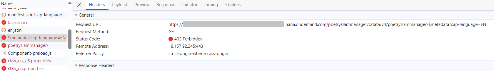
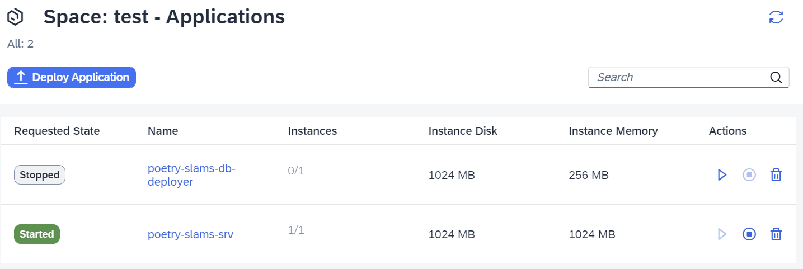

# Test and Troubleshoot

When developing a productive application, quality assurance and the detection of issues are essential.

## Manual Test

You can manually test the application on your local machine:  

1. Run the command `npm install` on the command line interface to install the node modules defined in *package.json*.
2. [Optional] Only in the *main-multi-tenant-features* branch, run command `npm run prebuild`. This generates access classes to external APIs and is required to avoid syntax errors in the application and unit tests.
3. Run the command `cds watch`. This will start a Node.js server including the web application. The server uses an SQLight database which makes local testing easy. 

## Automated Tests

For quality assurance to check if the application still works as expected, it's important to use automated tests that are executed when changes to the data model, services, or the user interface have been made.

### SAP Cloud Application Programming Model Unit Tests

The data model and services can be tested with the SAP Cloud Application Programming Model unit test framework. The framework uses standard JavaScript libraries such as Chai and Mocha. A reference test implementation can be found in the folder */test/*. There are tests available for the entity model (folder */db/*) and for the service (folder */srv/*).

There are two ways to test the services in SAP Cloud Application Programming Model, either via service APIs or via HTTP APIs. For more details, go to the [SAP Cloud Application Programming Model documentation on testing with cds.test](https://cap.cloud.sap/docs/node.js/cds-test). 

#### Example of a Service API

The service API is used to test the Poetry Slam Manager entity model in [poetrySlamManagerModel.test.js](../../../tree/main-single-tenant/test/db/poetrySlamManagerModel.test.js).

In the following example, a visit is selected from the database and is to be recreated. However, the creation must be rejected due to uniqueness of the pair *poetrySlam_ID* and *visitor_ID*. 

```javascript
it('should ensure the uniqueness of the combination of visitor ID and poetry slam ID', async () => {
  const { Visits } = db.model.entities;
  const result = await SELECT.one
    .from(Visits)
    .columns('parent_ID', 'visitor_ID');

  await expect(db.create(Visits).entries(result)).to.rejected;
});
```

#### Example of an HTTP API

The HTTP API is used to test the Poetry Slam Manager service. There is one test file for each entity and a file to test the OData function of the service. Axios is used as HTTP client in the tests. The authorization is set to the user *Peter*.

In the following example, in the *beforeEach* function, the [sample data is reset](https://cap.cloud.sap/docs/node.js/cds-test#test-data-reset) and newly created. Besides this, all poetry slams are read via OData GET call. In the test, a published poetry slam is selected and the *Cancel* action is executed via OData. It checks if the status is correctly set to *Canceled*. Afterwards, the entry is read and the status code and criticality are checked. You can find the tests in [poetrySlamServicePoetrySlams.test.js](../../../tree/main-single-tenant/test/srv/poetryslam/poetrySlamServicePoetrySlams.test.js).

> Note: In the *beforeEach* function, the OData action *createTestData* is called. The action creates sample data for the entities *poetryslams*, *visitors* and *visits*. This is for demo purposes only.

```javascript

const ACTION = (url, name, parameters = {}) => POST (url+ `/PoetrySlamService.${name}`,parameters); 

axios.defaults.auth = { username: 'peter', password: 'welcome' };

describe('Poetryslams in PoetrySlamService', () => {
  let poetrySlams;

  beforeEach(async () => {
    await test.data.reset();
    await POST(`/odata/v4/poetryslamservice/createTestData`);

    // Read all poetry slams for usage in the tests
    poetrySlams = await GET(`/odata/v4/poetryslamservice/PoetrySlams`, {
      params: { $select: `ID,status_code,statusCriticality` }
    });
    expect(poetrySlams.data.value.length).to.greaterThan(0);
  });

  it('should change the status of poetry slams in action cancel on published entities', async () => {
      const id = poetrySlams.data.value.find(
        (poetrySlam) => poetrySlam.status_code === poetrySlamStatusCode.published
      ).ID;

      const actionResult = await ACTION(
        `/odata/v4/poetryslamservice/PoetrySlams(ID=${id},IsActiveEntity=true)`,
        'cancel'
      );
      expect(actionResult.data.status_code).to.eql(poetrySlamStatusCode.canceled);

      // Read the status of the poetry slam and check that it was canceled
      const result = await GET(
        `/odata/v4/poetryslamservice/PoetrySlams(ID=${id},IsActiveEntity=true)`,
        {
          params: { $select: `ID,status_code` }
        }
      );
      expect(result.data.status_code).to.eql(poetrySlamStatusCode.canceled);
    });
});
```

#### Unit Test Setup and Execution

To take over the unit tests and the configuration from the example implementation, take the following steps:

1. Copy the [entity unit tests](../../../tree/main-single-tenant/test/db) to your project.
2. Copy the [service unit tests](../../../tree/main-single-tenant/test/srv) to your project.
3. Add the Mocha, Chai, and Axios devDependencies to your *package.json*:
  
    1. Run command `npm add mocha -D`.
    2. Run command `npm add chai -D`.
    3. Run command `npm add chai-as-promised -D`.
    4. Run command `npm add chai-subset -D`.
  
    > Note: You can compare this with the [*package.json* of the example implementation](../../../tree/main-single-tenant/package.json). 

4. Copy the script with the name *test* to your *package.json*. 
5. Copy the Mocha configuration file [*.mocharc.json*](../../../tree/main-single-tenant/.mocharc.json) to your project.

To run the automated SAP Cloud Application Programming Model tests:

1. Run the command `npm install` in a terminal in SAP Business Application Studio.
2. [Optional] Only in *main-multi-tenant-features* branch, run command `npm run prebuild`. This generates access classes to external APIs and is required to avoid syntax errors in the application and unit tests.
3. Enter the command `npm run test`. All tests will be executed and the result will be shown afterwards.

### One Page Acceptance (OPA5) Tests

You can execute user interface and integration testing with the help of One Page Acceptance Tests (OPA5). A minimalist test setup is created by default when you first create an SAP Fiori application with the wizard as described in [Develop the Core of the SAP BTP Application](./14-Develop-Core-Application.md).

OPA5 tests are built on the QUnit testing framework. They simulate and check user interaction with the UI.

The tests are located in the directories [*app/poetryslams/webapp/test*](../../../tree/main-single-tenant/app/poetryslams/webapp/test) and [*app/visitors/webapp/test*](../../../tree/main-single-tenant/app/visitors/webapp/test).

> Note: Before you can execute the file **opaTests.qunit.html**, adjust it manually. To run the tests, add `https://sapui5.hana.ondemand.com/<version>` in front of the referenced resources in the file. You can have a look at the [*app/poetryslams/webapp/test/integration/opaTests.qunit.html*](../../../tree/main-single-tenant/app/poetryslams/webapp/test/integration/opaTests.qunit.html) of the reference application. You also have to adjust the file **FirstJourney.js**. Add  `When.onTheShell.iPressTile('fe-lrop-v4');` in the `opaTest` method after the app is started. You can have a look at the [*app/poetryslams/webapp/test/integration/FirstJourney.js*](../../../tree/main-single-tenant/app/poetryslams/webapp/test/integration/FirstJourney.js) of the reference application.

1. Start the local server: `npm run start`
2. To execute OPA5 tests for the *Poetry Slams* application, open: `<host>/poetryslams/webapp/test/integration/opaTests.qunit.html` and open `<host>/visitors/webapp/test/integration/opaTests.qunit.html` for the *Visitors* application.

#### More Information

- [Integration Testing with One Page Acceptance Tests (OPA5)](https://sapui5.hana.ondemand.com/sdk/#/topic/2696ab50faad458f9b4027ec2f9b884d.html)
- [A First OPA Test](https://sapui5.hana.ondemand.com/sdk/#/topic/1b47457cbe4941ee926317d827517acb)
- [Test Suite and Automated Testing](https://sapui5.hana.ondemand.com/sdk/#/topic/07c97a2e497d443eb6fa74bb9445ab9c)
- API:
  - [sap.fe.test](https://sapui5.hana.ondemand.com/#/api/sap.fe.test)
  - [sap.ui.test](https://sapui5.hana.ondemand.com/#/api/sap.ui.test)

## Testing Your Application During Development

When developing your application in SAP Business Application Studio, you can always start your application using `cds watch` or `cds serve` (refer to [Jumpstarting a CAP project](https://cap.cloud.sap/docs/get-started/in-a-nutshell#jumpstart)).

> Note: In case you get the error "port 4004 already used" and you cannot close a previously started `cds watch` (because the corresponding terminal is already closed), you can stop this process using terminal commands. To achieve this, you can find the process using port 4004 with the command `netstat -nlp | grep 4004` in the terminal to find the process ID, and stop that process using `kill -2 <process id>`.

### Trace

Consider adding log statements to the service implementations, for example: 
```javascript
console.log("Poetry Slam " + PoetrySlamIdentifier +" is canceled");
```
The log statements are written during the usage of your deployed application. Use the command `cf logs poetry-slams-srv --recent` in the SAP Business Application Studio terminal to review your own log messages or the ones created by others. You need to be logged in to your SAP BTP Cloud Foundry runtime space.

### Debug

You can debug locally with the standard Node.js debugging tools.
See also the [SAP Cloud Application Programming Model documentation on debugging](https://cap.cloud.sap/docs/tools/#debugging-with-cds-watch).

### Hybrid Testing
As described, your local environment will run with an SQLite database. If you want to connect your local test environment with an SAP HANA Cloud database to run your test against the same database technology as the deployed solution does, follow the instructions in this section.

For general guidelines on how to connect your local test against services in the Cloud, refer to the [SAP Cloud Application Programming Model documentation on hybrid testing](https://cap.cloud.sap/docs/advanced/hybrid-testing).

#### Prerequisites
When this project was created, the SAP HANA Cloud capability was included. As a result, the dependency @sap/cds_hana is listed in the file *package.json* and the
file *[.hdiconfig](../../../tree/main-single-tenant/db/src/.hdiconfig)* has been added to the project.

Now, you need to provide the credentials to connect to the SAP HANA Cloud database.

#### Step-By-Step Procedure
1. Log on to SAP BTP Cloud Foundry runtime and select the *org* and *space* of the instance where your application is deployed. 

2. You need to create a service key for your SAP HANA HDI Container service instance and add the key information to your local development environment. This can be achieved by executing the CDS command in your terminal: `cds deploy --to hana:<HDI Container service instance name> --profile hybrid --store-credentials`.

    For the Poetry Slam Manager solution, this would be `cds deploy --to hana:poetry-slams-db --profile hybrid --store-credentials`.

    Now, the files *default-env.json* and *cdsrc-private.json* are created at the root level of your project:
    - The *default-env.json* has the service key information with the credentials to connect to the SAP HANA Cloud database. 
    - The *cdsrc-private.json* stores the binding information. 
    
    Add both files to *.gitignore* because they contain confidential data.

3. Adapt the *package.json* file with new CDS profile hybrid:

    ```json
    "cds": {
      "requires": {
        "db": {
          "kind": "sql"
        },
        "[hybrid]": {
          "db": {
            "kind": "hana"
          }
        }
      }
    }
    ```

4. To run your application using the SAP HANA Cloud database, execute: `cds serve --profile hybrid`.
5. To run your unit tests, execute: `cds bind --exec --profile hybrid npm test`.

## Troubleshoot Your Application

There are several out-of-the-box tools that can be used to troubleshoot your application. Besides the options explained in the [CAP documentation on troubleshooting](https://cap.cloud.sap/docs/get-started/troubleshooting), a few general approaches are described below that can help identify where an issue originates from.

### Use Browser Development Tools

If you open the UI of your application and it doesn't look as expected, the browser development tools can help you identify the root cause of the issue in the application.

1. Open the browser development tools.

2. Check the requests and responses sent by the application (you may need to reload the page to see the errors). 

      Typical errors could be of type *403 Forbidden*. This would indicate that the user doesn't have the relevant authorizations.

      

3. In this case, check if the application role collections are either assigned to a user or to user groups as configured in the IdP that is connected to this subaccount. 

4. Once you've assigned the authorizations, reload the browser (use an incognito tab if the information is cached) and the app opens.

#### Check User Groups

The Identity Authentication service user groups are used to assign authorization roles to users. The user groups will be passed as *assertion attribute* to the SAP BTP subaccount and will be mapped to the respective role collections in the SAP BTP subaccount. Ensure that the user is configured from the Identity Authentication service admin UI and that the user groups have been configured for the typical user roles. Additionally, make sure that the attributes with the name *Groups* have also been assigned from the *Attributes* menu item.

For a detailed description of this process, go to [Configure Authentication and Authorization](15b-One-Off-Deployment.md#configure-authentication-and-authorization).

### Check Event Logs

If experiencing an error with a particular service, event logs can be used to narrow down and identify what actions to take and which service is causing the issue.

1. Navigate to your Cloud Foundry space in the SAP BTP provider account.
2. On the application menu, go to the *Events* section. 
3. Identify which events have been triggered since the last action. 
4. The *Time*, *Event* which occurred, the *Actor* (user who requested the event), the *Actee* (the service that was engaged), and a *Description* of the log are provided.

> Note that this doesn't just provide error information, but also general information too, which can be helpful with narrowing down which service might be causing the problem.

The logs which are generated here only have a limited lifetime and disappear after some time. Should an error be encountered, it is best to check for logs directly.

### Check Application Logs

There are application logs for all modules that are maintained in the *mta.yaml* file. To find them, go to your Cloud Foundry space. 

From here, you can navigate to the specific application and analyze the logs that are maintained for that application. 

1. Navigate to your Cloud Foundry space in the SAP BTP provider account.

   

2. Go to the application you want to analyze.
3. Navigate to the *Logs* section.
4. A list of logs is shown for that specific application.

> Note: Just like the event logs, there is a limited lifetime where the application logs can be accessed.

## Code Quality

Besides automated testing, code quality includes readability, maintainability, and compliance. There are several automated tools that help you to format your files in a consistent way, check for possible implementation, license or security issues, and update the included external packages. To keep your application up to date, you should configure such tools. See also [Update Project Dependencies](./14-Develop-Core-Application.md#update-project-dependencies).

## Give Feedback

In the SAP BTP subaccount cockpit, on the header of the page, there's a feedback icon you can use to report a bug:

<center>  </center>


The SAP Cloud Application Programming Model documentation also contains a [Resources](https://cap.cloud.sap/docs/resources/) page, which you can use to report any issues. 

## Test Multi-Tenant Applications

The information above refers to a one-off application, please refer also to [Test and Troubleshoot Multitenancy](26-Test-Trace-Debug-Multi-Tenancy.md) and [Test and Troubleshoot the ERP Integration](32-Test-Trace-Debug-ERP.md).
