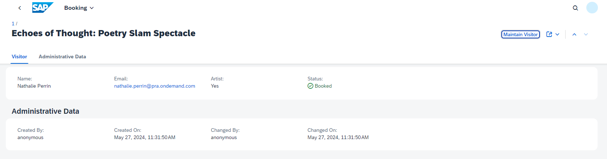

# Go on a Guided Tour to Explore the Capabilities of the Sample Application

Put yourself in the shoes of a poetry slam manager: Imagine it's your job to organize and run poetry slams.

Don't worry. With Poetry Slam Manager, a partner application, it's quite simple to organize poetry slams as the app helps you publish them and register artists and guests.

Buckle up and let us take you on a guided tour through the sample solution:

1. Launch your application locally with `cds watch` and log in with user *peter*. 

2. On the site, you find Poetry Slams and Visitors, the partner applications. To start the Poetry Slams app, click on the corresponding tile.
    
    

3. In the Poetry Slams app, an empty list is shown.

4. To create sample data for mutable data, such as poetry slams, visitors, and visits, click the button *Generate Sample Data*. As a result, multiple poetry slams are listed: Some are still in preparation while others have already been published. 

    > Note: If you click the *Generate Sample Data* button again, the sample data is set to the default values.

    

5. Select one of the poetry slams with status *Published* to see its details.

6. Choose *Edit* and change the description of the poetry slam.

    > Note: In addition, you can also change the title, the event date, the price, and the maximum number of visitors.

7. In the *Bookings* table, choose *Create*. Select *nathalie.perrin@pra.ondemand.com* from the value help and set the *Artist* indicator. 

    > Note: A new instance of the visit entity is created.
    
8. Save your changes to publish them.

    

9. Click *Nathalie Perrin* in the *Bookings* table for details of the individual booking for *Nathalie Perrin*. 
    
    > Note: You navigated to the *Visits* Object Page of the Poetry Slams application.

    

10. Click the *Maintain Visitor* button for an overview of all bookings for *Nathalie Perrin*. This includes bookings for all past as well as future poetry slams. 

    > Note: You navigated to the *Visitors* application of the Poetry Slam Manager solution.

    

This concludes the guided tour. Next, [learn about multitenancy and get an overview of the bill of materials](20-Multi-Tenancy-BillOfMaterials.md) and start your journey to deploy and subscribe your solution in the SAP BTP account.
