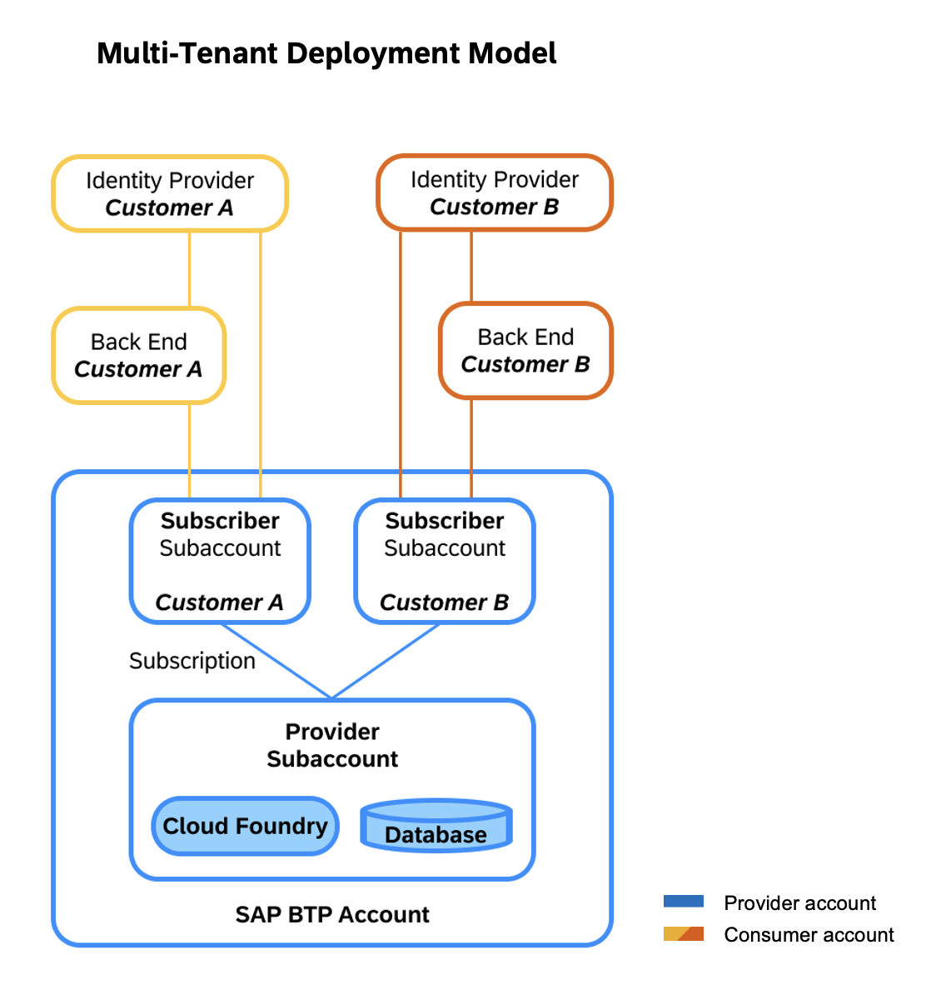

# Provision Tenants of the Multi-Tenant Application to Customers

The goal is to provide a multi-customer application as a partner-managed application. To achieve it, you create consumer subaccounts for each customer in the SAP BTP global account of the partner that hosts the provider subaccount as well. Then, you subscribe to the multi-tenant SAP BTP application in the consumer subaccount and connect the customer ERP system and the corporate identity provider.

As a result of this setup, all customers use shared SAP BTP resources such as SAP BTP Cloud Foundry runtime and the SAP HANA Cloud service. At the same time, SAP BTP multitenancy ensures a clear and secure separation of customer data (by database schemas) and user access management.

  

## Set Up SAP BTP Consumer Subaccount

To start the provisioning procedure, create an SAP BTP consumer subaccount for a specific customer:
1. Open the SAP BTP cockpit (use the global account that hosts the provider subaccount of the SAP BTP application).
2. Create a new *Multi-Environment* subaccount with the name `PoetrySlamsMTSubscriber1` (you can use any naming pattern for additional subaccounts to serve additional customers). 
3. As a provider, choose *Amazon Web Services (AWS)*. 

### Subscribe to the SAP BTP Multi-Tenant Application

1. In the SAP BTP cockpit (consumer subaccount), navigate to *Instances and Subscriptions*.
2. Create subscriptions to *Poetry Slam Manager* with service plan *default* (this is your own multi-tenant SAP BTP application that you just created).

### Launch the SAP BTP Multi-Tenant Application

1. In the SAP BTP cockpit (consumer subaccount), navigate to *Instances and Subscriptions*.
2. To launch the *Poetry Slam Manager* application, choose *Go to Application*. 

### Set Up Single Sign-On for the SAP BTP Application Subscription

#### Prerequiste 

You have admin access to an SAP Identity and Authentication service tenant.

#### Details

Identity Authentication service is used as corporate identity provider (IdP). Therefore, establish a trust relationship between the service provider (the SAP BTP consumer subaccount) and the Identity Authentication service tenant. As a result, the SAP BTP consumer subaccount and the Partner Reference Application delegate user authentications to the Identity Authentication service tenant including single sign-on. Furthermore, the Identity Authentication service tenant is used to assign authorization roles to users via user groups.

#### Configure Trust Using SAML 2.0

Set up the trust relationship between the SAP BTP subaccount to Identity Authentication service using SAML 2.0: 

> Note: Typically, the SAP BTP consumer subaccount is assigned to the partner and the Identity Authentication service tenant is assigned to the customer in such a way that a trust configuration using OpenID Connect (OIDC) is not possible, and, therefore, we use the SAML protocol for the trust relationship. If the provider subaccount, the consumer subaccount, and the Identity Authentication service tenant are assigned to the customer, OIDC is the preferred approach to configure trust. In this case, follow the instructions in [One-Off Deployment](./15b-One-Off-Deployment.md).

1. In the SAP BTP consumer subaccount, download the **SAML metadata file of the subaccount**.
2. Open *Security* in the menu and go to *Trust Configuration*.
3. Choose *Download SAML Metadata*.

4. On the Identity Authentication admin UI, open *Applications* in the menu under *Applications & Resources* and create a new application of type *SAP BTP Solution*:

	1. Enter the required information, such as application display name, home URL, and so on. 
    The display name appears on the user log-in screen and the login applies to all applications linked to the Identity Authentication service tenant (following the single sign-on principle). Choose a meaningful text from an end-user perspective representing the scope of the Identity Authentication service, for example, `Almika Inc. - Poetry Slams`, or something more general if you subscribed to multiple apps in your consumer subaccount.
	2. Open the section *SAML 2.0 Configuration* and upload the **subaccount SAML metadata file** from the SAP BTP subaccount, which you downloaded in the previous step.
	3. Open the section *Subject Name Identifier* and select *E-Mail* as basic attribute.
	4. Open the section *Default Name ID Format* and select *E-Mail*.
  	5. Open the section *Attributes* and add the user attribute *Groups* with the value *Groups* from the source *Identity Directory*.
        > Note: The assertion attribute *Groups* is used to process authorization checks in the consumer subaccount based on user groups. The value *Groups* of the assertion attribute must be written with a capital G for SAP BTP subaccounts!

5. To download the **SAML metadata file of the IdP**, open the menu item *Applications & Resources*. Go to *Tenant Settings* and *SAML 2.0 Configuration*. Choose *Download Metadata File*.

6. In the SAP BTP consumer subaccount, open the menu item *Security* and go to *Trust Configuration*. 
7. Choose *New SAML Trust Configuration*. 
8. Upload the **SAML metadata file of the IdP** that you just downloaded and enter a meaningful name and description of the IdP (for example, ``Corporate IdP``).

#### Configure Authorization Roles 

In this example, Identity Authentication service user groups are used to assign authorization roles to users. This comes with the advantage of customers assigning users to the groups in the IdP without requiring access to the SAP BTP subaccount. To achieve this, user groups are passed as an assertion attribute to the SAP BTP consumer subaccount and are mapped to the respective role collections in the subaccount. 

1. On the Identity Authentication admin UI, open the menu item *User Management* under *Users & Authorizations* and add the users that require access to the SAP BTP application. Enter their user details such as name and e-mail address. However, take into account that the e-mail address is used as the identifying attribute (use the same e-mail address in all related systems incl. Identity Authentication service, ERP system, and so on).
	
2. Open the menu item *Groups* under *Users & Authorizations* and add user groups that represent typical user roles. Enter a unique (technical) *Name* and a meaningful *Display Name*, for example:

	| Name                         	| Display Name		             	|
	| :------------------------- 	| :-------------------------		|
	| `PoetrySlamManager`   		| `Poetry Slam Manager`				|
	| `PoetrySlamVisitor`           | `Poetry Slam Visitor`             |
   > Note: To add users to the user group, choose *Add* and select the user from the list of users and save your changes.
3. In the SAP BTP consumer subaccount, open the menu item *Role Collections* and create the required roles or use existing ones. For each role, add a new user group by selecting the previously configured identity provider and set the name of the *User Group* (using the unique technical name of the user group of the Identity Authentication service). Assign the respective users to the role collection that you want to use the group:

	| Role Collection                   				| User Groups         		|
	| :---                               				| :---			        	|
	| PoetrySlamManagerRoleCollection 					| Poetry_Slam_Manager 		|		
	| PoetrySlamVisitorRoleCollection   				| Poetry_Slam_Visitor   	|	

4. To test the login using single sign-on, launch the SAP BTP application and select the Identity Authentication service tenant as IdP. 

    > Note: If the user has not yet been replicated from the Identity Authentication service tenant to the SAP BTP subaccount, the first attempt to open the app may fail with an authorization error message (at the very latest, the replication is triggered and executed automatically at this point). The second login attempt to open the app will be successful.

You can deactivate the user login with the *Default Identity Provider* (which refers to the *SAP ID Service*) in the *Trust Configuration* of your SAP BTP consumer subaccount. As a result, end users cannot select the _Default Identity Provider_, and the customer's Identity Authentication service tenant is used for authentication automatically.

## Remarks and Troubleshooting

Subscriptions can be deleted in the consumer subaccount, but be aware of the fact that all data will be lost.
If you delete and recreate a subscription of the SAP BTP application, all consumer subaccount configurations (trust/SSO, destinations, and so on) remain valid, except for the user groups in the role collections. You may observe a *404 - Unauthorized* error message when accessing the SAP BTP application if you haven't added the user groups to the role collections of the SAP BTP application after resubscribing to it.

If you manually delete an application or undeploy it from the provider subaccount while the application still has active subscriptions, note that there are a few service instances that can't be deleted. In addition to that, it's no longer possible to delete subscriptions to the removed application via the UI of the subscriber subbaccounts. Instead, to delete the subscriptions, you need to access the service instance of the service _SaaS Provisioning Service_. Once you've removed all subscriptions, you can remove the remaining service instances from the provider subaccount.

If you need more information on how to trace and debug your application, go to the section on [testing, tracing, and debugging](26-Test-Trace-Debug-Multi-Tenancy.md).