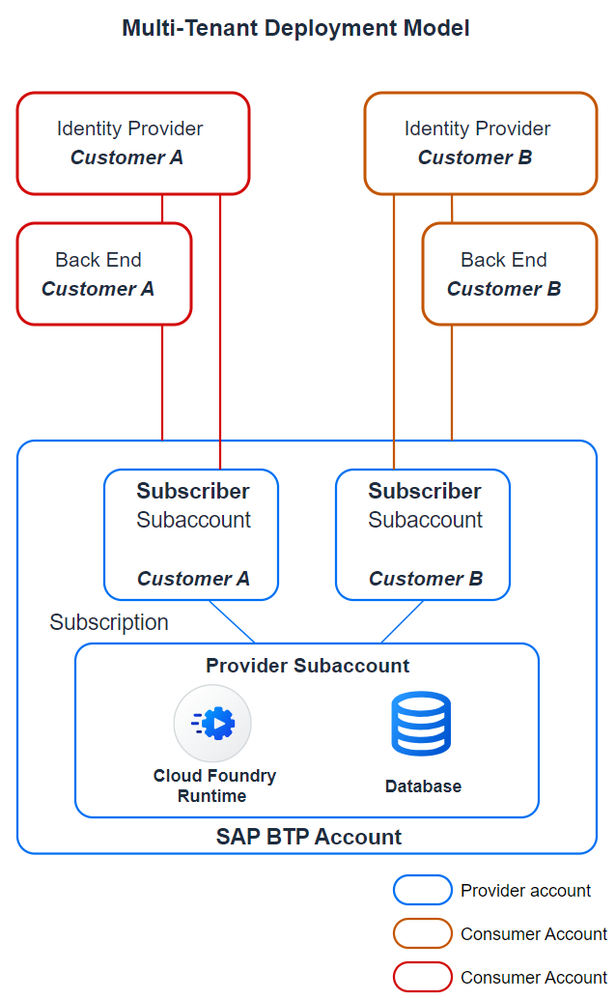

# Provision Your Multi-Tenant Application to Consumer Subaccounts

The goal is to provide a multi-customer application as a partner-managed application. To achieve it, you create consumer subaccounts for each customer in the SAP BTP global account of the partner that hosts the provider subaccount as well. Then, you subscribe to the multi-tenant SAP BTP application in the consumer subaccount and connect the customer ERP system and the corporate identity provider.

As a result of this setup, all customers use shared SAP BTP resources such as SAP BTP Cloud Foundry runtime and the SAP HANA Cloud service. At the same time, SAP BTP multitenancy ensures a clear and secure separation of customer data (by database schemas) and user access management.

  

## Set Up SAP BTP Consumer Subaccount

To start the provisioning procedure, create an SAP BTP consumer subaccount for a specific customer:
1. Open the SAP BTP cockpit (use the global account that hosts the provider subaccount of the SAP BTP application).
2. Create a new *Multi-Environment* subaccount with the name `PoetrySlamsMTSubscriber1` (you can use any naming pattern for additional subaccounts to serve additional customers). 
3. As a provider, choose *Amazon Web Services (AWS)*. 

### Subscribe to and Launch the SAP BTP Multi-Tenant Application

To provision the application on an SAP BTP consumer subaccount for a specific customer, subscribe to the application:
1. In the SAP BTP cockpit of the consumer subaccount, navigate to *Instances and Subscriptions*.
2. Create a subscription to *Poetry Slam Manager* with service plan *default*. This is your own multi-tenant SAP BTP application that you've just created.
3. To launch the *Poetry Slam Manager* application, choose *Go to Application* once the application status is *Subscribed*. 

### Entitle and Subscribe to SAP Build Work Zone Application

1. In the newly created SAP BTP cockpit consumer subaccount, open *Entitlements* and assign *SAP Build Work Zone* with 
	- *Service*: *SAP Build Work Zone, standard edition* 
	- *Plan*: *standard (Application)*.

2. Open the *Service Marketplace* and select the service *SAP Build Work Zone*.

3. Create a subscription of *SAP Build Work Zone* with
    - *Service*: *SAP Build Work Zone, standard edition*
    - *Plan*: *standard (Application)*.

	> Note: In case the subscription fails, check the error message by clicking on the red status icon. If the following error message is shown, the error is caused as an OpenID Connect (OIDC) trust configuration is required: *'To subscribe this application link an Identity Authentication tenant to the subaccount with the "Establish Trust" option. For more information: https://help.sap.com/viewer/65de2977205c403bbc107264b8eccf4b/Cloud/en-US/161f8f0cfac64c4fa2d973bc5f08a894.html'*. As a prerequisite for the trust, the SAP BTP subaccount and the Identity Authentication service tenant must be assigned to the same customer ID. In the partner use case, they are assigned to different customer IDs. Therefore, in this tutorial SAML 2.0 is used for single sign-on in this tutorial.
	
	> Currently, SAP Build Work Zone requires a configured OpenID Connect (OIDC) trust to be subscribed. Nevertheless, there is a proposed workaround to subscribe SAP Build Work Zone. 
	
	> The required steps are as follows::
	> 1. Establish a trust connection in the consumer subaccount with your IdP (partner owned IdP). 
	> 2. Create the *SAP Build Work Zone, standard edition* subscription.
	> 3. Deactivate the trust connection with the partner IdP again.
	> 4. Follow the SAP Note [3311634 - Switching user login back from Identity Authentication (IAS) to Authorization and Trust Management (XSUAA)](https://me.sap.com/notes/3311634/E) to switch SAP Build Work Zone from Identity Authentication (IAS) to Authorization and Trust Management (XSUAA).

4. In the left navigation pane, open *Security > Users* and add the role collection *Launchpad_Admin* to your user.

> Note: SAP Build Work Zone provides a managed application router that is used to manage application authentication and tokens. 

## Create Destinations to Access the HTML5 Business Solutions of the Provider Subaccount

The Partner Reference Application is a content provider and offers content using the common data model. Besides this, it creates destinations to access the provided content.

In the consumer subaccount, [destinations](https://help.sap.com/docs/cloud-portal-service/sap-cloud-portal-service-on-cloud-foundry/settings-for-html-business-solutions-work-in-progress) for the design-time and the runtime of the provided content are required, too.

Therefore, export the required subaccount destinations from the provider subaccount and import them to the consumer subaccount.

1. Export the destinations from the provider subaccount.

	1. Open the SAP BTP cockpit of the provider.
	2. Navigate to the *Destinations* view.
	3. (Optional) Adapt the destinations in landscape eu10. This step is necessary because the HTML5 repository and SAP Build Work Zone services are hosted in eu10, while the application runs in eu10-00x.
		1. If your application runs in landscape eu10 and the service URL includes *eu10-00x.hana.ondemand.com*, where x stands for any number, adapt the destinations before exporting them.
		2. In the *poetry-slams-rt* destination, remove *-00x* from the *URL*. The last part of the URL should be: *launchpad.cfapps.eu10.hana.ondemand.com*.
		3. In the *poetry-slams-cdm* destination, remove *-00x* from the *URL*, the *Token Service URL*, and the additional property *uri*. It should be: *cfapps.eu10.hana.ondemand.com*.
	4. Select the *poetry-slams-cdm* destination and export it. A *poetry-slams-cdm* file is stored on your computer.
	5. Select the *poetry-slams-rt* destination and export it. A *poetry-slams-rt* file is stored on your computer.
	6. Do not close the provider cockpit, as you'll need it for the next steps.

2. Import the destinations in the consumer subaccount.
	1. Open the SAP BTP cockpit of the consumer.
	2. Navigate to the *Destinations* view.
	3. Import the *poetry-slams-cdm* destination using the downloaded file. The values of the destination are taken over. The value of the Client Secret property can't be exported but you can get it as follows:

		1. Navigate to *Instances and Subscriptions* of the provider subaccount.
		2. Select the *poetry-slams-html5-runtime* service instance in the table.
		3. Choose *View Credentials* at the top right corner of the screen.
		4. From the Credentials file that opens, copy the value of the clientsecret.
		5. Navigate back to your design-time destination and add the value you just copied to the Client Secret property.

	4. Import the *poetry-slams-rt* destination using the downloaded file.
	5. Replace the URL with `https://<consumer account subdomain>.launchpad.cfapps.eu10.hana.ondemand.com`.

	> Note: In case you undeploy the solution in the provider subaccount and deploy it again, the *poetry-slams-cdm* destination needs to be updated. The *clientid*, *clientsecret* and *xsappname* need to be copied from the *poetry-slams-html5-runtime* credentials.

## Configure SAP Build Work Zone

Since the web application and the destinations for the provided content are available, it's ready to be added to SAP Build Work Zone.

This is done in the *Site Manager* that is launched when you go to the application *SAP Build Work Zone, standard edition* under *Instances and Subscriptions* in the consumer subaccount.

SAP Build Work Zone offers additional features besides navigation and theming support. For more details, check out [Enable Key User Flexibility Using SAP Build Work Zone](./51-Multi-Tenancy-Features-Tenant-Key-User-Flexibility.md).

### Configure the Content Channel of Your Web Application

1. In the *Site Manager*, open the *Channel Manager*. As the web application is deployed in the provider subaccount, it is not automatically added as content to the *HTML5 Apps* content channel.

2. Create a new *Content Provider*. 
	1. Set the title *Poetry Slam Manager*.
	2. Set the description *Content of Poetry Slam Manager Solution*.
	3. Select *poetry-slams-cdm* as *Design-Time-Destination*.
	4. Select *poetry-slams-rt* as *Runtime-Destination*.
	5. Save the content channel.
	6. Use *Report* to see the created elements of your channel.

	 > Note: You must update the content channel every time you made changes to the web application. It may take some time to reflect the changes.

	> Note: For more information, refer to [Creating a Content Provider](https://help.sap.com/docs/CIAS%20FES%202020/ecb81b5bfce440ca8e7e7c9ad58fcf3a/70e980150c174778aff9f698fde04307.html) on SAP Help Portal.

### Review the Created Content of Your Web Application

1. Open the *Content Manager*.
2. The *Poetry Slam Manager Role* and the *Poetry Slam Visitor Role* were automatically created. The names in the *ID* fields are the name of the role collections that are created in the SAP BTP cockpit of the consumer account that handles the access for the application content.
3. Select one of the roles.
4. The *Poetry Slams* and the *Visitors* apps are automatically assigned. These were defined in the cdm-file of the application.

### Create a Launchpad Site

In this step, you create and review a launchpad site. If you already have a site, just add your web applications.

1. Open the *Site Directory*. 
2. Create a new site and enter a site name, for example, *Partner Reference Application*.
3. Open the *Site Settings* to launch the *Site Editor*.
	1. Open the *Role Assignments* and click on Edit.
	2. Activate the *Assignment Status* of the roles *Poetry Slam Visitor Role* and *Poetry Slam Manager Role*.
	3. Save the changes.
4. Open *Manage Site Alias* and enter a site alias, for example `cet` or `central-entry-point`. 
	> Note: Using a site alias, you obtain stable, short and human readable access URLs, for example `<subscription hostname>/site/cet#poetryslams-display`. This allows you to refactor or change Work Zone sites at a later point in time without forcing users to adapt custom tiles and browser bookmarks.
5. Save the alias.

You can launch the Work Zone site using the *URL* provided in the *Properties* of the *Site Settings*.
However, on the site, you don’t see any tiles yet; before being able to see the tiles *Poetry Slam Events* and *Visitors and Artists*, you need to configure the authorization roles as described in the next steps.

> Note: For quick access in the subsequent chapters of this tutorial, note down the *URL*. 

### (Optional) Customer-Specific Apps

If a customer needs to add further specific links to the site, follow these steps:

#### Create a Group and Add the Link 

1. Open the *Content Manager*.
2. Create a new *App* and enter a description and the URL.
3. Choose *Open App - In a new tab*.
4. Deselect the *Add intent and default SAP parameters to URL* option.
5. On the *Navigation* tab, enter *Semantic Object* `default` and *Action* `default`.
6. Create a new *Group* and enter a title and description. 
7. Add the new app to the group.
8. Save your changes.

#### Assign the New App to the Default Role

Now, assign the new app to the *Everyone* role, which is a default role. This makes the content visible to all users.

1. Open the *Content Manager*.
2. Choose *Everyone* to open the *Role Editor*.
3. Choose *Edit*.  
4. On the *Apps* tab, find the list of available apps. Move the slider in the *Assignment Status* column to assign your apps to the group. The slider turns green.
5. Save your changes.

> Note: The added application should be visible on the site created in the previous step.

## Configure Authentication and Authorization 

You use the Identity Authentication service as a corporate identity provider (IdP) and establish a trust relationship between the service provider (the SAP BTP subaccount to which you deployed the application) and the Identity Authentication service tenant. As a result, the SAP BTP subaccount and the application delegate user authentications to the Identity Authentication service tenant including single sign-on. Furthermore, you use the Identity Authentication service tenant to assign authorization roles to users through user groups.

However, as a prerequisite, you must have admin access to an Identity Authentication service tenant. 

### Set Up Single Sign-On for the SAP BTP Application Subscription

As a preferred approach, you configure trust between the SAP BTP subaccount and the Identity Authentication service using OpenID Connect (OIDC). As a further option, a SAML 2.0 trust configuration is described as well.

#### OpenID Connect Configuration

Set up the trust relationship between the SAP BTP subaccount to the Identity Authentication service using OpenID Connect (OIDC). For more information, refer to [Configuring OpenID Connect](https://help.sap.com/docs/identity-authentication/identity-authentication/openid-connect) on SAP Help Portal. 

> Note: As a prerequisite for this setup, the SAP BTP subaccount and the Identity Authentication service tenant must be assigned to the same customer ID. If they are assigned to different customer IDs, configure SAML 2.0 as described below.

1. Within your SAP BTP subaccount, open the menu item *Security* and go to *Trust Configuration*. 
2. Choose *Establish Trust* and select the Identity Authentication service tenant to set up the OIDC trust configuration.
3. Log on to your Identity Authentication service Admin UI (URL: [IAS]/admin/). 
4. Open the menu item *Applications* and search for the application that refers to your SAP BTP subaccount.
   > Note that the name typically follows the pattern: *XSUAA_[subaccount-name]*.
5. Edit the application and change the following fields:
    - The display name appears on the user log-on screen and the login applies to all applications linked to the Identity Authentication service tenant (following the single sign-on principle). Change the *Display Name* to something meaningful from an end-user perspective representing the scope of the Identity Authentication service.
    - Enter the *Home URL*, for example, the link to the SAP Build Work Zone launchpad or the application.
	
#### Configure Trust Using SAML 2.0

Set up the trust relationship between the SAP BTP subaccount to the Identity Authentication service using SAML 2.0. For more information, refer to [SAP Cloud Identity Services](https://help.sap.com/docs/identity-authentication/identity-authentication/saml-2-0) on SAP Help Portal. The SAML2 usage applies only if the OpenID Connect configuration is not possible. That is the case when the SAP BTP subscriber subaccount and the Identity Authentication service tenant are not assigned to the same customer ID. This setup comes with limitations regarding remote access to the OData services of the SAP BTP application with principal propagation.

1. In the SAP BTP consumer subaccount, download the **SAML metadata file of the subaccount**.
	1. Open *Security* in the menu and go to *Trust Configuration*.
	2. Choose *Download SAML Metadata*.

2. On the Identity Authentication admin UI, open *Applications* in the menu under *Applications & Resources* and create a new application of the type *SAP BTP Solution*:
	1. Enter the required information, such as application display name, home URL, and so on. 
    The display name appears on the user log-in screen and the login applies to all applications linked to the Identity Authentication service tenant (following the single sign-on principle). Choose a meaningful text from an end-user perspective representing the scope of the Identity Authentication service, for example, `Almika Inc. - Poetry Slams`, or something more general if you subscribed to multiple apps in your consumer subaccount.
	2. Open the section *SAML 2.0 Configuration* and upload the **subaccount SAML metadata file** from the SAP BTP subaccount, which you downloaded in the previous step.
	3. Open the section *Subject Name Identifier* and select *E-Mail* as the primary attribute.
	4. Open the section *Default Name ID Format* and select *E-Mail*.
  	5. Open the section *Attributes* and add the user attribute *Groups* with the value *Groups* from the source *Identity Directory*.
        > Note: The assertion attribute *Groups* is used to process authorization checks in the consumer subaccount based on user groups. The value *Groups* of the assertion attribute must be written with a capital G for SAP BTP subaccounts!

3. To download the **SAML metadata file of the IdP**, open the menu item *Applications & Resources*. Go to *Tenant Settings* and *SAML 2.0 Configuration*. Choose *Download Metadata File*.

4. In the SAP BTP consumer subaccount, open the menu item *Security* and go to *Trust Configuration*. 
	1. Choose *New SAML Trust Configuration*. 
	2. Upload the **SAML metadata file of the IdP** that you just downloaded and enter a meaningful name and description of the IdP (for example, ``Corporate IdP``).

Looking for more information on the SAP Authorization and Trust Management service? Go to [Building Side-By-Side Extensions Using SAP BTP -> Describing Authorization and Trust Management (XSUAA)](https://learning.sap.com/learning-journeys/build-side-by-side-extensions-on-sap-btp/describing-authorization-and-trust-management-xsuaa-_cbf0d0c5-29ec-4685-9cf4-487156b41284).

#### Configure Authorization Roles 

In this example, Identity Authentication service user groups are used to assign authorization roles to users. This comes with the advantage of customers assigning users to the groups in the IdP without requiring access to the SAP BTP subaccount. To achieve this, user groups are passed as an assertion attribute to the SAP BTP consumer subaccount and are mapped to the respective role collections in the subaccount. 

1. On the Identity Authentication admin UI, open the menu item *User Management* under *Users & Authorizations* and add the users that require access to the SAP BTP application. Enter their user details such as name and e-mail address. However, take into account that the e-mail address is used as the identifying attribute (use the same e-mail address in all related systems incl. Identity Authentication service, ERP system, and so on).
	
2. Open the menu item *Groups* under *Users & Authorizations* and add user groups that represent typical user roles. Enter a unique (technical) *Name* and a meaningful *Display Name*, for example:

	| Name                         	| Display Name		             	|
	| :------------------------- 	| :-------------------------		|
	| `PoetrySlamManager`  			| Poetry Slam Manager				|
	| `PoetrySlamVisitor`           | Poetry Slam Visitor       	  	|
   > Note: To add users to the user group, choose *Add* and select the user from the list of users and save your changes.

3. In the SAP BTP consumer subaccount, open the menu item *Role Collections* and edit the role collections that were created by SAP Build Work Zone, for example, ~poetry_slam_manager_poetrySlamManagerRole. 

	For each role collection, add the role from the reference application (defined in the [*xs-security.json*](../../../tree/main-multi-tenant/xs-security.json)) and add a user group by selecting the previously configured identity provider and set the name of the *User Group* (using the unique technical name of the user group of the Identity Authentication service).

	| Role Collection                    				| Role		  			| User Groups         		|
	| :---                               				| :---					| :---			       		|
	| `~poetry_slam_manager_poetrySlamManagerRole` 		| PoetrySlamManagerRole | `PoetrySlamManager` 		|		
	| `~poetry_slam_manager_poetrySlamVisitorRole`		| PoetrySlamVisitorRole | `PoetrySlamVisitor`   	|	

### Test Single Sign-On

There are two ways to test the application. Either using SAP Build Work Zone and the managed app router (preferred) or the subscription and the implemented app router.

#### Test with SAP Build Work Zone

Launch the SAP Build Work Zone site with the URL you noted down during the launchpad site creation. Set the Identity Authentication service tenant as IdP. Choose one of the tiles. The application should come up.

You may deactivate the user login with the *Default Identity Provider* (which refers to the *SAP ID Service*) in the *Trust Configuration* of your SAP BTP consumer subaccount. As a result, end users cannot select the _Default Identity Provider_, and the customer's Identity Authentication service tenant is used for authentication automatically.

#### Test Without SAP Build Work Zone

Launch your SAP BTP application by navigating to *Instances and Subscriptions* and opening the SAP BTP application. Set the Identity Authentication service tenant as IdP. 

> Note: When opening the application through the subscription, only the poetry slams application can be tested. The navigation to the visitors application will not work as SAP Build Work Zone handles it.

## Remarks and Troubleshooting

Subscriptions can be deleted in the consumer subaccount, but be aware of the fact that all data will be lost.
If you delete and recreate a subscription of the SAP BTP application, all consumer subaccount configurations (trust/SSO, destinations, and so on) remain valid, except for the user groups in the role collections. You may observe a *404 - Unauthorized* error message when accessing the SAP BTP application if you haven't added the user groups to the role collections of the SAP BTP application after resubscribing to it.

If you manually delete an application or undeploy it from the provider subaccount while the application still has active subscriptions, note that there are a few service instances that can't be deleted. In addition, it's no longer possible to delete subscriptions to the removed application through the UI of the subscriber subaccounts. Instead, to delete the subscriptions, you need to access the service instance of the service _SaaS Provisioning Service_. Once you've removed all subscriptions, you can remove the remaining service instances from the provider subaccount.

If you need more information on how to trace and debug your application, go to [Test and Troubleshoot Multitenancy](26-Test-Trace-Debug-Multi-Tenancy.md).
