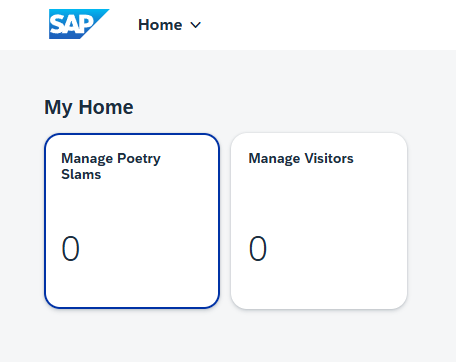
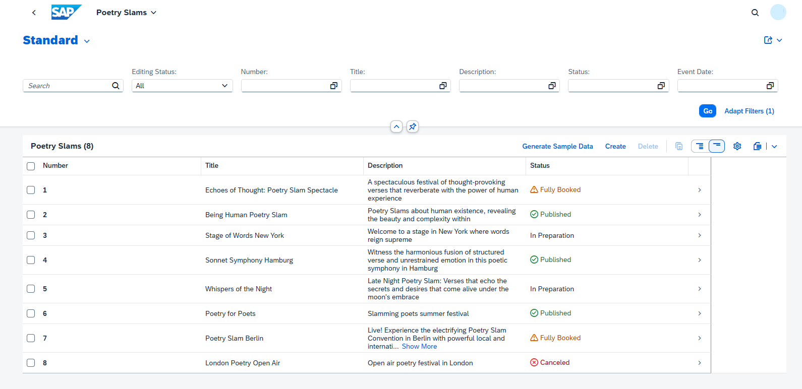
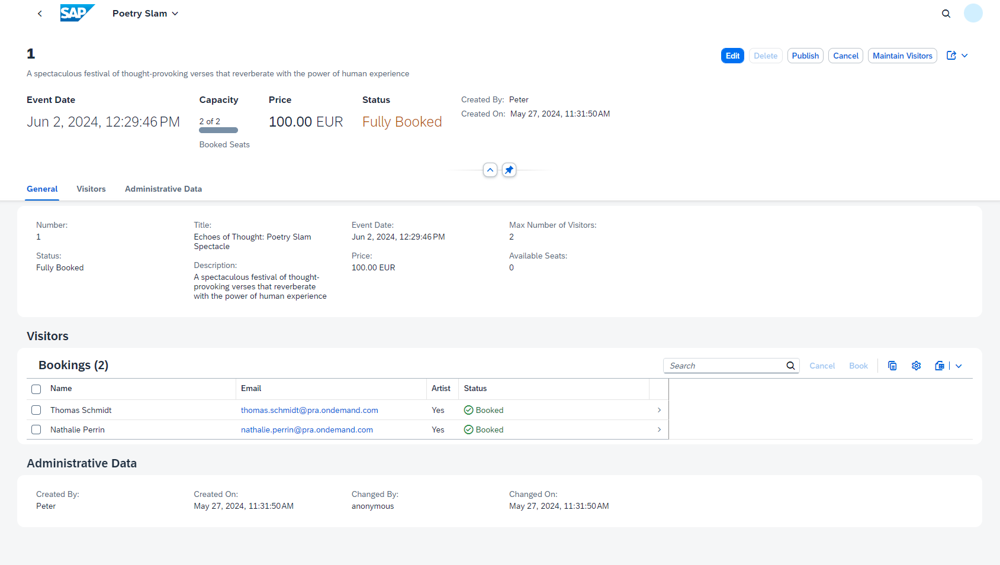
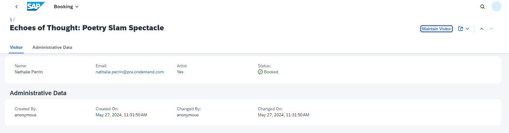
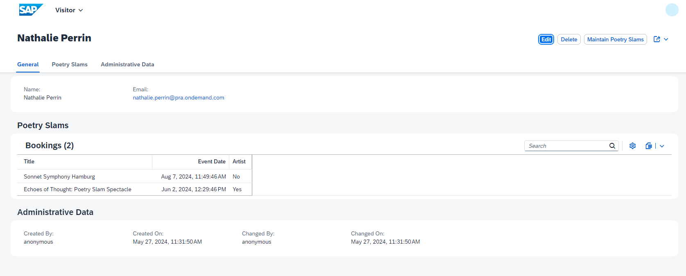

# Go on a Guided Tour to Explore the Capabilities of the Deployed Sample Application

Put yourself in the shoes of a poetry slam manager: Imagine it's your job to organize and run poetry slams.

Don't worry. With Poetry Slam Manager, a partner application, it's quite simple to organize poetry slams as the app helps you publish them and register artists and guests.

Buckle up and let us take you on a guided tour through the debployed sample solution:

1. Launch your SAP Build Work Zone site by opening the page URL you noted down during the [multitenancy provisioning](./25-Multi-Tenancy-Provisioning.md).
        
    > Note: SAP Build Work Zone delegates the user authentication to the Identity Authentication service, which acts as corporate identity provider in this example.

2. On the site, you find Poetry Slams and Visitors, the partner applications. To start the Poetry Slams app, click on the corresponding tile.
    
    > Note: The Partner Reference Application is embedded in SAP Build Work Zone. Additionally, you can launch other SAP BTP apps relevant for key users and administrators such as Identity Authentication service to manage user authentications and authorizations. To launch these apps, you don't need to log in again as they're linked to your corporate IdP and you can use single sign-on.

    

3. In the Poetry Slams app, an empty list is shown.

    > Note: You see a metadata-driven UI in line with SAP style guides. Using the UI theme manager, you can choose your favorite theme. Furthermore, you can customize the table layout and adapt the filter area according to your personal preferences. The *Export to Spreadsheet* function allows you to download the poetry slam data into a spreadsheet application. All these capabilities are provided out of the box without any development efforts.

    

4. To create sample data for mutable data, such as poetry slams, visitors, and visits, choose *Generate Sample Data*. As a result, multiple poetry slams are listed: Some are still in preparation while others have already been published. 
    
    > Note: If you choose *Generate Sample Data* again, the sample data is set to the default values.

5. Select one of the poetry slams with status *Published* to see its details.

6. Choose *Edit* and change the description of the poetry slam.

7. In the *Bookings* table, choose *Create*. Select *nathalie.perrin@pra.ondemand.com* from the value help and set the *Artist* indicator. 
    
8. Save your changes to publish them.

    > Note: Your changes are immediately saved to the database as *Draft*. Additionally, the system locks the poetry slam for other users to avoid concurrent changes. Only by clicking on *Save*, your changes become visible to all users and the edit lock gets released. This gives you sufficient time to make your changes.

    

9. Click *Nathalie Perrin* in the *Bookings* table for details of the individual booking for *Nathalie Perrin*. 
    
    > Note: You navigated to the *Visits* Object Page of the Poetry Slams application.

    

10. Click the *Maintain Visitor* button for an overview of all bookings for *Nathalie Perrin*. This includes bookings for all past as well as future poetry slams. 

    > Note: You navigated to the *Visitors* application of the Poetry Slam Manager solution.

    

This concludes the guided tour... We hope you enjoyed the ride. 
