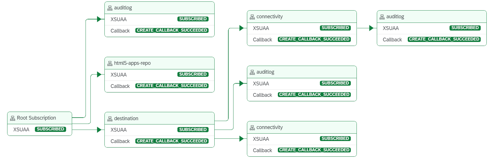

# Test and Troubleshoot Multitenancy

## The Subscription Management Dashboard

When developing a multi-tenant application, the subscription management dashboard can be used to easily manage and maintain each of the tenants that have currently been subscribed to the application.

You can do the following in the subscription management dashboard:

- View all subscriptions to your application and detailed information about them, such as their state and tenant ID.
- View the dependencies and status of each subscription.
- Perform operations on subscriptions, for example, update the list of dependencies.
- Displays detailed information about any errors that arise during the subscription process. This gives you means to identify the source of issues and fix them.

1. To use the dashboard, assign the role collection *Subscription Management Dashboard Administrator* or *Subscription Management Dashboard Viewer* to your user. 
    > Note: This role collection is created when an application including the service *SaaS Provisioning Service* (technical name *saas-registry*) is deployed.
2. In the navigation bar of the SAP BTP subaccount cockpit, select *Services* and go to *Instances and Subscriptions*. 
3. In the *Instances* section, find the instance of the service *SaaS Provisioning Service* (in your case: *poetry-slams-registry*) and choose the *poetry-slams-registry* hyperlink.
4. This will open a new window where a list of all subscriptions is displayed. If a subscription has failed, you can find the error details here.
5. Click on the line of a specific tenant to display the dependency graph for a visual overview of the dependencies of the services:

For more information about using the Subscription Management Dashboard, refer to [Using the Subscription Management Dashboard](https://help.sap.com/docs/btp/sap-business-technology-platform/using-subscription-management-dashboard)

## Additional Information

The information above is specific to a multi-tenant application. Find additional hints in the tutorials [Test and Troubleshoot](16-Test-Trace-Debug.md) (for one-off applications) and [Test and Troubleshoot an ERP Integration](32-Test-Trace-Debug-ERP.md).