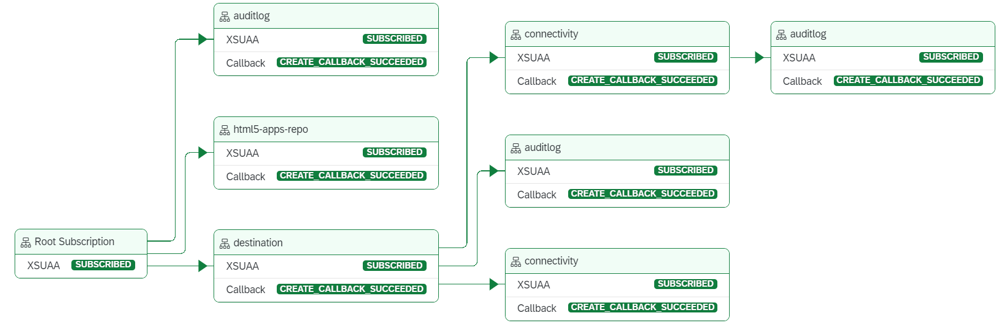
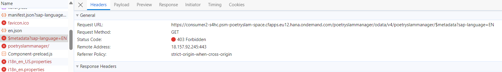
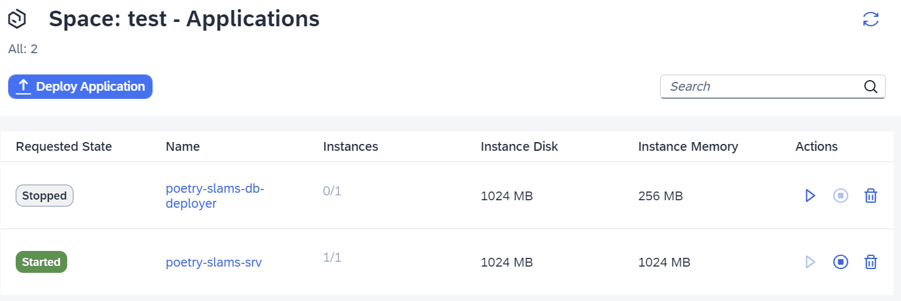

# Test and Troubleshoot Multitenancy

## The Subscription Management Dashboard

When developing a multi-tenant application, the *Subscription Management Dashboard* can be used to easily manage and maintain each of the tenants that have currently been subscribed to the application. In case there are problems with a subscription, the subscription dashboard can be used to analyze the current status.

Capabilities of the *Subscription Management Dashboard*: 
- The dashboard enables application providers to review the deployment of multi-tenant applications, including the application and subscription status and the change history/subscription history.
- Application providers can perform subscription actions such as *Unsubscribe* and *Update*, and track the status of subscriptions in progress.
- In the *Overview* section of the subscribed application, application owners can review information such as *Subscription Status*, *Global Accounts*, *Consumer Subaccounts*, *Application Name*, *Application URL*, *License Type* (productive, test tenant), *Changed On*, and *Created On*.
- In the *Dependencies* section, application providers can review the service dependencies of the application. There is a tree view and a table view of the dependencies. The information helps users view the full list of dependencies among various services used in the application. It outlines, for example, the dependencies between the application service module and the modules for destinations, 
SAP HTML5 Application Repository service for SAP BTP, and connectivity services. 

To use the dashboard:

1. Open the SAP BTP cockpit of the provider subaccount.

2. Assign the role collection *Subscription Management Dashboard Administrator* or *Subscription Management Dashboard Viewer* to your user. 
    > Note: This role collection is created when an application including the service *SaaS Provisioning Service* (technical name *saas-registry*) is deployed.
3. In the navigation bar of the SAP BTP subaccount cockpit, select *Services* and go to *Instances and Subscriptions*. 
4. In the *Instances* section, find the instance of the service *SaaS Provisioning Service* (in this case: *poetry-slams-registry*) and choose the *poetry-slams-registry* hyperlink.
    > Note: In case of authorization issues, open it in an incognito window of your browser.
5. This will open a new window where a list of all subscriptions is displayed. If a subscription has failed, you can find the error details here.
6. Click on the line of a specific tenant to display the dependency graph for a visual overview of the dependencies of the services:

<center></center>

For more information about using the Subscription Management Dashboard, refer to [Using the Subscription Management Dashboard](https://help.sap.com/docs/btp/sap-business-technology-platform/using-subscription-management-dashboard)

## Trace Your Deployed Application

Consider adding log statements to the service implementations, for example: 
```javascript
console.log("Poetry Slam " + PoetrySlamIdentifier +" is canceled");
```
The log statements are written during the use of your deployed application. Use the command `cf logs poetry-slams-srv --recent` in the SAP Business Application Studio terminal to review your own log messages or the ones created by others. You need to be logged in to your SAP BTP Cloud Foundry runtime space.

## Hybrid Testing
As described, your local environment runs with an SQLite database. If you want to connect your local test environment with an SAP HANA Cloud database to run your test against the same database technology as the deployed solution does, follow the instructions in this section.

For general guidelines on how to connect your local test against services in the Cloud, refer to the [SAP Cloud Application Programming Model documentation on hybrid testing](https://cap.cloud.sap/docs/advanced/hybrid-testing).

### Prerequisites
When this project was created, the SAP HANA Cloud capability was included. As a result, the dependency @sap/cds_hana is listed in the file *package.json* and the
file *[.hdiconfig](../../../tree/main-multi-tenant/db/src/.hdiconfig)* has been added to the project.

Now, you need to provide the credentials to connect to the SAP HANA Cloud database.

### Step-By-Step Procedure
1. Log on to SAP BTP Cloud Foundry runtime and select the *org* and *space* of the instance where your application is deployed. 

2. You need to create a service key for your SAP HANA HDI Container service instance and add the key information to your local development environment. This can be achieved by executing the CDS command in your terminal: `cds deploy --to hana:<HDI Container service instance name> --profile hybrid --store-credentials`.

    For the Poetry Slam Manager solution, this would be `cds deploy --to hana:poetry-slams-db --profile hybrid --store-credentials`.

    Now, the files *default-env.json* and *cdsrc-private.json* are created at the root level of your project:
    - The *default-env.json* has the service key information with the credentials to connect to the SAP HANA Cloud database. 
    - The *cdsrc-private.json* stores the binding information. 
    
    Add both files to *.gitignore* because they contain confidential data.

3. Adapt the *package.json* file with new CDS profile hybrid:

    ```json
    "cds": {
      "requires": {
        "db": {
          "kind": "sql"
        },
        "[hybrid]": {
          "db": {
            "kind": "hana"
          }
        }
      }
    }
    ```

4. To run your application using the SAP HANA Cloud database, execute: `cds serve --profile hybrid`.
5. To run your unit tests, execute: `cds bind --exec --profile hybrid npm test`.

## Troubleshoot Your Application

### Missing Access Rights

Typically, if the application is not loading, it's due to missing access rights. To check if the error is caused due to missing authorizations, follow these steps:

1. Open the browser development tools.

2. Check the requests and responses sent by the application (you may need to reload the page to see the errors). 

      Typical errors could be of type *403 Forbidden*. This would indicate that the user doesn't have the relevant authorizations.

      

3. In this case, check if the application role collections are either assigned to a user or to user groups as configured in the IdP that is connected to this subaccount. 

4. Once you've assigned the authorizations, reload the browser (use an incognito tab if the information is cached) and the app opens.

#### Check User Groups

The Identity Authentication service user groups are used to assign authorization roles to users. The user groups are passed as *assertion attribute* to the SAP BTP subaccount and are mapped to the respective role collections in the SAP BTP subaccount. Ensure that the user is configured from the Identity Authentication service admin UI and that the user groups have been configured for the typical user roles. Additionally, make sure that the attributes with the name *Groups* have also been assigned from the *Attributes* menu item.

For a detailed description of this process, go to [Configure Authentication and Authorization](25-Multi-Tenancy-Provisioning.md#configure-authentication-and-authorization).

### Check Event Logs

If you experience an error with a particular service, event logs can be used to narrow down and identify what actions to take and which service is causing the issue.

1. Navigate to your Cloud Foundry space in the SAP BTP provider account.
2. On the application menu, go to the *Events* section. 
3. Identify which events have been triggered since the last action. 
4. The *Time*, *Event* which occurred, the *Actor* (user who requested the event), the *Actee* (the service that was engaged), and a *Description* of the log are provided.

> Note that this doesn't just provide error information, but also general information too, which can be helpful with narrowing down which service might be causing the problem.

The generated logs only have a limited lifetime and disappear after some time. Should an error be encountered, it is best to check for logs directly.

### Check Application Logs

There are application logs for all modules that are maintained in the *mta.yaml* file. To find them, go to your Cloud Foundry space. 

From here, you can navigate to the specific application and analyze the logs that are maintained for that application. 

1. Navigate to your Cloud Foundry space in the SAP BTP provider account.

   

2. Go to the application you want to analyze.
3. Navigate to the *Logs* section.
4. A list of logs is shown for that specific application.

> Note: Just like the event logs, there is a limited lifetime where the application logs can be accessed.

## Give Feedback

In the SAP BTP subaccount cockpit, on the header of the page, there's a feedback icon you can use to report a bug:

<center>  </center>

The SAP Cloud Application Programming Model documentation also contains a [Resources](https://cap.cloud.sap/docs/resources/) page that you can use to report any issues. 

## Additional Information

The information above is specific to a deployed multi-tenant application. Find additional hints in the tutorials [Test and Troubleshoot](16-Test-Trace-Debug.md) for the application development, local testing, and [Test and Troubleshoot an ERP Integration](32-Test-Trace-Debug-ERP.md).
