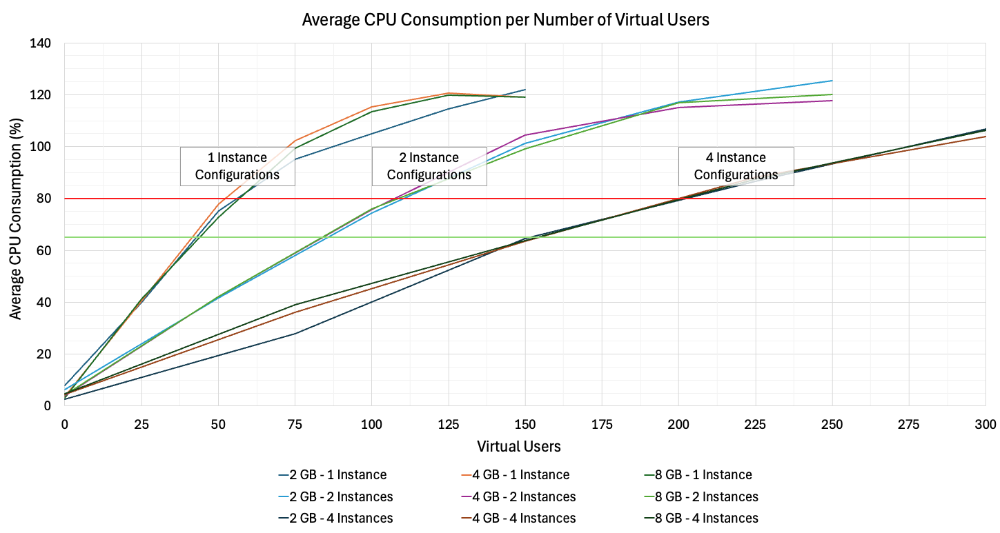

# Estimate the Required Cloud Foundry Environment Configuration

This tutorial is based on Cloud Foundry as the underlying Platform-as-a-Service (PaaS). Cloud Foundry enables developers to build, deploy, and manage cloud-native applications efficiently. It supports multiple programming languages and frameworks, integrates seamlessly with SAP and third-party services, and offers multi-cloud deployment with reduced infrastructure management overhead.

As a partner, you provide your application to multiple tenants. This tutorial explains how to configure the Cloud Foundry runtime to provide your application to an increasing number of tenants.

The tutorial is split into the following sections:
- [Scaling Parameters of the Cloud Foundry Environment](28-CF-Environment-Scaling.md#scaling-parameters-of-the-cloud-foundry-environment)
- [Understanding the Cloud Foundry Runtime Requirements of Your Application](28-CF-Environment-Scaling.md#understanding-the-cloud-foundry-runtime-requirements-of-your-application)
- [Sample Measurement for the Poetry Slam Manager Application](28-CF-Environment-Scaling.md#sample-measurement-for-the-poetry-slam-manager-application)

## Disclaimer and Prerequisites

This tutorial describes how you can scale the Cloud Foundry environment based on experiences and measurements with the Partner Reference Application. The application is a simple CAP Node.js application that doesn't perform complex calculations or operations on big data. If your application handles more complex scenarios, you may need to conduct additional measurements to determine the appropriate resources for important border cases. If your application relies on multiple dependent services, consider including their impact in your Cloud Foundry environment calculations.

However, you can use the approach described in this tutorial for such cases as well. It describes how to measure the Cloud Foundry runtime resource consumption with a simulated load. The results allow you to scale your Cloud Foundry environment configuration to meet your business requirements.

To simulate load and store measurements, you need a tool that runs a scenario with several requests to your application multiple times in parallel. Additionally, you create a small script that regularly calls the Cloud Foundry Command Line Interface (CF CLI) and stores the results for later analysis. You can find more details in the sections below.

## Scaling Parameters of the Cloud Foundry Environment

You can configure parameters in the Cloud Foundry environment, such as **Disk per Instance**, **Memory per Instance**, and **Number of Instances**. These parameters can be adapted in two ways: **Vertical Scaling** and **Horizontal Scaling**.

### Vertical Scaling

The attribute **Disk per Instance** allocates the required disk space of each application instance. It is affected by the source code of the appliation and the services that are bound to the application. The disk space needs to be configured before the application is deployed.

**Memory per Instance** is the memory (RAM) used to run the application on Cloud Foundry. The memory also determines how many (virtual) CPUs are provided to run the application. 
A maximum of 16 GB of memory can be assigned to a single application instance. If your application handles memory-heavy operations, such as parsing large files, you might need to increase the available memory.

Both, the **Disk per Instance** and **Memory per Instance** define the size of each instance. This is called **Vertical Scaling**.

In the Cloud Foundry environment, applications receive a guaranteed CPU share of 1/4 virtual core for each GB of runtime memory quota reserved for an application instance. This is called **CPU Entitlement**. Each instance can be assigned a maximum memory of 16 GB, which equals a maximum of 4 virtual CPU cores for one application instance.

For example, a **Memory per Instance** of 1 GB entitles the application to use up to 25% of the CPU. If the landscape is not operating at full capacity, Cloud Foundry may allow your application to use more CPU than the entitlement specifies. However, these additional resources aren't guaranteed. To ensure your application functions properly at all times, don't exceed the configured entitlement.

> Note: Node.js is a single-threaded runtime. Since the Partner Reference Application is developed with CAP Node.js, requests to the application are handled sequentially. This means that an increase of entitled CPUs beyond 100% will not increase the throughput. This means, vertical scaling beyond a memory size of 4 GB will not improve the performance.

For more information, see [SAP Help Portal - SAP BTP-Specific Configurations](https://help.sap.com/docs/btp/sap-business-technology-platform/cloud-foundry-environment#sap-btp-specific-configurations).

### Horizontal Scaling

The **Number of Instances** determines how many application instances are used to operate the application. This is called **Horizontal Scaling**.

Increasing the number of application instances provides higher availability and stability as well as parallelization.

### Configuration of the Cloud Foundry Environment Parameters

There are different options to configure the Cloud Foundry environment of the deployed application: 

- The **Multi-Target Application Development Descriptor (mta.yaml)** can be used to configure the Cloud Foundry environment during the deployment process. 
- The **BTP Cockpit** or the **Cloud Foundry Interface** can be used to update the configuration after the application is deployed.

#### Multi-Target Application Development Descriptor (mta.yaml)

The [Multi-Target Application Development Descriptor (mta.yaml)](https://help.sap.com/docs/SAP_HANA_PLATFORM/4505d0bdaf4948449b7f7379d24d0f0d/4486ada1af824aadaf56baebc93d0256.html) defines with which configuration the application is deployed:

1. Open the file [mta.yaml](../../../tree/main-multi-tenant/mta.yaml) in the root directory of the project.
2. Navigate to the *modules* section and check the configuration of the applications to be deployed (for example, poetry-slams-srv, poetry-slams-mtx and poetry-slams).
3. The module-specific *parameters* section can be configured. In case a parameter is not listed, it automatically gets a default value assigned during deployment (see [help on parameters](https://help.sap.com/docs/SAP_HANA_PLATFORM/4505d0bdaf4948449b7f7379d24d0f0d/4050fee4c469498ebc31b10f2ae15ff2.html#parameters)):
    
    - memory (default: 1 GB)
    - instances (default: 1)
    - disk_quota (default: 256 MB)

> Note: If landscape-specific configurations are required, the parameters can also be provided in a [Multi-Target Apllication Deployment Extension Descriptor (mtaext.yaml)](https://help.sap.com/docs/SAP_HANA_PLATFORM/4505d0bdaf4948449b7f7379d24d0f0d/51ac525c78244282919029d8f5e2e35d.html?locale=en-US).

#### BTP Cockpit

The configuration of a *deployed* application can be changed in the SAP BTP Cockpit of the provider subaccount:

1. Open the SAP BTP Cockpit of the provider subaccount.
2. Select *Cloud Foundry > Spaces*.
3. Access the application in the Cloud Foundry Space (i.e. poetry-slams-srv).

You can find application-specific information on the overview page. This includes currently running application instances and their configurations, which can be changed in the Instance Details section. Changes have the same effect on all application instances.

#### Cloud Foundry Command Line Interface

Lastly, the [Cloud Foundry CLI](https://docs.cloudfoundry.org/cf-cli/) can also be used to scale the *deployed* applications:

- Number of Instances: ```cf scale <app-name> -i <instances>```
- Disk Space: ```cf scale app-name -k <disk_quota>```
- Memory: ```cf scale app-name -m <memory>```

> Detailed information about the setup and configuration of the Cloud Foundry environment are available on SAP Help Portal ([Cloud Foundry Environment](https://help.sap.com/docs/btp/sap-business-technology-platform/cloud-foundry-environment#loio9809fa4f02cb4696baea5c23d6eaac94)).

## Understanding the Cloud Foundry Runtime Requirements of Your Application

You want to answer the question: How do I need to scale my Cloud Foundry runtime to fit to an increasing number of tenants?

Start by selecting a test scenario that reflects the primary use of your application. Estimate how frequently this scenario will run within a specific timeframe for a given number of tenants. Simulate a similar load on one of your demo systems and measure the Cloud Foundry runtime consumption. These results will help you identify the necessary configuration for a productive environment.

This approach is described below with the following steps:

1. Definition of Application Use Cases
2. Deployment of the Application
3. Execution of Load Tests
4. Adjustment of Cloud Foundry Environment Parameters
5. Refinement of Cloud Foundry Environment Parameters based on Border Use Cases

### Definition of Application Use Cases
To define tests for your application, first identify its use cases. You can categorize these use cases into main and border cases. To estimate the Cloud Foundry resources needed for daily usage, execute the initial load tests based on the main use cases you've identified.

In addition, estimate how many users will use the application based on the number of tenants and users per tenant.

### Deployment of the Application
Start by deploying your application without additional configuration. If the default configuration is not sufficient, increase the **Disk per Instance** and **Memory per Instance** as needed.

### Execution of Load Tests
Load tests execute your test scenario by simulating many parallel users. You need an external tool that provides this functionality.

While the load test is executed, the Cloud Foundry environment utilization needs to be measured. You can do this using the [Cloud Foundry CLI](https://docs.cloudfoundry.org/cf-cli/). Execute ```cf app <app-name>```periodically and store the result until the load test is finished. Depending on the tool to execute the load tests, you can also store the average time of each scenario execution and the failure rates.

### Adjustment of Cloud Foundry Environment Parameters
With the received metrics, first estimations on the optimal Cloud Foundry environment for a given scenario can be made (see the example for the Partner Reference Application in the next [chapter](28-CF-Environment-Scaling.md#sample-measurement-for-the-poetry-slam-manager-application)).

Adjust the parameters of the Cloud Foundry environment accordingly:
1. Increase the **Memory per Instance** to have enough buffer for occasional memory-heavy operations. This is called "**Scale-Up**" (vertical scaling).
2. Increase the **Number of Instances** to not cross the limit of the entitled CPU usage. This is called "**Scale-Out**" (horizontal scaling).

Repeat the load tests with the adjusted parameters and re-adjust if required.

### Refinement of Cloud Foundry Environment Parameters based on Border Use Cases
Based on the specifics of your application, a single main use case might not be enough to determine the Cloud Foundry runtime requirements comprehensively. You can apply the above approach to additional use cases, including border use cases. The general method to measure and scale up or scale out based on the results remains consistent.

## Sample Measurement for the Poetry Slam Manager Application

This chapter describes how the Cloud Foundry environment configuration is measured for the Poetry Slam Manager application. It includes the following sections:
- [Test Scenario](28-CF-Environment-Scaling.md#test-scenario): Description of the main use case of the Poetry Slam Manager application and how it translates to the test scenario
- [Load Test Setup](28-CF-Environment-Scaling.md#load-test-setup): Description of the Cloud Foundry environment under test and the procedure of the load test
- [Test Results](28-CF-Environment-Scaling.md#conclusion): Summary of the measurement results of the load tests

### Test Scenario

The main use cases of the Partner Reference Application are read, create and update operations of entities using the user interface of the web application.
Therefore, a good load test scenario includes:

- Showing the first 15 poetry slams on the list page (READ)
- Creating a poetry slam and assigning visitors (CREATE and CREATE association) using the draft concept of CAP and SAP Fiori Elements (DRAFT)
- Updating a poetry slam (UPDATE)

The test scenario uses requests that are recorded during the interaction with the web application.

*Virtual users* execute the scenario continuously and restart when finished. You can gradually increase the number of parallel virtual users to measure the application's load capacity.

To convert the load from virtual users to real-world tenants and business users, assume that each tenant's users create 2 poetry slams per week. Each poetry slam includes 200 visits, totaling 402 entities and 400 associations per week. These are average numbers per tenant or subscription.

In one of the load test scenarios, one entity and one association are created.

We expect 400 scenarios per tenant each week. With 5 workdays and 8 working hours per day, this results in 10 scenarios per hour for each tenant. In the tests described below, we typically measure 1600 scenario executions per hour (*) which corresponds to the usage of 160 tenants. For your application, the specific numbers and scaling will vary based on your application's expected usage.

> (*) In the test setup described below, we measured 267 scenario executions every 10 minutes with 50 parallel virtual users. This equals approximately 1600+ scenario executions per hour.

### Load Test Setup

The tests for the Partner Reference Application were executed in a setup with one provider and one subscriber subaccount with the following initial Cloud Foundry environment configuration:

|                          | Service (poetry-slams-srv)     | Approuter (poetry-slams) | MTX Module (poetry-slams-mtx) |
---------------------------|--------------------------------|--------------------------|--------------------------------
| Disk per Instance (MB)   |                           2048 |                     1024 |                           512 |
| Memory per Instance (MB) |                           4096 |                      256 |                           256 |
| Number of Instances      |                              1 |                        1 |                             1 |

A load test was executed with increasing volume:

- An external tool executes the test scenario with multiple virtual users in parallel, such as 25 users.
    - Each virtual user runs the scenario until it completes successfully or fails. The scenario includes random "think" times, ranging from 5 to 15 seconds, between different UI interactions. This think time simulates regular user interactions and prevents an unnatural accumulation of simultaneous requests.
    - Once the scenario run completes, the virtual user starts anew.
- After a set time frame, typically 10 minutes to ensure reliable results, the number of virtual users is increased, for example, by another 25 virtual users.
- During this time, the CPU consumption and Memory utilization was measured and recorded using the Cloud Foundry CLI command `cf app <app-name>`. In our case, this would be `cf app poetry-slams` and `cf app poetry-slams-srv` to measure both the approuter and the core CAP application.

### Application Behaviour

With the tool used to execute the load test for the Partner Reference Application, it is possible to measure the average time to complete a scenario execution, excluding the configured think time. This allows you to compare how much time the system needs to send and process requests on average for a single scenario execution. In addition, the tool shows how many scenarios don't complete successfully.

The following diagram shows the number of parallel **Virtual Users**, the **Average Scenario Duration (excluding think time)** and the **Average Scenario Failure Rate**, depending on the **Test Duration**:

<p align="center">
    
</p>

During the first 10 minutes, the number of virtual users is set to 25. The average scenario duration is between 6 and 7 seconds, and the average failure rate is 0.

Between 10 and 20 minutes, the number of virtual users is increased to 50. The average scenario duration increases slightly.

After 20 minutes, the number of virtual users is further increased to 75. The average scenario duration rises to a little more than 10 seconds. There are few scenario failures, such as request timeouts or rejected requests.  These failures indicate that the system starts to lose the ability to serve all requests with this load of virtual users.

Between 30 and 40 minutes, the number of virtual users is set to 100. As described above, this load corresponds to a typical expected average load of 160 tenants. With the given test Cloud Foundry runtime setup of 1 instance with 4096 MB of memory, the average response time increases significantly to around 18 seconds, and on average, more than 40% of the scenarios fail.

Further increasing the load to 125 virtual users after 40 minutes leads to an even higher failure rate. The average scenario duration seems to drop again to below 10 seconds. However, this is an artifact of the measurement: due to the increased failure rate, many requests are rejected, leading to a seemingly shorter "processing" time.

This already shows that this setup should only be used for a load below 75 virtual users. Let's examine the measured Cloud Foundry runtime resource consumption in this test setup.

### Cloud Foundry Runtime Resource Consumption

The first result shows metrics for the application's overall behavior. The following diagram details the resource consumption of the Cloud Foundry Runtime by the service **poetry-slams-srv** monitored with Cloud Foundry CLI command `cf app poetry-slams-srv`. It shows the **Average CPU Consumption**, **Average CPU Entitlement** and **Average Memory Utilization** based on the **Test Duration**. Again, every 10 minutes the number of parallel **Virtual Users** was increased by 25.

<p align="center">
    
</p>

In the first 10 minutes, with 25 parallel virtual users, the average CPU consumption is at 50% and memory consumption of about 350 MB. As the number of virtual users increases, the average CPU consumption also rises: it reaches about 75% with 50 virtual users (from 10 to 20 minutes), about 100% with 75 virtual users (from 20 to 30 minutes), and saturates at about 110-120 percent for higher numbers of virtual users. Meanwhile, memory consumption increases slightly, always staying below 600 MB.

This indicates that the CPU is the limiting resource. Since the Node.js runtime is single-threaded, CPU consumption will not exceed 120 percent.

The following conclusions can be drawn:
- The tested configuration supports a load of **50 to 75 virtual users**. To ensure optimal performance, choose a Cloud Foundry runtime configuration where CPU consumption averages below 80%.
- Higher loads increase response times and may cause failed requests.
- CPU consumption is the limiting factor. To enhance performance, **scale horizontally** by increasing the number of instances.
- Increasing memory per instance (**vertical scaling**) does not improve performance.

Since the above example uses a memory size of 4096 MB, the CPU entitlement is exactly 1. This means the **Average CPU Entitlement Consumption** equals the **Average CPU Consumption**. You can examine the approuter service (**poetry-slams**) to understand the difference between the consumed CPU entitlement and the CPU consumption. 

The diagram below shows the resource consumption of the approuter (Cloud Foundry CLI command `cf app poetry-slams`) recorded for the same measurement.

<p align="center">
    
</p>

While the **Average Memory Utilization** remains steady at around **150MB**. However, the **Average CPU Consumption** increases with every new set of **virtual users**, reaching about 35%. Since the **Memory per Instance** is only configured with **256MB**, the approuter can only use 1/16 of a virtual CPU core (1 CPU per 4GB memory). This means the **Average CPU Entitlement Consumption** is 16 times larger than the **Average CPU Consumption**, exceeding **500%**. This overconsumption occurs only if the underlying platform has spare resources, but your application is guaranteed resources only up to the entitlement based on your Cloud Foundry runtime configuration (1 virtual CPU per 4 GB memory). To ensure smooth operation, you should scale up your **Memory per Instance** or the **Number of Instances** to reduce the **Average CPU Consumption** per application instance.

In summary, while the approuter is not the limiting factor of the application's performance, you need to increase its **CPU Entitlement**.

### Comparison of Different Cloud Foundry Runtime Configurations

In the previous sections you have seen how a specific Cloud Foundry runtime configuration can be measured. Let's now compare different configurations, for example, setups with different **Memory per Instance** or the **Number of Instances**.

The graph below illustrates how the measured **Average CPU Consumption** varies depending on the number of parallel **virtual users** across different setups. The red line indicates the **80% Average CPU Consumption** threshold, marking the limit for stable and good system performance. The green line is set at **65% Average CPU Consumption**, a point where performance degradation typically becomes noticeable based on past experiences with on-premise systems and single-threaded applications.

<p align="center">
    
</p>

The results indicate that configurations with the same **Number of Instances** progress similarly. Each configuration with the same **Number of Instances** reaches the *80%-threshold* at similar numbers of **virtual users**.

- **1 Instance**:   Approximately **55 virtual users** (independent of the used **Memory per Instance** values of 2, 4 or 8 GB)
- **2 Instances**:  Approximately **100 virtual users** (independent of the used **Memory per Instance** values of 2, 4 or 8 GB)
- **4 Instances**:  Approximately **200 virtual users** (independent of the used **Memory per Instance** values of 2, 4 or 8 GB)

To improve the application's performance for more users, you should scale it horizontally by adding more application instances. Vertical scaling alone does not enhance performance.

> Note: Consider reducing the **Memory per Instance** to lower the overall memory requirement, which is calculated by multiplying the **Memory per Instance** with the **Number of Instances**. Ensure that the **Memory per Instance** remains adequate to avoid becoming a limiting factor and stays within the **CPU Entitlement**. If you reduce the **Memory per Instance**, you may need to increase the **Number of Instances**.

### Conclusion

Based on the results above, you can scale the application's underlying services to handle the desired load, such as 100 virtual users. This corresponds to the average load of 160 tenants, as explained in the [Test Scenario](28-CF-Environment-Scaling.md#test-scenario) section.

- Approuter (poetry-slams)
    - Increase the **Memory per Instance** to **512 MB** to increase the **CPU Entitlement** per application instance to 1/8 CPU.
    - Increase the **Number of Instances** to 3 to reduce the **Average CPU Consumption** per application instance.
- Application Service (poetry-slams-srv)
    - Decrease the **Memory per Instance** to **1024 MB** to use the memory assigned to a single application instance more efficiently. This results in a **CPU Entitlement** reduction from 1 to 1/4 CPU.
    - Increase the **Number of Instances** to **6** to reduce the **Average CPU Consumption** and not exceed the **CPU Entitlement**.
- MTX module (poetry-slams-mtx)
    - This module is never called by the scenario test described here. It is only used for the tenant and subscription handling. Hence, no configuration changes are required.

To maintain the **Average CPU Consumption** per application instance at around **25%**, you should increase the **Number of Instances**. This action decreases the **Average Memory Utilization** per instance and enhances the application's reliability.

> Note: If you reduce the **Memory per Instance**, you usually need to increase the **Number of Instances** to stay within the **CPU Entitlement**.

> Note: You can display the required **Disk per Instance** of each service using the command ```cf app <app-name>```. The disk quota is not relevant for the entitlement of the [SAP BTP, Cloud Foundry runtime](https://www.sap.com/germany/products/technology-platform/btp-cloud-foundry-runtime.html). In all services described here, you can reduce it to the same value as the **Memory per Instance**.

> Note: You can optimize individual services, such as [Approuter Configurations](https://www.npmjs.com/package/@sap/approuter#configurations) or [Database Pool Configuration](https://cap.cloud.sap/docs/node.js/databases#pool), in addition to scaling the application. These changes can positively influence the required scaling. However, they are beyond the scope of this tutorial.

In general, these settings give a starting point. Of course, in productive usage you will still need to monitor the resource consumption. For example, base loads and peak loads may allow you even more optimized settings. [Automatic scaling](https://help.sap.com/docs/application-autoscaler) can help to address dynamic resource needs. Additonaly, based on your application, it might be necessary to monitor the usage of the SAP HANA database in case it reaches its limits during the load test. An upgrade of the database itself is another possibility to enhance the performance of the application. For simple applications, like the Poetry Slam Manager, this option is not necessary.

This approach helps you understand your application's needs early and prepares you for many tenants and their business users.

#### Summary

The SAP BTP service **[Cloud Foundry runtime](https://www.sap.com/germany/products/technology-platform/btp-cloud-foundry-runtime.html)** provides the Cloud Foundry runtime resources based on **Memory** in units of **1 GB** (1024 MB).

With the configuration presented in the conclusion, the following memory sizes are estimated to be sufficient for the expected average load produced by 160 tenants:
- Back-end service (poetry-slams-srv): **6144 MB** (6 instances of 1024 MB)
- Approuter (poetry-slams): **1536 MB** (3 instances of 512 MB)
- MTX service (poetry-slams-mtx): **256 MB** (1 instance)

This equals a total of **7936 MB**, which is included in **8 units (8 GB)** of the SAP BTP service **[Cloud Foundry runtime](https://www.sap.com/germany/products/technology-platform/btp-cloud-foundry-runtime.html)**.

For smaller numbers of tenants, this can be scaled accordingly to get the following estimates (number of instances always rounded to the next larger natural number):

**_5 tenants_**

|                               | Memory per Instance (MB) | Number of Instances | Total Memory (MB) |
--------------------------------|-------------------------:|--------------------:|------------------:|
| Service (poetry-slams-srv)    |                     1024 |                   1 |              1024 |
| Approuter (poetry-slams)      |                      512 |                   1 |               512 |
| MTX Module (poetry-slams-mtx) |                      256 |                   1 |               256 |
| **Total**                     |                          |                     |          **1792** |

Required Entitlement: 2 GB.

**_20 tenants_**

|                               | Memory per Instance (MB) | Number of Instances | Total Memory (MB) |
--------------------------------|-------------------------:|--------------------:|------------------:|
| Service (poetry-slams-srv)    |                     1024 |                   1 |              1024 |
| Approuter (poetry-slams)      |                      512 |                   1 |               512 |
| MTX Module (poetry-slams-mtx) |                      256 |                   1 |               256 |
| **Total**                     |                          |                     |          **1792** |

Required Entitlement: 2 GB.

**_100 tenants_**

|                               | Memory per Instance (MB) | Number of Instances | Total Memory (MB) |
--------------------------------|-------------------------:|--------------------:|------------------:|
| Service (poetry-slams-srv)    |                     1024 |                   4 |              4096 |
| Approuter (poetry-slams)      |                      512 |                   2 |              1024 |
| MTX Module (poetry-slams-mtx) |                      256 |                   1 |               256 |
| **Total**                     |                          |                     |          **5376** |

Required Entitlement: 6 GB.

> Note: Increasing the number of application instances will increase the application's availability and reliability (even if individual instances crash). The example above considers what is expected to be sufficient to serve the simulated load. Of course, you may want to increase the **Number of Instances** (and possibly decrease the **Memory per Instance**) to provide a high degree of availability of your application.

## Further Information

For more information on the Cloud Foundry environment on SAP BTP, see:
- SAP Help Portal: [SAP Business Technology Platform - Cloud Foundry Environment](https://help.sap.com/docs/btp/sap-business-technology-platform/cloud-foundry-environment)
- SAP Community Blog: [Optimise your SAP BTP, Cloud Foundry runtime costs](https://community.sap.com/t5/technology-blogs-by-sap/optimise-your-sap-btp-cloud-foundry-runtime-costs/ba-p/13523291)
    
    
    
