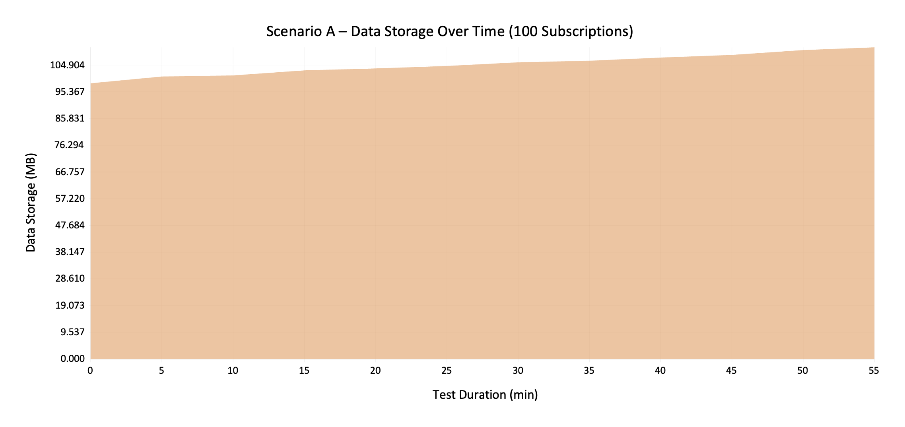
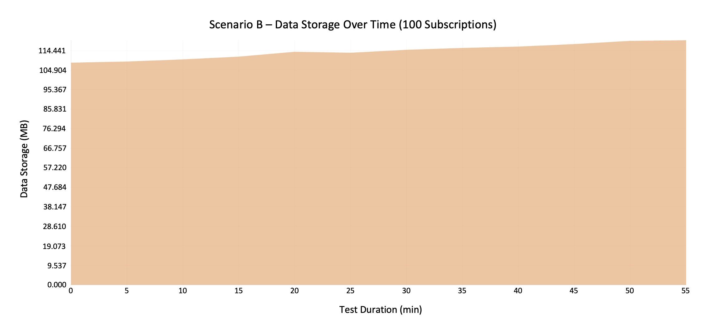
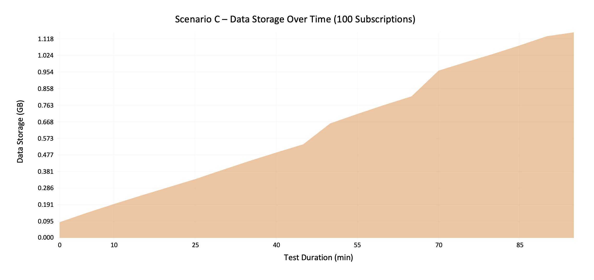
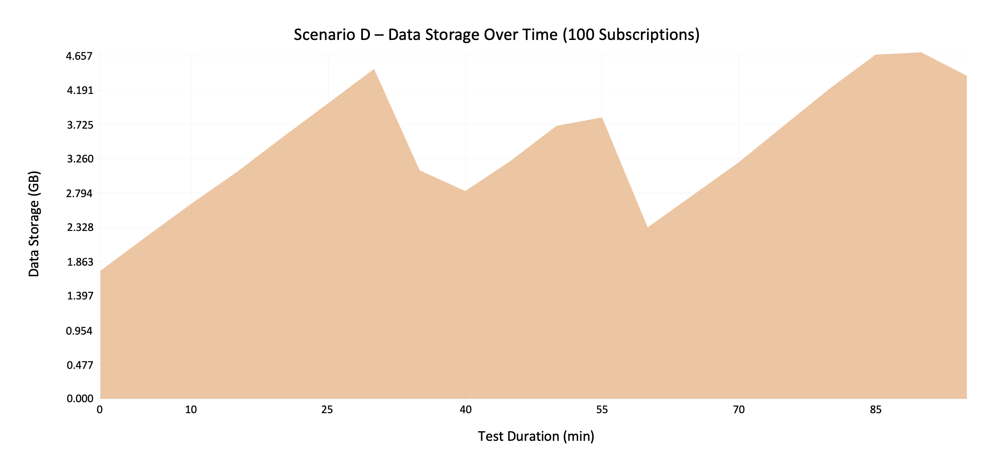
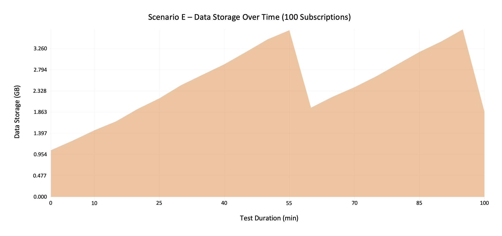

# Estimate the SAP Cloud Logging Service Consumption

This tutorial is based on the [SAP Cloud Logging service](https://help.sap.com/docs/cloud-logging/cloud-logging/what-is-sap-cloud-logging), which provides a centralized log management for applications running on SAP Business Technology Platform (BTP). SAP Cloud Logging provides the possibility to collect, store, and analyze logs efficiently. It supports search and visualization capabilities, and helps ensure compliance and observability in multi-tenant scenarios as described in the previous chapter [Observability](43-Multi-Tenancy-Features-Observability.md).

As a partner delivering applications to multiple tenants, you need to estimate the capacity units required for the SAP Cloud Logging service to maintain performance and cost efficiency. Capacity planning depends on factors such as service configuration, log volume (data ingestion and storage), and the use of telemetry tools like the [cap-js/telemetry](https://github.com/cap-js/telemetry) plugin.
This tutorial explains how to measure and estimate capacity unit consumption for SAP Cloud Logging based on explicitly defined scenarios. These scenarios reflect typical application behavior and logging patterns, providing a reliable foundation for planning and scaling your solution.

This tutorial is organized as follows:
- [Parameters of the SAP Cloud Logging Service](29-Cloud-Logging-Consumption.md#parameters-of-the-sap-cloud-logging-service)
- [Understanding the SAP Cloud Logging Service Requirements of Your Application](29-Cloud-Logging-Consumption.md#understanding-the-sap-cloud-logging-service-requirements-of-your-application)
- [Sample Measurement for the Poetry Slam Manager Application](29-Cloud-Logging-Consumption.md#sample-measurement-for-the-poetry-slam-manager-application)

## Disclaimer and Prerequisites

This tutorial describes how to scale the SAP Cloud Logging service based on measurements from the Partner Reference Application. If your application has more complex workloads, additional measurements to estimate capacity unit consumption accurately are required.

To ingest data (logs, metrics, traces) and record storage behavior, use a script that runs a well-defined scenario (sequence of requests) against your application. Details follow in the sections below.

To understand how to implement the SAP Cloud Logging service, including the telemetry plugin, see the [Observability](43-Multi-Tenancy-Features-Observability.md#add-telemetry-plugin-metrics-and-trace-exporters) chapter.

## Parameters of the SAP Cloud Logging Service

Captured logs, metrics, and traces can be influenced by configuring parameters such as **max_data_nodes**, **max_instances**, **retention_period**, and **ingest_otlp** in the SAP Cloud Logging service.

### Configuration of the SAP Cloud Logging Service
The mentioned SAP Cloud Logging service parameters can be configured in the [**Multi-Target Application Development Descriptor (mta.yaml)**](../../../tree/main-multi-tenant-features/mta.yaml) file of your project: 

```yaml
  # Cloud Logging Service
  - name: poetry-slams-cloud-logging
    type: org.cloudfoundry.managed-service
    parameters:
      service: cloud-logging
      service-plan: standard
      config:
        backend:
          max_data_nodes: 10
        ingest:
          max_instances: 10
        ingest_otlp:
          enabled: false
        retention_period: 7
```

> Note: If parameters are omitted in the [mta.yaml](../../../tree/main-multi-tenant-features/mta.yaml) file, defaults apply as mentioned in [Configuration Parameters](https://help.sap.com/docs/cloud-logging/cloud-logging/configuration-parameters) on SAP Help Portal and shown above.

#### Data Nodes

The **max_data_nodes** parameter defines the maximum disk size for storing observability data. Each data node has a storage of 100 GiB, as described in the [SAP Cloud Logging Capacity Unit Cost Estimator](https://sap-cloud-logging-estimator.cfapps.us10.hana.ondemand.com/). This is **not** equal to the net storage. The net storage accounts for:

- The **disk usage watermark** (75% of disk size)
- A **replication factor of 2** as described in [Service Plans](https://help.sap.com/docs/cloud-logging/cloud-logging/service-plans?version=Cloud) and [Configuration Parameters](https://help.sap.com/docs/cloud-logging/cloud-logging/configuration-parameters?version=Cloud) on SAP Help Portal.

##### Example (SAP Cloud Logging Service, Standard Plan)
With **2 data nodes** × **100 GiB** = **200 GiB** raw storage, the net storage is estimated at **~75 GiB**.
With default autoscaling (2 to 10 data nodes), the service can scale up to **1000 GiB raw storage** and **~375 GiB (approx. 403 GB) net storage**.

#### Ingest Instances
The **max_instances** parameter specifies the maximum number of ingest instances the system can provision. Ingest instances scale automatically based on overall CPU utilization. Scaling starts when CPU utilization reaches 80%. It regulates the peak throughput and data buffering as described in [Configuration Parameters](https://help.sap.com/docs/cloud-logging/cloud-logging/configuration-parameters?version=Cloud) on SAP Help Portal.

#### OpenTelemetry Protocol Ingestion
If the **ingest_otlp** parameter is set to true, data ingestion of **logs** and **metrics** into the SAP Cloud Logging service is enabled using the OpenTelemetry protocol as described in [Ingest via OpenTelemetry API Endpoint](https://help.sap.com/docs/cloud-logging/cloud-logging/ingest-via-opentelemetry-api-endpoint) on SAP Help Portal. This parameter is also required when using the [cap-js/telemetry](https://github.com/cap-js/telemetry) plugin. The plugin samples traces, providing observability into distributed application flows while keeping trace data manageable.

#### Retention (Time-based Curation)
The **retention_period** parameter sets how many days data is kept before deletion, also known as **time-based curation**. The default is seven days, with a range from one to 90 days.

> Note: There is also a curation called „size-based curation“ which can't be configured directly. This is automatically applied as soon as the file size gets too large and the maximum of defined data nodes is reached. Then, certain files are deleted automatically to free up space as described in [Configuration Parameters](https://help.sap.com/docs/cloud-logging/cloud-logging/configuration-parameters?version=Cloud) on SAP Help Portal.

### Configuration of Telemetry Plugin
To export traces to SAP Cloud Logging service, the telemetry plugin must be enabled. Detailed implementation steps are described in [Observability](43-Multi-Tenancy-Features-Observability.md#add-telemetry-plugin-metrics-and-trace-exporters).

By default, the plugin uses the **ParentBased(root=AlwaysOn)** sampler. This means every trace is sampled (100%). This ensures complete trace visibility but may not be necessary for all scenarios. To adjust the sampling behavior, you can overwrite the default sampler configuration provided by the plugin. This flexibility allows you to define a custom sampling strategy based on the applications requirements. To change the default sampler, update the root **package.json** as shown in the following example.

```json
{
    "cds": {
        "requires": {
            "telemetry": {
                "kind": "to-cloud-logging",
                "tracing": {
                    "sampler": {
                    "kind": "ParentBasedSampler",
                    "root": "TraceIdRatioBasedSampler",
                    "ratio": 0.5,
                    "ignoreIncomingPaths": [
                        "/health"
                    ]
                    }
                }
            }
        }
    }
}
```

> Note: This changes the sampler from **ParentBased(root=AlwaysOn)** to the **ParentBased(root=TraceIdRatioBased)**. The **ratio** parameter sets the sampling ratio to 50%. This means each trace has a 50% probability of being sampled as described in [TraceIdRatioBased - OpenSearch documentation](https://opentelemetry.io/docs/specs/otel/trace/sdk/#traceidratiobased).


### Behavior at Limits: Storage and Ingest

This chapter answers two common operational questions about system limits and how the SAP Cloud Logging service reacts.

#### What Happens if Storage (Data Nodes) Reaches the Maximum?

When the configured **maximum number of data nodes** is reached and storage pressure persists, **size‑based curation** is applied automatically. Data is organized in [**indices**](https://docs.opensearch.org/2.19/getting-started/intro/#index). As soon as the maximum capacity of a node is reached, the **oldest indices are deleted** to free space and keep the cluster healthy.

Conclusion:
- Removal of older indices implies **loss of historical data**.
- To avoid unexpected deletion of older data, consider:
  - Increasing `max_data_nodes` (if capacity budget permits)
  - Reducing `retention_period` (keep less history)
  - Lowering **trace sampling ratio** and/or **log verbosity**

#### What Happens if Ingest Instances are Saturated by the Data Throughput?

If the **ingest instances** are overloaded, they return **HTTP 429 (Too Many Requests)** in response to client requests.

## Understanding the SAP Cloud Logging Service Requirements of Your Application

**Goal:** Configure the SAP Cloud Logging service to **capture the most relevant logs, metrics, and traces while minimizing capacity unit consumption**.

1. Choose a test scenario that represents the primary usage of your application.
2. Estimate how often this scenario occurs in a defined timeframe and for a given number of tenants.
3. Create a similar load on a test system and measure resource consumption of the SAP Cloud Logging service.

This provides a realistic estimate of capacity unit usage for your production environment.

**Approach:**

1. Define Application Use Cases
2. Deploy the Application
3. Run Tests
4. Adjust Cloud Logging Service Parameters

### Define Application Use Cases
To define tests for your application, first identify its use cases. You can categorize these use cases into **main** and **border** use cases. To estimate the SAP Cloud Logging service resources and capacity units needed for daily usage, run the initial tests based on the main use cases you've identified.

In addition, estimate how many users will use the application based on the number of tenants and users per tenant.

### Deploy the Application
Start by deploying your application with the SAP CLoud Logging service and the CAP Telemetry plugin enabled as described in [Observability: logging, metrics, and tracing](43-Multi-Tenancy-Features-Observability.md). Before deploying, set the **retention_period** parameter to **90** days.

> Note: Setting the **retention_period** parameter to 90 days makes it easier to estimate storage usage within a 90-day time frame because you don't need to factor size-based curation into the calculation. Although size-based curation can further optimize storage usage by freeing up additional space, it's intentionally excluded to simplify the estimation.

### Run Tests
Run your test scenario. For the Partner Reference Application, the test was run with one user per tenant.

> Note: If many parallel users (for example, hundreds or thousands of concurrent requests across multiple tenants) need to be simulated, a load testing or performance testing tool is required that can generate concurrent traffic and measure system behavior under load.

During the test, the SAP Cloud Logging service captures the necessary data in various dashboards:
  - [UsageMetrics] Dashboard
    - Data Storage Usage
    - Ingest Instances
    - Data Nodes
      > Note: The difference in data storage usage between the start and the end of the test time frame represents the additional storage consumed as a result of the test activity, measured in gigabytes. Because data storage usage is logged only every five minutes, a larger observation window is required to reliably measure storage growth over time. The same applies to the ingest and data node instance diagrams.
  - OTel Spans and Logs
    - Server Spans
        > Note: This shows the number of spans recorded during the test. It's relevant when the CAP Telemetry plugin and different sampling ratios are used.
  - [OTel] Metrics Explorer
    - Average Metrics Value by Service Name over Time
    - Average Metrics Value by Metric Name over Time
      > Note: For these diagrams, you can apply a filter to focus on the most relevant captured data, such as **container.cpu.usage**, **container.filesystem.usage**, or **container.memory.usage**. These metrics show how the file system (disk used), CPU usage (time used per single CPU core), and memory usage (memory used) change over time while the test runs.

In addition to the measurements required for the estimation, further insights can be gained. For example, it can be determined whether all requests sent to the application during the test activity were successful. If any requests failed, the dashboards provide details on which request failed, the affected application module, and the logger that recorded the failure. This information is available in the following dashboards:
  - CF Overview
  - CF Requests and Logs
  - CF Four Golden Signals
  
### Adjust Cloud Logging Service Parameters
Based on the results, first estimations on the optimal SAP Cloud Logging service configuration for a given scenario can be made. Have a look at the example for the Partner Reference Application in the next [section](29-Cloud-Logging-Consumption.md#sample-measurement-for-the-poetry-slam-manager-application).

Adjust the parameters of the [SAP Cloud Logging service](https://help.sap.com/docs/cloud-logging/cloud-logging/what-is-sap-cloud-logging) and CAP Telemetry plugin accordingly:
- **Maximum data nodes (max_data_nodes)** required for storage.
- **Maximum ingest instances (max_instances)** required for peak throughput and buffering.
- **Trace sampling ratio** in CAP Telemetry to avoid always‑on (100%) sampling and reduce storage.

These adjustments help prevent unexpected autoscaling and control capacity units. Repeat the load tests and refine as needed.

## Sample Measurement for the Poetry Slam Manager Application

This chapter explains how resources are measured for the Poetry Slam Manager application. It is split into the follwoing sections:

1. [Test Setup](29-Cloud-Logging-Consumption.md#test-setup)
2. [Test Scenario](29-Cloud-Logging-Consumption.md#test-scenario)
3. [Comparison of the Different Test Scenarios](29-Cloud-Logging-Consumption.md#comparison-of-the-different-test-scenarios)
4. [Conclusion](29-Cloud-Logging-Consumption.md#conclusion)

### Test Setup

The tests are performed in a setup with one provider and with 1, 20, and 100 subscriber subaccounts with the following configurations.

#### Cloud Logging Service

The SAP Cloud Logging service parameters are configured in the [**Multi-Target Application Development Descriptor (mta.yaml)**](../../../tree/main-multi-tenant-features/mta.yaml) file as follows: 

```yaml
  # Cloud Logging Service
  - name: poetry-slams-cloud-logging
    type: org.cloudfoundry.managed-service
    parameters:
      service: cloud-logging
      service-plan: standard
      config:
        ingest_otlp:
          enabled: true
        retention_period: 90
```

> Note: Because **max_data_nodes** and **max_instances** are not set, default autoscaling applies (2 to 10) for both data nodes and ingest instances as described in [Configuration Parameters](https://help.sap.com/docs/cloud-logging/cloud-logging/configuration-parameters) on SAP Help Portal.

#### Telemetry Plugin

For the telemetry plugin, the [default sampler configuration](https://github.com/cap-js/telemetry?tab=readme-ov-file#sampler) is used. The default sampler used by the plugin is the same default sampler used by OpenSearch [**ParentBased(root=AlwaysOn)**](https://opentelemetry.io/docs/specs/otel/trace/sdk/#built-in-samplers). As a result, 100% of telemetry traces are sampled.

### Test Scenario

The main use cases of the Partner Reference Application are read, create, and update operations of entities. Therefore, the test scenario includes:

- Reading all poetry slams from the list page (READ)
- Creating 200 visitors (CREATE):
  - Create visitors (DRAFT)
  - Activate visitors
- Creating two poetry slams:
  - Create poetry slams (DRAFT)
  - Activate poetry slams
  - Publish poetry slams
  - Draft edit poetry slams (DRAFT)
- Add 200 visitors as visit to each poetry slam (CREATE and CREATE by Association):
  - Activate poetry slams

> Note: The [draft concept of CAP and SAP Fiori elements](https://cap.cloud.sap/docs/guides/uis/fiori#draft-support) is used.

Requests are run using the [service broker](42a-Multi-Tenancy-Service-Broker.md), simulating one virtual user.

To translate this to tenants and business users, assume each tenant creates **2 poetry slams per week**. Each poetry slam has **200 visits**, resulting in **400 entities and 400 associations**, and **200 visitors** per week. Over 12 weeks, this results in:


| **Tenants**       | **1**                                | **20**                                | **100**                               |
|-------------------|--------------------------------------|---------------------------------------|---------------------------------------|
| **Weeks**         | 1 Week / 12 Weeks (84 Days)          | 1 Week / 12 Weeks (84 Days)           | 1 Week / 12 Weeks (84 Days)           |
| **Poetry Slams**  | 2 / 24                               | 40 / 480                              | 198 / 2376                            |
| **Visits**        | 400 / 4800                           | 8000 / 96000                          | 39600 / 475200                        |
| **Visitors**      | 200 / 2400                           | 4000 / 48000                          | 19800 / 237600                        |

> Note: The test uses a 12-week (84-day) time frame because the retention period can be set to a maximum of 90 days. After this period, time-based curation affects the data storage, which is outside the scope of this test.

### Comparison of the Different Test Scenarios

In the following sections, different test scenarios and their results are compared.
While scenario **A** and scenario **B**

> Note: The SAP Cloud Logging service dashboards provide resource consumption information in 5-minute intervals only. This affects the time scale of the provided diagrams below. 

#### Scenario A — Idle Application (No Traffic, Telemetry Disabled)

- Test duration: 60 minutes
- Traffic: No
- Telemetry: Disabled

For the first scenario, the data storage usage remains essentially **flat**, independent of the number of subscriptions. The image below shows the data.

<p align="center">
  
</p>

#### Scenario B — Idle Application (No Traffic, Telemetry Enabled)

- Test duration: 60 minutes
- Traffic: No
- Telemetry: Enabled (trace sampling ratio 1.0 / 100%)

Even with 100% sampling, the data storage usage shows **no considerable increase** as long as the application remains idle. The image below shows the data.

<p align="center">
  
</p>

#### Scenario C — Active Application with Traffic (Telemetry Disabled)

The application actively handles requests and generates logs and metrics, but telemetry is turned off, so no traces are sampled.

- Test duration: Long enough to complete one full cycle of the defined scenario
- Traffic: Yes (see [test scenario](29-Cloud-Logging-Consumption.md#test-scenario))
- Telemetry: Disabled

Compared to scenarios A and B, the data storage usage increases significantly (**+1.06 GB**), and scales with the number of subscriptions. Observed values are **~14.1 logs/s, ~14.1 requests/s, 80281 total requests**. During a test cycle, the SAP Cloud Logging resources constantly stays at **2 ingest instances and data nodes**. The image below shows the data.

<p align="center">
  
</p>

#### Scenario D — Active Application with Traffic (Telemetry Enabled)
The application actively handles requests and generates logs and metrics. Telemetry is enabled to sample traces.

- Test duration: Long enough to complete one full cycle of the defined scenario
- Traffic: Yes (see [test scenario](29-Cloud-Logging-Consumption.md#test-scenario))
- Telemetry: Enabled (trace sampling ratio 1.0 / 100%)

With telemetry enabled, the data storage growth is **more significant**. Compared to scenario C, the **data storage increased by approximately 2.47 GB** for 100 subscriptions, with **41,507 OTel spans sampled**. Throughput remains within **2 ingest instances and data nodes** (**~14.1 requests/s, 14.4 logs/s**). The image below shows the data.

<p align="center">
  
</p>

#### Compression Effects (zstd)

The chart shows periodic **drops** during the test window, caused by [**zstd**](https://docs.opensearch.org/2.19/im-plugin/index-codecs/) compression. To check the codec of your [indices](https://docs.opensearch.org/2.19/getting-started/intro/#index), run the following command in the [OpenSearch Dev Tool](https://docs.opensearch.org/2.19/dashboards/dev-tools/run-queries/):

```sh
GET /_all/_settings
```

For index patterns like **logs-cfsyslog-*** (logs), **otel-v1-apm-span-*** (traces), and **metrics-otel-v1-*** (metrics), look for:

- **settings.index.codec** (Value in the given tests: **zstd**)
- **settings.index.codec.compression_level** (Value in the given tests: **6** out of 6)

A higher codec compression level improves the compression ratio (smaller storage) but slows down compression and decompression. This can increase indexing and search latency. In practice, **zstd can reduce storage by ~35%**, with a corresponding performance trade‑off. For more information, see [Benchmarking - OpenSearch](https://docs.opensearch.org/2.19/im-plugin/index-codecs/#benchmarking).

#### Scenario E — Active Application Handling Traffic with Telemetry Enabled and 50% Trace Sampling
The application actively processes requests and generates logs and metrics. Telemetry is enabled to sample traces, and trace sampling is configured with a 50% sampling possibility for each trace.

- Test duration: Long enough to complete one full cycle of the defined scenario
- Traffic: Yes
- Telemetry: Enabled (**trace sampling ratio 0.5 / 50%**)

Compared to scenario D (100% sampling, 41,507 spans and ~2.47 GB storage increase), scenario E (50% sampling, 23,527 spans and ~851 MB storage increase) shows a ~43% reduction in spans and a ~65% reduction in storage. This aligns with the expected effect of lowering the sampling ratio from 100% to 50%, acknowledging minor deviations due to workload variability and compression behavior (for example, zstd compaction). Throughput decreases slightly (**~13.7 requests/s, 13.8 logs/s**) compared to scenario D, which is consistent with test-run variance and does not stem from sampling itself (sampling primarily affects trace volume, not request or log emission).

With the reduced trace ratio, the 2 ingest instances and data nodes remains sufficient throughout the run. The lower storage pressure helps delay scaling needs for data nodes. The image below shows the data.

<p align="center">
  
</p>

### Summary

General observations:
- **Scenario A and B**: Storage growth is negligible per week and stays low even over 12 weeks, regardless of whether telemetry is on or off when there is no traffic.
- **Scenario C to E**: Once traffic is present, storage increases. Adding telemetry increases it further, and the effect scales with tenant count.
- **Scenario D vs. E**: Reducing the trace sampling ratio to 50% consistently lowers trace volume and storage deltas while keeping request and log throughput nearly unchanged.

#### Capacity Units (CUs) — Measurement Scope

Capacity units (CUs) in SAP Cloud Logging are **measured per hour**. For more information, see [SAP Cloud Logging Capacity Unit Estimator](https://sap-cloud-logging-estimator.cfapps.us10.hana.ondemand.com/). CUs are a consumption-based metric used to price and allocate resources. All CU values in the summary tables below were collected over **one‑hour** observation windows. The estimation is that each [test scenario](29-Cloud-Logging-Consumption.md#test-scenario) **does not exceed 60 minutes**. The reported CUs reflect the service consumption for **that hour and per week, as defined in the [test scenario](29-Cloud-Logging-Consumption.md#test-scenario)**.

#### Measurements with 1 Subscription

| **Scenario**                                | **Requests/Sec** | **Logs/Sec** | **OTel Spans (Count)** | **Storage Delta (per Week)** | **Storage Delta (12 Weeks)** | **Ingest Instances** | **Data Nodes** |
|---------------------------------------------|-----------------:|-------------:|-----------------------:|-----------------------------:|-----------------------------:|---------------------:|---------------:|
| **A — Idle, Telemetry Off**                 | ~0.0             | ~0.0         | N/A                    | >0.01 GB                     | ~0.13 GB                     | 2                    | 2              |
| **B — Idle, Telemetry On (100%)**           | ~0.0             | ~0.0         | ~0                     | ~0.01 GB                     | ~0.14 GB                     | 2                    | 2              |
| **C — Active Traffic, Telemetry Off**       | 1.4              | 1.4          | N/A                    | >0.01 GB                     | ~0.04 GB                     | 2                    | 2              |
| **D — Active Traffic, Telemetry On (100%)** | 2.7              | 2.8          | 438                    | ~0.06 GB                     | ~0.66 GB                     | 2                    | 2              |
| **E — Active Traffic, Telemetry On (50%)**  | 2.7              | 2.7          | 266                    | ~0.05 GB                     | ~0.60 GB                     | 2                    | 2              |


> Note: C to D adds a modest telemetry overhead (~0.06 GB/week to ~0.66 GB/12 weeks).
Halving the sampling in scenario E trims that overhead slightly (~0.05 GB/week to ~0.60 GB/12 weeks). This reflects that at a small scale, traces contribute to storage but don’t dominate it.


#### Measurements with 20 Subscriptions

| **Scenario**                                | **Requests/Sec** | **Logs/Sec** | **OTel Spans (Count)** | **Storage Delta (per Week)** | **Storage Delta (12 Weeks)** | **Ingest Instances** | **Data Nodes** |
|---------------------------------------------|-----------------:|-------------:|-----------------------:|-----------------------------:|-----------------------------:|---------------------:|---------------:|
| **A — Idle, Telemetry Off**                 | ~0.0             | ~0.0         | N/A                    | ~0.01 GB                     | ~0.16 GB                     | 2                    | 2              |
| **B — Idle, Telemetry On (100%)**           | ~0.0             | ~0.0         | ~0                     | ~0.01 GB                     | ~0.16 GB                     | 2                    | 2              |
| **C — Active Traffic, Telemetry Off**       | 7.4              | 7.4          | N/A                    | ~0.07 GB                     | ~0.81 GB                     | 2                    | 2              |
| **D — Active Traffic, Telemetry On (100%)** | 10.8             | 11           | 9.022                  | ~1.31 GB                     | ~15.72 GB                    | 2                    | 2              |
| **E — Active Traffic, Telemetry On (50%)**  | 11.5             | 11.6         | 5.079                  | ~0.91 GB                     | ~10.94 GB                    | 2                    | 2              |

> Note: Telemetry with a 100% sampling ratio in scenario D raises storage substantially (~1.31 GB/week and ~15.72 GB/12 weeks). With 50% sampling in scenario E, storage drops significantly to ~0.91 GB/week and ~10.94 GB/12 weeks with about 30% reduction compared to scenario D.


#### Measurements with 100 Subscriptions

| **Scenario**                                | **Requests/Sec** | **Logs/Sec** | **OTel Spans (Count)** | **Storage Delta (per Week)** | **Storage Delta (12 Weeks)** | **Ingest Instances** | **Data Nodes** |
|---------------------------------------------|-----------------:|-------------:|-----------------------:|-----------------------------:|-----------------------------:|---------------------:|---------------:|
| **A — Idle, Telemetry Off**                 | ~0.0             | ~0.0         | N/A                    | ~0.01 GB                     | ~0.16 GB                     | 2                    | 2              |
| **B — Idle, Telemetry On (100%)**           | ~0.0             | ~0.0         | ~0                     | ~0.01 GB                     | ~0.13 GB                     | 2                    | 2              |
| **C — Active Traffic, Telemetry Off**       | 14.1             | 14.1         | N/A                    | ~1.06 GB                     | ~12.72 GB                    | 2                    | 2              |
| **D — Active Traffic, Telemetry On (100%)** | 14.1             | 14.4         | 41.507                 | ~2.47 GB                     | ~29.63 GB                    | 2                    | 2              |
| **E — Active Traffic, Telemetry On (50%)**  | 13.7             | 13.8         | 23.527                 | ~0.851 GB                    | ~10.21 GB                    | 2                    | 2              |

> Note: The impact of telemetry becomes significant: scenario D reaches ~2.47 GB/week and ~29.63 GB/12 weeks. Reducing sampling to 50% (scenario E) cuts storage to ~0.851 GB/week and ~10.21 GB/12 weeks: This represents a reduction og around 65%, which shows that sampling benefits increase with scale.

### Conclusion

The measurements provide the following information:

1. When the application is idle, storage growth is close to zero. Enabling telemetry without traffic doesn't change this.
2. As soon as traffic is present, storage consumption rises and scales with tenants. Telemetry at 100% sampling adds a significant trace footprint, especially at higher tenant counts.
3. Lowering the trace sampling ratio to 50% consistently reduces storage pressure while leaving request and log rates largely unchanged. The savings are modest at small scale and substantial at larger scale: up to ~65% reduction for 100 tenants in our test runs.

**Result**

Across all presented scenarios and tenant counts, **2 ingest instances** and **2 data nodes** are sufficient, and autoscaling wasn't activated within the observed time frames.

Based on these results, you can use the [SAP Cloud Logging Capacity Unit Estimator](https://sap-cloud-logging-estimator.cfapps.us10.hana.ondemand.com/) to calculate an estimate of the required **CUs** for the given scenario.
Select the required service plan (for example, **Standard**). The corresponding **Capacity Unit Rate per Hour** is shown for each individual component.

To calculate an estimate of the required **CUs** of the SAP Cloud Logging service for the sample measurements of the Poetry Slam Manager application, you can use the following values: 

| **Component**            | **Configuration Value** | **Activity Hours**                    |
|--------------------------|------------------------:|--------------------------------------:|
| **Standard Foundation**  | 1                       | 168 h (1 week) / 2016 h (12 weeks)    |
| **Standard Storage**     | 2                       | 168 h (1 week) / 2016 h (12 weeks)    |
| **Standard Ingest**      | 2                       | 168 h (1 week) / 2016 h (12 weeks)    |
| **Standard Ingest OTel** | enabled                 | 168 h (1 week) / 2016 h (12 weeks)    |
