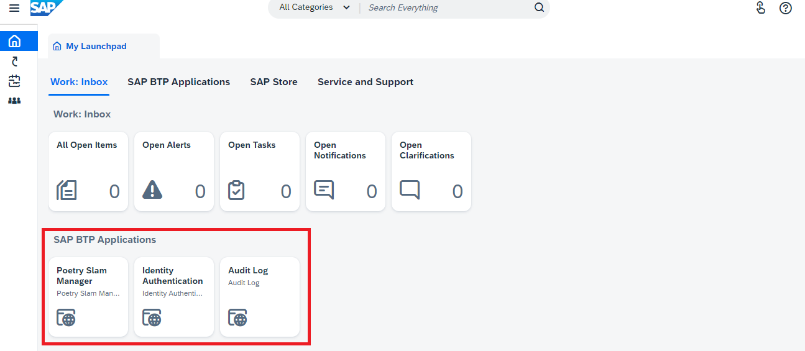
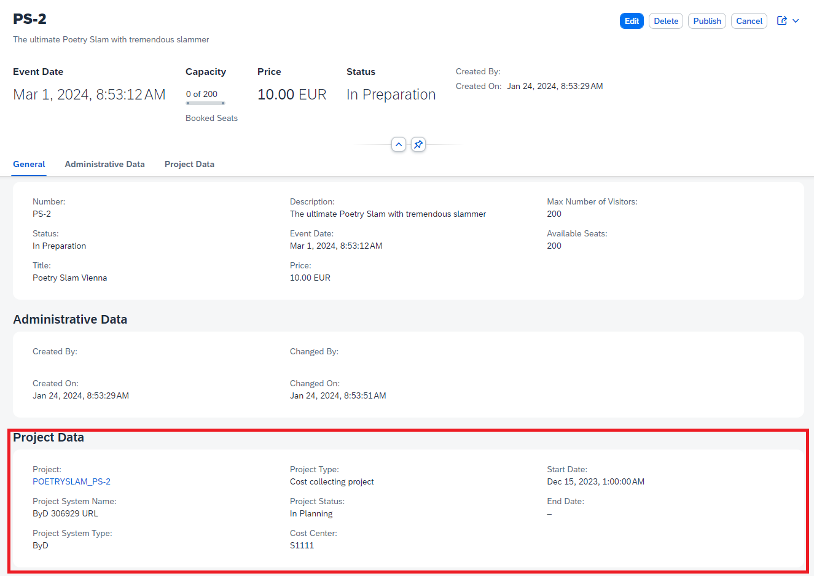

# A Guided Tour to Explore the ERP Integration

Put yourself in the shoes of a poetry slam manager: Imagine it's your job to organize and run poetry slams.

You create the poetry slams in the Poetry Slam Manager application as described in the [Guided Tour](./17-Guided-Tour.md). 

But imagine you want to do additional planning in a project in your core ERP system. 

In the last sections, you learned how to connect different ERP systems, such as SAP Business One, SAP S/4HANA Cloud Public Edition or SAP Business ByDesign, and what the integration between the ERP system and the Poetry Slam Manager solution looks like from a UI perspective. 

> Note: This section is based on SAP Business ByDesign, but regardless of the actual ERP system, the integration process includes the same steps.

Now, imagine you're a project manager and your company runs its business on SAP Business ByDesign. Your home base is the *Project Management* work center. You use SAP Business ByDesign projects to plan and staff events, to collect costs, and to purchase required equipments. Furthermore, you use Poetry Slam Manager, a partner application, to publish poetry slams and to manage bookings of visitors and artists.

Let us take you on a guided tour through the integrated sample solution after the ERP integration with SAP Business ByDesign: 

1. Open SAP Business ByDesign using the single sign-on URL (for example, ``https://my123456-sso.sapbydesign.com``).
        
    > Note: SAP Business ByDesign delegates the user authentication to the Identity Authentication service, which acts as a corporate identity provider in this example.

2. On the launchpad, you find the partner applications Poetry Slams and Visitors. To launch the Poetry Slams app in a new browser window, choose the Poetry Slams tile.
    
    

    > Note: The partner application is embedded in the SAP Business ByDesign launchpad using the SAP Business ByDesign URL mash-up capabilities. Additionally, you can launch other SAP BTP applications relevant to key users and administrators such as the *Identity Authentication Service* to manage user authentications and authorizations.
    Launching these applications doesn't require any additional login because they are linked to your corporate IdP as you benefit from single sign-on.

3. In the Poetry Slams application, an empty list is displayed.

4. To create sample data for mutable data, such as poetry slams, visitors, and visits, choose *Generate Sample Data*. As a result, multiple poetry slams are listed: Some are still in preparation and have not been released yet while others are already published. 
    > Note: If you choose *Generate Sample Data* again, the sample data is set to the default values.

5. To view the details of a poetry slam, choose one that is neither canceled nor in draft mode. 

6. Choose *Create Project in SAP Business ByDesign*. As a result, the system creates a project in SAP Business ByDesign based on a project template.

    > Note: The application creates the project in SAP Business ByDesign using an SAP Business ByDesign OData service for projects with user propagation. This means that your SAP Business ByDesign user authorizations apply in the partner application as well; you can only create a project if your user has write-authorizations for SAP Business ByDesign projects. 

7. After creating the project, you can see the project details in the *Project Data* section. The project ID is displayed as a link. To go to the project overview, click the project ID.

    

    > Note: The application mixes in live project data from SAP Business ByDesign (no data replication with delays). It receives SAP Business ByDesign project data using the SAP Business ByDesign OData service for projects and user propagation again, and, hence, the data is only visible if you have the authorizations to read projects in SAP Business ByDesign.
    The link to launch the SAP Business ByDesign project overview is assembled dynamically and uses the SAP Business ByDesign hostname of your SAP BTP subaccount configuration as well as the project ID.
    When you go back to SAP Business ByDesign, no additional login is required because of single sign-on.

This concludes the guided tour... We hope you enjoyed the ride. 
