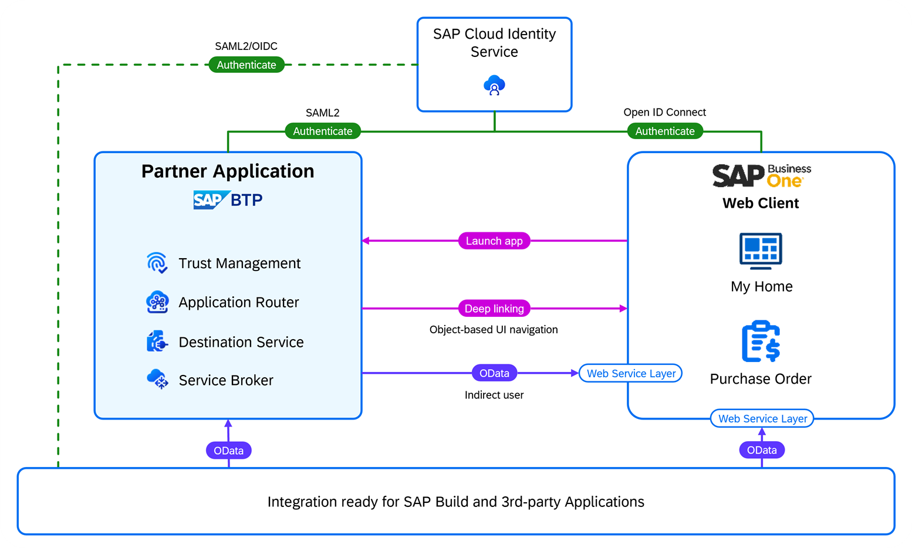

# Configure the Integration with SAP Business One

In this section, you integrate Poetry Slam Manager, your SAP Business Technology Platform (SAP BTP) solution, with the SAP Business One system of your customer. The Identity Authentication services tenant will act as a corporate identity provider (IdP).

1. Front-end integration:
    1. Launch Poetry Slams and Visitors applications from the SAP Business One launchpad.
    2. Navigate from Poetry Slams to the related SAP Business One purchase order (*Purchase Order* instance).
    3. Use the same Identity Authentication service tenant as a corporate identity provider (IdP) and configure single sign-on for: 
        - Poetry Slams,
        - Visitors, 
        - SAP Business One, Web client, 
        - SAP Business One Control Center, 
        - and SAP Business One Extension Manager.
2. Back-channel integration: Create SAP Business One purchase orders in Poetry Slam Manager using OData APIs with basic authentication or principal propagation.

  

## Set Up SAP BTP Consumer Subaccount

To start the provisioning procedure, create an SAP BTP consumer subaccount for a specific customer:

1. Open the SAP BTP cockpit (the same global account that hosts the provider subaccount of the SAP BTP application).
2. Create a new *Multi-Environment* subaccount with a name that refers to the tenant number or the customer. 
3. As a provider, choose *Amazon Web Services (AWS)*. In the Poetry Slam Manager example, the subaccount is called *Consumer 1: OEC Computers*. 

### Subscribe To the SAP BTP Multi-Tenant Application

1. In the SAP BTP cockpit (consumer subaccount), navigate to *Instances and Subscriptions*. 
2. Create a subscription to *Poetry Slam Manager* with the *default* service plan (this is the multi-tenant SAP BTP application you just created).

## Set Up Single Sign-On for the SAP BTP Application Subscription

In this tutorial, the Identity Authentication service (IAS) tenant that is used by the SAP Business One system for authentication is reused.  

### Configure Single Sign-On for the SAP BTP Application

Therefore, configure a trust relationship between the SAP BTP consumer subaccount and the Identity Authentication service tenant of SAP Business One as described in [Configure Trust Using SAML 2.0](./25-Multi-Tenancy-Provisioning.md#configure-trust-using-saml-20).

### Launch the SAP BTP Multi-Tenant Application

1. In the *Instances and Subscriptions* of the consumer account, select the *Poetry Slam Manager* application.
2. To launch the *Poetry Slams Manager* application, choose *Go to Application*. Copy the link address of the Poetry Slams application and note it down as **SAP BTP Application Poetry Slams Tenant URL** for later reference.
3. From there, open a fully booked poetry slam and click in the header of the Object Page to *Maintain Visitors*. Copy the link address of the Visitors application and note it down as **SAP BTP Application Visitors Tenant URL** for later reference.

## Configure Single Sign-On Identity and Authentication Management for SAP Business One

In this tutorial, the Identity Authentication service as a corporate identity provider is used to establish a trust relationship between the service provider (the SAP Business One system) and the Identity Authentication service tenant. As a result, SAP Business One delegates user authentications to the Identity Authentication service tenant including single sign-on. 

Below you find more information about how to set up the trust relationship between SAP Business One and Identity Authentication service using SAML 2.0. The e-mail address is used to identify the user.
Therefore, you need to ensure that the same e-mail addresses are entered for users in SAP Business One *System Landscape Directory* and in the Identity Authentication service tenant.

1. Open the SAP Business One *System Landscape Directory* using the URL _https://\<sap-business-one-server:port\>/ControlCenter_.
    > Note: User should be of type *B1SiteUser* with administration access.
2. Open the *Identity Providers* tab. 
3. Choose *Add* to create a new entry in the identity provider list.
	1. Enter the following details in the *Add Identity Provider* window: 
        - *Protocol* = `OIDC` 
        - *IDP Alias* = `b1-psmias` 
        - *IDP Display Name* = `Poetry Slam Manager IAS`
        - The field value of *OIDC Discovery URL* is constructed using the pattern _https://\<sap-business-one-server\>/.well-known/openid-configuration_ 
        - *Claim Name* = `mail`
        - As the *Email Domain*, enter `<domain-name-of-the-email-ids>` (for example, *sap.com*). Make sure that you enter the domain name of the user e-mail ID specific to your use case.
        > Note: *Client ID and Client Secret* are obtained from the application created in the *Identity Authentication service* (see _4. Create a new application in the *Identity Authentication service* admin UI_).

        > Note: Copy the **Redirect URI** field value, which will be used in the creation of a new Identity Authentication service application in the next steps.
   4. Keep the *Add Identity Provider* window open until *Client ID* and *Client Secret* are received in a later step.
4. Create a new application in the *Identity Authentication service* admin UI.
    1. Open *Applications and Resources > Applications*.
    2. Choose *Create* to create a new application.
    3. Enter the following details in the *Create Application* window: 
        - *Display Name* = `B1 Poetry Slam Manager`
        - *Home URL* = `https://<sap-business-one-server>/`
        - *Protocol Type* = `OpenID Connect`
    4. Choose *Create*.
    5. In the *Single Sign-On* properties of the newly created application, select *OpenID Connect Configuration*. 
    6. As *Name*, enter `B1 Poetry Slam Manager`.
    7. In the  *Redirect URIs* section, choose *Add* and enter the **Redirect URI**, which you copied in a previous step.
    8. In the *Post Logout Redirect URIs* section, choose *Add* and enter `\<Redirect URI\>/logout_response`.
    9. Choose *Save*. 
    10. In the *Application APIs* properties of the newly created application, select *Client Authentication*.
    11. In the *Secrets* section, choose *Add*.
    12. In the *Add Secret* window, enter a `Description` and use the default values for the rest of the fields.
    13. Choose *Save*, which will prompt the *Client ID* and *Client Secret* of the application.
        > Note: Make sure that you save *Client ID* and *Client Secret* for later usage since they cannot be retrieved from the system anymore.
    14. Copy the *Client ID* and the *Client Secret*.
    15. Go back to the SAP Business One *System Landscape Directory* *Add Identity Provider* window and enter the *Client ID* and the *Client Secret* to complete the creation of the identity provider in the SAP Business One system.
5. Add users in the SAP Business One *System Landscape Directory*.
    1. Navigate to the *Users* section. 
    2. To add landscape admin users, follow these steps:
        1. Choose *Add*. 
        2. Select the *Identity Provider* created above.
        3. Enter a B1-site-user e-mail in the *User Name* field.
        4. Select the user as *Landscape Administrator*.
        5. Choose *OK*.
        > Note: B1-site-user must be created in the *User Management* of *Identity Authentication service*.
    3. To add business users, follow these steps:
        1. Choose *Add*. 
        2. Select the *Identity Provider* created above.
        3. Enter a business user e-mail in the *User Name* field, which is already available in the SAP Business One system.
        4. Choose *OK*.
        > Note: SAP Business One business user must be created in the *User Management* of *Identity Authentication service*.
6. Bind the users of the identity provider to the users of SAP Business One in the SAP Business One *System Landscape Directory*: 
    1. Navigate to the *Users* section.
    2. Select the business user added in the previous step and choose *Bind*.
    3. Select a *Company* from the drop-down list.
    4. For the *User Code*, you have two options:
	   - Option 1: Select a preexisting user code in the SAP Business One system.
	   - Option 2: Create a new user code in the SAP Business One system and select the newly created user code from the drop-down list. 
    5. Skip all fields that are not mandatory, and choose *OK*.

7. Activate the identity provider in the SAP Business One *System Landscape Directory*:
    1. Navigate to *Identity Providers* and select the newly created identity provider.
    2. Choose *Activate*.
    3. In the confirmation window, choose *Yes*.
        > Note: The status of the identity provider is changed to *Active*.

8. To test the SAP Business One user authentication with single sign-on, open the SAP Business One, Web client URL in an incognito browser window and check if SAP Business One redirects to the Identity Authentication service log-on screen for user authentication. 
9. Use your e-mail and the Identity Authentication service password. If the login to SAP Business One is processed successfully, you will be logged in with the SAP Business One user that has the same e-mail address configured as you entered.
    > Note: Test the control center with single sign-on by opening the SAP Business One *System Landscape Directory* using the URL _https://\<sap-business-one-server:port\>/ControlCenter_.

> Note: For more details, refer to [Identity and Authentication Management in SAP Business One](https://help.sap.com/docs/SAP_BUSINESS_ONE_IAM/548d6202b2b6491b824a488cfc447343/7f94c5836fad44e6a02322d39e229cc3.html?locale=en-US).

## (Optional) Register the Identity Provider of the SAP BTP Application in the SAP Business One SSO Extension Manager

> Note: This section is only relevant in case the connection is configured using principle propagation.
To establish a trust relationship between SAP Business One and the Poetry Slam Manager application, the identity provider used for the Poetry Slam Manager application needs to be registered in the SAP Business One Extension SSO Manager.

First, register the identity provider of the Poetry Slam Manager application:
1. Access the Extension SSO Manager: *https://<sap-business-one-server:port>/ExtensionSSOManager/*.
2. Navigate to **Principal Propagation > Identity Providers**.
3. Register a new identity provider at the **Registered Identity Providers** table:
    - Protocol: OpenID Connect (OIDC)
    - Name: *<name>* (for example: *Your Subaccount Subdomain*)
    - Discovery Endpoint: *https://<SAP_BTP_consumer_subaccount_subdomain>.authentication.\<region>.hana.ondemand.com/.well-known/openid-configuration*
    - Identity Claim Name: *email*

Second, bind the identity provider to a SAP Business One tenant:
1. Navigate to **Principal Propagation > Tenants**.
2. In the *Tenant Binding List* table, choose **Bind**.
3. In the *Tenant Binding* dialog, select the previously registered identity provider and the target tenant of SAP Business One.

> Note: To enforce authorization checks for external access, set the following authorization in the user authorization settings of the SAP Business One application. For all users accessing SAP Business One data using DI API or the service layer, ensure **Disable DI API Permission Check** is set to **No Authorization**.

## Get SAP Business One OData Services Metadata
In general, SAP Business One exposes OData services through the SAP Business One service layer. The Poetry Slam Manager side-by-side SAP BTP application uses SAP Business One
*Purchase Order* data. It reads and writes purchase orders using OData services exposed through the SAP Business One service layer. It must be reachable with a public URL, such as *https://{{B1-hostname}}:{{Port}}*.

To check the availability of the exposed SAP Business One service layer, you can get the OData metadata by calling the $metadata URL of the OData service in a browser window: *https://<sap-business-one-service-layer:port>/b1s/v2/$metadata*.

To prevent exposing system ports to the public while connecting to SAP Business One, a Cloud Connector can be used instead.  
For further details about the installation and usage of a Cloud Connector, please refer to the guide [Business One integration with Cloud Connector](./33c-B1-Integration-With-Cloud-Connector.md).  

In case you don't need a Cloud Connector for your integration scenario, you can continue with the other sections below.

## Set Up Destinations to Connect the SAP BTP Application to SAP Business One

[HTTP Destinations](https://help.sap.com/docs/connectivity/sap-btp-connectivity-cf/http-destinations) can be configured in the subaccounts of SAP Business Technology Platform. They can be used to connect your application to the internet, as well as to an on-premise system. To set up a destination, follow these steps:
1. Open your SAP BTP consumer subaccount.
2. Go to *Connectivity* and choose *Destinations*.
3. Create the following destinations:

    - **b1-url**: Link to the SAP Business One UI.

        | Parameter Name    | Value                                                                                     |
        | :---------------- | :--------------------------------------------------------------------------------------   |
        | *Name*:           | *b1-url*                                                                                  |
        | *Type*:           | *HTTP*                                                                                    |
        | *Description*:    | Enter a destination description, for example, ``SAP Business One 123456 URL``.            |
        | *URL*:            | *https://{{B1-hostname}}* for example, ``https://my123456sapOne.com``.                     |
        | *Proxy Type*:     | *Internet*                                                                                |
        | *Authentication*: | *NoAuthentication*                                                                        |

    - **b1**: Connect to the SAP Business One API using the service layer.

        > Note: For more details, refer to [Setting Up SAP BTP Destination for Service Layer](https://help.sap.com/docs/SAP_BUSINESS_ONE_WEB_CLIENT/e6ac71d18c7543828bd4463f77d67ff7/bfeaccb8b53348318970f8bbbc3d5f0a.html?locale=en-US&q=Business%20One%20extension).

        - Option 1 (Basic Authentication):
            | Parameter Name           | Value                                                                                                  |
            | :------------------------ | :-------------------------------------------------------------------------------------                |
            | *Name*:                   | *b1*                                                                                                  |
            | *Type*:                   | *HTTP*                                                                                                |
            | *Description*:            | Enter a destination description, for example, ``SAP Business One 123456``.                             |
            | *URL*:                    | *https://{{B1-hostname}}:{{Port}}*, for example, ``https://my123456.sapOne.com:55000``.                |
            | *Proxy Type*:             | *Internet*                                                                                            |
            | *Authentication*:         | *BasicAuthentication*                                                                                 |
            | *User*:                   | Enter the username.                                                                                   |
            | *Password*:               | Enter the password.                                                                                   |
            
        - Option 2 (Principal Propagation):
            | Parameter Name           | Value                                                                                                  |
            | :------------------------ | :-------------------------------------------------------------------------------------                |
            | *Name*:                   | *b1*                                                                                                  |
            | *Type*:                   | *HTTP*                                                                                                |
            | *Description*:            | Enter a destination description, for example, ``SAP Business One 123456``.                             |
            | *URL*:                    | *https://{{B1-hostname}}:{{Port}}*, for example, ``https://my123456.sapOne.com:55000``.                |
            | *Proxy Type*:             | *Internet*                                                                                            |
            | *Authentication*:         | *NoAuthentication*                                                                                    |

            Additional Properties:
            | Property Name                 | Value            |
            | :---------------------------- | :--------------- |
            | *forwardAuthToken*:           | *true*           |
            | *URL.headers.X-b1-companyid*: | *{{Company ID}}* |

            > Note: You can see the `{{Company ID}}` in the SAP Business One Extension SSO Manager in the *Tenant Binding List*.

## Add SAP BTP Applications to the SAP Business One Launchpad

As a final step, add Poetry Slam Manager to the SAP Business One launchpad. This makes it possible for poetry slam managers to launch it directly from SAP Business One.

1. Create an SAP Business One Web Client extension in Visual Studio Code.

    The Visual Studio Code Wizard for SAP Business One Web Client Extensions is based on [yeoman-ui](https://github.com/SAP/yeoman-ui), which is a graphical user interface for running Yeoman generators, and runs as a Visual Studio Code extension, aiming to provide a template wizard for customers and partners to create or package the extensions for SAP Business One Web Client. 
    
    > Note: Consider the prerequisites: [Development Environment Setup](https://help.sap.com/docs/SAP_BUSINESS_ONE_WEB_CLIENT/e6ac71d18c7543828bd4463f77d67ff7/b121ab221f4044baaf6051bba14cc160.html?locale=en-US) with the setup steps of your operating system.

    > Note: Ensure that the *SAP Business One Web Client Extensions* for Visual Code is installed. An installation guide can be found under [Installing VS Code Wizard for SAP Business One Web Client Extensions](https://help.sap.com/docs/SAP_BUSINESS_ONE_WEB_CLIENT/e6ac71d18c7543828bd4463f77d67ff7/a59a55746044497fbe975a0ace903dac.html?q=Business%20One%20extension). 

    1. Open Visual Studio Code.
    2. Search for the `Application Wizard` *Extension* from SAP OS, published and verified by sap.com.
    4. Choose *Command Palette* under the *View* section.
    5. Enter *Open Template Wizard*.
    6. Choose the *SAP Business One Web Client Extensions* generator, which enables users to create and package extensions for SAP Business One Web Client.
    7. Choose *Start*. 
    8. Provide application information such as *ID*, *version*, *provider details*, and choose *Next*.
    9. As *Module Type*, choose *URL Mashup App* and choose *Next*.
    10. Provide a *module name* and *tile number*.
    11. Provide tile settings information, such as *title*, *subtitle*, *dimension*, *tile link method*, *link for the tile*, *decoration type* as *icon*, and the icon for tile as *sap-icon://microphone*. 
        > Note: The link for the tile is the URL of the SAP BTP application to be launched from the SAP Business One launchpad, for example, the **SAP BTP Application Poetry Slams Tenant URL** you noted down in a previous step.

        > Note: Refer to SAP Help documentation [Creating a URL Mashup App](https://help.sap.com/docs/SAP_BUSINESS_ONE_WEB_CLIENT/e6ac71d18c7543828bd4463f77d67ff7/28461b436583429b9d17c2db43567323.html?q=Business%20One%20extension) for more information.
    12. Choose package the application as *Yes* in the *Application Summary* section and choose *Finish*.
    13. An npm application is generated. In the folder *mta_archives*, a package of the type *mtar* is generated.
    14. Repeat the steps to add the Visitors application, too. Use the **SAP BTP Application Visitors Tenant URL** as link for the tile.

2. Set up the SAP Business One Web client in the SAP Business One Extension Manager.

	1. Open *SAP Business One Extension Manager* using the URL _https://\<sap-business-one-server:port\>/ExtensionManager_.
    2. Open the *Extensions* tab. 
    3. Choose *Import*. Choose *Browse*, and then select the generated *mtar*-file for the poetry slams application.
    4. Choose *Upload*.
    5. Once the upload is completed, choose *Next* and choose *Finish*.
    6. Open the *Company Assignment* tab.
    7. Choose *Assign* in the *Extensions* section.
    8. In the *Specify an extension* table, select the extension imported in a previous step.
    9. Choose *Next*. Choose the default settings for *Startup Mode* and *User Preferences*, and then choose *Next*.
    10. Choose *Finish* and complete the company assignment for the SAP Business One extension.
    11. Repeat steps one to ten for the *mtar* file of the visitor mashup.

    > Note: For more details, refer to [Creating a URL Mashup App](https://help.sap.com/docs/SAP_BUSINESS_ONE_WEB_CLIENT/e6ac71d18c7543828bd4463f77d67ff7/28461b436583429b9d17c2db43567323.html?locale=en-US&q=Business%20One%20extension).

3. Make the SAP Business One Web Client extension visible on the SAP Business One Web Client UI:
    1. Open *SAP Business One Web Client* using the URL _https://\<sap-business-one-server:port\>_.
    2. Choose the *Extensions* menu.
    3. Choose the imported *SAP Business One Web Client Extension*.
    4. Click on the *SAP Business One Web Client Extension*. The SAP BTP application is launched in new browser window.
        > Note: The SAP BTP application is launched using single sign-on using Identity Authentication service.
        
        1. Open a poetry slam that is *published* or *fully booked* and create a purchase order in SAP Business One. 
        
        2. Check that the navigation to the purchase order in SAP Business One functions correctly.
        
    5. Users can also assign the *SAP Business One Web Client Extension* to the launchpad of the user homepage.

## Remarks and Troubleshooting

If you need more information on how to trace and debug your application with ERP integration, go to the section on [testing and troubleshooting](32-Test-Trace-Debug-ERP.md). If you're looking for more information on the ERP integration of Poetry Slam Manager, take the [guided tour of the ERP integration](31-Guided-Tour-ERP-Integration.md).
