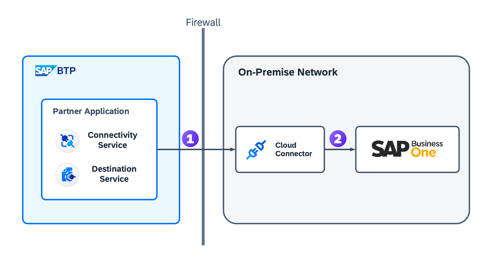

# SAP Business One Integration Using a Cloud Connector

## Purpose

In the previous sections, you learned how to integrate the Poetry Slam Manager with SAP Business One as an ERP back end. In this section, You're connecting the Poetry Slam Manager with your SAP Business One system through a secure tunnel, avoiding the need to expose the service layer from the SAP Business One back end to the internet. To achieve this, you're adding an instance of a Cloud Connector to your environment.
The Cloud Connector serves as a secure link between cloud applications and on-premise systems, allowing controlled access to them. It functions as a reverse invoke proxy within a secured network, providing fine-grained control over both accessible on-premise resources and cloud applications that use it. For more information about the Cloud Connector, see [SAP Help Portal - Cloud Connector](https://help.sap.com/docs/connectivity/sap-btp-connectivity-cf/cloud-connector).

The finished integration of SAP Business One using the Cloud Connector offers the same features as the direct connection explained in previous chapters:

- Create purchase orders for poetry slam events with one click and preview purchase order information on the Poetry Slams UI.
- As SAP Business One user, start the Poetry Slams and Visitors applications from your SAP Business One launchpad, and navigate from the Poetry Slams application to the associated purchase order in the system.

This chapter extends the previously shown SAP Business One integration.  
The following chapters are prerequisites for the SAP Business One integration using a Cloud Connector:
- [Learn More About the Prerequisites and the Purpose of SAP Business One Integration](./33-B1-Prerequisites.md)
- [Integrate the SAP BTP Application with SAP Business One](./33a-B1-Integration.md)
- [Configure the Integration with SAP Business One](./33b-Multi-Tenancy-Provisioning-Connect-B1.md) (Excluding section *Set Up Destinations to Connect the SAP BTP Application to SAP Business One*)

## Enhance the Configuration of the SAP Cloud Application Programming Model Project

To access the Cloud Connector, the SAP BTP Connectivity service is required. The following steps show how to implement it in your application:

1. In the [*mta.yaml*](../../../tree/main-multi-tenant/mta.yaml) file:
    1. Add the connectivity service to the resources section:
        ```YML
        resources:
        - name: poetry-slams-connectivity-service
            type: org.cloudfoundry.managed-service
            parameters:
            service: connectivity
            service-plan: lite
        ```
    2. Add the connectivity service as dependency to the modules *poetry-slams-srv* and *poetry-slams-mtx*:
        ```YML
        modules:
        # ...
        - name: poetry-slams-srv
            # ...
            requires:
            # ...
            - name: poetry-slams-connectivity-service
        # ...
        - name: poetry-slams-mtx
            # ...
            requires:
            # ...
            - name: poetry-slams-connectivity-service
        ```
2. In the [*package.json*](../../../tree/main-multi-tenant/mtx/sidecar/package.json) of the MTX sidecar, add the *connectivity* attribute to the *mtx-sidecar* profile:
    ```JSON
    {
    "name": "partner-reference-application-mtx",
        ...
        "cds": {
            "profile": "mtx-sidecar",
            "requires": {
                ...
                "connectivity": true
            }
        }
    }
    ```

Update your application in the provider subaccount. For detailed instructions, refer to [Deploy the Multi-Tenant Application to a Provider Subaccount](24-Multi-Tenancy-Deployment.md#build-and-deploy-to-cloud-foundry).

## Install a Cloud Connector in Your SAP Business One Environment

Before beginning, ensure that a computer or virtual machine is available for installing the Cloud Connector. This resource should meet the following criteria:
1. Located within a network zone with:
    - Internet access to the SAP BTP region host, either directly or through an HTTPS proxy.
    - Direct access to the SAP Business One system it provides access to, meaning that there is transparent connectivity between the Cloud Connector and the SAP Business One system.
    > Note: For more information on prerequisites for network zones, see [Network Zones](https://help.sap.com/docs/connectivity/sap-btp-connectivity-cf/cloud-connector-network-zones).
2. Meet the [hardware requirements](https://help.sap.com/docs/connectivity/sap-btp-connectivity-cf/prerequisites#hardware).
3. Adequate operating system for Cloud Connector installation: [Product availability matrix](https://help.sap.com/docs/connectivity/sap-btp-connectivity-cf/prerequisites#product-availability-matrix).
4. JDK preinstalled according to [JDK requirements](https://help.sap.com/docs/connectivity/sap-btp-connectivity-cf/prerequisites#jdks).

For Windows installations, Microsoft Visual C++ 2019 runtime libraries should be preinstalled. For more information, refer to the [Microsoft installation guide](https://help.sap.com/docs/connectivity/sap-btp-connectivity-cf/installation-on-microsoft-windows-os).

For more information about installing the Cloud Connector, see [Cloud Connector installation](https://help.sap.com/docs/connectivity/sap-btp-connectivity-cf/installation).

1. Download the desired version of the Cloud Connector for installation on your on-premise network from the following page: [SAP development tools](https://tools.hana.ondemand.com/#cloud).
    > For the purpose of this guide, the non-portable Windows installer will be used.
2. Open the downloaded file and follow the steps in the installer.
    > Note: Ensure the default port 8443 is not being used by another service. If port 8443 is already in use, choose a free port during installation. The selected port will be used later in this guide.
3. After the installation is complete, two desktop shortcut icons should be added: __Start Cloud Connector__ and __Stop Cloud Connector__.
4. For testing purposes, check that the service is registered and running. Open the Windows Services app (_Control Panel > Admin Tools > Services_), search for __SAP Cloud Connector__, open service details, and ensure that the __Service Status__ is __Running__.
5. The Cloud Connector can be accessed at `https://<hostname>:<port>`
    - `<hostname>` refers to the machine on which the Cloud Connector is installed. If this is installed in the same machine, you can simply enter localhost.
    - `<port>` is the port set as part of the Cloud Connector installation (default port is 8443).

## Establish the Connections Using the Cloud Connector

To access the on-premise SAP Business One from the consumer subaccount, two connections should be configured as shown in the diagram below:

1. A connection between the Cloud Connector and the application on SAP Business Technology Platform.
2. A connection between the Cloud Connector and SAP Business One.



### Establish a Connection between the Cloud Connector and the Consumer Subaccount 
To create a secure tunnel between the Cloud Connector and the consumer subaccount, follow these steps:

1. In the consumer subaccount, go to __Connectivity > Cloud Connector__.
2. Choose __Download Authentication Data__.
3. Copy the downloaded file to the device where the Cloud Connector is installed.
4. Log in to the Cloud Connector admin webpage at `https://localhost:<port>`.
    - Standard user: _Administrator_.
    - Initial password: _manage_.
    - `<port>` is the port set as part of the Cloud Connector installation (default port is 8443).
    > Hint: Once the initial password has been used, a new password must be set for the Administrator user.
5. Choose __Add Subaccount__.
6. Set HTTP proxy configurations to align with the on-premise network settings (In case no HTTP proxy is used, choose _Next_ to skip the configuration).
7. Select the _Configure using authentication data from file_ option, and use the subscriber subaccount authentication data copied to the VM in Step 2.
9. _Location ID_ can be left empty.
10. _Description_ can be set freely.

The consumer subaccount is now visible in the Cloud Connector, and the Cloud Connector is visible in the consumer subaccount:
- __Subaccount__: In Connectivity > Cloud Connector, a new instance is shown.
- __Cloud Connector__: In the subaccount dashboard in the Cloud Connector admin webpage, at least one item is shown. In the details of the item, the name corresponds to the subscriber subaccount name, and the status should be _connected_.

### Establish a Connection between the Cloud Connector and SAP Business One

To connect the Cloud Connector with SAP Business One, some configuration is necessary. The Cloud Connector needs to know where to redirect requests intended for SAP Business One and which system resources are available. Follow these steps to configure and establish this connection:

1. Find out the internal host name and port from the SAP Business One Service Layer. 
    1. Log in to the Control Center of SAP Business One.
    2. Go to the __Services__ tab.
    3. Search for __Service Layer__ and copy its URL.
2. Download the certificate from the SAP Business One Service Layer server.
    1. Open the URL you've just copied in the VM where the Cloud Connector is installed.
    2. Export the server certificates and save the export locally.
3. Add the server certificates from the SAP Business One Service Layer to the Cloud Connector.
    1. Go to __Configuration__ tab on the Cloud Connector admin webpage.
    2. Switch to the __On Premise__ tab.
    3. Scroll down and choose __Add a X.509 certificate__ (plus icon) in the allowlist.
    4. Select the certificates you exported in the previous step.
4. Configure mapping and available resources.
    1. Go to __Cloud To On-Premise__ in the Cloud Connector admin webpage.
    2. Add a new mapping to an internal system (plus icon) with the following parameters:
        - Backend type: _Other SAP System_
        - Protocol: _HTTPS_
        - Internal Host: `<Internal SAP Business One Service Layer hostname>`
        > Note: Internal Host may be taken from the SAP Business One URL (everything before the `:` sign).
        - Internal Port: `<Internal SAP Business One Service Layer port number>`
        > Note: Internal Port may be taken from the SAP Business One Service Layer URL (number after the `:` sign).
        - Virtual Host: `<Cloud Connector name>`
        - Virtual Port: `<Cloud Connector port>`
        > You can set both the virtual host and virtual port freely. However, port 50000 is recommended. These parameters are used later for the destination on the subscriber subaccount.
        - Choose _Allow Principal Propagation_.
        - Principal Type: _X.509 Certificate_.
        - Do not choose _System Certificate for Logon_.
        - Host In Request Header: _Use Internal Host_.
        - The description can be set freely.
    3. After the mapping was added, test the connection (first icon on the action column) and the result should be _Reachable_.
5. Add the resources that should be exposed through the Cloud Connector:
    - Choose the plus icon in the __Resources__ table of the mapping you've just added.
    - Set the URL Path to `/`. This allows access to all the resources from this system.
    - Set the Access Policy to _Path and all Sub-Paths_.
    - Leave the other configuration unchanged.

> Note: More details about the configuration of the system mapping in the Cloud Connector are described in the SAP Help document [Configure Access Control (HTTP)](https://help.sap.com/docs/connectivity/sap-btp-connectivity-cf/configure-access-control-http).

## Set Up Destinations to Connect the SAP BTP Application to SAP Business One

[HTTP Destinations](https://help.sap.com/docs/connectivity/sap-btp-connectivity-cf/http-destinations) can be configured in the subaccounts of the SAP Business Technology Platform. They can be used to connect your application to the internet, as well as to an on-premise system. To setup a destination, follow these steps:
1. Open your SAP BTP consumer subaccount.
2. Go to *Connectivity* and choose *Destinations*.
3. Create the following destinations:

    - **b1-url**: Link to the SAP Business One UI.

        | Parameter Name    | Value                                                                                     |
        | :---------------- | :--------------------------------------------------------------------------------------   |
        | *Name*:           | *b1-url*                                                                                  |
        | *Type*:           | *HTTP*                                                                                    |
        | *Description*:    | Enter a destination description, for example, ``SAP Business One 123456 URL``.            |
        | *URL*:            | *https://{{B1-hostname}}* for example, ``https://my123456sapOne.com``.                    |
        | *Proxy Type*:     | *Internet*                                                                                |
        | *Authentication*: | *NoAuthentication*                                                                        |

    - **b1**: Connect to the SAP Business One API using the Cloud Connector.

        > Note: `{{Virtual Host}}` and `{{Virtual Port}}` have to be identical to the values desribed in section [Establish a Connection between the Cloud Connector and SAP Business One](./33c-B1-Integration-With-Cloud-Connector.md#establish-a-connection-between-the-cloud-connector-and-sap-business-one).

        - Option 1 (Basic Authentication):

            | Parameter Name           | Value                                                                                                  |
            | :------------------------ | :-------------------------------------------------------------------------------------                |
            | *Name*:                   | *b1*                                                                                                  |
            | *Type*:                   | *HTTP*                                                                                                |
            | *Description*:            | Enter a destination description, for example, ``SAP Business One 123456 with Cloud Connector``.       |
            | *URL*:                    | *http://{{Virtual Host}}:{{Virtual Port}}*                                                            |
            | *Proxy Type*:             | *OnPremise*                                                                                           |
            | *Authentication*:         | *BasicAuthentication*                                                                                 |
            | *User*:                   | Enter the username.                                                                                   |
            | *Password*:               | Enter the password.                                                                                   |

        - Option 2 (Principal Propagation):

            > Note: To use principal propagation, make sure you have completed the required setup in SAP Business One: [Register the Identity Provider of the SAP BTP Application in the SAP Business One SSO Extension Manager](./33b-Multi-Tenancy-Provisioning-Connect-B1.md#optional-register-the-identity-provider-of-the-sap-btp-application-in-the-sap-business-one-sso-extension-manager)

            | Parameter Name           | Value                                                                                            |
            | :------------------------ | :-------------------------------------------------------------------------------------          |
            | *Name*:                   | *b1*                                                                                            |
            | *Type*:                   | *HTTP*                                                                                          |
            | *Description*:            | Enter a destination description, for example, ``SAP Business One 123456 with Cloud Connector``. |
            | *URL*:                    | *http://{{Virtual Host}}:{{Virtual Port}}*                                                      |
            | *Proxy Type*:             | *OnPremise*                                                                                     |
            | *Authentication*:         | *NoAuthentication*                                                                              |

            Additional Properties:
            | Property Name                 | Value            |
            | :---------------------------- | :--------------- |
            | *forwardAuthToken*:           | *true*           |
            | *URL.headers.X-b1-companyid*: | *{{Company ID}}* |
            | *HTML5.DynamicDestination*:   | *true*           |
            | *WebIDEEnabled*:              | *true*           |

            > Note: You can see the `{{Company ID}}` in the SAP Business One Extension SSO Manager in the *Tenant Binding List*.

            > Note: The *Additional Properties* `HTML5.DynamicDestination` and `WebIDEEnabled` are only needed if the destination is also used for local tests in the Business Application Studio. More details about local tests are described in the documentation [On-Premise Connectivity From Business Application Studio (BAS)](https://sap.github.io/cloud-sdk/docs/java/features/connectivity/running-locally#on-premise-connectivity-from-business-application-studio-bas) of the SAP Cloud SDK.

## Remarks and Troubleshooting

Now, everything is set up for your back-channel integration to SAP Business One using a Cloud Connector. To continue with the integration example, you can now follow the guide on how to [add SAP BTP applications to the SAP Business One launchpad](./33b-Multi-Tenancy-Provisioning-Connect-B1.md#add-sap-btp-applications-to-the-sap-business-one-launchpad).  

If you need more information on how to trace and debug your application with ERP integration, go to the section on [testing and troubleshooting](32-Test-Trace-Debug-ERP.md). If you're looking for more information on the ERP integration of Poetry Slam Manager, take the [guided tour of the ERP integration](31-Guided-Tour-ERP-Integration.md).

