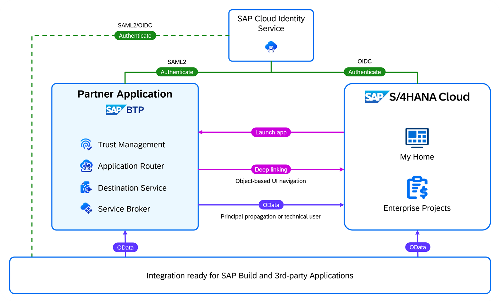
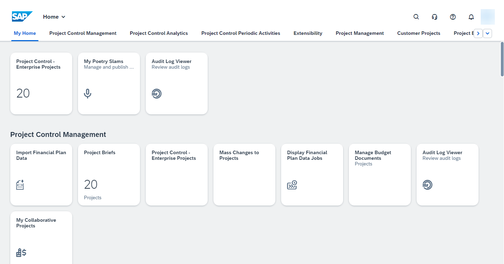

# Configure the Integration with SAP S/4HANA Cloud Public Edition

In this section, you connect an SAP S/4HANA Cloud tenant, the Identity Authentication service tenant of the SAP S/4HANA Cloud system (acting as a corporate identity provider), and the SAP BTP consumer subaccount with the customer subscription of Poetry Slam Manager.

1. Front-end integration:
    1. Launch Poetry Slams and Visitors applications from the SAP S/4HANA Cloud launchpad.
    2. Launch applications to administrate SAP BTP such as the Identity Authentication service admin application from the SAP S/4HANA Cloud launchpad.
    3. Navigate from Poetry Slam Manager to the related SAP S/4HANA Cloud enterprise projects.
    4. Configure single sign-on for SAP S/4HANA Cloud, Poetry Slams and Visitors applications, and all SAP BTP admin apps using the same Identity Authentication service tenant as corporate identity provider (IdP).

2. Back-channel integration: Create and read SAP S/4HANA Cloud enterprise projects from Poetry Slam Manager using OData APIs with principal propagation.

  

## Set Up SAP BTP Consumer Subaccount

To start the provisioning procedure, create an SAP BTP consumer subaccount for a specific customer:

1. Open the SAP BTP cockpit (the same global account that hosts the provider subaccount of the SAP BTP application).
2. Create a new *Multi-Environment* subaccount with a name that refers to the tenant number or the customer. 
3. As a provider, choose *Amazon Web Services (AWS)*. In the Poetry Slam Manager example, the subaccount is called *Consumer 2: Andina Publications (S4HC)*. 

### Subscribe To the SAP SAP BTP Multi-Tenant Application

1. In the SAP BTP cockpit of the newly created consumer subaccount, navigate to *Instances and Subscriptions*. 
2. Create a subscription to *Poetry Slam Manager* with the *default* service plan (this is the multi-tenant SAP BTP application you just created).

## Set Up Single Sign-On for the SAP BTP Application Subscription
In this tutorial, the Identity Authentication service tenant that is used by the SAP S/4HANA Cloud tenant for authentication is reused.  

### Configure Single Sign-On for the SAP BTP Application
Configure a trust relationship between the SAP BTP consumer subaccount and the Identity Authentication service tenant of SAP S/4HANA Cloud as described in the section [Configure Trust Using SAML 2.0](./25-Multi-Tenancy-Provisioning.md).

### Launch the SAP BTP Multi-Tenant Application

1. To launch the Poetry Slams application, choose *Go to Application*. Copy the link address of the Poetry Slams application and note it down as **SAP BTP Application Poetry Slams Tenant URL** for later reference.

2. From there, open a fully booked poetry slam and click in the header of the Object Page to *Maintain Visitors*. Copy the link address of the Visitors application and note it down as **SAP BTP Application Visitors Tenant URL** for later reference.

> Note: If you're directed to an SAP HANA XS Advanced Login screen after launching the application, check the naming of your SAP BTP Cloud Foundry runtime organization. The organization name must be in lowercase.

## Configure Single Sign-On for SAP S/4HANA Cloud

In this tutorial, the Identity Authentication service tenant is reused that is used by the SAP S/4HANA Cloud tenant for authentication.   

Therefore, the trust relationship between the SAP S/4HANA Cloud tenant and the Identity Authentication service tenant is already established. No further activities are required.

## Configure SAP S/4HANA Cloud OData Services to Create and Read Enterprise Projects

1. Search for the following OData APIs on the [SAP API Business Hub](https://api.sap.com/package/SAPS4HANACloud/all) and take note of the communication scenarios per API:
    - [*Enterprise Project*](https://api.sap.com/api/API_ENTERPRISE_PROJECT_SRV_0002/overview) (OData v2): Communication scenario: *Enterprise Project Integration* (SAP_COM_0308)
    - [*Enterprise Project - Read Project Processing Status*](https://api.sap.com/api/ENTPROJECTPROCESSINGSTATUS_0001/overview) (OData v4): Communication scenario: *Enterprise Project - Project Processing Status Integration* (SAP_COM_0725)
    - [*Enterprise Project - Read Project Profile*](https://api.sap.com/api/ENTPROJECTPROFILECODE_0001/overview) (OData v4): Communication scenario: *Enterprise Project - Project Profile Integration* (SAP_COM_0724)

2. In the SAP S/4HANA Cloud system, create a new *Communication System* that represents the SAP BTP consumer subaccount:

    | Parameter Name | Value                                                                                 |
    | :-------------- | :------------------------------------------------------------------------------------- |
    | *System ID*:    | ``PRA-MT-S2`` |
    | *System Name*:  | ``Partner Applications - Poetry Slam Manager Tenant 2``
    | *Host Name*:    | Enter the hostname of the subscription of the Partner Reference Application (host of the URL of the deployed Partner Reference Application). |

3. Add a *Communication User* for inbound communication to the *Communication System* (create a new user):

    | Parameter Name | Value                                                                                 |
    | :-------------- | :------------------------------------------------------------------------------------- |
    | *User Name*:    | ``PRA-MT-S2-USER`` (reuse the subdomain name *armt-s2* of the consumer subaccount) |
    | *Description*:  | ``Technical user of Poetry Slam Manager``                                         |
    | *Password*:     | Choose a secure password.                                                               |

4. Create a new *Communication Arrangement*: Open the *Communication Scenario* *SAP_COM_0308* and start the configuration using the *Create Comm. Arrangement* button:

    | Parameter Name         | Value                                                                       |
    | :---------------------- | :--------------------------------------------------------------------------- |
    | *Arrangement Name*:     | Choose a meaningful name, for example, `Poetry Slam Manager - Projects`.|
    | *Communication System*: | Choose the communication system created above.                                |
    | *Inbound Communication - User Name*: | Choose the user for inbound communication created above.         |
    | *Inbound Communication - Authentication Method*: | `User ID and Password`                              |

5. Take note of the user name and password of the communication user as **SAP S/4HANA Cloud Communication User** and **SAP S/4HANA Cloud Communication User Password** for later reference. 

6. Create further communication arrangements for the other two OData services using the same communication system and communication user:
    - Communication arrangement *Poetry Slam Manager - Project Profile* for communication scenario *SAP_COM_0724*
    - Communication arrangement *Poetry Slam Manager - Project Status* for communication scenario *SAP_COM_0725*

You can now consume the OData service using the technical user and basic authentication (user/password).

## Configure OAuth Authentication for OData Services

OAuth 2.0 SAML Bearer authentication is used to access the SAP S/4HANA Cloud OData service to read and write projects with the user context initiated by a user on the UI of Poetry Slam Manager. As a result, SAP S/4HANA Cloud user authorizations apply to Poetry Slam Manager as well. Users without the permission to manage projects in SAP S/4HANA Cloud can still open Poetry Slam Manager, but SAP S/4HANA Cloud enterprise project data is not retrieved and projects cannot be created.

### Configure Authentication by Business Users
Configure SAP S/4HANA Cloud for OAuth 2.0 SAML Bearer authentications.

1. Determine the identifying certificate of the SAP BTP consumer subaccount. 
    1.  In the SAP BTP consumer subaccount, to get the identifying X509 certificate of the SAP BTP consumer subaccount, open the menu item *Connectivity* and go to *Destinations*.

    2. Choose *Download Trust* and save the file with the signing certificate. 

    3. Change the file name using *.cer* as file extension, for example, to `sap-btp-signing-certificate.cer`.

    4. Open the file with the signing certificate and note down the *Issued by* or *Issuer* name.

        As a result, you have a file with the **SAP BTP subaccount signing certificate** (with file extension *.cer)* and the **SAP BTP subaccount service provider name**, referred to as *Issued by* in the SAP BTP subaccount signing certificate. Keep them both as you need them later.

2. Create the OAuth 2.0 identity provider in SAP S/4HANA Cloud.

    1.  In SAP S/4HANA Cloud, to configure an OAuth 2.0 identity provider, open the *Partner Applications - Poetry Slam Manager Tenant 2* *Communication System* you created in the previous step.
    2.  Activate *OAuth 2.0 Identity Provider*.
    3.  Upload the **SAP BTP Subaccount Signing Certificate** via *Upload Signing Certificate*.
    4.  Copy the *CN* property of the *Signing Certificate Issuer* into *OAuth 2.0 SAML Issuer* field.
    5.  Keep the *User ID Mapping Mode* = *User Name*.

3.  In SAP S/4HANA Cloud, to change the authentication method of the communication arrangement for enterprise projects to OAuth 2.0, open the *Poetry Slam Manager - Projects* communication arrangement you created in a previous step. 

4.  Go to *Inbound Communication* and reselect the user for inbound communication. Choose the same user with authentication method *OAuth 2.0*.
     > Note: The OData services for project profiles and project processing status don't support OAuth and, therefore, these services will be used with a basic authentication.
        
5. Take note of the **SAP S/4HANA Cloud OData Service URL** (service URL of service Enterprise Project) and the OAuth 2.0 details: 
    - SAP S/4HANA Cloud OAuth Client ID (this is the same as the SAP S/4HANA Cloud Communication User)
    - SAP S/4HANA Cloud OAuth Client Secret (this is the SAP S/4HANA Cloud Communication User Password)
    - SAP S/4HANA Cloud OAuth User Name 
    - SAP S/4HANA Cloud OAuth Token Service URL 
    - SAP S/4HANA Cloud OAuth SAML2 Audience 
    - SAP S/4HANA Cloud OAuth Scope *API_ENTERPRISE_PROJECT_SRV_0002*.

6. Open the SAP S/4HANA Cloud UI in a Google Chrome browser and click on the lock icon *View site information* on the left side of the URL. To export the **SAP S/4HANA Cloud Server Certificate** as a base-64 encoded *X.-509* file, choose *Connection is secure* and *Certificate is valid*. Choose *Details* and *Export*.

## Set Up Destinations to Connect the SAP BTP App to SAP S/4HANA Cloud

In this section, three destinations are created to access SAP S/4HANA Cloud OData services:
- destination *s4hc* to consume SAP S/4HANA Cloud OData services with principal propagation
- destination *s4hc-tech-user* to consume SAP S/4HANA Cloud OData services using a technical user
- destination *s4hc-url* to provide the SAP S/4HANA Cloud hostname of UI navigations and the name of the SAP S/4HANA Cloud system as used by business users.

1.  In the SAP BTP consumer subaccount, to create the destination *s4hc* to consume SAP S/4HANA Cloud OData services with principal propagation, open the *Connectivity* menu item of the SAP BTP consumer subaccount.
2. Choose *Destinations* and create a *New Destination* with the following field values:

    | Parameter Name           | Value                                                                                    |
    | :------------------------ | :---------------------------------------------------------------------------------------- |
    | *Name*:                   | *s4hc*                                                                                    |
    | *Type*:                   | *HTTP*                                                                                    |
    | *Description*:            | Destination description, for example, `SAP S/4HANA Cloud XXXXXX with principal propagation`    |
    | *URL*:                    | API endpoint of your SAP S/4HANA Cloud system, for example, `https://myXXXXXX-api.s4hana.ondemand.com` |
    | *Proxy Type*:             | *Internet*                                                                                |
    | *Authentication*:         | *OAuth2SAMLBearerAssertion*                                                               |
    | *Audience*:               | Enter the **SAP S/4HANA Cloud OAuth SAML2 Audience**, for example, ``https://myXXXXXX.s4hana.ondemand.com``. |
    | *AuthnContextClassRef*:   | *urn:oasis:names:tc:SAML:2.0:ac:classes:X509*                                             |
    | *Client Key*:             | Enter the **SAP S/4HANA Cloud OAuth Client ID**.                                                         |
    | *Token Service URL*:      | Enter the **SAP S/4HANA Cloud OAuth Token Service URL**, for example, ``https://myXXXXXX-api.s4hana.ondemand.com/sap/bc/sec/oauth2/token``. |
    | *Token Service User*:     | Enter the **SAP S/4HANA Cloud OAuth Client ID**.                                                         |
    | *Token Service Password*: | Enter the **SAP S/4HANA Cloud OAuth Client Secret**.                                                    |

2. Enter the *Additional Properties*:
    
    | Property Name  | Value                                                          |
    | :-------------- | :-------------------------------------------------------------- |
    | *nameIdFormat*: | *urn:oasis:names:tc:SAML:1.1:nameid-format:emailAddress*        |
    | *scope*:        | Enter the **SAP S/4HANA Cloud OAuth Scope** (API_ENTERPRISE_PROJECT_SRV_0002). |
    | *userIdSource*: | *email*                                                         |

    > Note: For testing, you may configure a basic authentication using the **SAP S/4HANA Cloud Communication User** and **SAP S/4HANA Cloud Communication User Password** of the destination *s4hc*.

    > Note: You may need to upload the **SAP S/4HANA Cloud Server Certificate** into the destination service for Secure Sockets Layer (SSL) authentication using the link *Upload and Delete Certificates* on the destinations screen. You can download the SAP S/4HANA Cloud server certificate. Open the SAP S/4HANA Cloud UI in a Google Chrome browser and click on the lock icon *View site information* on the left side of the URL. To export the **SAP S/4HANA Cloud Server Certificate** as a base-64 encoded *X.-509* file, choose *Connection is secure* and *Certificate is valid*. Choose *Details* and *Export*.

3. Create the destination *s4hc-tech-user* to consume SAP S/4HANA Cloud OData services using a technical communication user.

4.  Open the *Connectivity* menu item of the SAP BTP consumer subaccount, choose *Destinations*, and create a *New Destination* with the following field values:

    | Parameter Name   | Value                                                                            |
    | :---------------- | :-------------------------------------------------------------------------------- |
    | *Name*:           | *s4hc-tech-user*                                                                  |
    | *Type*:           | *HTTP*                                                                            |
    | *Description*:    | Destination description, for example, ``SAP S/4HANA Cloud XXXXXX with technical user``   |
    | *URL*:            | API endpoint of your SAP S/4HANA Cloud system, for example, ``https://myXXXXXX-api.s4hana.ondemand.com`` |
    | *Proxy Type*:     | *Internet*                                                                        |
    | *Authentication*: | *BasicAuthentication*                                                             |
    | *User*:           | Enter the **SAP S/4HANA Cloud Communication User**.                                              |
    | *Password*:       | Enter the **SAP S/4HANA Cloud Communication User Password**.                                     |

5. Create the destination *s4hc-url* to launch SAP S/4HANA Cloud apps and to store the name of the SAP S/4HANA Cloud system used by business users. 

6.  Open the *Connectivity* menu item of the SAP BTP consumer subaccount, choose *Destinations*, and create a *New Destination* with the following field values:

    | Parameter Name   | Value                                                                                  |
    | :---------------- | :-------------------------------------------------------------------------------------- |
    | *Name*:           | *s4hc-url*                                                                              |
    | *Type*:           | *HTTP*                                                                                  |
    | *Description*:    | Enter the name of your *SAP S/4HANA Cloud* system used by your business users, for example, ``My Productive SAP System``. |
    | *URL*:            | UI endpoint of your SAP S/4HANA Cloud system, for example, ``https://myXXXXXX.s4hana.ondemand.com`` |
    | *Proxy Type*:     | *Internet*                                                                              |
    | *Authentication*: | *NoAuthentication*                                                                      |

    > Note: The destination URL stores the hostname of the SAP S/4HANA Cloud system. By storing the base URL in a destination, you ensure that connecting the SAP BTP web application to the SAP S/4HANA Cloud system is a pure configuration task and does not require any code changes. 
    
    At runtime, you dynamically assemble the parameterized URL to launch the project planning view of SAP S/4HANA Cloud enterprise projects by concatenating this base URL with the floorplan-specific path and the object-specific parameters (for example, the project ID). The authentication method is not relevant in this destination and, therefore, you choose *NoAuthentication* to keep things simple (of course, this destination cannot be used to use any SAP S/4HANA Cloud service directly).

    > Note: The destination description is used to store the name of the SAP S/4HANA Cloud system used by business users. At runtime, we you this description to refer to the SAP S/4HANA Cloud system on the UI of the SAP BTP application.

## Add SAP BTP Applications to the SAP S/4HANA Cloud Launchpad

As a last step, Poetry Slam Manager and SAP BTP admin applications are added to the SAP S/4HANA Cloud launchpad to make it possible for both poetry slam managers and system administrators to launch all relevant applications from a single launchpad.

1.  In the SAP S/4HANA Cloud tenant, to create a custom tile, open the Custom Tiles application and add a new tile with the field values:
			
    | Field       | Value                                                                           |
    | :----------- | :----------------------------------------------------------------------------- |
    | *Title*:     | `Poetry Slams`                                                          |
    | *ID*:        | `POETRYSLAMS`                                                            |
    | *Subtitle*:  | `Manage poetry slams`                                                          |
    | *URL*:       | Enter the **SAP BTP Application Poetry Slams Tenant URL**, you noted down in a previous step.    |
    | *Icon*:      | Choose an icon, for example, *sap-icon://microphone*                           |
            
2. Choose *Assign Catalogs* and add a *Business Catalog*, for example, *Enterprise Projects - Project Control Management*.
	
3. Choose *Publish*.

4.  Open the *App Finder* in your user profile and search for the *Enterprise Projects - Project Control Management* catalog. 

    > Note: Optionally, you can assign the app to a different or to a new app group. 

    > Note: Refresh your browser window if the app is not listed.

5. Repeat the previous steps for the Visitors application. Use the **SAP BTP Application Visitors Tenant URL** as URL.

Now you find the Poetry Slams and Visitors applications on the SAP S/4HANA Cloud launchpad in the *Project Control Management* group.

Repeat the same steps with suitable business catalogs to create custom tiles for the Identity Authentication service admin application.

> Note: Typically, customers have SAP S/4HANA Cloud tenants for customizing, test, and productive use. In such a setup, the custom tile is created in the customizing tenant and transported to the test and productive tenants via software collections. 

## Create Users and Assign Authorizations

The SAP BTP application design relies on business users and authorizations being created and managed in the Cloud ERP solution (in this case, SAP S/4HANA Cloud) and the customer identity provider (in this case, Identity Authentication service connected to SAP S/4HANA Cloud).
As a general approach, users are created in the ERP solution and the IdP, and then assigned to the user group that includes the authorization of the partner application users.

To create a user in  SAP S/4HANA Cloud, follow the documentation [Identity and Access Management](https://help.sap.com/docs/SAP_S4HANA_CLOUD/a630d57fc5004c6383e7a81efee7a8bb/f25f9108740442c3804370f2d88a9bdd.html?q=Maintain%20Business%20Users).

> Note: Make sure that you maintain the same e-mail address for users in the Cloud ERP and the Identity Authentication service tenant. Otherwise, single sign-on and the API-led integration using OAuth SAML bearer won't work.

## Test

1. To test the integration and single sign-on authentication, open the SAP S/4HANA Cloud launchpad and log on using your SAP S/4HANA Cloud user. 
2. Launch Poetry Slams application via the custom tile on the SAP S/4HANA Cloud launchpad. 
3. The Poetry Slams application opens in a new browser tab without any additional authentication prompt.
    1. Open a poetry slam that is *published* or *fully booked* and create a project in SAP S/4HANA Cloud.        
    2. Check that the navigation to the project in SAP S/4HANA Cloud works.
4. Launch the Visitors application via the custom tile on the SAP S/4HANA Cloud launchpad. 
5. The Visitors application opens in a new browser tab without any additional authentication prompt.

## Remarks and Troubleshooting

If you need more information on how to trace and debug your application with ERP integration, go to the section on [testing and troubleshooting](32-Test-Trace-Debug-ERP.md). If you're looking for more information on the ERP integration of Poetry Slam Manager, take the [guided tour of the ERP integration](31-Guided-Tour-ERP-Integration.md).
