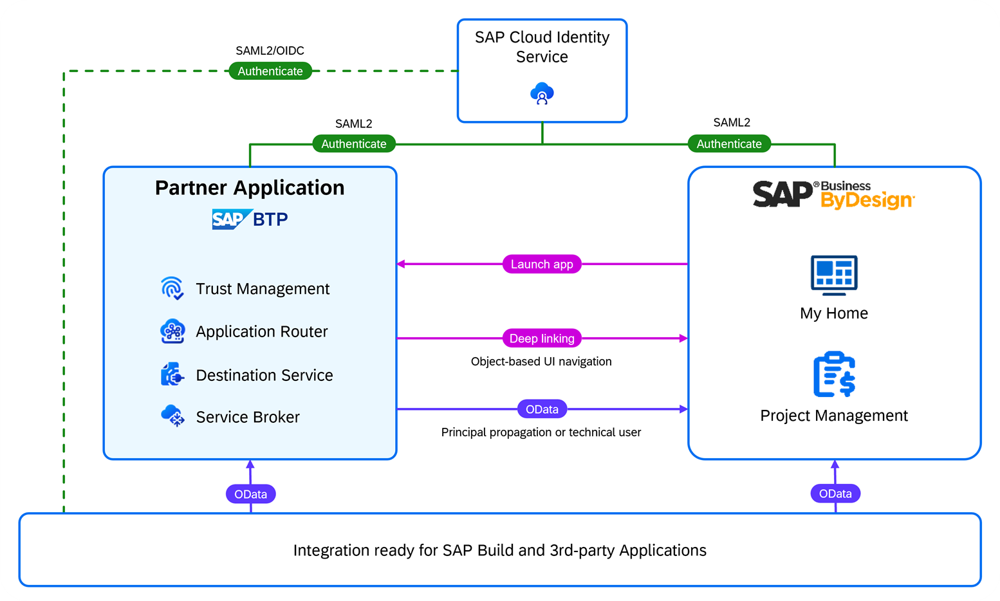

# Configure the Integration with SAP Business ByDesign

In this section, you integrate Poetry Slam Manager, your SAP Business Technology Platform (SAP BTP) solution, with the SAP Business ByDesign tenant of your customer. The Identity Authentication service tenant will act as a corporate identity provider (IdP).

1. Front-end integration:
    1. Launch Poetry Slams and Visitors applications from the SAP Business ByDesign launchpad.
    2. Launch applications to administrate SAP BTP such as the Identity Authentication service admin application from the SAP Business ByDesign launchpad.
    3. Navigate from Poetry Slams to the related SAP Business ByDesign projects (*Project Management* workcenter).
    4. Configure single sign-on for SAP Business ByDesign, Poetry Slam Manager, and all SAP BTP admin apps using the same Identity Authentication service tenant as a corporate identity provider (IdP).
2. Back-channel integration: Create SAP Business ByDesign projects in Poetry Slam Manager using OData APIs with principal propagation.

  

## Set Up SAP BTP Consumer Subaccount

To start the provisioning procedure, create an SAP BTP consumer subaccount for a specific customer:

1. Open the SAP BTP cockpit (the same global account that hosts the provider subaccount of the SAP BTP application).
2. Create a new *Multi-Environment* subaccount with a name that refers to the tenant number or the customer. 
3. As a provider, choose *Amazon Web Services (AWS)*. In the Poetry Slam Manager example, the subaccount is called *Consumer 1: Almika Events Cleveland*. 

### Subscribe To the SAP SAP BTP Multi-Tenant Application

1. In the SAP BTP cockpit of the newly created consumer subaccount, navigate to *Instances and Subscriptions*. 
2. Create a subscription to *Poetry Slam Manager* with the *default* service plan (this is the multi-tenant SAP BTP application you just created).

## Set Up Single Sign-On for the SAP BTP Application Subscription
In this tutorial, the Identity Authentication service tenant that is used by the SAP Business ByDesign tenant for authentication is reused.  

### Configure Single Sign-On for the SAP BTP Application
Configure a trust relationship between the SAP BTP consumer subaccount and the Identity Authentication service tenant of SAP Business ByDesign as described in [Configure Trust Using SAML 2.0](./25-Multi-Tenancy-Provisioning.md).

### Launch the SAP BTP Multi-Tenant Application

1. To launch the Poetry Slams application, choose *Go to Application*. Copy the link address of the Poetry Slams application and note it down as **SAP BTP Application Poetry Slams Tenant URL** for later reference.

2. From there, open a fully booked poetry slam and click in the header of the Object Page to *Maintain Visitors*. Copy the link address of the Visitors application and note it down as **SAP BTP Application Visitors Tenant URL** for later reference.

   > Note: The application cannot be started successfully as the authorizations are not set. This is described in the next section.

2. Replace *poetryslams/index.html* in the link address of the poetry slams application with *visitors/index.html* to get the visitors application URL and note it down as **SAP BTP Application Visitors Tenant URL** for later reference.

   > Note: If you're directed to an SAP HANA XS Advanced Login screen after launching the application, check the naming of your SAP BTP Cloud Foundry runtime organization. The organization name must be in lowercase.

## Configure Single Sign-On for SAP Business ByDesign

In this tutorial, the Identity Authentication service as a corporate identity provider is used to establish a trust relationship between the service provider (the SAP Business ByDesign tenant) and the Identity Authentication service tenant. As a result, SAP Business ByDesign delegates user authentications to the Identity Authentication service tenant including single sign-on. 

Below you find more information about how to set up the trust relationship between SAP Business ByDesign and Identity Authentication service using SAML 2.0. The e-mail address is used to identify the user.
Therefore, you need to ensure that the same e-mail addresses are entered for users in SAP Business ByDesign and in the Identity Authentication service tenant.

1. Configure the trust in the SAP Business ByDesign customer system.
    1. Log on to your Identity Authentication service Admin UI (URL: [IAS]/admin/).
    2. Open the *Tenant Settings* in menu item *Applications & Resources*. Go to *SAML 2.0 Configuration* and choose *Download Metadata File* (**IDP SAML metadata file**).
    3. In SAP Business ByDesign, open the *Application and User Management* work center and navigate to *Common Tasks*. Go to *Configure Single Sign-On*.
    4. Go to the *Identity Provider* sheet. In the *Trusted Identity Provider* list, choose *New Identity Provider*. 
    5. Upload the **IDP SAML metadata file** that you downloaded from the Identity Authentication service tenant. 
    6. Enter a suitable name for the IdP as *Alias*. 
        > Note: The alias is displayed in the selection screen when you choose an IdP if you configure multiple identity providers in SAP Business ByDesign.   
    7. In the list under *Supported Name ID Formats*, add *E-Mail Address* as additional *Name ID Format*. Use the action *Set to Default* of the *Actions* group to set the e-mail address as default name ID. 
    8. Save your changes.
    9. Choose *Activate Single Sign-On*.
    10. Go to the *My System* sheet and choose *SP Metadata* to download the **SAP Business ByDesign Service provider SAML metadata file**.
2. Configure the Identity Authentication service.
    1. On the Identity Authentication service admin UI, open the *Applications* menu item and create a new application of type *SAP BTP Solution*.
    2. Enter the required information such as application display name, home URL, and so on. 
        > Note: The display name appears on the user log-in screen and the login applies to all applications linked to the Identity Authentication service tenant (following the single sign-on principle). Choose a meaningful display name from an end-user perspective representing the scope of the Identity Authentication service, for example, `Almika Inc. - User login` or `Almika Inc. - SAP Business ByDesign user authentication`. As home URL, you may use the SAP Business ByDesign access URL for single sign-on, for example, `https://myXXXXXX-sso.sapbydesign.com`.
    3. Open the *SAML 2.0 Configuration* section and upload the **SAP Business ByDesign Service provider SAML metadata file** that you downloaded from SAP Business ByDesign.
    4. Open the *Subject Name identifier* section and select *E-Mail* as basic attribute.
    5. Open the *Default Name ID Format* section and select *E-Mail*.
3. To test the SAP Business ByDesign user authentication with single sign-on, open the single sign-on access URL of SAP Business ByDesign (for example, `https://myXXXXXX-sso.sapbydesign.com`) in an incognito browser window and check if SAP Business ByDesign redirects to the Identity Authentication service log-in screen for user authentication. Use your e-mail and the Identity Authentication service password. If the login to SAP Business ByDesign is processed successfully, you will be logged in with the SAP Business ByDesign user that has the same e-mail address configured as you entered.

## Configure SAP Business ByDesign OData Services

In Poetry Slam Manager, SAP Business ByDesign projects are read and written by using the *khproject* custom OData service, which was created during the SAP Business ByDesign integration steps.

Therefore, an OAuth 2.0 SAML Bearer authentication is enabled to access the SAP Business ByDesign OData service to read and write SAP Business ByDesign projects with user context initiated by a user on the UI of the SAP BTP application. As a result, SAP Business ByDesign user authorizations apply to the SAP BTP application as well. Users without permission to manage projects in SAP Business ByDesign can still open the SAP BTP application, but SAP Business ByDesign project data is not retrieved and projects cannot be created.

### Configure Authentication by Business Users

This section describes how to configure SAP Business ByDesign for OAuth 2.0 SAML Bearer authentications with the customer's SAP BTP subaccount.

1. Determine the identifying certificate of SAP BTP consumer subaccount. 

    1. In the SAP BTP consumer subaccount, to get the identifying X509 certificate of the User Account and Authentication service (UAA) as OAuth identity provider, open the menu item *Connectivity* and go to *Destinations*.
    
    2. Choose *Download Trust* and save the file with the signing certificate. 
    
    3. Change the file name using *.cer* as file extension, for example, to `sap-btp-signing-certificate.cer`.

    4. Open the file with the signing certificate and note down the *Issued by* or *Issuer* name.

        As a result, you have a file with the **SAP BTP subaccount signing certificate** (with file extension *.cer)* and the **SAP BTP subaccount service provider name**, referred to as *Issued by* in the SAP BTP subaccount signing certificate. Keep them both as you need them later.

2. Create the OAuth 2.0 Identity Provider in SAP Business ByDesign.

    1. In SAP Business ByDesign, to configure an OAuth 2.0 identity provider, open the SAP Business ByDesign *Application and User Management* work center and the *Configure OAuth 2.0 Identity Providers* task.

    2. Create new *OAuth 2.0 Identity Provider*:
        - *Issuing Entity Name*: Enter the **SAP BTP subaccount service provider name** noted down in step 4.
        - *Primary Signing Certificate*: Upload the **SAP BTP subaccount signing certificate** (*.cer* file).
        - Select the indicator *Email Address*.

    3. Enter an *Alias* for the new *OAuth 2.0 Identity Provider*, for example, `Poetry Slam Manager`.

    4. Save your changes. 

3. In SAP Business ByDesign, add an *OAuth2.0 Client Registration*:
    1. Open the SAP Business ByDesign *Application and User Management – OAuth2.0 Client Registration* work center view. 
    
    2. Create a new OAuth2.0 client registration, choose *New*:
        - *Client ID*: Note the *Client ID* generated by the system as **SAP Business ByDesign OAuth Client ID**.
        - *Client Secret*: Enter a secure password and note down the password as **SAP Business ByDesign OAuth Client Secret**.
        - *Description*: Enter a meaningful description.
        - *Issuer Name*: Select the *OAuth 2.0 Identity Provider* you created. 
        - *Scope*: Select the scope ID *UIWC:CC_HOME*, which is sufficient for most use cases. Note down the scope as **SAP Business ByDesign OAuth Scope**. The scope defines which services can be accessed. It considers the work centers that are assigned to the client.

    3. Save your changes. 

4. To get the SAP Business ByDesign service provider name, open the SAP Business ByDesign *Application and User Management* work center and the *Configure Single Sign-On* task. On the *My System* sheet, note down the *Local Service Provider* as **SAP Business ByDesign service provider name**.

5. To download the SAP Business ByDesign server certificate, open the SAP Business ByDesign UI in a Google Chrome browser and click on the lock icon *View site information* on the left side of the URL. To export the **SAP Business ByDesign server certificate** as a base-64 encoded *X.-509* file, choose *Connection is secure* and *Certificate is valid*. Choose *Details* and *Export*. Store it with a name without special characters and filename extension *.crt*.

> Note: Keep your notes and the SAP Business ByDesign server certificate file as you will need them when configuring the destinations in the SAP BTP provider subaccount after completing the code enhancements of your SAP BTP application.

## Set Up Destinations to Connect the SAP BTP App to SAP Business ByDesign 

In your SAP BTP consumer subaccount, create the destination *byd* to connect to SAP Business ByDesign with principal propagation:

1. Open the *Connectivity* menu item on the SAP BTP consumer subaccount, choose *Destinations*, and create a new destination with the following field values:

    | Parameter Name           | Value                                                                                 |
    | :------------------------ | :------------------------------------------------------------------------------------- |
    | *Name*:                   | *byd*                                                                                  |
    | *Type*:                   | *HTTP*                                                                                 |
    | *Description*:            | Enter a destination description, for example, ``SAP Business ByDesign 123456 with principal propagation``. |
    | *URL*:                    | *https://{{ByD-hostname}}*, for example, ``https://my123456.sapbydesign.com``            |
    | *Proxy Type*:             | *Internet*                                                                             |
    | *Authentication*:         | *OAuth2SAMLBearerAssertion*                                                            |
    | *Audience*:               | Enter the **SAP Business ByDesign service provider name**.                                                |
    | *AuthnContextClassRef*:   | *urn:none*                                                                             |
    | *Client Key*:             | Enter the **SAP Business ByDesign OAuth Client ID**.                                                      |
    | *Token Service URL*:      | *https://{{ByD-hostname}}/sap/bc/sec/oauth2/token*                                     |
    | *Token Service User*:     | Enter the **SAP Business ByDesign OAuth Client ID**.                                                      |
    | *Token Service Password*: | Enter the **SAP Business ByDesign OAuth Client Secret**.                                                  |

2. Enter the *Additional Properties*:
    
    | Property Name  | Value                                                   |
    | :-------------- | :------------------------------------------------------- |
    | *nameIdFormat*: | *urn:oasis:names:tc:SAML:1.1:nameid-format:emailAddress* |
    | *scope*:        | Enter the **SAP Business ByDesign OAuth Scope** (*UIWC:CC_HOME*).           |
    | *userIdSource*: | *email*                                                  |

    > Note: You may need to upload the SAP Business ByDesign server certificate, which you downloaded in a previous step as **SAP Business ByDesign server certificate** into the destination service for Secure Sockets Layer (SSL) authentication using the link *Upload and Delete Certificates* on the destinations screen. 

    > Note: Destinations in the SAP BTP subaccount are deleted and the system raises the error code 409 (conflict) if the user used for deployment (user logged-on in SAP BTP Cloud Foundry runtime) does not have the authorization to edit destinations. Always make sure your deployment user has the authorization to edit destinations.

In your SAP BTP consumer subaccount, create the destination *byd-url* to launch SAP Business ByDesign screens. 

The destination *byd-url* is used to store the single sign-on URL of the SAP Business ByDesign system. By storing the base URL in a destination, you ensure that connecting the SAP BTP web application to SAP Business ByDesign systems is a pure configuration task and does not require any code changes.

At runtime, you dynamically assemble the parameterized URL to launch the SAP Business ByDesign project overview (referred to as *external object-based navigation* in SAP Business ByDesign) by concatenating the base URL with the SAP Business ByDesign floorplan-specific path and the object-specific parameters (for example, the project ID). The authentication method is not relevant in this destination and, therefore, you choose *NoAuthentication* to keep things simple (of course, this destination cannot be used to use any SAP Business ByDesign service directly).

1. Open the *Connectivity* menu item of the SAP BTP consumer subaccount, choose *Destinations*, and create new Destination with the following field values:

    | Parameter Name   | Value                                                                                 |
    | :---------------- | :-------------------------------------------------------------------------------------- |
    | *Name*:           | *byd-url*                                                                               |
    | *Type*:           | *HTTP*                                                                                  |
    | *Description*:    | Enter a destination description, for example, ``SAP Business ByDesign 123456 URL``.                         |
    | *URL*:            | *https://{{ByD-hostname-for-SSO}}* for example, ``https://my123456-sso.sapbydesign.com`` |
    | *Proxy Type*:     | *Internet*                                                                              |
    | *Authentication*: | *NoAuthentication*                                                                      |
    
## Add SAP BTP Applications to the SAP Business ByDesign Launchpad

As a last step, Poetry Slams and Visitors and SAP BTP admin applications are added to the SAP Business ByDesign launchpad to make it possible for both poetry slam managers and system administrators to launch all relevant applications from a single launchpad.

1. To create mashup, go to SAP Business ByDesign and open the *Application and User Management - Mashup Authoring* work center view.

2. Create and activate a new URL mashup for the *Poetry Slam Manager - Poetry Slams* application with the following data:

	- *Port Binding Type*: Select *1 - Without Port Binding*
    - *Mashup Category*: Select *Application Integration*.
    - *Mashup Name*: ``Poetry Slams``
    - *Description*: ``Manage poetry slams``
    - *URL*: Enter the **SAP BTP Application Poetry Slams Tenant URL**, you noted down in a previous step.
    - *HTTP Method*: Select *Get*.

    For more information on mashup creation in SAP Business ByDesign, go to the [SAP help](https://help.sap.com/docs/SAP_BUSINESS_BYDESIGN/2754875d2d2a403f95e58a41a9c7d6de/2be269a4722d1014a96d9a0ba09c255a.html).

3. Create and activate a new URL mashup for the *Poetry Slam Manager - Visitors* application with the following data: 

	- *Port Binding Type*: Select *1 - Without Port Binding*
    - *Mashup Category*: Select *Application Integration*.
	- *Mashup Name*: ``Visitors``
	- *Description*: ``Manage poetry slams visitors``
	- *URL*: Enter the **SAP BTP Application Visitors Tenant URL**, you noted down in a previous step.
	- *HTTP Method*: Select *Get*.

4. Create and activate a new URL mashup for the Identity Authentication service admin application with the following data:

    - *Port Binding Type*: Select *1 - Without Port Binding*
    - *Mashup Category*: Select *Application Integration*.
    - *Mashup Name*: ``Identity Authentication Service``
    - *Description*: ``Manage user authorizations and user groups``
    - *URL*: Enter the URL of the Identity Authentication service admin UI following the pattern ``https://<Identity Authentication service hostname>/admin/``.
    - *HTTP Method*: Select *Get*.
	
5. Add the SAP BTP applications to the SAP Business ByDesign launchpad in SAP Business ByDesign
    1. Open the *Home - My Launchpad* work center view.
    2. Go to the *Me Area* in the top shell bar and select *Start Personalization Mode*.
    3. Choose the launchpad group that fits your use case best (or create a new group), choose the *+* tile.
    4. Pin the tiles referring to the mashups created above from the *Mashup* gallery to the launchpad. 
    4. Save your changes and leave the personalization mode.

6. To test the front-end single sign-on, use the single-sign-on URL (following the pattern ``https://myXXXXXX-sso.sapbydesign.com/``) and log on using your Identity Authentication service user to open SAP Business ByDesign. Launch the *Poetry Slams* application via the SAP Business ByDesign launchpad. No additional authentication is required.

    1. Open a poetry slam that is *published* or *fully booked* and create a project in SAP Business ByDesign. 
        
    2. Check that the navigation to the project in SAP Business ByDesign works.

## Create Users and Assign Authorizations

The SAP BTP application design relies on business users and authorizations being created and managed in the Cloud ERP solution (in this case, SAP Business ByDesign) and the customer identity provider (in this case, Identity Authentication service).
As a general approach, users are created in the ERP solution and the IdP, and then assigned to the user group that includes the authorization of the partner application users.

To create a user in SAP Business ByDesign, you can either hire an *Employee* or create a *Service Agent*. For more information follow the quick guides:

- [Quick Guide for Employees in Business Partner Data](https://help.sap.com/docs/SAP_BUSINESS_BYDESIGN/2754875d2d2a403f95e58a41a9c7d6de/2dd59e78722d1014b6eee1e49ba6383c.html)
- [Service Agents Quick Guide](https://help.sap.com/docs/SAP_BUSINESS_BYDESIGN/2754875d2d2a403f95e58a41a9c7d6de/fa1b263da6274a2d864fb75c4f7fc182.html)

> Note: Make sure that you maintain the same e-mail address for users in the Cloud ERP and the Identity Authentication service tenant. Otherwise, single sign-on and the API-led integration using OAuth SAML bearer won't work.

## Remarks and Troubleshooting

If you need more information on how to trace and debug your application with ERP integration, go to the section on [testing and troubleshooting](32-Test-Trace-Debug-ERP.md). If you're looking for more information on the ERP integration of Poetry Slam Manager, take the [guided tour of the ERP integration](31-Guided-Tour-ERP-Integration.md).
