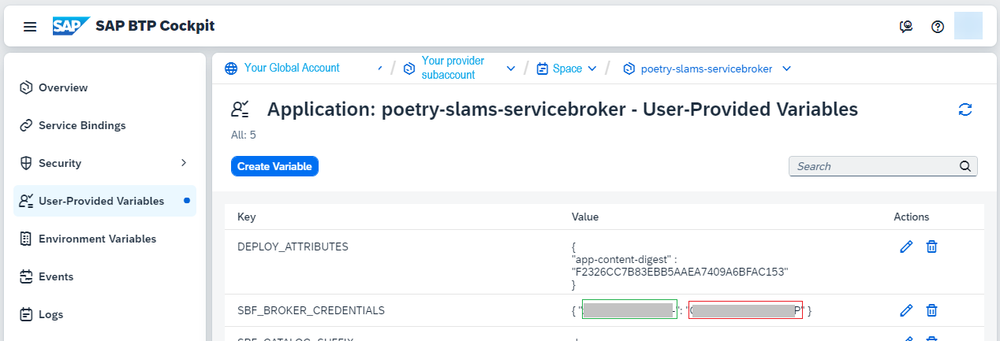

# Configure and Consume the APIs of the SAP BTP Application

In the previous steps ([Enhance the SAP BTP Application by a Service Broker](./42a-Multi-Tenancy-Service-Broker.md)), you added the service broker to the core of the application and deployed it to the provider SAP BTP subaccount.

The service broker is used to enable access to application OData services using tenant-specific credentials and authorizations taking into account the tenant isolation of an multi-tenant application. 

In this section, you learn how to configure and consume the APIs of the SAP BTP application in the consumer SAP BTP subaccount.

## Configure the Service Broker in a Consumer SAP BTP Subaccount

In general, there are two approaches to create a service broker instance in the consumer subaccount: You can either use the Cloud Foundry command line interface (CLI) or the SAP BTP command line interface (CLI): 
- The Cloud Foundry command line interface requires you to activate SAP BTP Cloud Foundry runtime (without quota) in your subaccount. 
- When using the SAP BTP command line interface, there's no need to activate SAP BTP Cloud Foundry runtime. 

This section describes how to use the SAP BTP command line interface. For more details, go to the [SAP BTP command line interface documentation](https://help.sap.com/docs/btp/sap-btp-neo-environment/download-and-start-using-btp-cli-client).

1. As the SAP BTP command line interface is not installed in SAP Business Application Studio by default, first, you need to install it. Use the statements below in a terminal in your SAP Business Application Studio from the root folder of your project:

     1. Download the CLI automatically accepting the licence agreement.

        ```
        curl -LJO https://tools.hana.ondemand.com/additional/btp-cli-linux-amd64-2.54.0.tar.gz --cookie eula_3_1_agreed=tools.hana.ondemand.com/developer-license-3_1.txt
        ```

     2. Decompress the downloaded file.

        ```
        tar -xvzf btp-cli-linux-amd64-2.54.0.tar.gz
        ```

     3. Create a new folder called *cli*.

        ```
        mkdir cli
        ```

     4. Copy the CLI into the new folder.
     
        ```
        cp ./linux-amd64/btp cli
        ```

     5. Clean up.

        ```
        rm -rf btp-cli-linux-amd64-2.54.0.tar.gz linux-amd64
        ```

     6. Add the *cli* folder to the search path.
     
        ```
        PATH=$PATH:$(pwd)/cli
        ```

2. Add the *cli/* folder to [*.gitignore*](../../../blob/main-multi-tenant-features/.gitignore).

3. Log on to SAP BTP. To set the consumer account as your target:

   1. Log on to the SAP BTP global account. Use the default URL.

      ```
      btp login
      ```
   
   2. Determine the ID of the consumer subaccount. It's required in the next step.

      ```
      btp list accounts/subaccounts
      ```

   3. Set the subaccount of the consumer as target.
      
      ```
      btp target --subaccount <subaccount id of the consumer account>
      ```

4. Register the consumer subaccount with the service broker of the provider subaccount.

   1. Get the URL of the provider service broker.

      i. In the SAP BTP cockpit of the provider subaccount, navigate to the SAP BTP Cloud Foundry runtime space where the application is deployed.

      ii. In the space cockpit, navigate to *Applications* and click on the link *poetry-slams-servicebroker*.

      iii. Copy the *Application Route* from the *Application Overview* for later usage (**provider service broker URL**).

   2. Get the credentials of the provider service broker.

      i. Go to *User-Provide Variables* in the *Application Cockpit* of the service broker.

      ii. Copy the values of *SBF_BROKER_CREDENTIALS*: The first value is the user (marked in green in the image below), the second is the password (marked in red).

       

   3. Use the information from above (**provider service broker url**, **user**, **password**) to register the consumer subaccount with the service broker. Run this command in the CLI:

      ```
      btp register services/broker --name poetry-slams-servicebroker --url <provider service broker url> --user "<user>" --password "<password>" --subaccount <consumer subaccount id>
      ```

      > Note: In the previous section about [Enabling API Access of SAP BTP Applications Using Service Broker](./42a-Multi-Tenancy-Service-Broker.md), a generated user/password combination was introduced in the provider subaccount. This means that this combination will get regenerated with new values during every redeployment. Nevertheless, the service keys that you create below will still work. However, for new subscriptions, use the updated values.

5. Create an instance of the service broker in the consumer subaccount.
   1. Run the following command.
     ```
     btp create services/instance --subaccount <consumer subaccount id> --plan-name fullaccess --offering-name psm-servicebroker-dev --parameters '{ "xs-security": { "xsappname": "psm-sb-sub1-full", "oauth2-configuration": { "credential-types": ["binding-secret"] } } }' --name psm-sb-sub1-full
     ```
   2. Afterward, you will find the instance in the SAP BTP consumer subaccount cockpit under *Services* - *Instances and Subscriptions* - *Instances*.

6. To create credentials for the consumer service broker, run the command:
     ```
     btp create services/binding --subaccount <consumer subaccount id> --binding binding_full --instance-name psm-sb-sub1-full
     ```

7. Read the credentials.
   1. Run the following command.
     ```
     btp list services/binding
     btp get services/binding --name binding_full
     ``` 
   2. The relevant information of the output is in the section *credentials*. In that section, note down these values:
      - `uaa.url` as **Service Key UAA-URL**: the URL to retrieve an access token.
         > Note: Make sure that you use the correct value, for example, NOT `uaa.apiurl`!
      - `uaa.clientid` as **Service Key UAA Client-ID**: the credential (client ID) required to retrieve an access token from `uaa.url`.
      - `uaa.clientsecret` as **Service Key UAA Client-Secret**: the credential (client secret) required to retrieve an access token from `uaa.url`.
      - `endpoints.psm-servicebroker` as **Service Key API-Endpoint** - the URL where you can read the business data while providing an access token.

With these details, you're ready to explore and test the OData services.

### Alternatively: Use the SAP BTP Subaccount Cockpit

Alternatively, you can perform the steps 5, 6, and 7 of the description above in the SAP BTP cockpit of the consumer subaccount. The results are the same, but you might find the procedure more straightforward: 

5. Create an instance of the service broker in the consumer subaccount:
   1. In the SAP BTP cockpit of the consumer subaccount, go to *Services* and *Service Marketplace*. 
   2. Search for the tile with the name and description defined in the *catalog.json* of the *broker* folder (in the Partner Reference Application: *psm-servicebroker-dev* / *PSM service broker*, the suffix *-dev* is the space in the provider subaccount where the application is deployed). 
   3. In the *Actions* menu of this tile, choose *Create*.
   4. In the pop-up message, you can choose from the plans that you previously defined, referring to different authorizations (in the Partner Reference Application: *fullaccess* or *readonlyaccess*).
   5. Use the default *Runtime Environment* (*Other*).  
   6. Choose a name that is unique accross the global account. To do so, the name could include a suffix identifying the consumer tenant and the plan such as `psm-sb-sub1-full`.
   7. Choose *Next* and enter the JSON below using the name you set in the previous step:
      ```
      { "xs-security": { "xsappname": "psm-sb-sub1-full", "oauth2-configuration": { "credential-types": ["binding-secret"] } } }
      ```
   8. Choose *Create*.
   9. Afterward, you will find the instance in the SAP BTP consumer subaccount cockpit under *Services* - *Instances and Subscriptions* - *Instances*.

6. Create credentials for the consumer service broker:
   1. In the SAP BTP consumer subaccount cockpit, go to *Services*, *Instances and Subscriptions*, and *Instances*. 
   2. Open the *Actions* menu of the service broker instance you just created. 
   3. Select *Create Service Binding* and choose a name for the binding, for example, `binding_full`.

7. Read the credentials:
   1. In the SAP BTP consumer subaccount cockpit, go to *Services*, *Instances and Subscriptions*, and *Instances*. 
   2. Click on the link of the service binding. When you view the created credentials, copy the values of the fields
   
      - `uaa.url` as **Service Key UAA-URL**: the URL to retrieve an access token.
         > Note: Make sure that you use the correct value, for example, NOT `uaa.apiurl`!
      - `uaa.url` as **Service Key UAA-URL**: the URL to retrieve an access token.
         > Note: Make sure that you use the correct value, for example, NOT `uaa.apiurl`!
      - `uaa.clientid` as **Service Key UAA Client-ID**: the credential (client ID) required to retrieve an access token from `uaa.url`.
      - `uaa.clientsecret` as **Service Key UAA Client-Secret**: the credential (client secret) required to retrieve an access token from `uaa.url`.
      - `endpoints.psm-servicebroker` as **Service Key API-Endpoint**
      - the URL where you can read the business data while providing an access token.
     
         

With these details, you're ready to explore and test the OData services.

## Consume the Application APIs

There are two ways to consume the application APIs: via a technical user or a named user.
However, the technical user is preferred when using the OData services within an automatic (background) process where the login cannot be forwarded to the IdP logon and, hence, no "named" user can be authenticated.

### Consume the Application APIs as a Technical User

Technical users to consume APIs are required when the APIs of the Poetry Slam Manager application are consumed from a background process. In this case, you can get an access token with the values from the service binding noted down previously.

To do so, execute the following HTTP requests using the `curl` command:

1. Get an access token for authorization.
   ```
   curl "<Service Key UAA-URL>/oauth/token?grant_type=client_credentials&response_type=token" -u '<Service Key UAA Client-ID>:<Service Key UAA Client-Secret>'
   ```
2. Extract the **access_token** from the response.

3. Get the poetry slams (using the access token).
   ```
   curl <Service Key API-Endpoint>/odata/v4/poetryslammanager/PoetrySlams -H "Authorization: Bearer <access token>"
   ```

More samples are provided within [ServiceBroker_TechnicalAccess.http](./api-samples/ServiceBroker_TechnicalAccess.http). They can be tested with the pre-installed SAP Business Application Studio plug-in REST Client.

### Consume the Application APIs as a Named User (Principal Propagation)

In other use cases, you want to consume the services with principal propagation:
You use a regular user that logs on to the IdP. An example could be an SAP Build application that has its own UI, but needs to consume the APIs of the Poetry Slam Manager application. In this case, you don't want to use a technical user, but use the logon of a regular user with user-specific authorizations.

You can test this scenario using Postman. In the folder [*api-samples*](./api-samples/), you find a Postman collection and a Postman environment with some examples. Check the documentation of the Postman collection for further details about how to run the examples.