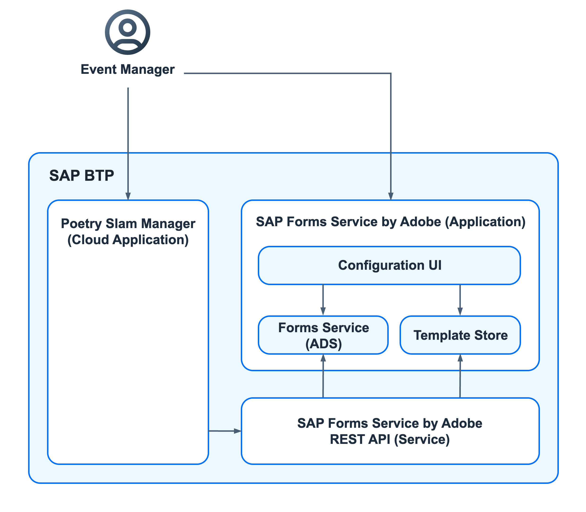

# Manage Forms

Put yourself in the shoes of a poetry slam manager who uses a poetry slam management application to manage the events. A guest list helps to ensure a smooth reception of the guests and artists at the entrance of the event location. 

Use the SAP Forms service by Adobe to manage print and interactive forms. For more information, refer to [SAP Forms Service by Adobe](https://help.sap.com/docs/forms-service-by-adobe/sap-forms-service-cf/sap-forms-service-by-adobe?version=Cloud) on SAP Help Portal.

## Bill of Materials

### Entitlements
In addition to the entitlements listed for the [multitenancy version](./20-Multi-Tenancy-BillOfMaterials.md), the list shows the entitlements that are required in the different subaccounts to add forms. 

| Subaccount    |  Entitlement Name                         | Service Plan          | Type          | Quantity                  | 
| ------------- |  ---------------------------------------- | -----------------     | ------------- | ------------------------- |
| Provider      |                                           |                       |               |                           |
|               | SAP Forms service by Adobe                | default (Application) | Application   | 1                         | 
|               | SAP Forms service by Adobe API            | standard              | Service       | 1                         | 

### Applications
To enable the feature the _Adobe LiveCycle Designer_ application, which is provided by SAP, needs to be downloaded and installed on the local machine.

## Architecture
You can use the SAP Forms service by Adobe REST API to call the service from a cloud application, and the SAP Forms service configuration UI to customize rendering behaviour. Use the Adobe LiveCycle Designer to create a form.

1. **Adobe LiveCycle Designer**: Supports you in creating templates for interactive and print forms by providing a wide set of design functions. The created form is then uploaded to the Template Store of the SAP Forms service by Adobe. For more information, refer to [Using the Adobe LiveCycle Designer](https://help.sap.com/docs/forms-service-by-adobe/sap-forms-service-cf/using-adobe-livecycle-designer) on SAP Help Portal.

    > Note: When creating a form in the Adobe LiveCycle Designer, make sure to disable JavaScript for your PDF to avoid potential security risks.

2. **SAP Forms Service by Adobe Application**

    1. Template Store: Use the SAP Forms service template store to save and organize forms, template files, and schema files, and the SAP Forms service template store UI to create forms and assign templates and schemas to them. 
        For more information, refer to [Template Store API Endpoints](https://help.sap.com/docs/forms-service-by-adobe/sap-forms-service-cf/template-store-api-endpoints) and [Template Store UI](https://help.sap.com/docs/forms-service-by-adobe/sap-forms-service-cf/template-store-ui) on SAP Help Portal.

    2. Configuration UI: Use the configuration tool to manage your SAP Forms service settings, custom fonts, job profiles, and support files. For more information, refer to [Configuration Tool](https://help.sap.com/docs/forms-service-by-adobe/sap-forms-service-cf/configuration-tool) on SAP Help Portal.


3. **SAP Forms Service by Adobe REST API**: Access the template store to get the data from SAP Forms service by Adobe and use it in the SAP BTP application. For more information, refer to [SAP Forms Service by Adobe REST API](https://help.sap.com/docs/forms-service-by-adobe/sap-forms-service-cf/sap-forms-service-by-adobe-rest-api) on SAP Help Portal.

<p align="center">
    
</p>

## How to Enhance the Application Step by Step

To explore this feature with the Poetry Slam Manager, you have two options: 

1. Clone the repository of the Partner Reference Application. Check out the [*main-multi-tenant*](../../../tree/main-multi-tenant) branch and enhance the application step by step. 

2. Alternatively, check out the [*main-multi-tenant-features*](../../../tree/main-multi-tenant-features) branch where the feature is already included. 

The following describes how to enhance the **main-multi-tenant** branch (option 1).

### Application Enablement 

1. Add the API to access the SAP Forms service by Adobe. 

    1. The SAP Forms service by Adobe API REST API is available on SAP API Business Hub. Download the metadata file (*.json* file) from the *API Specification* section:
        - [*Forms Service by Adobe API (Cloud Foundry)*](https://api.sap.com/api/CF_ADSRestAPI/overview) 

    2. Rename the downloaded metadata file to *FORMSAPI.json*.
    
    3. In SAP Business Application Studio, upload the [*FORMSAPI.json*](../../../tree/main-multi-tenant-features/external_resources/FORMSAPI.json) to the [*external_resources* folder](../../../tree/main-multi-tenant-features/external_resources).     
    
    4. Enhance the npm build script in the [*package.json*](../../../tree/main-multi-tenant-features/package.json) of your project to generate the API that is required to access the SAP Forms Service by Adobe.     

        ```json
        "scripts": {
            "prebuild": "npx openapi-generator --input external_resources/FORMSAPI.json --outputDir srv/external --transpile true --overwrite"
        }
        ```

    5. Add the folder `srv/external/` to the [.gitignore file](../../../tree/main-multi-tenant-features/.gitignore). Since the files of the forms API will always be generated during the build step they should not be pushed to GitHub.

        ```
        srv/external/
        ```

    6. Add the [logo](../../../tree/main-multi-tenant-features/srv/poetryslam/sample_data/poetrySlamLogo.jpg) with file name poetrySlamLogo.jpg for your generated form to path *srv/poetryslam/sample_data/*. This can be replaced by a customer-specific logo.

2. Enhance the poetry slam service.

    1. Add a new read-only and not persisted entity *PDFDocument* to the [poetry slam service](../../../tree/main-multi-tenant-features/srv/poetryslam/poetrySlamService.cds). The *ID* is the ID of the poetry slam. It is used to read the poetry slam data, such as event description and visitors. The *content* element indicates that it contains media data through the LargeBinary datatype and the *@Core.MediaType* annotation, refer to [Reading LargeBinary/BLOB - capire documentation](https://cap.cloud.sap/docs/guides/databases#reading-largebinary-blob). As soon as a redirect to *../PDFDocument/content* is done, a custom media stream is created and returned as response, refer to the capire documentation on [Custom Streaming](https://cap.cloud.sap/docs/node.js/best-practices#custom-streaming-beta).
    
        ```cds
        // Generated PDF document with SAP Forms Service by Adobe
        @readonly  @cds.persistence.skip
        entity PDFDocument {
            key ID        : UUID;

                @Core.MediaType  : mediaType
                content       : LargeBinary;

                @Core.IsMediaType: true
                mediaType : String;
        }
        ```

    2. Copy the forms class [*forms.js*](../../../tree/main-multi-tenant-features/srv/lib/forms.js) to your project. The forms class handles the usage of the SAP Forms service by Adobe API. 

    3. Provide a translatable text for the file name in [*srv/i18n/i18n.properties*](../../../tree/main-multi-tenant-features/srv/i18n/i18n.properties). Add the corresponding translation to the language-specific file [*srv/i18n/i18n_de.properties*](../../../tree/main-multi-tenant-features/srv/i18n/i18n_de.properties).
        ```
        guestList               = Guest List
        ```

        > Note: The function *getFileName* in the file *forms.js* provides an example of how to access the texts (in the user's language) using the cds i18n module [cds.i18n.labels](https://cap.cloud.sap/docs/node.js/cds-i18n#labels).

    4. Copy the logo class [*logo.js*](../../../tree/main-multi-tenant-features/srv/lib/logo.js) to your project. 

    5. Copy the service credentials class [*serviceCredentials.js*](../../../tree/main-multi-tenant-features/srv/lib/serviceCredentials.js) to your project. This class offers functionality to get the required logon to bound services (like the SAP Forms Service by Adobe API).

    > Note: The `getAppUrl`-function is not required for the forms feature and can be removed.

    6. Copy the [poetry slam service output management implementation](../../../tree/main-multi-tenant-features/srv/poetryslam/poetrySlamServiceOutputImplementation.js) with an on-READ event of the *PDFDocument* entity to your project. The implementation reads the poetry slam data including artists and visitors. Furthermore, it creates the form with the data and returns a media streaming object that includes the rendered PDF, a valid content type, and a file name for the guest list which is to be downloaded as PDF.
        ```javascript
        const cds = require('@sap/cds');

        const Forms = require('../lib/forms');
        ...
        module.exports = async (srv) => {
            const { PDFDocument, PrintQueues } = srv.entities;
            ...
            srv.on('READ', PDFDocument, async () => {
                ...
            });
        };
        ```

    7. Add the output management implementation handler to the [srv/poetryslam/poetrySlamServiceImplementation.js](../../../tree/main-multi-tenant-features/srv/poetryslam/poetrySlamServiceImplementation.js).
    
        ```javascript
        const outputHandler = require('./poetrySlamServiceOutputImplementation');
        module.exports = class extends cds.ApplicationService {
            async init() {
                ...
                 await outputHandler(this); // Forward handler for output
                ...
            }
        };
        ```

3. Enhance the Fiori elements UI of the *Poetry Slams* application. 

    1. Enhance the [manifest.json](../../../tree/main-multi-tenant-features/app/poetryslams/webapp/manifest.json) to add a button to the header of the poetry slams object page which triggers the guest list creation. The button is only enabled in read-only mode.
         ```json
        "CreateGuestList": {
            "press": "poetryslams.ext.customActions.createGuestList",
            "visible": "{= ${ui>/editMode} !== 'Editable'}",
            "enabled": "{= ${ui>/editMode} !== 'Editable'}",
            "text": "{i18n>createGuestList}"
        }
        ```   

    2. Add the custom action implementation of the *CreateGuestList* button in the [customActions.js](../../../tree/main-multi-tenant-features/app/poetryslams/webapp/ext/customActions.js). The action redirects to read the element *content* of the *PDFDocument* entity with the ID of the currently displayed poetry slam. The service responds with the downloaded guest list PDF file. 
        
        1. Add the *createGuestList* function.

            ```js
            createGuestList: function (oBindingContext) {
                const poetrySlamID = oBindingContext.getObject().ID;
                const oModel = this._controller.getView().getModel();
                // Redirect to guest list creation endpoint
                sap.m.URLHelper.redirect(
                    oModel.sServiceUrl + `PDFDocument(${poetrySlamID})/content`,
                    true
                );
            }
            ``` 

    3. Add the texts into the [*/app/poetryslams/webapp/i18n/i18n.properties* file](../../../tree/main-multi-tenant-features/app/poetryslams/webapp/i18n/i18n.properties).

        ```
        #XBUT
        createGuestList         = Create Guest List
        ```

        > Note: In the reference example, the [*/app/poetryslams/webapp/i18n/i18n_de.properties*](../../../tree/main-multi-tenant-features/app/poetryslams/webapp/i18n/i18n_de.properties) file with the German texts is also available. You can adopt them accordingly.
    
4. Add the required npm modules as dependencies to the *package.json* of your project. Refer to the file [package.json](../../../tree/main-multi-tenant-features/package.json) of the sample application.
    
    1. Open a terminal.
    
    2. Run the command `npm add @sap-cloud-sdk/openapi`. The package handles the HTTP requests to the SAP Forms service by Adobe. 

    3. Run the command `npm add -D @sap-cloud-sdk/openapi-generator`. The generator is used to create your own service module using an OpenAPI specification. 

    4. Run the command `npm add xml-escape`. This handles the xml escaping of the poetry slam data during runtime.

    5. Run the command `npm add fast-xml-parser`. The package converts a java script object to an XML string. 

    6. Run the command `npm add stream`. The package supports streaming objects to the browser. 
    
    7. Run the command `npm install` in your project root folder to install the required npm modules for the application. 

### SAP BTP Configuration and Deployment

1. Open the SAP BTP cockpit of the provider subaccount and add the required entitlements:
    
     1. *Forms Service by Adobe* with the *default (Application)* plan to access the SAP Forms service UIs (Adobe Document Services configuration and template store UI).

     2. *Forms Service by Adobe API* with the *standard* plan to connect to the forms service using the SAP BTP application and thus the REST API.

2. Add the SAP Forms service by Adobe API service as resource into the [mta.yaml](../../../tree/main-multi-tenant-features/mta.yaml) file. Besides this, the resource is required as dependency in the service and mtx modules.

    ```yaml
    modules:
        - name: poetry-slams-srv
          requires:
            - name: poetry-slams-adsrestapi

        - name: poetry-slams-mtx
          requires:
            - name: poetry-slams-adsrestapi

    resources:
        # Adobe Forms REST API Service
        - name: poetry-slams-adsrestapi
          type: org.cloudfoundry.managed-service
          parameters:
            service: adsrestapi
            service-plan: standard
    ```
3. Run the command `npm install` in your project root folder to install the required npm modules. 

4. Build and deploy the application. As a result, an SAP Forms service by Adobe API instance named *poetry-slams-adsrestapi* is created.
    > Note: For detailed instructions on how to deploy, refer to [Deploy Your SAP BTP Multi-Tenant Application](./24-Multi-Tenancy-Deployment.md).

5. Open the menu item *Service Marketplace* in the SAP BTP cockpit and create an instance of *Forms Service by Adobe* with the *default* plan.
      
      > Note: A new application called Forms Service by Adobe is added. 

6. To enable you to configure and store form templates:    

    1. Open the *Role Collections* menu item and create a new role collection called `ADSAdmin`.
    2. Edit the role collection. 
    3. Add the *ADSAdmin* and *TemplateStoreAdmin* roles to access the template store UI and the configuration tool of Adobe Document Services (ADS).
    4. Add the users who should be allowed to upload and configure the forms.

### Form Creation and Upload
After you have deployed your application with the SAP Forms service by Adobe, you need to upload the form to the template store:

> Note: The usage of the template store UI is described in [Manage Forms, Templates and Schemas (UI)](https://help.sap.com/docs/forms-service-by-adobe/sap-forms-service-cf/manage-forms-templates-and-schemas-ui) on SAP Help Portal.

1. Open the *Forms Service by Adobe* application in the SAP BTP cockpit.

2. Select *Template Store*.   

3. Create a new form named *ps_bookings_list_form*.

4. Upload a template:
    
    1. Download the form [template for the reference application](./output_management/44_ps_bookings_list_template.xdp).
        
    2. Select the newly created form and choose *Upload* in the *TEMPLATES* section.

    3. Name the template *ps_bookings_list_template*.
        
    4. Choose the downloaded template in the *Upload Template* step.

    5. Add the template.
    
5. Assign a schema:

    1. Download the form [schema for the reference application](./output_management/44_ps_bookings_list_form_schema.xsd).

    2. In the *SCHEMA* section, select *Upload*.

    3. Choose the downloaded schema and upload it.

6. Make sure to adjust the form and schema variable in the [forms class *forms.js*](../../../tree/main-multi-tenant-features/srv/lib/forms.js) according to the name of the uploaded form and schema file given in the template store.

7. If the provided template and schema was used, the SAP custom font `72` needs to be uploaded to the configuration UI. To enable the SAP Forms service by Adobe to render the PDF correctly, the font needs to be provided since it was used for the template creation. Font 72, desktop version, can be downloaded [here](https://experience.sap.com/fiori-design-web/downloads/). How to upload a custom font to the SAP Forms service by Adobe, is described in [Upload a Font](https://help.sap.com/docs/forms-service-by-adobe/sap-forms-service-cf/upload-fonts?version=Cloud).

> Note:  If you want to create your own form, you can use the [Adobe LiveCycle Designer](https://help.sap.com/docs/forms-service-by-adobe/sap-forms-service-cf/using-adobe-livecycle-designer?locale=en-US). You can download the latest version of the Adobe LiveCycle Designer from [SAP for Me](https://me.sap.com/softwarecenter). This service is only available for Microsoft Windows.

### Testing

To ensure good quality it is crucial to test the new functionality.

#### Hybrid Testing

Testing in a hybrid setup, runs the application locally (in SAP Business Application Studio), but using services on the SAP BTP, running in the Cloud Foundry runtime. Enable hybrid testing by setting up the required configuration in your SAP BTP subaccount and your development environment in SAP Business Application Studio.

1. In the SAP BTP provider account, navigate to the Cloud Foundry space.

2. Navigate to the application module. In the reference application this is called *poetry-slams-srv*.

3. Open the *Environment Variables*.

4. Create a file named *default-env.json* in the *root* folder of your project. Ensure that the file is not uploaded to your version management control system.

5. Copy the VCAP environment variables of the *adsrestapi* to the *default-env.json*. The file should have this structure:

    ```json
    {
        "VCAP_SERVICES" : {
            "adsrestapi": [
                {
                    ...
                }
            ]
        }
    }
    ```

    > Note: If you use other features, such as Audit Log, you need to copy these environment variables, too.

6. Execute `npm install` in a terminal to install the node modules.

7. Execute `npm run prebuild` to generate access classes to the external forms API.

8. Execute `npm run start` to start the application considering the VCAP environment variables.

9. Once you are ready, you can test the feature as implemented.

#### Unit Tests

Unit tests are available to test the forms feature:

1. Copy the [test/srv/poetryslam/poetrySlamServiceOutputImplemention.test.js](../../../tree/main-multi-tenant-features/test/srv/poetryslam/poetrySlamServiceOutputImplemention.test.js) to your project. This file checks the enhancements of the poetry slam service.

2. Copy the [test/srv/lib/forms.test.js](../../../tree/main-multi-tenant-features/test/srv/lib/forms.test.js) to your project. This file checks the forms class.

3. To run the automated SAP Cloud Application Programming Model tests:

    1. Enter the command `npm install` in a terminal in SAP Business Application Studio.
    2. Execute the command `npm run prebuild` to run the forms API generator.
    3. Enter the command `npm run test`. 

## A Guided Tour to Explore the Forms Feature

Now it is time to take you on a guided tour through the forms feature of Poetry Slam Manager: 

1. Open the SAP BTP cockpit of the customer subaccount.

2. Open the Poetry Slams application. 

3. To create sample data for mutable data, such as poetry slams, visitors, and visits, choose *Generate Sample Data*. As a result, a list with several poetry slams is shown.
    > Note: If you choose *Generate Sample Data* again, the sample data is set to the default values.

4. Open a poetry slam that has the status *Fully Booked*.

     > Note: Several visitors are shown in the *Bookings* list. Check that all the artists and visitors have booked the event. Adjust the bookings accordingly, if required.

5. Choose the button *Create Guest List* in the menu of the object page.

6. The SAPUI5 PDF Viewer opens showing the generated form with a list of artists and visitors of the poetry slam. A *download* button is available to download and print the guest list.
