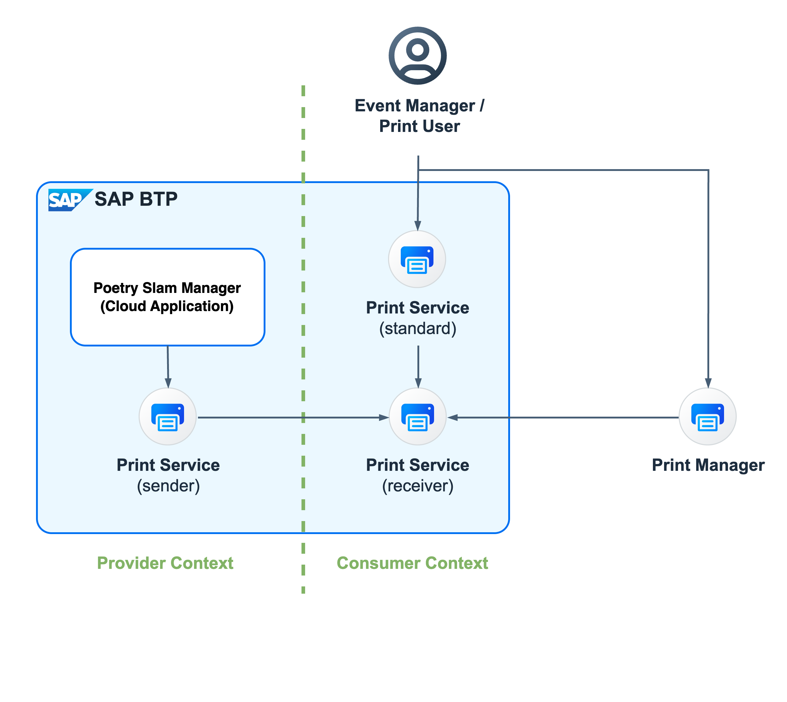

# Print Documents

Put yourself in the shoes of a poetry slam manager who uses a poetry slam management application to manage the events. Instead of creating, viewing and downloading forms, you want the guest list to be directly sent to a physical printer. Because your printer is located in your customer landscape, an SaaS cloud application like the *Poetry Slam Manager* will not have direct access to the printer. To support printing, SAP BTP offers the [SAP Print Service](https://help.sap.com/docs/SCP_PRINT_SERVICE/7615de0949ce441d8bc5df7725a6bfc6/e038be89d87c474c9af3f976e4573fc1.html).
It consists of several parts:

1. The *SAP Print Service* with service plan *sender* is a service that runs in the provider subaccount and allows you to assign documents to print queues. Print queues are the consumer-subaccount-specific storage of documents waiting to be printed.
2. The *SAP Print Service* with service plan *standard* is an application that runs in a consumer subaccount and allows you to create and manage the print queues. 
3. The *SAP Print Service* with service plan *receiver* is a service running in a consumer subaccount. It provides the credentials to pull documents from SAP BTP to the customer landscape.
4. The *SAP Print Manager* is a Windows application that runs on a customer's computer. It regularly pulls documents from print queues (using the *receiver* credentials) and sends them to a local printer.

<p align="center">
    
</p>

## Bill of Materials

### Entitlements
In addition to the entitlements listed for the [multitenancy version](./20-Multi-Tenancy-BillOfMaterials.md), the list shows the entitlements that are required in the different subaccounts to add printing. 

| Subaccount    |  Entitlement Name                         | Service Plan          | Type          | Quantity                  | 
| ------------- |  ---------------------------------------- | -----------------     | ------------- | ------------------------- |
| Provider      |                                           |                       |               |                           |
|               | SAP Print service                         | sender                | Service       | 1                         | 
| Consumer      |                                           |                       |               |                           |
|               | SAP Print service                         | standard              | Application   | 1                         | 
|               | SAP Print service                         | receiver              | Service       | 1                         | 

## Guide How to Enhance the Application Step by Step

To explore this feature with the Poetry Slam Manager, you have two options: 

1. Clone the repository of the Partner Reference Application. Check out the [*main-multi-tenant*](../../../tree/main-multi-tenant) branch and enhance the application step by step. 

2. Alternatively, check out the [*main-multi-tenant-features*](../../../tree/main-multi-tenant-features) branch where the feature is already included. 

The following describes how to enhance the **main-multi-tenant** branch (option 1).

### Enabling Printing in the Poetry Slams Application

1. As you will print the guest list which you created based on chapter [Manage Forms](./44a-Multi-Tenancy-Features-Forms.md) follow all enablement steps described there first. 

2. Generate access classes to the SAP Print Service API.

    1. Download the definition of the [SAP Print Service API](https://api.sap.com/api/PRINTAPI/overview) which you can find on the overview page under *API Specification* as *JSON* .

    2. Copy the downloaded openAPI definition file (*PRINTAPI.json*) to the folder *external_resources*.

    3. Add a `prebuild` script to your [*package.json*](../../../tree/main-multi-tenant-features/package.json). This will generate the access classes out of the uploaded definition whenever you run the `npm run build` command. If you need to execute several commands in the *prebuild* step, you can concatenate them with `&&`.
        ```json
        "prebuild": "npm ci && npx openapi-generator --input external_resources/PRINTAPI.json --outputDir srv/external -t --overwrite && npx openapi-generator --input external_resources/FORMSAPI.json --outputDir srv/external -t --overwrite",
        ```

    4. Add the folder for the generated files to [*.gitignore*](../../../tree/main-multi-tenant-features/.gitignore).
        ```
        # generated openapi artefacts
        srv/external/
        ```

    5. Add `@sap-cloud-sdk/openapi` to the `dependencies` of your *package.json* by running `npm add @sap-cloud-sdk/openapi`.

    6. Add `@sap-cloud-sdk/openapi-generator` to the `devDependencies` of your *package.json* by running `npm add -D @sap-cloud-sdk/openapi-generator`.

    7. Run the command `npm install` in your project root folder to install the required npm modules for the application. 

    8. Run `npm run prebuild` to generate the access classes.

3. Extend your service by an action `Print Guest List`.

    1. Extend *srv/poetryslam/poetrySlamService.cds* with a new action `printGuestList`. The action has a parameter `printQueue`. The calculated entity `PrintQueues` is used for the value help of the action parameter:
        ```cds
        ...
        entity PoetrySlams as
            ...;
            actions {
                ...;
                // Action: print visitor list
                action printGuestList(
                            @(
                              title:'{i18n>selectPrintQueue}',
                              mandatory:true,
                              Common:{
                                ValueListWithFixedValues: true,
                                ValueList               : {
                                  $Type         : 'Common.ValueListType',
                                  CollectionPath: 'PrintQueues',
                                  Parameters    : [
                                    {
                                      $Type            : 'Common.ValueListParameterInOut',
                                      ValueListProperty: 'name',
                                      LocalDataProperty: printQueue
                                    },
                                    {
                                      $Type            : 'Common.ValueListParameterDisplayOnly',
                                      ValueListProperty: 'descr'
                                    }
                                  ]
                                },
                              }
                            )
                            printQueue : String);
            };

        // PrintQueues (virtual entity for value help)
        @readonly
        @cds.persistence.skip
        entity PrintQueues {
            key name  : String;
                descr : String;
        };
        ```

    3. Provide an implementation for the action in [*srv/poetryslam/poetrySlamServiceOutputImplementation.js*](../../../tree/main-multi-tenant-features/srv/poetryslam/poetrySlamServiceOutputImplementation.js)
        ```javascript
        const { getPrintQueues, print } = require('../lib/print');
        ...
        module.exports = async (srv) => {
            ...
            // Entity action "printGuestList": Create a Form (PDF) and send it to the SAP Print Service
            srv.on('printGuestList', async (req) => {
                ...
            });
            // Virtual Entity PrintQueues
            srv.on('READ', 'PrintQueues', async () => {
                ...
            });
        };
        ```

    4. Copy the implementation of [srv/lib/print.js](../../../tree/main-multi-tenant-features/srv/lib/print.js). This file contains the logic to call the SAP Print Service APIs (read print queues, create documents, create print tasks).

    5. Provide translatable messages for your implementation in [*srv/i18n/messages.properties*](../../../tree/main-multi-tenant-features/srv/i18n/messages.properties). Add the corresponding translation to the language-specific file [*srv/i18n/messages_de.properties*](../../../tree/main-multi-tenant-features/srv/i18n/messages_de.properties).
        ```
        ACTION_PRINT_NO_ACCESS                                  = Access to print service not possible.
        ACTION_PRINT_NO_QUEUE                                   = No print queue available.
        ACTION_PRINT_NO_DOCUMENT                                = Document could not be sent to print queue.
        ACTION_PRINT_NO_PRINTTASK                               = Print task could not be created.
        ACTION_PRINT_FAIL                                       = Printing not possible.
        ACTION_PRINT_SUCCESS                                    = Document "{0}" sent to print queue "{1}".

        ```

    6. Use the implementation in [*srv/poetryslam/poetrySlamServiceImplementation.js*](../../../tree/main-multi-tenant-features/srv/poetryslam/poetrySlamServiceImplementation.js)
        ```js
        const outputHandler = require('./poetrySlamServiceOutputImplementation');

        module.exports = cds.service.impl(async (srv) => {
            ...
            await outputHandler(srv); // Forward handler for output
            ...
        });
        ```

 4. Add the action to the user interface of your application.

    1. Add an action to the Poetry Slam Object page by annotating `Identification` of the `UI` of `service.PoetrySlams` in *annotations.cds*:
        ```cds
        // Print the guest list
        {
          $Type : 'UI.DataFieldForAction',
          Action: 'PoetrySlamService.printGuestList',
          Label : '{i18n>printGuestList}',
          ![@UI.Hidden]: {$edmJson: {$Not: {$Path: 'IsActiveEntity'}}}
        }
        ```

        > Note: The action is only available for saved poetry slams, not for drafts.

    2. Provide the translatable texts for the button label, action parameter and file name in [*srv/i18n/i18n.properties*](../../../tree/main-multi-tenant-features/srv/i18n/i18n.properties). Add the corresponding translation to the language-specific file [*srv/i18n/i18n_de.properties*](../../../tree/main-multi-tenant-features/srv/i18n/i18n_de.properties).
        ```
        printGuestList          = Print Guest List
        selectPrintQueue        = Select Print Queue
        guestList               = Guest List
        ```

### SAP BTP Configuration and Deployment

1. Add the *Print Service* as a resource to your application.

    1. Add the resource in [*mta.yaml*](../../../tree/main-multi-tenant-features/mta.yaml).
        ```yaml
        modules:
        - name: poetry-slams-srv
            requires:
            - name: poetry-slams-print-service
        
        - name: poetry-slams-mtx
            requires:
            - name: poetry-slams-print-service

        resources:
          # SAP Print Service
          - name: poetry-slams-print-service
            type: org.cloudfoundry.managed-service
            parameters:
              service: print
              service-plan: sender
        ```

    2. Register the service in the multi-tenant environment [*mtx/sidecar/package.json*](../../../tree/main-multi-tenant-features/mtx/sidecar/package.json) (see [SaaS Registry Dependencies](https://cap.cloud.sap/docs/guides/multitenancy/#saas-dependencies)):
        ```yaml
          "cds": {
            ...
            "requires": {
              ...  
              "poetry-slams-print-service": {
                "vcap": {
                  "label": "print"
                },
                "subscriptionDependency": {
                  "uaa": "xsappname"
                }
              }
            }
          }
        ```

2. Add the entitlement for the "Print Service", plan "sender" to your provider subaccount.

3. Build the application and deploy it to your provider subaccount.

    > Note: If the application was already deployed in a previous step, you need to update the subscriptions of the application. For more information on the subscription manager, refer to [Test and Troubleshoot Multitenancy](./26-Test-Trace-Debug-Multi-Tenancy.md).

### Configuring Printing in Consumer Subaccounts

To use the print functionality, you have to maintain a print queue which is the cloud storage for documents to be printed.

1. In the SAP BTP cockpit of the consumer subaccount, in the *Entitlements*, use *Edit* and *Add Service Plans* to add the service *Print Service* with plan *standard (Application)*. Save this change to *Entitlements*.

2. In *Instances and Subscriptions* of the consumer subaccounts, create a subscription for plan *standard*.

3. In *Security* -> *Role Collections* create a role collection *PrintQueueManager*. Edit this role collection, add the role "PrintQueueSuperUser" and add *Users* and/or *UserGroups* who should be entitled to maintain print queues.

4. In *Instances and Subscriptions* create an instance of *Print Service* plan *receiver*.

    > Note: The instance name must have a length of no more than 12 characters and may consist only of letters, digits and underscore. You may choose *pq_access*.

5. For the created instance *pq_access*, use the action to *Create Servince Binding*. Use the name *access_key*.

6. In *Instances and Subscriptions*, section *Application*, click the link *Print Service*.
    1. Click *Manage Print Queues*.
    2. Click *Create*.
    3. Enter a name, for example *print_queue_consumer_01*.
    4. Enter a description, for example *Print Queue for Consumer Subaccount 01*.
    5. Enter format *PDF*.
    6. Choose print user *pq_access*.
    7. Choose *Save*.

Next, you and/or your customer need to install the *SAP Print Manager for Pull Integration* to regularly read the print queue and send the documents to a printer. Follow the documentation about [Establishing the Connection Between SAP Print Service and SAP Cloud Print Manager for Pull Integration](https://help.sap.com/docs/SCP_PRINT_SERVICE/7615de0949ce441d8bc5df7725a6bfc6/2a1a47535a5948aabf4225e1f7d24a16.html).

### Testing

#### Local Testing

To test locally (from within SAP Business Application Studio), you can connect the "local" application (started with `cds watch`) with a deployed print service and a subscription. 

1. Go to your provider subaccount in the SAP BTP cockpit and navigate to the Cloud Foundry space.

2. Click the link of the application called *poetry-slams-print-srv*.

3. Go to the *Environment Variables* and copy the whole *json* structure containing the attribute *"VCAP_SERVICES"*.

4. Go to the consumer subaccount and note down the `Tenant ID`.

5. Create a file *default-env.json* on the root folder of your project in the Business Application Studio. Copy the previously copied values into this file:
    ```json
    {
        "VCAP_SERVICES": {
            "print": [
                ...
            ],
            "adsrestapi": [
                ...
            ]
        },
        "test_tenant_id": "<Tenant ID of the consumer tenant to test with>"
    }    
    ``` 

    > Note: Since you are using the guest list that you created based on chapter [Managing Forms](./44a-Multi-Tenancy-Features-Forms.md), you will need both sections for `print` and `adrestapi`.

6. Run the application using `cds watch` from a terminal within SAP Business Application Studio. You can use a terminal of type `JavaScript Debug Terminal` for easy debugging.

#### Unit Tests for Printing

To support automatic testing of the print feature, a sample unit test implementation is provided in [*print.test.js*](../../../tree/main-multi-tenant-features/test/srv/lib/print.test.js). The test uses *stubs* to decouple from the external services.

To run the automated SAP Cloud Application Programming Model tests:

1. Enter the command `npm install` in a terminal in SAP Business Application Studio.
2. Execute the command `npm run` prebuild to run the forms API generator.
3. Enter the command `npm run test`. All tests are carried out and the result is shown afterwards.

## A Guided Tour to Explore the Print Feature

Now, take a tour through the print feature of *Poetry Slam Manager*: 

1. Open the SAP BTP cockpit of the customer subaccount.

2. Open the Poetry Slams application of the Poetry Slam Manager. 

3. To create sample data for mutable data, such as poetry slams, visitors, and visits, choose *Generate Sample Data*. As a result, a list with several poetry slams is shown.

4. Open a poetry slam and click the button *Print Guest List* in the menu of the object page. On the popup, select a print queue and choose *Print Guest List*. A popup confirms that the guest list was sent to the selected print queue.
    > Note: If no print queue is available from the drop down list box, go back to the paragraph [Configuring Printing in Consumer Subaccounts](./44b-Multi-Tenancy-Features-Print.md#configuring-printing-in-consumer-subaccounts) and maintain a print queue as described there.

5. When you open the print queue from the application *Print Service* available in the consumer subaccount, you will find the printed document. 

6. You can install the [*SAP Cloud Print Manager for Pull Integration*](https://help.sap.com/docs/SCP_PRINT_SERVICE/7615de0949ce441d8bc5df7725a6bfc6/b6f8f8352108474e865ee3c6cffdd219.html) on your local computer to regularly pull documents from print queues and send them to a local printer.
