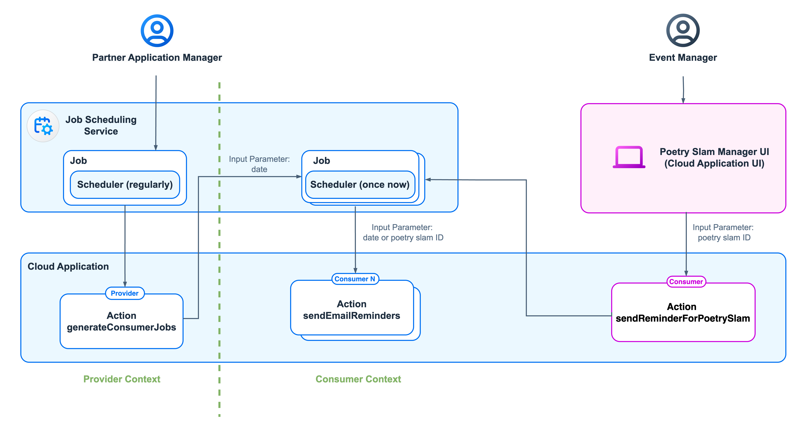

# Schedule Jobs and Add Background Execution

Jobs and background execution are required for various use cases. This tutorial covers two specific use cases:

1. Job scheduling by the partner: Imagine you host a poetry slam manager solution for several customers. You need to execute some logic for all subscribed consumers of your solution. For example, you want to schedule jobs that regularly run for poetry slam events of each consumer. For each customer using the application, a reminder email notification is sent to their visitors about upcoming poetry slam events.

2. Background execution triggered by the customer: Imagine you're a poetry slam manager using a poetry slam management solution to handle events. You want to send email notifications for a specific poetry slam asynchronously, using background execution. The status of this background execution appears on the poetry slam's object page.

For both use cases, the SAP Job Scheduling service is used to schedule jobs either regularly or as a one-time task. For more information, refer to [SAP Help for SAP Job Scheduling Service](https://help.sap.com/docs/job-scheduling/sap-job-scheduling-service/what-is-sap-job-scheduling-service). This service also offers a dashboard for job management. In a multi-tenant landscape, only the application provider can access this dashboard. Through a web-based user interface, jobs for provider instances can be created and updated. Jobs for consumers can be viewed and edited but can't be created using the dashboard.

> Note: For smaller use cases where asynchronous event handling is primarily needed, consider using the [Event-Queue framework](https://github.com/cap-js-community/event-queue). Built on top of CAP Node.js, it's designed for efficient and streamlined asynchronous event processing. However, this approach is not covered here.

## Bill of Materials

### Entitlements
In addition to the entitlements listed for the [multitenancy version](./20-Multi-Tenancy-BillOfMaterials.md), this list shows the entitlements required in the subaccounts to enable the SAP Job Scheduling service. 

| Subaccount    |  Entitlement Name                         | Service Plan          | Type          | Quantity                  | 
| ------------- |  ---------------------------------------- | -----------------     | ------------- | ------------------------- |
| Provider      |                                           |                       |               |                           |
|               | Job Scheduling Service                    | standard              | Service       | 1                         | 

## Architecture
The Partner Reference Application uses the SAP Job Scheduling service as a resource. This service needs to access the Poetry Slam Manager application to call actions for sending emails. The Poetry Slam Manager provides a new service, *JobSchedulerService*, with the actions (*generateConsumerJobs* and *sendEmailReminder*). It grants access to the SAP Job Scheduling service to call it directly from a job execution. 

For the "Job Scheduling by the partner" use case, you as a partner manually create a job in the SAP Job Scheduling dashboard once and it's scheduled to run regularly. During each run, it executes the *generateConsumerJobs* action on the application instance operating within the provider subaccount. This action creates a job for each consumer and schedules it for immediate execution. The generated consumer jobs have a *date* parameter that specifies sending emails for all poetry slams occurring up to that date. The job then calls the *sendEmailReminders* action with the *date* as a parameter in the consumer subscription. It selects the relevant poetry slams and sends notifications to the registered visitors and artists.

For the "Background execution triggered by the customer" use case, the user interface of the poetry slam object page is enhanced with a button linked to the instance-based (bound) *sendEmailReminderForPoetrySlam* action. This action is defined in the *PoetrySlamService*. It generates a job for this consumer tenant and schedules it for immediate execution. The generated job includes a *poetry slam ID* parameter, which specifies the poetry slam for which emails shall be sent. The job executes the *sendEmailReminders* action with the poetry slam ID as a parameter in the consumer subscription, selecting the relevant poetry slam and sending the emails to the registered visitors and artists.

<p align="center">
    
</p>

## How to Enhance the Application Step by Step

To explore this feature with the Poetry Slam Manager, you have two options: 

1. Clone the repository of the Partner Reference Application. Check out the [*main-multi-tenant*](../../../tree/main-multi-tenant) branch and enhance the application step by step. 

2. Alternatively, check out the [*main-multi-tenant-features*](../../../tree/main-multi-tenant-features) branch where the feature is already included. 

The following describes how to enhance the **main-multi-tenant** branch (option 1).

### Application Enablement of "Job Scheduling by the Partner" Use Case

1. As you're sending an email you configured based on chapter [Send emails](./44c-Multi-Tenancy-Features-EMail.md), follow all enablement steps described there first. 

2. Add a new OData service to the application called *jobSchedulerService*.

    1. Copy the [job scheduler service definition](../../../tree/main-multi-tenant-features/srv/jobscheduler/jobSchedulerService.cds) to a new folder `jobscheduler` in the `srv` folder. The service offers actions to send email reminders and to generate consumer jobs. Besides this, the required authorizations are defined.

    2. Copy the [job scheduler service implementation](../../../tree/main-multi-tenant-features/srv/jobscheduler/jobSchedulerServiceImplementation.js) to the `jobscheduler` folder. The file includes the registration of the actions that are triggered directly by the job scheduler.
        > Note: When the SAP Job Scheduling service invokes an application endpoint, it provides request headers like the *Job ID*, the *Job Schedule ID*, the *Job Run ID* and the *SAP Job Scheduling service Host URI*. They can be utilized to use the SAP Job Scheduling service REST APIs and Node.js Client Library. More information can be accessed in the SAP Help Portal document [Asynchronous Mode](https://help.sap.com/docs/job-scheduling/sap-job-scheduling-service/asynchronous-mode).

    3. Copy the [job scheduler action implementation](../../../tree/main-multi-tenant-features/srv/lib/jobSchedulerActionImplementation.js) to the `lib` folder in the `srv` folder. The file includes the implementation of the actions to send email reminders and to generate consumer jobs.

    4. Copy the [job scheduler class](../../../tree/main-multi-tenant-features/srv/lib/jobScheduler.js) to the `lib` folder. This class handles the access to the job scheduler service by using the Node.js module [@sap/jobs-client](https://help.sap.com/docs/job-scheduling/sap-job-scheduling-service/node-js-client-library).

    5. Copy the service credentials class [*serviceCredentials.js*](../../../tree/main-multi-tenant-features/srv/lib/serviceCredentials.js) to the `lib` folder. This class provides functionalities to obtain credentials and tokens used for the authentication to the bound services, such as the SAP Job Scheduling service. Additionally, it includes helper functions to retrieve the provider tenant and determine the application service URL.

    6. Copy the tenant manager class [*tenantManager.js*](../../../tree/main-multi-tenant-features/srv/lib/tenantManager.js) to the `lib` folder. This class offers functionality to get tenant information from the Saas Provisioning service.

    7. Add the new service to the [srv/services.cds](../../../tree/main-multi-tenant-features/srv/services.cds) file.

        ```cds
        using from './jobscheduler/jobSchedulerService';
        ```

    8. Include the success and error message texts for actions in the [*srv/i18n/messages.properties*](../../../tree/main-multi-tenant-features/srv/i18n/messages.properties) file.

        ```
        ACTION_JOB_GENERATION_STARTED                           = The job was successfully scheduled.
        ACTION_JOB_GENERATION_FAILED                            = The job scheduling failed.
        ACTION_JOB_EXECUTION_STARTED                            = Job execution triggered.
        ACTION_JOB_EXECUTION_FAILED                             = Job could not be triggered.
        ACTION_JOB_EMAIL_REMINDER_SEND_FAIL                     = The reminder email could not be sent.
        ACTION_JOB_EMAIL_REMINDER_NO_ID_OR_DATE                 = A valid Poetry Slam ID or date is missing.
        ```

        > Note: In the reference example, the [*srv/i18n/messages_de.properties*](../../../tree/main-multi-tenant-features/srv/i18n/messages_de.properties) file with the German texts is also available. You can adopt them accordingly.

    9. For local testing, define a new user in the [*.cdsrc.json*](../../../tree/main-multi-tenant-features/.cdsrc.json) file. This user has access only to the SAP Job Scheduling service.

        ```cds
        "TechnicalJobSchedulerUser": {
            "password": "welcome",
            "id": "jobservice",
            "roles": ["JobScheduler", "authenticated-user"]
        }
        ```

3. Enhance the production section in the [*package.json*](../../../tree/main-multi-tenant-features/package.json) of your project by enabling the CDS SaaS Provisioning service.     

    ```json
    "[production]": {
        "multitenancy": true,
        "cds.xt.SaasProvisioningService": true
    }
    ```

4. Add the following scope and role template to the [xs-security.json](../../../tree/main-multi-tenant-features/xs-security.json) file. It enables the SAP Job Scheduling service to access the Poetry Slam Manager application:

    ```json
    {
        "scopes": [
            ...
            {
                "name": "$XSAPPNAME.JobScheduler",
                "description": "SAP Job Scheduling Scope",
                "grant-as-authority-to-apps": [
                    "$XSSERVICENAME(poetry-slams-jobscheduler)"
                ]
            }
     
        ]
        ...
    }
    ```

5. Add the required npm modules as dependencies to the [package.json](../../../tree/main-multi-tenant-features/package.json) of your project:
    
    1. Open a terminal.
    
    2. Run the command `npm add @sap/jobs-client`. This node module integrates the SAP Job Scheduling service. 
 
    3. Run the command `npm add @sap-cloud-sdk/http-client`. This node module offers a generic http-client.    
    
    4. Run the command `npm install` in your project root folder to install the required npm modules for the application. 

### Application Enablement of "Background Execution Triggered by the Customer" Use Case

1. Enhance the poetry slam manager domain model.

    1. Enhance the `PoetrySlams` entity of the [db/poetrySlamManagerModel.cds](../../../tree/main-multi-tenant-features/db/poetrySlamManagerModel.cds) domain model with a new field that describes the job status.

        ```cds
        entity PoetrySlams : cuid, managed {
            ...
            jobStatusText         : String(255) default 'Job not triggered yet';
        }
        ```
        
    2. Annotate the `PoetrySlams` entity of the [db/poetrySlamManagerModel.cds](../../../tree/main-multi-tenant-features/db/poetrySlamManagerModel.cds) domain model with the *jobStatus*.

        ```cds
        annotate PoetrySlams with @fiori.draft.enabled {
            ...
            jobStatusText @title: '{i18n>jobStatusText}' @readonly;
        }
        ```

    3. Add the UI text for the field into the [*/db/i18n/i18n_de.properties*](../../../tree/main-multi-tenant-features/db/i18n/i18n.properties) file.

        ```
        jobStatusText               = Event Reminder Status
        ```

        > Note: In the reference example, the [*/db/i18n/i18n_de.properties*](../../../tree/main-multi-tenant-features/db/i18n/i18n_de.properties) file with the German texts is also available. You can adopt them accordingly.

2. Enhance the poetry slam service. 

    1. Add a new field named `isJobStatusShown` to the entity *PoetrySlams* in the [poetry slam service definition](../../../tree/main-multi-tenant-features/srv/poetryslam/poetrySlamService.cds). The field controls the visibility of the job scheduling status section on the user interface.

        ```cds
        virtual null                         as isJobStatusShown             : Boolean @odata.Type: 'Edm.Boolean',
        ```
    
    2. Add a new action named `sendReminderForPoetrySlam` to the entity *PoetrySlams* in the [poetry slam service definition](../../../tree/main-multi-tenant-features/srv/poetryslam/poetrySlamService.cds). The action sends an email to all visitors of a specific poetry slam.

        ```cds

        // Action: Schedule to once send E-Mail Reminder to all visitors for a specific poetry slam event
        @(
            // Determines that poetryslam entity is used when the action is performed
            cds.odata.bindingparameter.name: 'poetryslam',
            // Defines that poetryslam entity is affected and targeted by the action
            Common.SideEffects             : {TargetProperties: [
                'poetryslam/isJobStatusShown',
                'poetryslam/jobStatusText'
            ]}
        )
        action sendReminderForPoetrySlam()  returns PoetrySlams;
        ```
        
    3. Add the implementation of the *read*-handler of the poetry slam entity in the [poetry slam service](../../../tree/main-multi-tenant-features/srv/poetryslam/poetrySlamServicePoetrySlamsImplementation.js) to set the value of the `isJobStatusShown` field.

        ```js
        srv.on('READ', ['PoetrySlams.drafts', 'PoetrySlams'], async (req, next) => {

            // Read the PoetrySlams instances
            let poetrySlams = await next();

            // In this method we enrich the data from the database by external data and calculated fields
            // In case none of these enriched fields are requested, we do not need to read from the external services
            // So we first check if the requested columns contain any of the enriched columns and return if not
            const requestedColumns = req.query.SELECT.columns?.map((item) =>
                Array.isArray(item.ref) ? item.ref[0] : item.as
            );
            const enrichedFields = [
                'isJobStatusShown'
            ];

            if ( 
                requestedColumns &&
                !enrichedFields.some((item) => requestedColumns?.includes(item))
            ) {
                return poetrySlams;
            }
            
            for (const poetrySlam of convertToArray(poetrySlams)) {
                
                // Display information about background execution
                if (poetrySlam.jobStatusText !== 'Job not triggered yet') {
                    poetrySlam.isJobStatusShown = true;
                } else {
                    poetrySlam.isJobStatusShown = false;
                }
            }
        });
        ```

    4. Copy the file [poetrySlamServiceJobSchedulerImplementation.js](../../../tree/main-multi-tenant-features/srv/poetryslam/poetrySlamServiceJobSchedulerImplementation.js) to directory *srv/poetryslam/*. It includes the implementation of the action *sendReminderForPoetrySlams*, which schedules a job with predefined parameters. The parameters include the scheduling data, like the time to execute the job, a description and the poetry slam ID. Additionally, it states that the action `sendEmailReminder` shall be triggered by the job.

    5. Add the job scheduling implementation handler to the [srv/poetryslam/poetrySlamServiceImplementation.js](../../../tree/main-multi-tenant-features/srv/poetryslam/poetrySlamServiceImplementation.js) file.
    
        ```javascript
        const jobSchedulerHandler = require('./poetrySlamServiceJobSchedulerImplementation');
        module.exports = cds.service.impl(async (srv) => {
            ...
            await jobSchedulerHandler(srv); // Forward handler for job scheduling
            ...
        });
        ```

3. Enhance the SAP Fiori elements UI of the *Poetry Slams* application. 

    1. Open the [*app/poetryslams/annotations.cds*](../../../tree/main-multi-tenant-features/app/poetryslams/annotations.cds) file to add a section that shows the job execution status. 
    
        1. Annotate *service.PoetrySlams* with a new hidden field *isJobStatusShown*.    
            ```cds
                isJobStatusShown             @UI.Hidden;
            ```

        2. Add a new field group *BackgroundExecution* with the *jobStatus*.
            ```cds
            
            FieldGroup #BackgroundExecution: {
                $Type: 'UI.FieldGroupType',
                Data : [{
                    $Type: 'UI.DataField',
                    Value: jobStatusText
                }]
            }
            
            ```
        
        3. Add a new facet *BackgroundExecution* that is only visible in case a job was already triggered for the current poetry slam.

            ```cds
            {
                $Type        : 'UI.ReferenceFacet',
                Label        : '{i18n>backgroundExecution}',
                ID           : 'BackgroundExecution',
                Target       : '@UI.FieldGroup#BackgroundExecution',
                ![@UI.Hidden]: {$edmJson: {$Not: {$Path: 'isJobStatusShown'}}} // Display Job Status if SendEmailReminder triggered
            }
            ```

        4. Add the action to send the reminder for the poetry slam in the background to the *Identification* section.

            ```cds
            {
                $Type : 'UI.DataFieldForAction',
                Action: 'PoetrySlamService.sendReminderForPoetrySlam',
                Label : '{i18n>sendReminderForPoetrySlams}',
                ![@UI.Hidden]: {$edmJson: {$Not: {$Path: 'IsActiveEntity'}}}
            },
            ```
    2. Add the UI text for the button into the [*/app/poetryslams/i18n/i18n.properties*](../../../tree/main-multi-tenant-features/app/poetryslams/i18n/i18n.properties) file.

        ```
        backgroundExecution         = Background Execution
        sendReminderForPoetrySlams  = Send Event Reminder
        ```

        > Note: In the reference example, the file [*/app/poetryslams/i18n/i18n_de.properties*](../../../tree/main-multi-tenant-features/app/poetryslams/i18n/i18n_de.properties) with the German texts is also available. You can adopt them accordingly.

### SAP BTP Configuration and Deployment

1. Add the SAP Job Scheduling service as resource into the [mta.yaml](../../../tree/main-multi-tenant-features/mta.yaml) file. In addition, the resource is also required as dependency in the service, mtx modules, and the app router.

    ```yaml
    modules:
        - name: poetry-slams-srv
          requires:
            - name: poetry-slams-jobscheduler

        - name: poetry-slams-mtx
          requires:
            - name: poetry-slams-jobscheduler

        - name: poetry-slams
          requires:
            - name: poetry-slams-jobscheduler

    resources:
        # Job scheduler Service
        - name: poetry-slams-jobscheduler
          type: org.cloudfoundry.managed-service
          parameters:
            service: jobscheduler
            service-plan: standard
            config:
                enable-xsuaa-support: true
    ```

2. Register the service in the multi-tenant environment [*mtx/sidecar/package.json*](../../../tree/main-multi-tenant-features/mtx/sidecar/package.json) (see [SaaS Registry Dependencies](https://cap.cloud.sap/docs/guides/multitenancy/#saas-dependencies)):

    ```yaml
    "cds": {
        ...
        "requires": {
            ...  
            "poetry-slams-jobscheduler": {
                "vcap": {
                    "label": "jobscheduler"
                },
                "subscriptionDependency": {
                    "uaa": "xsappname"
                }
            }
        }
    }
    ```

3. Open the SAP BTP cockpit of the provider subaccount and add the required entitlements:
    
     - *Job Scheduling Service* with the *standard* plan to schedule jobs.

4. Build and deploy the application. As a result, a Job Scheduling Service instance named *poetry-slams-jobscheduler* is created.
    > Note: For detailed instructions on how to deploy, refer to [Deploy the Multi-Tenant Application to a Provider Subaccount](./24-Multi-Tenancy-Deployment.md).

### Unit Tests

To ensure good quality, it is crucial to test the new functionality. Unit tests are available to test this feature:

1. Copy the [*test/srv/jobscheduler/jobSchedulerService.test.js*](../../../tree/main-multi-tenant-features/test/srv/jobscheduler/jobSchedulerService.test.js) file to your project. This file tests the implementation of the job scheduler service.

2. Copy the [*test/srv/poetryslam/poetrySlamServiceJobSchedulerImplementation.test.js*](../../../tree/main-multi-tenant-features/test/srv/poetryslam/poetrySlamServiceJobSchedulerImplementation.test.js) file to your project. This file tests the implementation of the poetry slam service enhancements with the *sendReminderForPoetrySlam* action.

3. Copy the [*test/srv/lib/jobScheduler.test.js*](../../../tree/main-multi-tenant-features/test/srv/lib/jobScheduler.test.js) file to your project. This file tests the jobScheduler class.

4. Copy the [*test/srv/lib/jobSchedulerActionImplementation.test.js*](../../../tree/main-multi-tenant-features/test/srv/lib/jobSchedulerActionImplementation.test.js) file to your project. This file tests the jobSchedulerActionImplementation class.

5. Copy the [*test/srv/lib/tenantManager.test.js*](../../../tree/main-multi-tenant-features/test/srv/lib/tenantManager.test.js) file to your project. This file tests the tenantManager class.

6. To run the automated SAP Cloud Application Programming Model tests:

    1. Enter the command `npm install` in a terminal in SAP Business Application Studio.
    2. Enter the command `npm run test`. All tests are carried out and the result is shown afterwards. 

## SAP BTP Job Scheduling Configuration

For the "Job scheduling by the partner" use case, the job that is regularly scheduled needs to be created.

1. Open the SAP BTP cockpit of the provider subaccount.

2. Create a subscription of the *Poetry Slam Manager* in the provider subaccount.

    As the *generateConsumerJobs* action runs in the context of the provider, a subscription of the *PoetrySlamManager* in the provider subaccount is required.

    1. In the SAP BTP cockpit of the provider subaccount, navigate to *Instances and Subscriptions*.
    
    2. Create a subscription to the *Poetry Slam Manager* with service plan *default*.

    > Note: No further setup or usage of the subscription is required. 

3. Determine the application route of the poetry slams service. 

    1. Navigate to *Cloud Foundry* > *Spaces*.
    
    2. Select the space hosting the deployed Poetry Slam Manager application.
    
    3. Select the *poetry-slams-srv* application.

    4. Copy the URL of the *application route* and note it as **application route URL**.

4. Setup a role collection to define who is allowed to maintain jobs and schedules.

    1. Navigate to *Security* > *Role Collections*.
    
    2. Create a new role collection called *JobSchedulingManager*. 

    3. Add the role "SAP_Job_Scheduling_Service_Admin" to the newly created role collection.
    
    4. Assign *Users* and/or *UserGroups* to the new role collection.

5. In *Instances and Subscriptions*, select the service instance *poetry-slams-jobscheduler*. The [*Job Scheduling Service Dashboard*](https://help.sap.com/docs/job-scheduling/sap-job-scheduling-service/manage-jobs-with-service-dashboard) opens.

6. Create a job with the following information:

    | Parameter               | Value                                                                       |
    | :----------------       | :----------------------                                                     |
    | *Name*:                 | *GenerateConsumerJobs*                                                      |
    | *Description*:          | *Manually created job to generate jobs for consumer subscriptions*          |
    | *Action*:               | **application route URL**/odata/v4/jobschedulerservice/generateConsumerJobs |
    | *HTTP Method*:          | *POST*                                                                      |
    | *Activate Job*:         | *Yes*                                                                       |

    > Note: the job is deleted in case the application will be undeployed.

7. Create a schedule for the job with the following information:

    | Parameter               | Value                     |
    | :----------------       | :----------------------   |
    | *Description*:          | *Immediately*             |
    | *Pattern*:              | *One Time*                |    
    | *Value*:                | *now*                     |

    > Note: Besides one-time schedules, recurring schedules are supported. A one-time schedule executes the job once at a specific time. Recurring schedules allow the job to run multiple times with a defined recurrence. For more details on these schedule types, refer to the SAP Help document [Schedule Types](https://help.sap.com/docs/job-scheduling/sap-job-scheduling-service/schedule-types). The job remains available regardless of the scheduling type.

    > Note: With this creation, the job is executed directly. 

## Analyzing Job Execution

As the application provider, you can analyze a job execution. 

1. Open the SAP BTP cockpit of the provider subaccount.

2. In *Security* -> *Role Collections*, create a role collection called *JobSchedulingManager*. Edit this role collection, add the role "SAP_Job_Scheduling_Service_Admin" and *Users* and/or *UserGroups* who should be entitled to maintain jobs and schedules.

3. Open the *poetry-slams-jobscheduler*. The *Job Scheduling Service Dashboard* is shown.

4. Navigate to the *Jobs* view. The overview shows the triggered jobs with the subdomain and tenant ID (context of the job), the creation date, and the schedule counts.

5. Choose a job to view the details. 

6. Navigate to the *Schedules* view.

7. Open a schedule. Depending of the job, in the *Data (JSON)* section, you'll find specific job information if available. 

8. Navigate to the *Run Logs* view. An overview is shown with the executed runs. For each run, the scheduled time, execution time, completion time, and status are listed.

9. Choose a run to view its log. The log displays messages from the run.

## A Guided Tour to Explore the Background Execution Feature

### Use case "Job Scheduling by the Partner"

Now it is time to take you on a guided tour through the job scheduling feature of Poetry Slam Manager: 

> Note: This exploration is intended for the application provider. The generated email will be retrieved by the users of the customers.

1. Open the SAP BTP cockpit of the provider subaccount.

2. Open the *poetry-slams-jobscheduler*. The *Job Scheduling Service Dashboard* is shown.

3. Navigate to the *Jobs* view. The overview shows the triggered jobs with the subdomain and tenant ID (context of the job), the creation date and the schedule counts.

4. Click on the job *GenerateConsumerJobs* to view the details. This job runs in context of the provider tenant.

4. Navigate to the *Schedules* view.

5. Open the schedule with the name *Immediately*.

6. Navigate to the *Run Logs* view. An overview is shown with the executed runs. For each run, the scheduled time, the execution time, completion time and the status is listed.

7. Click on one run. The run log is displayed. It shows messages from the run. 

### "Background Execution Triggered by the Customer"

Now it is time to take you on a guided tour through the background execution feature of Poetry Slam Manager: 

> Note: This exploration is intended for the application user.

1. Launch your SAP Build Work Zone site by opening the page URL you noted down during the [multitenancy provisioning](./25-Multi-Tenancy-Provisioning.md). On the site, you find Poetry Slams and Visitors, the partner applications.

2. Open the Visitors application.

3. Choose *Create* to create a new visitor.

4. Enter a name and your email address and create the visitor.

5. Choose *Maintain Poetry Slams* to navigate to the poetry slams application.

6. Create a new poetry slam.

7. Enter the mandatory data and save the poetry slam. 

8. Publish the poetry slam.

9. Edit the poetry slam and create a new booking.

10. Select the newly created visitor and save your changes.

11. Select the booking from the list.

12. Choose *Send Reminder Email*. You get the information that the job execution was successfully triggered.

    > Note: A new section called *Background Execution* is shown on the object page. This section shows the event reminder status. For instance, it displays *Job execution triggered.* when the job is running. It displays *Visitors: 2, Emails sent 2.* when the emails are successfully sent.

Now, let's have a look how you as the application provider can analyze the background execution. 

1. Open the SAP BTP cockpit of the provider subaccount.

2. Open the *poetry-slams-jobscheduler*. The *Job Scheduling Service Dashboard* is shown.

3. Navigate to the *Jobs* view. The overview shows the triggered jobs with the subdomain and tenant ID (context of the job), the creation date, and the schedule counts.

4. Choose the *send_email_reminder_for_event(<Tenant ID>)* job to view the details. This job runs in context of the customer tenant.

5. Navigate to the *Schedules* view.

6. Open the schedule called *Immediately for Poetry Slam Number <Number of the poetry slam for which the reminder was sent>*. In the *Data (JSON)* section, the poetry slam ID, you'll find the poetry slam ID for which the email reminder is sent.

    > Note: The data section is set in the [poetry slam job scheduler implementation](../../../tree/main-multi-tenant-features/srv/poetryslam/poetrySlamServiceJobSchedulerImplementation.js).

7. Navigate to the *Run Logs* view. An overview is shown with the executed runs. For each run, the scheduled time, execution time, completion time, and status is listed. 

8. Choose a run to view its log. The log displays messages from the run.

    > Note: One message is added in the [job scheduler action implementation](../../../tree/main-multi-tenant-features/srv/lib/jobSchedulerActionImplementation.js). This message informs you about the number of subscribed tenants for whom jobs were successfully scheduled.

