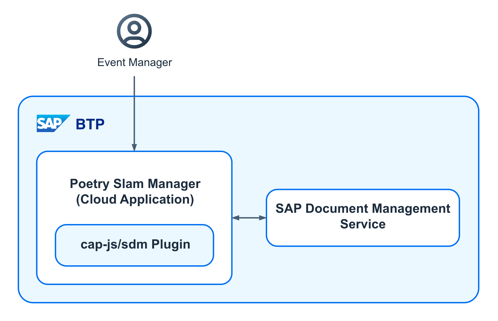

# Store Attachments

Imagine you're a poetry slam manager using a specialized application to organize events. Some events include catering, and you can upload a menu so guests can view catering options and prices in advance.

For storing attachments, the [SAP Document Management Service](https://help.sap.com/docs/document-management-service/sap-document-management-service/what-is-document-management-service) is used. Access to storage in your CAP application is managed with the [SAP cap-js/sdm](https://github.com/cap-js/sdm) plugin. Setting up attachments involves several components: 

1. The **Document Management Service, Repository option** service with the *build-runtime* service plan operates in the SAP BTP provider subaccount and is used to securely store and manage attachments in a repository.
2. The **Document Management Service, Integration option** service with the *build-runtime* service plan operates in the SAP BTP provider subaccount and is used to build document management capabilities for business applications and connect to the SAP Document Management Service repository.
3. The **@cap-js/sdm** plugin offers seamless integration at the CAP level with the SAP Document Management Service. It supports a reuse UI to manage and store attachments in the SAP Document Management Service repository. This is achieved through an [aspect](https://cap.cloud.sap/docs/cds/cdl#aspects) called **Attachments**.

<p align="center">
    
</p>

## Bill of Materials

### Entitlements
In addition to the entitlements listed for the [multitenancy version](./20-Multi-Tenancy-BillOfMaterials.md), the table below shows the entitlements that are required in the different subaccounts to store attachments. 

| Subaccount    |  Entitlement Name                                    | Service Technical Name | Service Plan          | Type          | Quantity                  | 
| ------------- |  ----------------------------------------------------| -------------------    |---------------------- | ------------- | ------------------------- |
| Provider      |                                                      |                        |                       |               |                           |
|               | Document Management Service, Integration option      | sdm                    |build-runtime          | Service       | 1                         |
|               | Document Management Service, Repository option       | sdm-repository         |build-runtime          | Service       | 1                         |

## Enhancing the Application Step by Step

To explore this feature with the Poetry Slam Manager, you have two options: 

1. Clone the repository of the Partner Reference Application. Check out the [*main-multi-tenant*](../../../tree/main-multi-tenant) branch and enhance the application step by step. 

2. Alternatively, check out the [*main-multi-tenant-features*](../../../tree/main-multi-tenant-features) branch where the feature is already included. 

The following describes how to enhance the **main-multi-tenant** branch (option 1).

### Application Enablement 

1. Enhance the Poetry Slam Manager [domain model](../../../tree/main-multi-tenant-features/db/poetrySlamManagerModel.cds). Add the **Attachments** aspect to the domain model. This provides a reuse component which handles the storage of attachments in the SAP Document Management Service repository. More details are described in the [cap-js/sdm](https://github.com/cap-js/sdm?tab=readme-ov-file#use-cap-jssdm-plugin) documentation on GitHub. 
    
    ```cds
        using { Attachments } from '@cap-js/sdm';

        extend PoetrySlams with {
            attachments           : Composition of many Attachments;
        }
    ```

2. Add the required npm modules as dependencies to the **package.json** files of your project. Refer to the **root** [package.json](../../../tree/main-multi-tenant-features/package.json) file and the **mtx/sidecar/** [package.json](../../../tree/main-multi-tenant-features/mtx/sidecar/package.json) file of the sample application.
    
    1. Open a terminal in the root folder of the project.
    
    2. Run the following command to add the `@cap-js/sdm` package. It provides the attachment aspect to the data model to store attachments in the SAP Document Management repository.
    
        ```
        npm add @cap-js/sdm
        ```
    
    3. Open the **root** [package.json](../../../tree/main-multi-tenant-features/package.json) file and add the *cds.xt.DeploymentService* to it. It manages the provisioning of the repository per subscription and stores its details. For unsubscriptions, it securely cleans up the repository.

        ```json
            "cds": {
                "requires": {
                    "cds.xt.DeploymentService": {
                        "preset": "in-sidecar"
                    }
                }
            }
        ```

   4. In the terminal, navigate to the **./mtx/sidecar/** folder.
        ```
        cd mtx/sidecar
        ```
   5. Add the `@cap-js/sdm` package to the mtx module to enable the attachment plugin for multitenancy. 
        ```
        npm add @cap-js/sdm
        ```

    6. Open the [package.json](../../../tree/main-multi-tenant-features/mtx/sidecar/package.json) in the **./mtx/sidecar/** folder and add the SAP Document Management Service, Integration option to the CDS requires section. 

        ```json
            "cds": {
                "requires": {
                    "poetry-slams-sdm-integration": {
                        "vcap": {
                            "label": "sdm"
                        },
                        "subscriptionDependency": {
                            "uaa": "xsappname"
                        }
                    }
                }
            }
        ```

3. In the **./mtx/sidecar/** folder create a file called `SDMRepositoryConfig.js` with the following configuration:

    ```JavaScript
        module.exports = {
            sdm: {
                repositoryConfig: {
                    displayName: 'PRA SDM Repository',
                    description: 'Onboarded on tenant subscription',
                    repositoryType: 'internal',
                    isVersionEnabled: 'false',
                    isVirusScanEnabled: 'true',
                    skipVirusScanForLargeFile: 'false',
                    hashAlgorithms: 'SHA-256'
                }
            }
        };
    ```
    > Note: This file serves as the SAP Document Management Service repository configuration and can be adjusted based on preference, as seen in [Internal Repository](https://help.sap.com/docs/document-management-service/sap-document-management-service/internal-repository) on SAP Help Portal. To store attachments with the SAP Document Management Service, a tenant-specific repository is created when you subscribe to the SaaS application. It is deleted when you unsubscribe, based on the configuration in the `SDMRepositoryConfig.js` file. Once the repository is created upon subscription, you can't update the configuration by changing the file and redeploying it. You need to update it using the APIs provided on [SAP Business Accelerator Hub](https://api.sap.com/api/AdminAPI/resource/Repository_Configuration).


4. Add the [sample catering PDF](../../../tree/main-multi-tenant-features/srv/poetryslam/sample_data/echoesOfThoughtPoetrySlamSpectacle_catering.pdf) file to the **./srv/poetryslam/sample_data/** folder. The PDF is used to test the upload of an attachment and includes event-specific catering options for guests.

5. Open the [xs-security.json](../../../tree/main-multi-tenant-features/xs-security.json) file in the root and create a new *PoetrySlamDocumentManagementRoleCollection* role collection with the *SDM_User* scope, required to manage attachments.

    ```json
        "role-collections": [
            {
                "name": "PoetrySlamDocumentManagementRoleCollection",
                "description": "Manage attachments of Poetry Slams",
                "role-template-references": [
                    "$XSSERVICENAME(poetry-slams-sdm-integration).SDM_User"
                ]
            }
        ]
    ```
    > Note: **poetry-slams-sdm-integration** is the resource *name* parameter of the *SAP Document Management Service* definition in the mta.yaml file that is added in a later step.

6. Enhance the OData action called *createTestData* in the [Poetry Slams service implementation](../../../tree/main-multi-tenant-features/srv/poetryslam/poetrySlamServiceImplementation.js) with the new method `handleAttachmentTestData`. This method adds the [sample catering PDF](../../../tree/main-multi-tenant-features/srv/poetryslam/sample_data/echoesOfThoughtPoetrySlamSpectacle_catering.pdf) file as an attachment to the first poetry slam. 

    > Note: To add the PDF file to the first poetry slam, ensure that both the SAP Document Management Service and the Authorization and Trust Management (XSUAA) service are connected.

    ```js
        const Attachments = require('../lib/attachments');

        this.on('createTestData', async (req) => {
        // ...
        try {
            // ...
            const attachments = new Attachments(req, db, poetrySlamIDs);
            await attachments.handleAttachmentTestData();
        } catch {
            // ...
        }
        });
    ```

7. Copy the [*./srv/lib/attachments.js*](../../../tree/main-multi-tenant-features/srv/lib/attachments.js) file to your project to implement the `handleAttachmentTestData` method.

8. (Optional) The next step moves the **Attachments** section, provided by the plugin, below the **Visitors and Artists** section on the poetry slams object page. It shows how a [CDS aspect](https://cap.cloud.sap/docs/cds/cdl#aspects) can be overwritten with custom configurations. If this step is skipped, the **Attachments** aspect is the last section on the object page by default.

    8.1. Enhance the [*./app/poetryslams/annotations.cds*](../../../tree/main-multi-tenant-features/app/poetryslams/annotations.cds) file. This file overwrites the default set annotations of the **Attachments** aspect.

        ```cds
            annotate service.PoetrySlams with @(
                UI                             : {
                    Facets                         : [
                        {
                            $Type : 'UI.LineItem',
                            ID    : 'Attachments',
                            Label : '{i18n>Attachments}',
                            Target: '@UI.LineItem#Attachments',
                        }
                    ]
                }
            );

            annotate service.PoetrySlams.attachments with @UI: {LineItem #Attachments: [
                {
                    Value             : type,
                    @HTML5.CssDefaults: {width: '10%'}
                },
                {
                    Value             : filename,
                    @HTML5.CssDefaults: {width: '25%'}
                },
                {
                    Value             : content,
                    @HTML5.CssDefaults: {width: '0%'}
                },
                {
                    Value             : createdAt,
                    @HTML5.CssDefaults: {width: '20%'}
                },
                {
                    Value             : createdBy,
                    @HTML5.CssDefaults: {width: '20%'}
                },
                {
                    Value             : note,
                    @HTML5.CssDefaults: {width: '25%'}
                }
            ]};

            annotate service.PoetrySlams.attachments with {
                folderId     @UI.Hidden;
                mimeType     @UI.Hidden;
                status       @UI.Hidden;
                repositoryId @UI.Hidden;
            };
        ```

    8.2. Take over the rest of the annotations from the **Attachments** aspect and add them to the [*/db/poetrySlamManagerModel.cds*](../../../tree/main-multi-tenant-features/db/poetrySlamManagerModel.cds) file.

        ```cds
            annotate PoetrySlams.attachments with {
                note       @(title: '{i18n>note}');
                filename   @(title: '{i18n>filename}');
                content    @(title: '{i18n>attachment}');
                url        @readonly;
                modifiedAt @(odata.etag: null);
                content    @Core.ContentDisposition: {
                    Filename: filename,
                    Type    : 'inline'
                };
            };
        ```

    8.3. For translation of the **Attachments** section title, copy the attachment-specific [web application texts](../../../tree/main-multi-tenant-features/app/poetryslams/i18n).

    8.4. Furthermore, add translation support for the **Attachments** table by copying the [domain model-i18n files](../../../tree/main-multi-tenant-features/db/i18n).
    
### SAP BTP Configuration and Deployment

1. Open the SAP BTP cockpit of the provider subaccount and add the required entitlements:
    
     1. **SAP Document Management Service** with the technical name *sdm* and *build-runtime* plan to securely store and manage attachments.

     2. **SAP Document Management Service** with the technical name *sdm-repository* and *build-runtime* plan to connect to the SAP Document Management Service repository.

2. Add the **SAP Document Management Service, Integration option** as resource into the [mta.yaml](../../../tree/main-multi-tenant-features/mta.yaml) file. 
    ```yaml
        # Document Management Service, Integration Option
        - name: poetry-slams-sdm-integration
        type: org.cloudfoundry.managed-service
        parameters:
            service: sdm
            service-plan: build-runtime
    ```

3. Additionally, it is required as a dependency in the service and MTX module.
    ```yaml
        # Service module
        # Defines the microservice or application that will be serviced.
        # Contract between the service and the used microservices, and the rest of the application. It specifies what is required from the environment, and what it provides to the environment.
        - name: poetry-slams-srv
          requires:
            ...
            - name: poetry-slams-sdm-integration

        # MTX module
        # Handles multitenancy
        - name: poetry-slams-mtx
          requires:
            ...
            - name: poetry-slams-sdm-integration
    ```

4. Furthermore, a repository ID needs to be provided in both the **poetry-slams-srv** and **poetry-slams-mtx** modules. The provided **REPOSITORY_ID** corresponds to the [externalId](https://help.sap.com/docs/document-management-service/sap-document-management-service/add-your-repository-using-onboarding-api) parameter of the created repository. It serves as a unique name for the repository. You can see this in the [mta.yaml](../../../tree/main-multi-tenant-features/mta.yaml) file.
    ```yaml
        # Service module
        # Defines the microservice or application that will be serviced.
        # Contract between the service and the used microservices, and the rest of the application. It specifies what is required from the environment, and what it provides to the environment.
        - name: poetry-slams-srv
          requires:
            ...
            - name: poetry-slams-sdm-integration
          properties:
            REPOSITORY_ID: PSM_REPO

        
        # MTX module
        # Handles multitenancy
        - name: poetry-slams-mtx
          requires:
            ...
            - name: poetry-slams-sdm-integration
          properties:
            REPOSITORY_ID: PSM_REPO
    ```

5. Run the command in your project root folder to install the required npm modules.

    ```
    npm install
    ```

6. Build and deploy the application. As a result, the **SAP Document Management Service, Integration option** instance named *poetry-slams-sdm-integration* is created.  

    > Note: For detailed instructions on how to deploy, refer to [Deploy Your SAP BTP Multi-Tenant Application](./24-Multi-Tenancy-Deployment.md).

### Testing

As of now it is only possible to test the **SAP Document Management Service** in a hybrid test setup as described in [Hybrid Testing](./32-Test-Trace-Debug-ERP.md).

#### Unit Tests

Unit tests are available to test the generation of test data including an attached sample PDF file:

1. Copy the [*test/srv/lib/attachments.test.js*](../../../tree/main-multi-tenant-features/test/srv/lib/attachments.test.js) file to your project. This file tests the *Attachments* class.

2. To run the automated SAP Cloud Application Programming Model tests, follow these steps:

    1. Enter the following command in a terminal in SAP Business Application Studio to install all required node modules.
        ```
        npm install
        ```

    2. Enter the following command to run all tests. The result is shown afterwards.
        ```
        npm run test
        ```


## A Guided Tour to Explore the Attachments Feature

Now it's time to take you on a guided tour through the attachment feature of the Poetry Slam Manager: 

1. Open the SAP BTP cockpit of the customer subaccount.

2. Navigate to **Security - Role Collections**. 
3. Assign the **PoetrySlamDocumentManagementRoleCollection** role collection to your user to be able to manage attachments in the *Poetry Slam Manager*. 

4. Open the Poetry Slams application.

5. To create sample data for mutable data, such as poetry slams, visitors, and visits, choose **Generate Sample Data**. As a result, a list with several poetry slams is shown.
    > Note: If you choose **Generate Sample Data** again, the sample data is set to the default values.

6. Test the upload of a new attachment file.

    1. Select a poetry slam event to upload an attachment.
        > Note: The first poetry slam event already has an attachment uploaded with the [sample catering menu PDF](../../../tree/main-multi-tenant-features/srv/poetryslam/sample_data/echoesOfThoughtPoetrySlamSpectacle_catering.pdf) file.

    2. Edit the event and upload the provided [sample catering menu PDF](../../../tree/main-multi-tenant-features/srv/poetryslam/sample_data/echoesOfThoughtPoetrySlamSpectacle_catering.pdf) file.

    3. Save the draft.
    
    4. Click on the link of the newly added attachment. The PDF file opens and displays various catering options for the poetry slam event.

## Remarks and Troubleshooting

- If an upload of a large attachment fails because of low bandwidth and a timeout, you can increase the default CAP Node.js server timeout. To adjust the timeout of the built-in Node.js server, make the following changes:

    1. Create a **server.js** file in the **./srv/** folder.

    2. In the [CAP listening event](https://cap.cloud.sap/docs/node.js/cds-server#listening), the server timeout can be increased.

    ```js
        const cds = require('@sap/cds'):
        // Listen to the 'listening' event to access the actual CAP HTTP server
        cds.once('listening', ({ server }) => {
            server. requestTimeout = 10 * 60 * 1000: // 10 minutes in ms
            console. log ("Node.js server timeout: ", server.requestTimeout);
        });
        module exports = cds. server;
    ```

- The **SAP Document Management Service** does not yet provide API access to test the service using the service broker.
