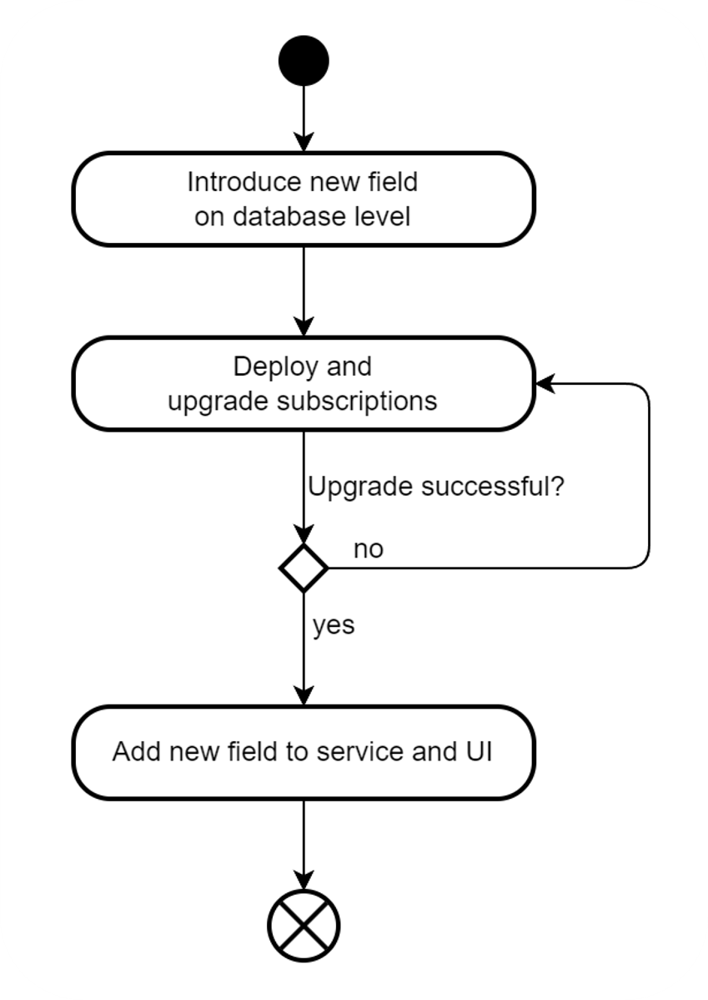
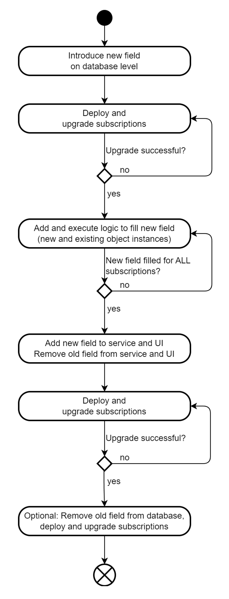

# Upgrading Multi-Tenant SaaS Applications

After deploying your application as outlined in the tutorial [Deploy Your SAP BTP Multi-Tenant Application](./24-Multi-Tenancy-Deployment.md) you might need to update it. Updates can include adding new functionality or keeping your implementation and its dependencies current. Customers who subscribe to multi-tenant SaaS applications typically expect these updates won't affect their usage of your application. This tutorial covers key considerations for ensuring seamless updates. It applies to both the multi-tenant and multi-tenant-features branches.

## Updating the Application

For the initial deployment of your application, you first built your application (`npm run build`) and then deployed it to the provider subaccount (`npm run deploy` which essentially used `cf deploy`).

When executing the deployment a second time (`npm run deploy` or `cf deploy`), your application is updated. This includes a restart of the application modules such as **poetry-slams-srv** (your main application) and **poetry-slams** (the application router). During the restart, the application isn't reachable. To avoid this downtime, consider using the so-called [blue-green deployment](https://help.sap.com/docs/btp/sap-business-technology-platform/blue-green-deployment-strategy).

In case you use the SAP Continuous Integration and Delivery service, you can also configure blue-green deployments in the [SAP Continuous Integration and Delivery Job Editor](https://help.sap.com/docs/continuous-integration-and-delivery/sap-continuous-integration-and-delivery/configure-sap-cloud-application-programming-model-job-in-job-editor#stages).

## Updating Subscriptions

If your update includes changes to the database model, such as new entities or fields, these changes aren't automatically reflected in all subscriptions. The same goes for changes to service dependencies that are subscription-specific. For instance, adding the feature to [print documents](./44b-Multi-Tenancy-Features-Print.md) introduces a new dependency on the **SAP Print service**.

In both cases, you need to update all subscriptions. Here are a few options:
1. Use the [UI of the **SAP SaaS Provisioning Service**](./26-Test-Trace-Debug-Multi-Tenancy.md#the-subscription-management-dashboard). This method lets you manually update individual subscriptions.
2. Use the various options of the [MTX multitenancy module](https://cap.cloud.sap/docs/guides/multitenancy/#update-database-schema). However, this option only covers changes in your database model and doesn't address changes in service dependencies.
3. Use the [APIs of the **SAP SaaS Provisioning Service**](https://saas-manager.cfapps.eu10.hana.ondemand.com/api#/). This approach, described below, can be easily used in scripts, pipelines, or from a terminal.
4. Dedicated tools like the [mtx-tool](https://cap-js-community.github.io/mtx-tool/cap-multitenancy/#upgrade-tenant-scaling) from the [SAP Cloud Application Programming Model Community](https://github.com/cap-js-community). This method also utilizes the APIs of the SAP SaaS Provisioning Service mentioned above.

To use the APIs of the **SAP SaaS Provisioning Service**, follow these steps:
1. The **SAP SaaS Provisioning Service** is already configured as a dependency in the [*mta.yaml*](../../../tree/main-multi-tenant/mta.yaml) file of the multi-tenant branch. It's listed as the resource named *poetry-slams-registry*. Add a line to create a stable service key named *poetry-slams-registry-key* for this service:
    ```yaml
    resources
      - name: poetry-slams-registry
        type: org.cloudfoundry.managed-service
        parameters:
          service: saas-registry
          service-plan: application
          service-keys:
            - name: poetry-slams-registry-key
    ```
    > Note: The multi-tenant-features branch already contains this line to create the service key in the [*mta.yaml*](../../../tree/main-multi-tenant-features/mta.yaml) file.

2. After deployment, open the *Instances and Services* in the SAP BTP cockpit of your provider account. You can view the key in the details of the service instance *poetry-slams-registry*. From this key, you need the fields **clientid**, **clientsecret**, **url** (the url of the authorization service), and **saas_registry_url**.

3. Use these values to obtain an access token from **url**, path */oauth/token?grant_type=client_credentials&response_type=token* using basic authorization with user **clientid** and password **clientsecret**, for example, by executing the following command from a terminal:
    ```sh
    curl '<url>/oauth/token?grant_type=client_credentials&response_type=token' -u '<clientid>:<clientsecret>'
    ```

4. Use that token and **saas_registry_url** to trigger the update of the application subscriptions per [batch-update](https://saas-manager.cfapps.eu10.hana.ondemand.com/api#/a_ApplicationController%20API/batchUpdateApplicationAndTenantSubscriptionAsync) or per [tenant-id](https://saas-manager.cfapps.eu10.hana.ondemand.com/api#/a_ApplicationController%20API/updateApplicationAndTenantSubscriptionAsync)  and use the response (header attribute *Location*) to pull the [status of the update job](https://saas-manager.cfapps.eu10.hana.ondemand.com/api#/n_Job%20Management/getJobRelatedToSaasApplicationById):

    The script [*tenant_update_registry.sh*](../../../tree/main-multi-tenant-features/test/cicd/tenant_update_registry.sh) in the *test* folder of the *multi-tenant-features* branch demonstrates how to perform these steps. You can also use this in pipelines. Provide the values of step 2 to the script as environment variables: **registry_clientid**, **registry_clientsecret**, **registry_uaa_url**, and **registry_saasreg_url**.

## Handling Changes to the Data Model

Imagine after some time you want to enhance your application by adding some functionality. Let's consider two examples:
1. You want to introduce a new field, **eventType**, to the entity **PoetrySlams**.
2. Instead of counting all visitors together, you distinguish between visitors and artists. You replace the existing field **freeVisitorSeats** with two new fields, **numberOfVisitors** and **numberOfArtists**. The UI needs adjustment accordingly.

In your multi-tenant cloud solution, these changes shouldn't break the application. Even temporary downtime is usually unacceptable. Let's explore how to implement these changes without interrupting your customers.

### Example 1: Adding New Fields

When deploying an update to your application that includes a new field, this new field won't appear in the databases of the various subscriptions immediately. You need to [update the subscriptions](./61-Operations-SubscriptionUpgrade.md#updating-subscriptions) first. Only then will the field be available in the database, allowing it to be consumed and exposed in services and UIs.

To avoid breaking your UI, you need to introduce a new field in a "phased" approach consisting of several updates of the application in the productive environment:
1. Update your application with the new field added to the database model. For example, add a new field, **eventType**, to the entity **PoetrySlams** in [db/poetrySlamManagerModel.cds](../../../tree/main-multi-tenant/db/poetrySlamManagerModel.cds).
2. Update all subscriptions to extend the database schema of all existing subscriptions. New subscriptions automatically include the new database schema.
3. Update your application by adding the new field in the service definitions, for example in [srv/poetryslam/poetrySlamService.cds](../../../tree/main-multi-tenant/srv/poetryslam/poetrySlamService.cds). Also, update the UI, for example [app/poetryslams/annotations.cds](../../../tree/main-multi-tenant/app/poetryslams/annotations.cds).

<p align="center">
    
</p>

This phased approach avoids downtimes and ensures your application doesn't break during or after upgrades.

### Example 2: Replacing Existing Fields

Replacing an existing field with new fields (in this example, replacing the existing field **freeVisitorSeats** with two new fields **numberOfVisitors** and **numberOfArtists**) is obviously an incompatible change. However, these changes shouldn't disrupt your application or cause downtimes. A phased approach with several sequential updates can effectively address this issue:

1. With a first update, introduce the new fields on database level and update all subscriptions to materialize them in the database schemas for all subscriptions.
2. With a second update, extend the logic of your application (service implementations). Ensure that for all changed or created instances, the new fields (**numberOfVisitors** and **numberOfArtists**) are filled correctly. In parallel, run a logic to calculate the new fields for all existing entities. This process needs to run across all existing subscriptions. Once all entities in all subscriptions are updated, the new fields are ready for consumption.
3. With a third update, you remove all occurences of the removed and no-longer-needed old field (**freeVisitorSeats**) in your service and UI implementations. Additionally, your services and UIs can now be updated to use the new fields (**numberOfVisitors** and **numberOfArtists**).
4. You can optionally remove the old fields from the database model with another update, as they are no longer referenced in the application.

<p align="center">
    
</p>

This may seem complex at first sight. However, such a phased approach has two major advantages:
- You avoid a downtime.
- You can check the progress and respond to any issues that arise. You proceed to the next phase only after completing the current one. This approach significantly reduces the risk of breaking your application. It's especially important for multi-tenant applications, where issues in one subscription shouldn't affect other subscriptions.

## Handling Changes to Service Dependencies

Similar to managing changes to the data model, changes in service dependencies schouldn't disrupt application consumption. A phased approach might be neccessary. For example, when adding a new service dependency to your application, follow these two steps:
1. Declare the dependency to the new service in your *mta.yaml* file and update all subscriptions.
2. Use the newly added service to expose the new functionality in your application.

The key pattern is to introduce changes gradually, minimizing the risk of breaking the application for consumers.
