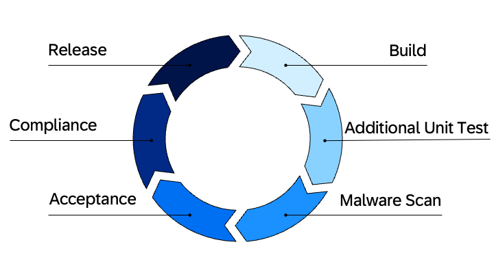

# Capabilities of SAP Continuous Integration and Delivery Service

Imagine you're developing and operating the Poetry Slam Manager application for your company. During the active development of your application, you want to ensure project stability and smooth update deployments. You can achieve this using the [SAP Continuous Integration and Delivery Service (CI/CD-Service) - SAP Help documentation](https://help.sap.com/docs/continuous-integration-and-delivery/sap-continuous-integration-and-delivery/what-is-sap-continuous-integration-and-delivery). This service lets you set up a pipeline to run unit tests, automatically deploy the application to your internal test subaccounts, and, after testing, publish it to the productive provider subaccount.

## Bill of Materials

### Entitlements
| Subaccount            |  Entitlement Name                                 | Service Plan          | Type          | Quantity                  | 
| ----------------------|  -----------------------------------------------  | -----------------     | ------------- | ------------------------- |
| Development Account   |                                                   |                       |               |                           |
|                       | SAP Continuous Integration and Delivery service   | default               | Service       | 1                         | 
|                       | SAP Alert Notification service                    | standard              | Service       | 1                         | 


## Guide How to Enhance the Application Step by Step

To explore this feature with the Poetry Slam Manager, you have two options:

1. Clone the repository of the Partner Reference Application. Check out the [main-multi-tenant](../../../tree/main-multi-tenant) branch and enhance the application step by step.
2. Alternatively, check out the [main-multi-tenant-features](../../../tree/main-multi-tenant-features) branch where the feature is already included.

The following describes how to enhance the main-multi-tenant branch (option 1).

## Supported Pipeline Phases of the SAP Continuous Integration and Delivery Service

<p align="center">

</p>

The pipeline supports the following steps:
1. In the *Build* step, the application is packaged into a deployable archive.
2. The *Additional Unit Tests* step executes unit tests. For example, in the Partner Reference Application, *npm run test* is executed.
3. The *Malware Scan* step scans the project files that were created during the build step for malware and viruses.
4. The *Acceptance* step is used to test the deployment including integration tests.
5. The *Compliance* step can be used to run additional compliance scans, such as security and licensing scans of application coding and open-source packages.
6. The *Release* step is used for productive deployment.

In the provided example, the *Compliance* and *Release* steps are skipped. 


## SAP BTP Configuration and Deployment
1. Open the SAP BTP cockpit of the development subaccount and add the required entitlements:
    - *Continuous Integration and Delivery* with the *default* plan to add CI/CD-app.
2. Navigate to *Instances and Subscriptions* and choose *Create*.
3. Search for Continuous Integration & Delivery, select the *default* plan, and create the application.
4. Next, go to *Users and Security* and assign the roles to your user.
    - The *CI/CD Service Administrator* can trigger, create, delete, and change the builds.
    - The *CI/CD Service Developer* is only able to trigger the build.

## Configuration of your SAP Continuous Integration and Delivery Service
1. In your development subaccount, go to *Instances and Subscriptions*.
2. Open the *Continuous Integration & Delivery* UI under *Application*.

There are three tabs:
- *Jobs*: This tab shows all your created jobs.
- *Repositories*: This tab contains the GitHub repositories that the job is allowed to access.
- *Credentials*: This tab stores all secrets and variables. You also place the GitHub access token for the created repositories here.

In case you are using GitHub as your source control system, you can follow the SAP Help documentation [add webhook in GitHub](https://help.sap.com/docs/continuous-integration-and-delivery/sap-continuous-integration-and-delivery/add-webhook-in-github) to set up the access of the CI/CD service to your repository.

### Create a Job for Deployment
Create a pipeline to run tests and deploy the partner reference application to a test subaccount.

1. Open the SAP Continuous Integration and Delivery UI.
2. In the SAP Continuous Integration and Delivery UI, navigate to the *Jobs* tab.
3. Choose the plus icon to create a new job and enter a unique name that helps you to identify it.
4. Under *Repository*, add your configured GitHub webhook.
5. As *Branch*, specify the name of the branch you want to deploy using the CI/CD service. For more information, see the [SAP Help documentation](https://help.sap.com/docs/continuous-integration-and-delivery/sap-continuous-integration-and-delivery/configure-multi-branch-job).
6. For the *Stages*, use *Source Repository*.
7. Make sure that the job is not activated yet. Otherwise, it runs as soon as changes are pushed into the defined branch.
> Note: Ensure that the *Credentials* list is empty. If available, choose *Delete* to avoid any authentication issues.

### Create the SAP Continuous Integration and Delivery Service config.yml File
In general, there are two ways to configure the CI/CD-pipeline:
1. Setting up a config.yml file in your project, see the [SAP Help documentation](https://help.sap.com/docs/continuous-integration-and-delivery/sap-continuous-integration-and-delivery/configure-sap-cloud-application-programming-model-job-in-your-repository?version=Cloud).
2. Using the CI/CD UI to configure the pipeline steps, see the [SAP Help documentation](https://help.sap.com/docs/continuous-integration-and-delivery/sap-continuous-integration-and-delivery/configure-sap-cloud-application-programming-model-job-in-job-editor?version=Cloud).

This guide explains the first option.

1. Open the application coding of the Partner Reference Application in the Business Application Studio.
2. Check out or create a new branch to add your CI/CD config file.
    - > Note: After merging this into the branch, the config.yml file is used to run the job.
3. In the Partner Reference Application root folder, create a new folder called *.pipeline*.
4. Navigate to the *.pipeline* folder and create a file named config.yml. This file will contain the required stages and steps that the CI/CD-job executes.

For a first deployment, copy the example configuration below. It contains the steps Build, Additional Unit Tests, Malware Scan, and Acceptance. Replace the placeholders for *cfApiEndpoint*, *cfOrg* and *cfSpace*. You can find these values in your provider subaccount.

1. Open your SAP BTP provider subaccount.
2. Make sure you're on the *Overview* page.
3. Copy the information found under Cloud Foundry Environment:
    1. cfApiEndpoint = API Endpoint
    2. cfOrg = Org Name
    3. cfSpace = Space Name

In the config.yml file, the same steps are configurable as described in *Supported Pipeline Phases of the SAP Continuous Integration and Delivery Service*.

```yaml
---
general:
    buildTool: 'mta'
service:
    buildToolVersion: 'MBTJ21N20'
    stages:
    Build:
        mavenExecuteStaticCodeChecks: false
        npmExecuteLint: false
    Acceptance:
        cfApiEndpoint: '<ENTER YOUR ENDPOINT>'
        cfOrg: '<ENTER YOUR ORG>'
        cfSpace: '<ENTER YOUR SPACE>'
        deployType: 'standard'
        cloudFoundryDeploy: true
        npmExecuteEndToEndTests: false
    Malware Scan:
        malwareExecuteScan: true
    Release:
        tmsExport: false
        tmsUpload: false
        cloudFoundryDeploy: false
    Additional Unit Tests:
        npmExecuteScripts: true
    Compliance:
        sonarExecuteScan: false
steps:
    cloudFoundryDeploy:
        mtaDeployParameters: '-f --version-rule ALL'
    npmExecuteScripts:
        runScripts:
        - 'prebuild'
        - 'test'
    artifactPrepareVersion:
        versioningType: 'cloud_noTag'
```
Push and merge your config.yml file into the GitHub branch you want to run the job for. Next, go back to the *Jobs* tab and activate the job you've created. The job is is now automatically triggered as soon as changes are merged to the selected branch. For the first time, the job needs to be triggered manually by choosing *Run*. This starts the build and deploys it to the configured test account.

You can have a look at the complete [config.yml](../../../tree/main-multi-tenant-features/.pipeline/config.yml) file provided in the main-multi-tenant-features branch. It includes more steps that are described later.


### Run the Job for Initial Deployment
There are three ways to trigger the jobs:
1. Manually from the SAP Continuous Integration and Delivery UI.
2. Regularly with timed triggers. For more information, see the [SAP Help documentation](https://help.sap.com/docs/continuous-integration-and-delivery/sap-continuous-integration-and-delivery/manage-timed-triggers-for-jobs).
3. Using automatic triggers: When creating your job, you specify a branch name. Whenever changes are pushed to the branch that is configured in the job, the job starts automatically. This behavior exemplifies  **_continuous_** integration and delivery.

For the first run, trigger the job manually from the SAP Continuous Integration and Delivery UI:
1. Open the UI.
2. Select the created job.
3. Choose *Run*.
4. Under the *Builds* segment, you see a started job.
5. Select the job to show the status of the different stages.

You have two options to see the log:
- See the log for a specific stage by choosing desired stage.
- Have a look at the full log by choosing *Show Full Log* at the top of a selected job.
    - The *Show Full Log* option often provides more details than simply examining the failed step. You can always search for the failed stage within the complete log.

After the first run is triggered, you have to subscribe the application to your subscriber subaccount as described in the [following tutorial](./25-Multi-Tenancy-Provisioning.md). Now, you need to [configure the Service Broker](./42b-Multi-Tenancy-Provisioning-Service-Broker.md).

### Enhance the config.yml File to Complete the Configuration
After the successful initial deployment, you can have a look at the [config.yml](../../../tree/main-multi-tenant-features/.pipeline/config.yml) file that includes additional steps to execute integration tests. To execute these additional tests and use the complete sample, the credentials must be maintained in the config.yml file.

```yaml
credentialVariables:
    # Credentials for integration test
    - name: 'service_broker_endpoint'
        credentialId: 'release-service-broker-endpoint'
    - name: 'service_broker_auth_server'
        credentialId: 'release-service-broker-auth-server'
    - name: 'service_broker_client_id'
        credentialId: 'release-service-broker-client-id'
    - name: 'service_broker_client_secret'
        credentialId: 'release-service-broker-client-secret'
    # Credentials for subscription updates
    - name: 'registry_clientid'
        credentialId: 'release-registry-clientid'
    - name: 'registry_clientsecret'
        credentialId: 'release-registry-clientsecret'
    - name: 'registry_uaa_url'
        credentialId: 'release-registry-uaa-url'
    - name: 'registry_saasreg_url'
        credentialId: 'release-registry-saasreg-url'
    cfCredentialsId: 'cloudfoundrydeploy'
```
Now add the shell scripts to your partner reference application.
1. Create a new folder called *cicd* under *test*.
2. Add the shell scripts located under [./test/cicd/*](../../../tree/main-multi-tenant-features/test/cicd).
    1. *tenant_update_registry.sh* is used to update the subscriptions.
    2. *cicd_integration_test.sh* is used to run an integration test.
    3. *cicd_all_tests.sh* is used in the pipeline to execute both scripts mentioned above.
3. In the cicd folder execute the command _chmod +x ./test/cicd/*.sh_ this will ensure that the right access rights are set for the pipeline.

To run the complete script, you have to create the secrets listed in the script above for your pipeline.
1. In your development subaccount, go to *Instances and Subscriptions*.
2. Under *Application*, open the Continuous Integration & Delivery UI.
3. Go to the *Credentials* tab.
4. Add the *Service Broker* service credentials for the [cicd_integration_test.sh](../../../tree/main-multi-tenant-features/test/cicd/cicd_integration_test.sh) test file.
    1. Open your subscriber subaccount.
    2. Go to the *Instances and Subscriptions* tab.
    3. Choose the service broker instance.
    4. Choose *View Credentials*.
    5. Take the credentials and add them in the *Credentials* tab of the Integration & Delivery UI.
5. Add the *SaaS Provisioning Service* credentials for the [tenant_update_registry.sh](../../../tree/main-multi-tenant-features/test/cicd/tenant_update_registry.sh) test file.
    1. Open your provider subaccount.
    2. Go to the *Instances and Subscriptions* tab.
    3. Choose the SaaS Provisioning Service instance.
    4. Under *Service Keys*, choose *Create*.
    5. Enter a *Service Key Name*, for example *poetry-slams-registry-key*.
    6. Choose *Create*.
    7. Choose *View Credentials*.
    8. Select your created service key from the dropdown list.
    9. Take the credentials and add them in the *Credentials* tab of the Integration & Delivery UI.
6. For the *cloudfoundrydeploy* secret, maintain a (technical) user and its password. This user must be added as *Org Member* of the Cloud Foundry environment in the provider subaccount with the *Org User* role and as *Space Developer* of the Cloud Foundry environment to which the application is deployed.

```yaml
    Build:
      runFirst:
        command: 'cp ./test/cicd/* cloudcitransfer'
    Acceptance:
      runLast:
        command: './cloudcitransfer/cicd_all_tests.sh'
```
Here's a brief explanation of the commands above: 
The *runFirst* command under *Build* copies the files located under [./test/cicd/*](../../../tree/main-multi-tenant-features/test/cicd) to the CI/CD workspace folder called *cloudcitransfer* at runtime. This step ensures the scripts are available for execution. After copying, the build process continues. In the Acceptance stage, the *runLast* command executes the scripts stored in the *cloudcitransfer* folder.

> Note: *runFirst* executes a command before the actual step. To run it after a step, use *runLast*.

More information on the job configuration can be found in the SAP Help documentation [Configure a Cloud Foundry Environment Job in Your Repository](https://help.sap.com/docs/continuous-integration-and-delivery/sap-continuous-integration-and-delivery/configure-sap-cloud-application-programming-model-job-in-your-repository).

### Additional Feature: Add the SAP Alert Notification Service for Automatic Notifications
To receive email notifications about the job execution status, use the SAP Alert Notification service. This feature actively informs users whether a build runs successfully or encounters issues.

#### SAP BTP Configuration and Deployment
1. Go to the entitlements in your development subaccount and add the *SAP Alert Notification service* with the *standard* plan.
2. Navigate to the *Instances and Subscriptions* view and create an instance of the newly entitled service.
3. Search for the *Alert Notification* service, provide a name, for example *pra-alert-notification*, and create it.
4. Open the instance and create a service key of the alert notification service.
5. After creating the key, follow [this tutorial](https://help.sap.com/docs/continuous-integration-and-delivery/sap-continuous-integration-and-delivery/enable-build-notifications?locale=en-US#procedure) to add the credentials of the key to the *Continuous Integration & Delivery* UI in the *Build Notification* section of a job.

#### SAP Alert Notification Service Configuration
For simplicity, it is recommended to use the SAP BTP cockpit for the configuration. Follow these steps to activate notifications for CI/CD jobs:

1. Navigate to *Instances and Subscriptions* and open the *SAP Alert Notification* instance.
2. Create an action that defines the notification type to be received. To receive email notifications, the *Email* type has to be selected. Follow the steps provided in the [Creating Actions - SAP Help documentation](https://help.sap.com/docs/alert-notification/sap-alert-notification-for-sap-btp/managing-actions#creating-actions).
3. Next, confirm the action using a token sent to the defined email. Follow the steps provided in [Confirming Actions - SAP Help documentation](https://help.sap.com/docs/alert-notification/sap-alert-notification-for-sap-btp/managing-actions#confirming-actions).
4. Create the condition that is required for the registration of events. Follow the steps provided in [Managing Conditions - SAP Help documentation](https://help.sap.com/docs/alert-notification/sap-alert-notification-for-sap-btp/managing-conditions#creating-conditions). To see which event properties are available for the CI/CD service, see [Next Steps - SAP Help](https://help.sap.com/docs/continuous-integration-and-delivery/sap-continuous-integration-and-delivery/enable-build-notifications?locale=en-US#next-steps). As *Condition*, you can use the *build.end* *event Type* in your pipeline to get a failure or success message at the end of the build. 
5. Create the required subscription to receive notifications for this event. Follow the steps provided in [Managing Subscriptions - SAP Help documentation](https://help.sap.com/docs/alert-notification/sap-alert-notification-for-sap-btp/managing-subscriptions).
6. Trigger the job to test the notification.
7. After the job ran through, you get either a success our a failure message.
